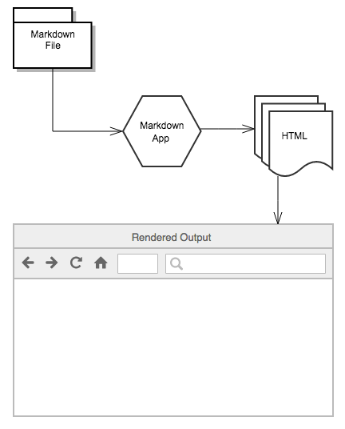

# 1. Markdown là gì?
Là ngôn ngữ đánh dấu ( markup language) được sử dụng để thêm các yếu tố định dạng như tiêu đề, in đậm/in nghiêng, danh sách... vào tài liệu văn bản
# 2. Tại sao nên sử dụng Markdown
Markdown dễ sử dụng, được sử dụng để tạo [websites](websites), [documents](https://www.markdownguide.org/getting-started/#documents), [notes](https://www.markdownguide.org/getting-started/#notes), [books](https://www.markdownguide.org/getting-started/#books), [presentations](https://www.markdownguide.org/getting-started/#presentations), [email messages](https://www.markdownguide.org/getting-started/#email) và [technical documentation](https://www.markdownguide.org/getting-started/#documentation).

Các website như Reddit và Github đều trợ giúp Markdown và rất nhiều ứng dụng Desktop và Web hỗ trợ nó.
# 3. Cách Markdown làm việc
Khi bạn viết trong Markdown, text nó sẽ được lưu trữ trong file văn bản gốc ( văn bản thô ) có phần mở rộng là .mh or .markdown. Nhưng sau đó là gì? Cách mà file Markdown của mình đã được định dạng (Formatted) được chuyển đổi thành HTML or 1 tài liệu sẵn sàng để in.

Câu trả lời đó là cần 1 Markdown Application để có thể xử lý ( biên dịch ) markdown file như: Microsoft Word, Dillinger, VS Code ... để hiển thị văn bản Markdown-formatted.

Markdown Application nó sử dụng 1 cái gì đấy đc gọi là Markdown processor để lấy vào 1 văn bản Markdown đã được định dạng thành 1 định dạng HTML ( tức là HTML đấy ) như : Dillinger, trên VS code thì bạn tham khảo [Compiling Markdown into HTML](https://code.visualstudio.com/docs/languages/markdown#_compiling-markdown-into-html)

ảnh minh họa 

# 4. Cách sử dụng Markdown cơ bản
## 4.1 Tiêu đề
input
```
# h1
## h2
### h3
#### h4
##### h5
###### h6
```
output
# h1
## h2
### h3
#### h4
##### h5
###### h6
## 4.2 Đoạn văn
Sử dụng 1 dòng trống để phân tách 1 hoặc nhiều dòng text. Chú ý là ko được thụt về bằng space hoặc tab nếu ko thì text đó chuyển thành Code block trong markdown. 
## 4.3 Ngắt dòng
Để ngắt dòng thì ta sử dụng 2 hoặc nhiều dấu cách ở cuối dòng mà bạn muốn cách.
## 4.4 Nhấn mạnh từ
### In đậm
có 2 cách là dùng ** hoặc __  
ví dụ: input
```
hello **bbbb**
heloo __aaaa__
```
output:  
hello **bbbb**  
heloo __aaaa__
### In nghiêng
có 2 cách là dùng * hoặc _  
ví dụ: input 
```
hello *aaa*
hello _bbb_
```
output  
hello *aaa*  
hello _bbb_
### Đậm và nghiêng
dùng *** hoặc ___  
ví dụ: input
```
hello ***aaa***
hello ___bbb___
```
output:  
hello ***aaa***  
hello ___bbb___
## 4.5 Blockquotes
Thêm > trước 1 đoạn văn  
ví dụ: input 
``` 
> Mùa đông không lạnh
```
output:  
> Mùa đông không lạnh
## 4.6 Danh sách
Thụt 1 hoặc nhiều item trong item cha để có 1
list lồng nhau.  
### Có thứ tự
ác item trong list phải bắt đầu là: một số + dấu chấm + dấu cách + tên item.  
ví dụ: input  
```
1. Sản phẩm
2. Liên hệ

6. Cháo lòng
5. Tiết canh
```
output: 
1. Sản phẩm
2. Liên hệ

6. Cháo lòng
5. Tiết canh
### Không thứ tự
Các item bắt đầu bằng: một dấu " *, +, - " + dấu cách + tên item  
ví dụ: input  
```
* Mùa xuân
- Mùa hạ
+ Mùa thu
* Mùa đông
```
output:  
* Mùa xuân
- Mùa hạ
+ Mùa thu
* Mùa đông
## 4.7 Links
ví dụ: input  
```
Muốn xem video thì lên [youtube](https://www.youtube.com/)
```
output:  
Muốn xem video thì lên [youtube](https://www.youtube.com/)
### Url hoặc email
Để nhanh chóng chuyển 1 url or email thành 1 link thì đặt chúng trong <>  
ví dụ: input 
``` 
mail: <xuanbaobn01@gmial.com>
```
output:  
mail: <xuanbaobn01@gmial.com>
## 4.8 Images
ví dụ: input  
```

```
output:  

## 4.9 Tạo bảng
Để tạo bảng ta sử dụng 3 or nhiều dấu gạch ngang (---) và sử dụng pipes (|) để tách các cột.  
ví dụ: input 
``` 
|Họ và tên | Giới tính|
|---|----------------|
|Nguyễn Văn A | Nam|
|Nguyễn Thị B|Nữ|
```
output:  
|Họ và tên | Giới tính|
|---|----------------|
|Nguyễn Văn A | Nam|
|Nguyễn Thị B|Nữ|
