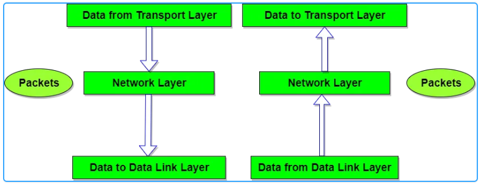
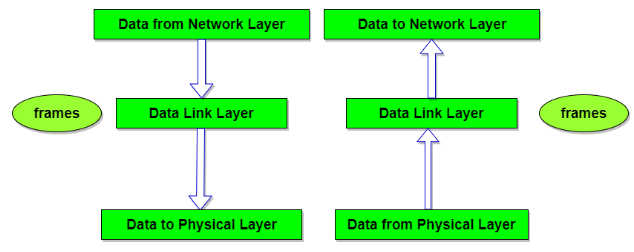
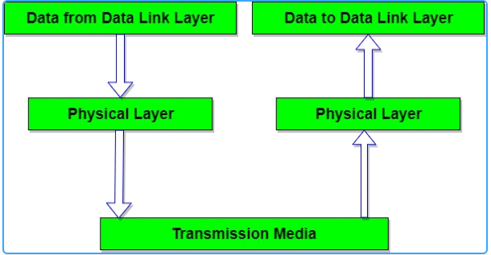

# 1. Mô hình OSI là gì ?
Mô hình **OSI** (Open Systems Interconnection Reference Model) tạm dịch là mô hình tham chiếu kết nối các hệ thống mở hay còn được gọi là mô hình bảy tầng của OSI. Mô hình OSI mô tả bảy tầng mà hệ thống máy tính sử dụng để giao tiếp qua mạng. Đây là mô hình tiêu chuẩn đầu tiên cho truyền thông mạng, được tất cả các công ty máy tính và viễn thông lớn áp dụng vào đầu những năm 1980. 

Mô hình osi

Mô hình OSI tuân theo các nguyên tắc phân tầng như sau:  
+ Mô hình gồm N = 7 tầng. OSI là hệ thống mở, phải có khả năng kết nối với các hệ thống khác nhau, tương thích với các chuẩn OSI  
+ Quá trình xử lý các ứng dụng được thực hiện trong các hệ thống mở, trong khi vẫn duy trì được các hoạt động kết nối giữa các hệ thống.
+ Thiết lập kênh logic nhằm mục đích thực hiện việc trao đổi thông tin giữa các thực thể.
# 2. Các giao thức trong mô hình OSI
Trong mô hình OSI có hai loại giao thức được sử dụng: giao thức hướng liên kết (Connection – Oriented) và giao thức không liên kết (Connectionless).
## 2.1 Giao thức hướng liên kết
Trước khi truyền dữ liệu, các thực thể đồng tầng trong hai hệ thống cần phải thiết lập một liên kết logic. Chúng thương lượng với nhau về tập các tham số sẽ sử dụng trong giai đoạn truyền dữ liệu, cắt/hợp dữ liệu, liên kết sẽ được hủy bỏ. Thiết lập liên kết logic sẽ nâng cao độ tin cậy và an toàn trong quá trình trao đổi dữ liệu.
## 2.2 Giao thức không liên kết
Dữ liệu được truyền độc lập trên các tuyến khác nhau. Với các giao thức không liên kết chỉ có giai đoạn duy nhất truyền dữ liệu.
# 3. Vai trò chức năng của 7 tầng OSI
## Tầng 7 – Application Layer ( Tầng ứng dụng)
Tầng ứng dụng là lớp trên cùng, xác định giao diện giữa người sử dụng và môi trường OSI. Tầng ứng dụng được sử dụng bởi phần mềm người dùng cuối như trình duyệt web và ứng dụng email. Nó cung cấp các giao thức cho phép phần mềm gửi, nhận thông tin và trình bày dữ liệu có ý nghĩa cho người dùng.

Một vài ví dụ về giao thức lớp ứng dụng là Hypertext Transfer Protocol ([HTTP](https://vi.wikipedia.org/wiki/Hypertext_Transfer_Protocol) - Giao thức truyền siêu văn bản), Post Office Protocol ([POP](https://vi.wikipedia.org/wiki/POP) - Giao thức bưu điện), Simple Mail Transfer Protocol ([SMTP](https://vi.wikipedia.org/wiki/SMTP#:~:text=SMTP%20(ti%E1%BA%BFng%20Anh%3A%20Simple%20Mail,STD%203)%2C%20ch%C6%B0%C6%A1ng%205.) - Giao thức truyền thư đơn giản), Domain Name System ([DNS](https://vietnix.vn/dns-la-gi/) - Hệ thống tên miền) và File Transfer Protocol ([FTP](https://vietnix.vn/ftp-la-gi/) - Giao thức truyền tệp).
## Tầng 6 – Presentation Layer (Tầng trình bày)
Tầng thứ hai kế tiếp tầng ứng dụng là tầng trình bày, tầng này sẽ giải quyết các vấn đề liên quan đến các cú pháp và ngữ nghĩa của thông tin được truyền.

Tầng trình bày xác định cách hai thiết bị sẽ mã hóa và nén dữ liệu để nó được nhận một cách chính xác ở đầu bên kia. Tầng trình bày lấy bất kỳ dữ liệu nào được truyền bởi tầng ứng dụng và chuẩn bị cho việc truyền qua tầng phiên.

Tầng này chịu trách nhiệm chính trong việc chuẩn bị dữ liệu để nó có thể được sử dụng bởi tầng ứng dụng; nói cách khác, tầng 6 làm cho dữ liệu hiển thị cho các ứng dụng sử dụng. Tầng trình bày chịu trách nhiệm dịch, mã hóa và nén dữ liệu.

Hai thiết bị đang giao tiếp có thể sử dụng các phương pháp mã hóa khác nhau, do đó, tầng 6 chịu trách nhiệm dịch dữ liệu đến thành một cú pháp mà lớp ứng dụng của thiết bị nhận có thể hiểu được.

Nếu các thiết bị đang giao tiếp qua kết nối được mã hóa, tầng 6 chịu trách nhiệm thêm mã hóa ở đầu người gửi cũng như giải mã mã hóa ở đầu người nhận để nó có thể hiển thị tầng ứng dụng với dữ liệu có thể đọc được, không được mã hóa.

Cuối cùng, lớp trình bày cũng chịu trách nhiệm nén dữ liệu mà nó nhận được từ lớp ứng dụng trước khi phân phối đến tầng 5. Điều này giúp cải thiện tốc độ và hiệu quả của giao tiếp bằng cách giảm thiểu lượng dữ liệu sẽ được truyền.
## Tầng 5 – Session Layer (Tầng phiên)
Đây là lớp chịu trách nhiệm đóng mở giao tiếp giữa hai thiết bị. Khoảng thời gian từ khi giao tiếp được mở và đóng được gọi là phiên. Tầng phiên đảm bảo rằng phiên vẫn mở đủ lâu để chuyển tất cả dữ liệu đang được trao đổi, và sau đó nhanh chóng đóng phiên để tránh lãng phí tài nguyên.

Lớp phiên cũng đồng bộ hóa việc truyền dữ liệu với các điểm kiểm tra. Ví dụ: nếu một tệp 100 megabyte đang được chuyển, tầng phiên có thể đặt một điểm kiểm tra cứ sau 5 megabyte. Trong trường hợp ngắt kết nối hoặc gặp sự cố sau khi 52 megabyte đã được chuyển, phiên có thể được tiếp tục từ điểm kiểm tra cuối cùng, có nghĩa là chỉ cần chuyển thêm 50 megabyte dữ liệu. Nếu không có các trạm kiểm soát, toàn bộ quá trình chuyển sẽ phải bắt đầu lại từ đầu
## Tầng 4 – Transport Layer (Tầng vận chuyển)
Tầng 4 chịu trách nhiệm giao tiếp đầu cuối giữa hai thiết bị. Điều này bao gồm việc lấy dữ liệu từ lớp phiên và chia nó thành các phần được gọi là phân đoạn trước khi gửi đến tầng 3. Tầng truyền tải trên thiết bị nhận có trách nhiệm tập hợp lại các phân đoạn thành dữ liệu mà tầng phiên có thể sử dụng.

Tầng vận chuyển cũng chịu trách nhiệm kiểm soát luồng và kiểm soát lỗi. Kiểm soát luồng xác định tốc độ truyền tối ưu để đảm bảo rằng người gửi có kết nối nhanh không làm người nhận có kết nối chậm bị choáng ngợp. Tầng truyền tải thực hiện kiểm soát lỗi ở đầu nhận bằng cách đảm bảo rằng dữ liệu nhận được là hoàn chỉnh và yêu cầu truyền lại nếu chưa.

## Tầng 3- Network Layer (Tầng mạng)
Tầng mạng có nhiệm vụ tạo điều kiện thuận lợi cho việc truyền dữ liệu giữa hai mạng khác nhau. Nếu hai thiết bị giao tiếp trên cùng một mạng, thì tầng mạng là không cần thiết. Tầng mạng chia nhỏ các phân đoạn từ lớp truyền tải thành các đơn vị nhỏ hơn, được gọi là gói, trên thiết bị của người gửi và tập hợp lại các gói này trên thiết bị nhận. Tầng mạng cũng tìm ra con đường vật lý tốt nhất để dữ liệu đến đích của nó; điều này được gọi là định tuyến.

## Tầng 2 – Data Link Layer (Tầng liên kết)
Tầng liên kết dữ liệu rất giống với tầng mạng, ngoại trừ tầng liên kết dữ liệu tạo điều kiện thuận lợi cho việc truyền dữ liệu giữa hai thiết bị trên mạng CÙNG. Tầng liên kết dữ liệu lấy các gói từ tầng mạng và chia chúng thành các phần nhỏ hơn gọi là khung. Giống như tầng mạng, tầng liên kết dữ liệu cũng chịu trách nhiệm điều khiển luồng và điều khiển lỗi trong giao tiếp nội mạng (Tầng vận chuyển chỉ làm nhiệm vụ điều khiển luồng và điều khiển lỗi cho truyền thông giữa các mạng).

## Tầng 1 – Physical Layer (Tầng vật lý)
Lớp này bao gồm các thiết bị vật lý liên quan đến việc truyền dữ liệu, chẳng hạn như cáp và thiết bị chuyển mạch. Đây cũng là lớp nơi dữ liệu được chuyển đổi thành một luồng bit, là một chuỗi gồm các số 1 và 0. Lớp vật lý của cả hai thiết bị cũng phải đồng ý về một quy ước tín hiệu để các số 1 có thể được phân biệt với các số 0 trên cả hai thiết bị.

### Tóm tắt chức năng các tầng giao thức trong OSI
|Tầng|Chức năng chủ yếu|Giao thức|  
|----|------------------|---------|
|__Application__|Giao tiếp người và môi trường mạng|Ứng dụng|
|__Presentation__|Chuyển đổi cú pháp dữ liệu để đáp ứng yêu cầu truyền thông của các ứng dụng|Giao thức Biến đổi mã| 
|__Session__|Quản lý các cuộc liên lạc giữa các thực thể bằng cách thiết lập, duy trì, đồng bộ hóa và hủy bỏ các phiên truyền thông giữa các ứng dụng|Giao thức phiên|
|__Transpost__|Vận chuyển thông tin giữa các máy chủ (End to End). Kiểm soát lỗi và luồng dữ liệu|Giao thức Giao vận| 
|__Network__|Thực hiện chọn đường và đảm bảo trao đổi thông tin trong liên mạng với công nghệ chuyển mạch thích hợp.|Giao thức mạng|
|__Data Link__|Tạo/gỡ bỏ khung thông tin (Frames), kiểm soát luồng và kiểm soát lỗi.|Thủ tục kiểm soát|
|__Physical__|Đảm bảo các yêu cầu truyền/nhận các chuỗi bit qua các phương tiện vật lý.|Giao diện DTE - DCE| 