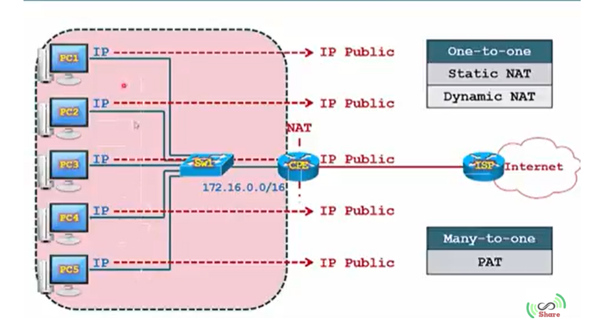
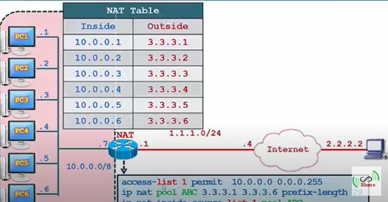
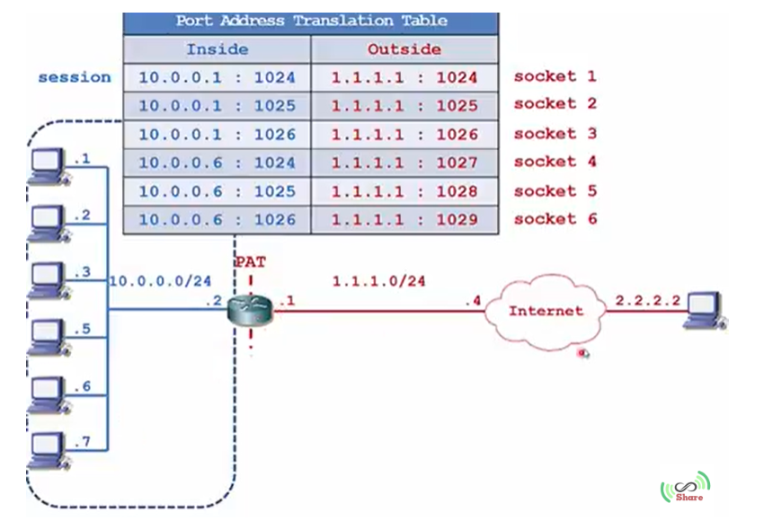
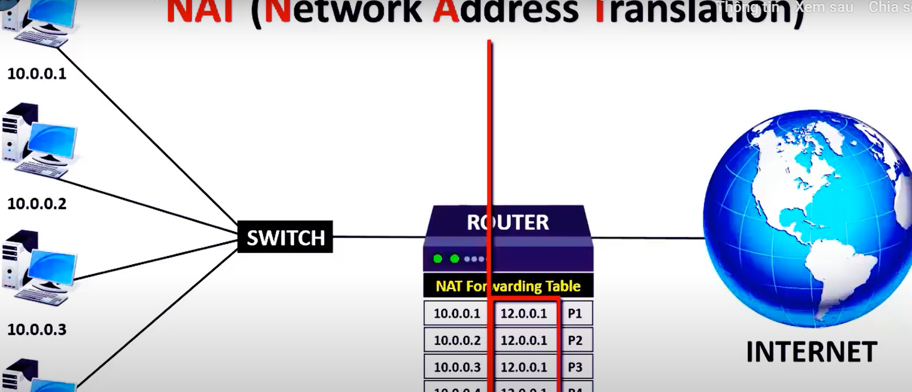
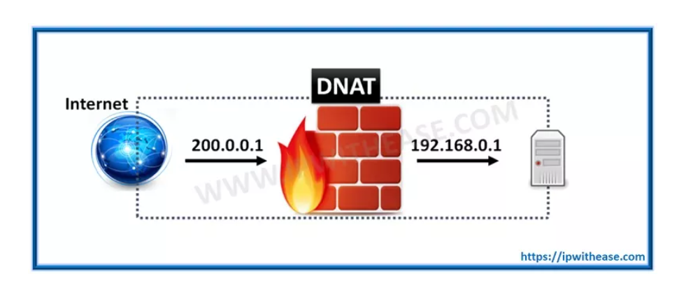

# ***Nắm chắc về NAT, cơ chế & cách hoạt động***
# ***Khái niệm***
- NAT là viết tắt của Network Address Translation, là một công nghệ được sử dụng để chuyển đổi địa chỉ IP của các thiết bị trong mạng nội bộ sang địa chỉ IP bên ngoài của mạng Internet. NAT được sử dụng phổ biến trong các mạng gia đình và doanh nghiệp vì nó cho phép nhiều thiết bị trong mạng nội bộ chia sẻ một địa chỉ IP công cộng duy nhất, giúp tiết kiệm địa chỉ IP và tăng tính bảo mật.

- Khi một thiết bị trong mạng nội bộ muốn kết nối với một thiết bị trên Internet, NAT sẽ chuyển đổi địa chỉ IP của thiết bị nội bộ thành địa chỉ IP công cộng của mạng và gửi yêu cầu kết nối đến Internet. Khi phản hồi được trả về từ Internet, NAT sẽ chuyển đổi địa chỉ IP công cộng của mạng thành địa chỉ IP của thiết bị nội bộ tương ứng và gửi phản hồi trả về cho thiết bị đó trong mạng nội bộ.

# ***Phân loại***
- NAT được chia thành 2 nhóm 
  - One-to-one
    - 

  - Many-to-many
    - 

## ***Static NAT***
- Trong NAT tĩnh, mọi thiết bị được gán một địa chỉ IP công cộng theo cách thủ công . Không cần phải nói rằng điều này tốn thời gian và không phải là cách sử dụng tốt các địa chỉ IPv4 đang khan hiếm nguồn cung cấp.
- Stactic NAT được dùng để chuyển đổi một địa chỉ IP này sang một địa chỉ IP khác. Thông qua cách cố định địa chỉ IP cục bộ sang địa chỉ IP công khai (Public). Quá trình này được thiết lập và cài đặt thủ công.
- Static NAT là một dạng của NAT, được sử dụng để chuyển đổi một địa chỉ IP nội bộ cố định sang một địa chỉ IP công cộng cố định. Static NAT cho phép một thiết bị trong mạng nội bộ được cấu hình với một địa chỉ IP công cộng duy nhất trên Internet, điều này giúp cho các thiết bị này dễ dàng được truy cập từ bên ngoài mạng.

- Khi một yêu cầu kết nối được gửi đến địa chỉ IP công cộng, Static NAT sẽ chuyển đổi địa chỉ IP đó sang địa chỉ IP của thiết bị trong mạng nội bộ tương ứng và gửi yêu cầu đến thiết bị đó. Sau đó, phản hồi từ thiết bị trong mạng nội bộ sẽ được chuyển đổi lại thành địa chỉ IP công cộng và được gửi trả về cho yêu cầu kết nối ban đầu.

## ***Dynamic NAT***
- Dynamic NAT dùng để ánh xạ một địa chỉ IP này sang một địa chỉ IP khác bằng cách thức tự động. Theo thường lệ, thì Dyanmic NAT sẽ chuyển đổi từ IP mạng cục bộ sang địa chỉ IP đã được đăng ký. Bất kỳ một địa chỉ IP nào nằm trong dải IP Public đã được định trước đều được gán với một địa chỉ bên trong mạng.
- Trong Dynamic NAT, mọi thiết bị được gán một địa chỉ IP công cộng, tự động từ nhóm địa chỉ IPv4 công cộng có sẵn. Sau khi thiết bị kết thúc giao tiếp, địa chỉ IP sẽ được trả lại cho nhóm để thiết bị tiếp theo muốn giao tiếp sử dụng. Do đó, NAT động cho phép nhiều máy chủ đánh địa chỉ Internet bằng cách sử dụng một số lượng địa chỉ đã đăng ký hạn chế.

- Dynamic NAT là một dạng của NAT, được sử dụng để chuyển đổi các địa chỉ IP nội bộ thành các địa chỉ IP công cộng có sẵn trong một "pool" (nhóm) địa chỉ IP công cộng. Khi một thiết bị trong mạng nội bộ muốn truy cập Internet, Dynamic NAT sẽ chọn một địa chỉ IP công cộng khả dụng từ pool để chuyển đổi địa chỉ IP của thiết bị nội bộ tương ứng sang địa chỉ IP công cộng đó.

- Một pool địa chỉ IP công cộng được cấu hình trên NAT và chỉ định cho các thiết bị trong mạng nội bộ. Khi một thiết bị trong mạng nội bộ yêu cầu kết nối đến Internet, NAT sẽ chọn một địa chỉ IP công cộng khả dụng trong pool và gán nó cho thiết bị đó. Khi kết nối được thiết lập, NAT sẽ sử dụng địa chỉ IP công cộng này để gửi yêu cầu đến Internet.

## ***PAT NAT***
- PAT (Port Address Translation) NAT là một dạng của NAT, được sử dụng để chuyển đổi các địa chỉ IP nội bộ sang một địa chỉ IP công cộng và sử dụng các cổng (port) khác nhau để phân biệt giữa các kết nối.

- Khi một yêu cầu kết nối được gửi đến địa chỉ IP công cộng, PAT NAT sẽ chuyển đổi địa chỉ IP và cổng đích của yêu cầu kết nối thành địa chỉ IP và cổng của thiết bị nội bộ tương ứng. Sau đó, yêu cầu kết nối được gửi đến thiết bị nội bộ đó và phản hồi từ thiết bị nội bộ cũng được chuyển đổi lại địa chỉ IP và cổng tương ứng và gửi trả về cho yêu cầu kết nối ban đầu.

- PAT NAT cho phép nhiều thiết bị trong mạng nội bộ chia sẻ một địa chỉ IP công cộng, điều này giúp tiết kiệm tài nguyên địa chỉ IP công cộng. Ngoài ra, PAT NAT còn cho phép một thiết bị có thể có nhiều kết nối đồng thời đến Internet bằng cách sử dụng các cổng khác nhau để phân biệt giữa các kết nối.
  - 

# ***Cách hoạt động***
- Trong một hệ thống, NAT có nhiệm vụ thực hiện truyền gói tin từ lớp mạng này sang lớp mạng khác. Ở đó, NAT sẽ thực hiện việc thay đổi địa chỉ IP bên trong gói tin và sau đó chuyển qua router và các thiết bị mạng khác. Trong quá trình gói tin được truyền từ mạng internet về NAT thì NAT sẽ thực hiện thay đổi địa chỉ IP đích thành địa chỉ IP mạng cục bộ (Private) trong hệ thống rồi mới chuyển đi.

- Với cách thức hoạt động như vậy, cho thấy NAT đóng vai trò rất quan trọng, giúp bảo vệ được các thông tin liên quan đến địa chỉ IP của máy tính. Nếu xảy ra tình trạng mất kết nối internet thì địa chỉ IP (Public) sẽ thay thế cho địa chỉ IP (Private).

# ***Tìm hiểu về SNAT và DNAT***
## ***SNAT***
- SNAT là viết tắt của Source Network Address Translation. SNAT thường được sử dụng khi máy chủ nội bộ/private cần bắt đầu kết nối với máy chủ bên ngoài/public. Thiết bị thực hiện NAT thay đổi địa chỉ IP riêng của máy chủ nguồn thành IP Public.

- Một tình huống điển hình của SNAT là khi được yêu cầu thay đổi địa chỉ hay cổng riêng thành public khi các gói rời khỏi mạng. Về thứ tự hoạt động, SNAT xuất hiện sau khi quyết định định tuyến được đưa ra. Bên cạnh đó, khi có nhiều máy chủ trên mạng “bên trong” muốn truy cập vào “bên ngoài”, SNAT sẽ được sử dụng.
- SNAT (Source Network Address Translation) là một dạng của NAT, được sử dụng để chuyển đổi địa chỉ IP nguồn của một gói tin từ địa chỉ IP nội bộ sang địa chỉ IP công cộng trước khi gói tin được gửi đến đích trên Internet.

- Khi một thiết bị trong mạng nội bộ muốn truy cập Internet, SNAT sẽ chọn một địa chỉ IP công cộng khả dụng từ pool để chuyển đổi địa chỉ IP nguồn của thiết bị nội bộ sang địa chỉ IP công cộng đó. Sau đó, gói tin sẽ được gửi đến đích trên Internet với địa chỉ IP nguồn là địa chỉ IP công cộng này.

- SNAT cho phép nhiều thiết bị trong mạng nội bộ chia sẻ một số lượng địa chỉ IP công cộng hạn chế, giúp tiết kiệm tài nguyên địa chỉ IP công cộng. Ngoài ra, SNAT còn giúp bảo mật mạng bằng cách giấu địa chỉ IP nội bộ của các thiết bị trong mạng nội bộ trước khi gửi đến Internet.

## ***DNAT***
- DNAT là viết tắt của Destination Network Address Translation. Nó có chức năng thay đổi địa chỉ đích trong IP của gói tin.

- Ngoài ra, DNAT cũng có thể thay đổi cổng đích trong TCP / UDP. Ứng dụng điển hình của nó là chuyển hướng các gói đến với đích là một địa chỉ/ cổng public, đi đến một địa chỉ/ cổng IP private bên trong mạng.

- Người dùng qua internet truy cập máy chủ web được lưu trữ trong trung tâm dữ liệu là một ví dụ điển hình mà DNAT được sử dụng để ẩn địa chỉ private. Đồng thời, thiết bị NAT chuyển IP đích public mà người dùng internet có thể truy cập thành địa chỉ IP private của máy chủ web.
- DNAT (Destination Network Address Translation) là một dạng của NAT, được sử dụng để chuyển đổi địa chỉ IP đích của một gói tin từ địa chỉ IP công cộng sang địa chỉ IP nội bộ trước khi gói tin được gửi đến đích trong mạng nội bộ.

- Khi một yêu cầu kết nối được gửi đến địa chỉ IP công cộng của một thiết bị, DNAT sẽ chuyển đổi địa chỉ IP đích của yêu cầu kết nối từ địa chỉ IP công cộng sang địa chỉ IP nội bộ của thiết bị trong mạng nội bộ tương ứng với yêu cầu kết nối đó. Sau đó, yêu cầu kết nối sẽ được gửi đến thiết bị nội bộ và phản hồi từ thiết bị nội bộ cũng sẽ được chuyển đổi lại địa chỉ IP đích tương ứng và gửi trả về cho yêu cầu kết nối ban đầu.

- DNAT cho phép các dịch vụ trong mạng nội bộ được truy cập từ Internet bằng cách chuyển đổi địa chỉ IP công cộng đến địa chỉ IP nội bộ của các thiết bị trong mạng nội bộ tương ứng. Ngoài ra, DNAT còn giúp bảo mật mạng bằng cách che giấu địa chỉ IP nội bộ của các thiết bị trong mạng nội bộ trước khi gửi đến Internet.

## ***So sánh***

# ***Tài liệu tham khảo***
<https://www.youtube.com/watch?v=ibM7uk9fn7c>
<https://ipwithease.com/snat-vs-dnat/>

<https://video.search.yahoo.com/search/video;_ylt=Awr.1OfGcPxjFBksq9r7w8QF;_ylu=c2VjA3NlYXJjaAR2dGlkAw--;_ylc=X1MDOTY3ODEzMDcEX3IDMgRmcgNtY2FmZWUEZnIyA3A6cyx2OnYsbTpzYixyZ246dG9wBGdwcmlkAwRuX3JzbHQDMARuX3N1Z2cDMARvcmlnaW4DdmlkZW8uc2VhcmNoLnlhaG9vLmNvbQRwb3MDMARwcXN0cgMEcHFzdHJsAzAEcXN0cmwDMTEEcXVlcnkDTkFUJTIwbmV0d29yawR0X3N0bXADMTY3NzQ4ODY2Mg--?p=NAT+network&ei=UTF-8&fr2=p%3As%2Cv%3Av%2Cm%3Asb%2Crgn%3Atop&fr=mcafee&type=E210US91215G0#id=3&vid=155671a1cdc3cebd415495f8fa8f49a3&action=view>

<https://vietnix.vn/nat-la-gi/>

<https://ottverse.com/what-is-nat-network-address-translation-webrtc/>
