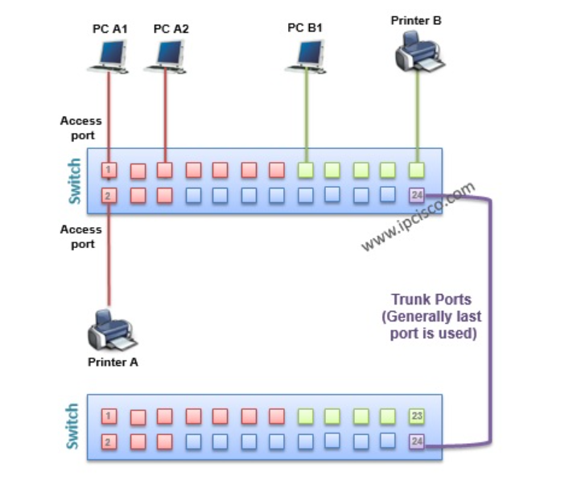
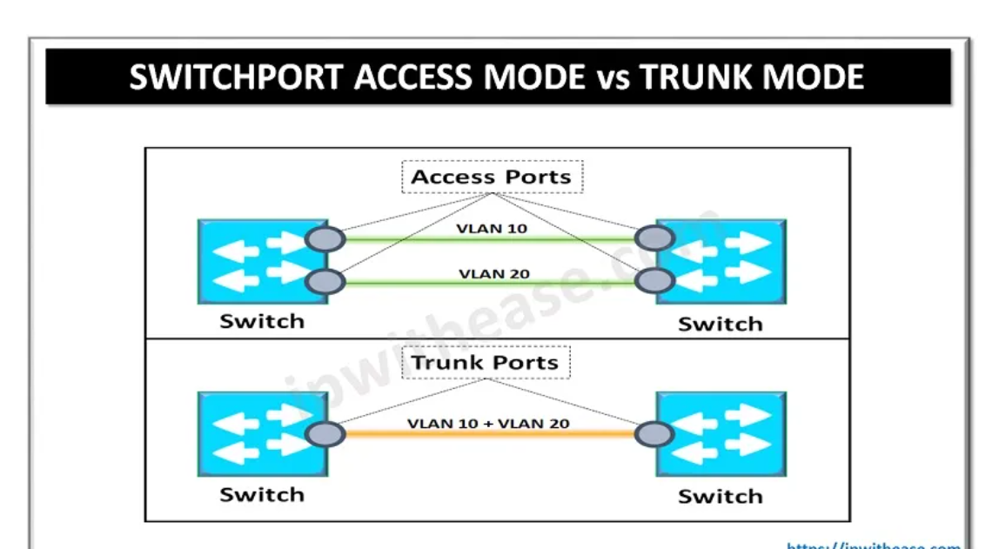
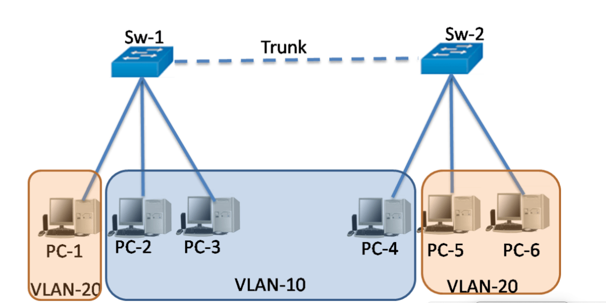

# ***Tìm hiểu về Access Port***

- Access port ( Cổng truy cập): Cổng có thể được gán cho một VLAN duy nhất.
- Access port là cổng truy cập, được sử dụng để kết nối các thiết bị mạng, 
chẳng hạn như máy tính, điện thoại 
hoặc máy in, với switch hoặc router. 
Access port chỉ cho phép một VLAN 
(Virtual Local Area Network) truy cập 
vào cổng đó, vì vậy tất cả các thiết 
bị được kết nối với access port sẽ 
thuộc cùng một VLAN.

Tóm lại, access port được sử dụng để 
kết nối các thiết bị mạng đơn lẻ với 
mạng cục bộ và chỉ cho phép truyền dữ 
liệu trong một VLAN duy nhất. Trong 
khi đó, trunk port được sử dụng để 
kết nối các thiết bị mạng và cho phép 
truyền dữ liệu giữa nhiều VLAN khác 
nhau thông qua cùng một kênh truyền.

# ***Tìm hiểuTrunk port:***

Trunk port là một kênh kết nối giữa các thiết bị mạng (như switch và router) trong mạng máy tính. Trong một mạng có nhiều VLAN, trunk port được sử dụng để gửi và nhận các khung dữ liệu từ nhiều VLAN khác nhau qua cùng một kênh truyền. Trong trường hợp này, các khung dữ liệu được gắn thẻ (tagged) với mã VLAN của chúng để cho switch hoặc router biết chúng thuộc về VLAN nào. Trunk port có thể kết nối giữa các switch hoặc giữa switch và router để cho phép truyền dữ liệu giữa các VLAN khác nhau trong mạng.
 
Trong khi đó, trunk port là cổng nối tiếp, được sử dụng để kết nối hai hoặc nhiều switch hoặc router lại với nhau. Trunk port cho phép truy cập đến nhiều VLAN khác nhau, giúp các thiết bị truy cập đến các VLAN khác nhau thông qua cùng một cổng.
# ***Cách hoạt động***

- Access port: Khi một thiết bị như máy tính được kết nối vào Access port của switch, switch sẽ ghi nhận địa chỉ MAC của thiết bị đó và lưu vào bảng MAC address table của switch. Khi switch nhận được gói tin từ Access port này, nó sẽ truyền gói tin đó đến các port khác trên cùng VLAN mà Access port đó đã được cấu hình trước đó. Nếu switch nhận được gói tin từ một Access port không được cấu hình trên VLAN, nó sẽ loại bỏ gói tin đó.

- Trunk port: Khi hai switch hoặc một switch và một router được kết nối với nhau thông qua Trunk port, chúng sẽ truyền dữ liệu giữa nhau thông qua các VLAN. Khi một gói tin được gửi từ switch A đến switch B thông qua Trunk port, switch A sẽ đánh dấu gói tin đó với thẻ VLAN để xác định VLAN của gói tin đó. Switch B nhận được gói tin này và sẽ kiểm tra thẻ VLAN để xác định gói tin thuộc VLAN nào. Sau đó, switch B sẽ truyền gói tin đó đến các port khác trên cùng VLAN như Access port của switch B.

# ***Tài liệu tham khảo***
<https://www.adroitacademy.com/blog/What-is-Access-and-Trunk-port>
<https://ipwithease.com/switchport-trunk-mode-vs-access-mode/>
<https://ipcisco.com/vlan-part-2/>
