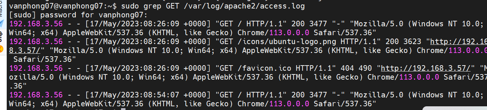

# ***Đường dẫn***

Theo mặc định, bạn có thể tìm thấy tệp nhật ký truy cập Apache tại đường dẫn sau:

`/var/log/apache/access.log`
`/var/log/Apache2/access.log`
`/etc/httpd/logs/access_log`

# ***Các câu lệnh thực hiện `file log apache`***
## ***Hiển thị 100 mục cuối cùng của Nhật ký truy cập***
`sudo tail -100 /var/log/apache2/access.log`

Lệnh `tail` yêu cầu máy đọc phần cuối cùng của tệp và -100lệnh chỉ đạo nó hiển thị 100 mục trước đó.

Phần cuối cùng, `/var/log/apache2/access.log` cho máy biết nơi tìm tệp nhật ký. Nếu tệp nhật ký của bạn ở một nơi khác, hãy đảm bảo thay thế đường dẫn máy của bạn thành tệp nhật ký Apache.

## ***Hiển thị Thuật ngữ cụ thể từ Nhật ký truy cập***
Đôi khi, bạn chỉ muốn hiển thị một loại mục cụ thể trong nhật ký. Bạn có thể sử dụng greplệnh để lọc báo cáo của mình theo các từ khóa nhất định.
`sudo grep GET /var/log/apache2/access.log`

Giống như lệnh trước, lệnh này xem tệp /var/log/apache2/access.log để hiển thị nội dung của nhật ký truy cập. Lệnh yêu grepcầu máy chỉ hiển thị các mục có GETyêu cầu.

Bạn cũng có thể thay thế các lệnh khác của Apache. Ví dụ: nếu bạn đang muốn theo dõi quyền truy cập vào hình ảnh .jpg, bạn có thể thay thế .jpg cho .jpg GET. Như trước đây, hãy sử dụng đường dẫn thực đến tệp nhật ký máy chủ của bạn.

## ***Cách xem nhật ký lỗi Apache***
`sudo tail -100 /var/log/apache2/error.log`

