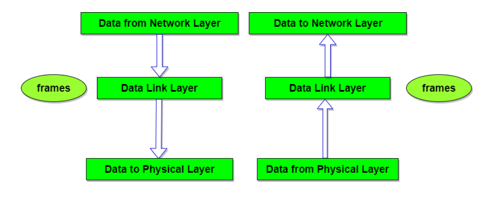
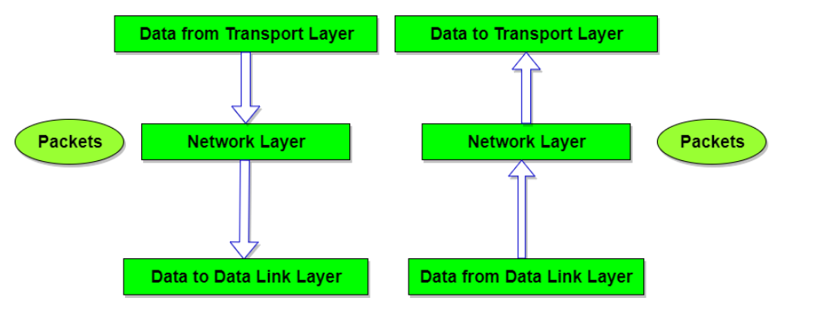
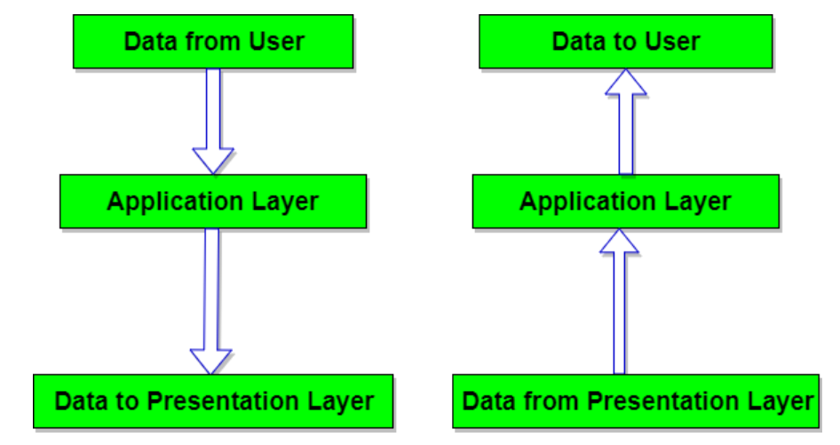
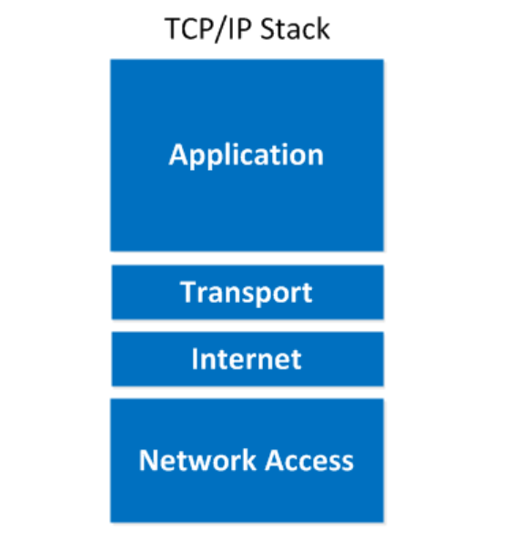
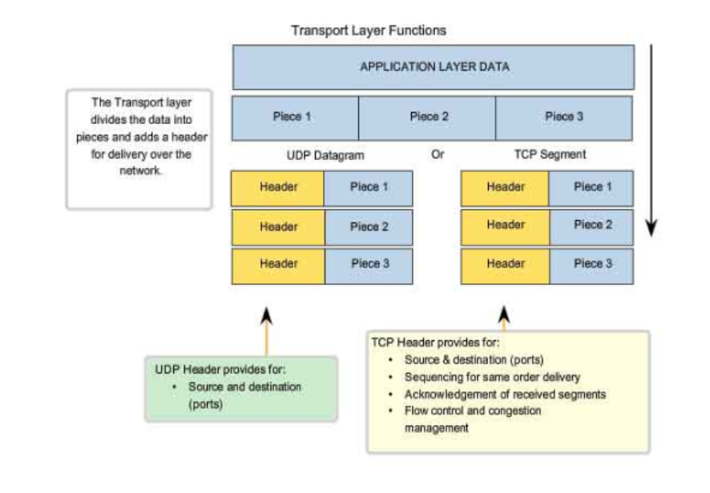

# **Mô hình OSI**
* Mô hình OSI tổ chức các giao thức truyền thông thành 7 tầng, mỗi một tầng giải quyết một phần hẹp của tiến trình truyền thông, chia tiến trình truyền thông thành nhiều tầng và trong mỗi tầng có thể có nhiều giao thức khác nhau thực hiện các nhu cầu truyền thông cụ thể.
*	Mô hình OSI được xây dựng gồm 7 tầng giao thức, hệ thống này được xây dựng theo các nguyên tắc sau: 
	- Các tầng có tính độc lập tương đối với nhau thực hiện các chức năng riêng biệt
	- Cho phép thay đổi chức năng hoặc giao thức trong một tầng không làm ảnh hưởng đến các tầng khác.
	- Có thể chia một tầng thành các tầng con khi cần thiết.
	- Cho phép huỷ bỏ các tầng con nếu thấy không cần thiết.
	- Bảo đảm liên kết cho nhiều hệ thống mạng khác nhau 
	- Thích ứng với nhu cầu phát triển các công nghệ mới trong tương lai

		
## **Chức năng các tầng trong mô hình OSI**
### **Tầng Vật Lí**
* 	Thực hiện các nhiệm vụ truyền dòng bit phi cấu trúc qua đường truyền vật lý, truy nhập đường truyền vật lý nhờ các phương tiện cơ, điện, quang…

### **Tầng dữ liệu**
* Cung cấp các phương tiện để truyền thông tin qua liên kết vật lý đảm bảo tin cậy; gửi các khối dữ liệu, kiểm soát lỗi và luồng dữ liệu khi cần thiết.

### **Tầng mạng( Network layer)**
* Thực hiện việc chọn đường và chuyển tiếp gói tin với công nghệ chuyển mạch thích hợp kiểm soát luồng dữ liệu và cắt/ hợp dữ liệu nếu cần.

### **Tầng vận chuyển( Transport layer)**
* Thực hiện truyền dữ liệu giữa 2 đầu mút, kiểm soát lỗi, kiểm soát luồng dữ liệu giữa 2 đầu mút, việc ghép kênh cắt/hợp dữ liệu nếu cần.

### **Tầng phiên( session layer)**
* Cung cấp các phương tiện quản lý truyền thông giữa các ứng dụng, thiết lập, duy trì , đồng bộ hóa, hủy bỏ các phiên truyền thông giữa các ứng dụng.

### **Tầng trình bày( presentation layer)**
* Chuyển đổi cú pháp dữ liệu để đáp ứng yêu cầu truyền dữ liệu của các ứng dụng qua môi trường OSI

### **Tầng ứng dụng( application layer)**
* Cung cấp các phương tiện để người sử dụng có thể truy cập được vào môi trường OSI, đồng thời cung cấp các dịch vụ thông tin phân tán

# **Mô hình TCP/IP**
## **Khái niệm**
* TCP/ IP (Transmission Control Protocol/ Internet Protocol - Giao thức điều khiển truyền nhận/ Giao thức liên mạng), là một bộ giao thức trao đổi thông tin được sử dụng để truyền tải và kết nối các thiết bị trong mạng Internet. TCP/IP được phát triển để mạng được tin cậy hơn cùng với khả năng phục hồi tự động.
* Một mô hình TCP/IP tiêu chuẩn bao gồm 4 lớp được chồng lên nhau, bắt đầu từ tầng thấp nhất là Tầng vật lý (Physical) → Tầng mạng (Network) → Tầng giao vận (Transport) và cuối cùng là Tầng ứng dụng (Application).

## **Chức năng các tầng trong mô hình TCP/IP**
### **Tầng vật lí**
* Là sự kết hợp giữa tầng Vật lý và tầng liên kết dữ liệu của mô hình OSI. Chịu trách nhiệm truyền dữ liệu giữa hai thiết bị trong cùng một mạng. Tại đây, các gói dữ liệu được đóng vào khung (gọi là Frame) và được định tuyến đi đến đích đã được chỉ định ban đầu.

### **Tầng mạng**
* Gần giống như tầng mạng của mô hình OSI. Tại đây, nó cũng được định nghĩa là một giao thức chịu trách nhiệm truyền tải dữ liệu một cách logic trong mạng. Các phân đoạn dữ liệu sẽ được đóng gói (Packets) với kích thước mỗi gói phù hợp với mạng chuyển mạch mà nó dùng để truyền dữ liệu. Lúc này, các gói tin được chèn thêm phần Header chứa thông tin của tầng mạng và tiếp tục được chuyển đến tầng tiếp theo. Các giao thức chính trong tầng là IP, ICMP và ARP.

### **Tầng giao vận**
* Chức năng chính của tầng 3 là xử lý vấn đề giao tiếp giữa các máy chủ trong cùng một mạng hoặc khác mạng được kết nối với nhau thông qua bộ định tuyến. Tại đây dữ liệu sẽ được phân đoạn, mỗi đoạn sẽ không bằng nhau nhưng kích thước phải nhỏ hơn 64KB. Cấu trúc đầy đủ của một Segment lúc này là Header chứa thông tin điều khiển và sau đó là dữ liệu.
* Trong tầng này còn bao gồm 2 giao thức cốt lõi là TCP và UDP. Trong đó, TCP đảm bảo chất lượng gói tin nhưng tiêu tốn thời gian khá lâu để kiểm tra đầy đủ thông tin từ thứ tự dữ liệu cho đến việc kiểm soát vấn đề tắc nghẽn lưu lượng dữ liệu. Trái với điều đó, UDP cho thấy tốc độ truyền tải nhanh hơn nhưng lại không đảm bảo được chất lượng dữ liệu được gửi đi.

### Tầng ứng dụng
* Đây là lớp giao tiếp trên cùng của mô hình. Đúng với tên gọi, tầng Ứng dụng đảm nhận vai trò giao tiếp dữ liệu giữa 2 máy khác nhau thông qua các dịch vụ mạng khác nhau (duyệt web, chat, gửi email, một số giao thức trao đổi dữ liệu: SMTP, SSH, FTP,...). Dữ liệu khi đến đây sẽ được định dạng theo kiểu Byte nối Byte, cùng với đó là các thông tin định tuyến giúp xác định đường đi đúng của một gói tin.

# **So sánh**
## Giống nhau
* -	Mối tương quan giữa hai mô hình OSI và TCP/IP là OSI được sử dụng như một mô hình tiêu chuẩn cho mạng và TCP/IP được sử dụng như một giao thức để triển khai mạng. Nếu bạn muốn tạo một hệ thống mạng, bạn có thể sử dụng mô hình OSI để tạo ra một kế hoạch và sử dụng giao thức TCP/IP để thực hiện kế hoạch đó.
* Mối tương quan giữa mô hình OSI và TCP/IP là hai mô hình này đều được sử dụng để mô tả cách các thiết bị mạng giao tiếp với nhau. Tuy nhiên, mô hình OSI cung cấp một cấu trúc chi tiết hơn cho việc giao tiếp giữa các thiết bị mạng, trong khi mô hình TCP/IP được thiết kế để cung cấp một cấu trúc cơ bản cho việc giao tiếp giữa các thiết bị mạng
## Khác nhau
### Mô hình OSI
* OSI (Open Systems Interconnection) là mô hình lập trình mạng được xây dựng bởi ISO (International Organization for Standardization) và cung cấp một cách trực quan để mô tả cách một hệ thống mạng hoạt động. OSI được chia thành 7 tầng, mỗi tầng đề cập đến một phần cụ thể của mạng và cách nó hoạt động với tầng khác.
* OSI (Open Systems Interconnection) là một mô hình 7 tầng, được xây dựng để mô tả cách các thiết bị mạng giao tiếp với nhau. Các tầng trong mô hình OSI bao gồm: tầng Application, Presentation, Session, Transport, Network, Data Link và Physical. Mỗi tầng trong mô hình này cung cấp các dịch vụ và chức năng khác nhau để hỗ trợ giao tiếp giữa các thiết bị mạng.
### Mô hình TCP/IP
* TCP/IP (Transmission Control Protocol/Internet Protocol) là một giao thức mạng được sử dụng trên Internet và các mạng khác. Nó được xây dựng trên nền tảng của OSI, nhưng chỉ có 4 tầng: tầng liên kết dữ liệu, tầng mạng, tầng giao vận và tầng ứng dụng.
* TCP/IP (Transmission Control Protocol/Internet Protocol) là một mô hình 4 tầng, được sử dụng để xây dựng Internet. Các tầng trong mô hình TCP/IP bao gồm: tầng Application, Transport, Internet và Network Access. Mỗi tầng trong mô hình này cung cấp các dịch vụ và chức năng khác nhau để hỗ trợ giao tiếp giữa các thiết bị mạng.

# **Tài liệu tham khảo**
* <https://www.totolink.vn/article/136-mo-hinh-osi-la-gi-chuc-nang-cua-cac-tang-giao-thuc-trong-mo-hinh-osi.html>
* <https://www.totolink.vn/article/149-mo-hinh-tcp-ip-la-gi-chuc-nang-cua-cac-tang-trong-mo-hinh-tcp-ip.html>

