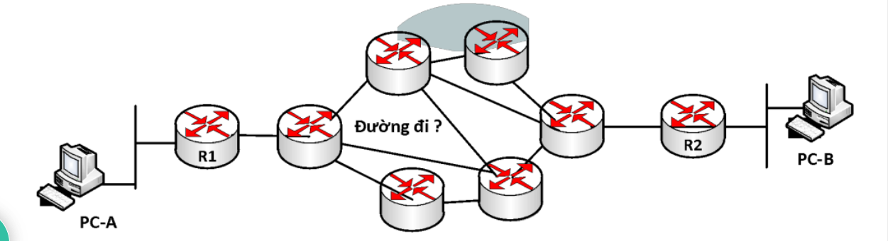
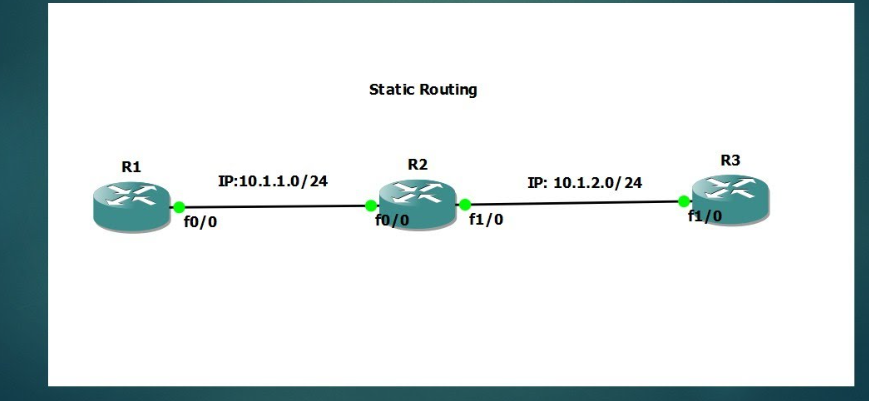
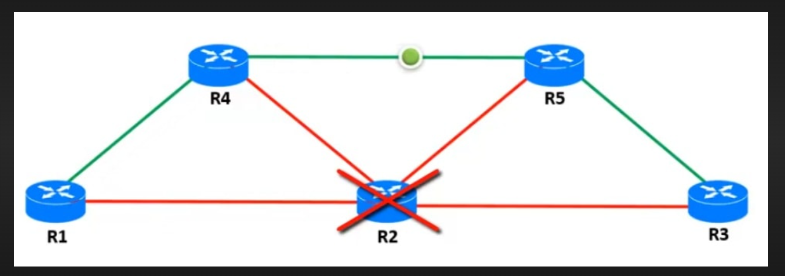
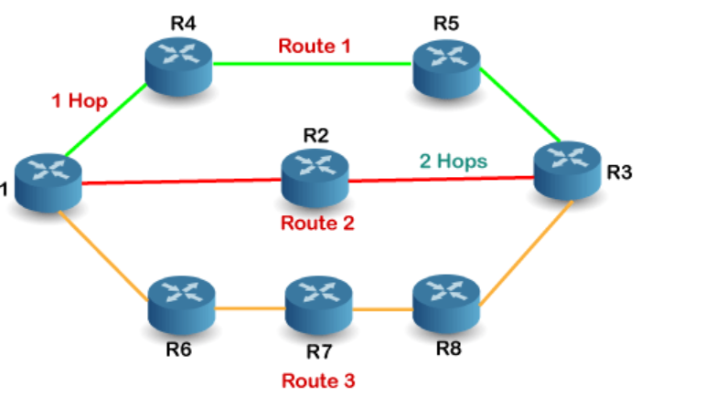
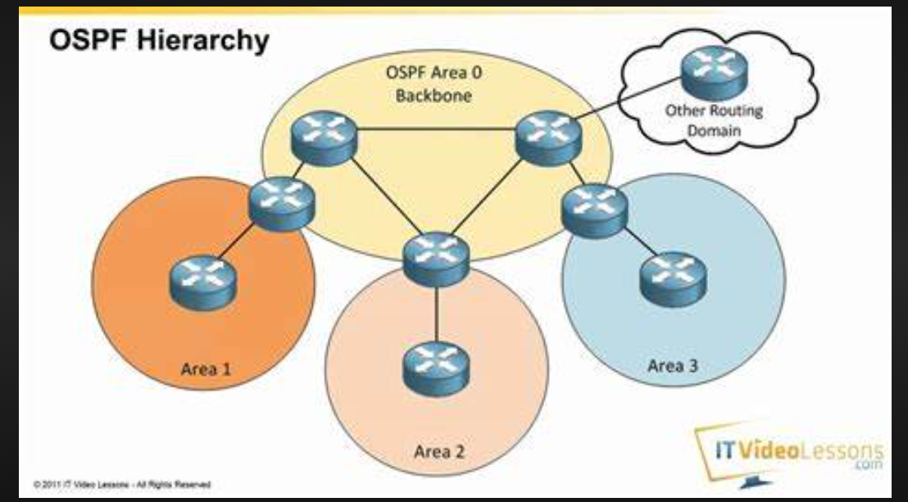

# ***Tìm hiểu về các giao thức định tuyến***
# ***Khái niệm***
- Định tuyến (Routing) là quá trình tìm kiếm và xác định đường đi tốt nhất trên một mạng máy tính để gói tin tới được đích thông qua các thiết bị định tuyến.
- Để làm được điều đó thì các thiết bị định tuyến cần phải dựa vào thông tin bẳng định tuyến (Routing Table) và giao thức định tuyến ( Routing Protocol).
- Định tuyến là quá trình xác định tuyến đường hoặc đường đi qua mạng mà một tin nhắn sẽ đi từ máy tính gửi đến máy tính nhận

# ***Cách hoạt động***
- Dữ liệu di chuyển dọc theo bất kỳ mạng nào dưới dạng gói dữ liệu. Mỗi gói dữ liệu có một tiêu đề chứa thông tin về điểm đích dự kiến của gói. Khi gói di chuyển đến đích của mình, một số bộ định tuyến có thể định tuyến gói đó nhiều lần. Các bộ định tuyến thực hiện quy trình này hàng triệu lần mỗi giây với hàng triệu gói.

- Khi một gói dữ liệu đến, trước tiên, bộ định tuyến sẽ tra cứu địa chỉ của gói trong bảng định tuyến. Quá trình này tương tự như một hành khách tham khảo lịch trình xe buýt để tìm tuyến xe buýt tốt nhất tới điểm đích của mình. Sau đó, bộ định tuyến chuyển tiếp hoặc di chuyển gói đến điểm tiếp theo trong mạng.

Ví dụ: khi bạn truy cập một trang web từ máy tính trong mạng văn phòng của bạn, các gói dữ liệu sẽ đi đến bộ định tuyến mạng văn phòng trước. Bộ định tuyến tra cứu gói có tiêu đề và xác định điểm đích của gói. Sau đó, bộ định tuyến sẽ tự tra cứu bảng nội bộ của nó và chuyển tiếp gói – đến bộ định tuyến tiếp theo hoặc đến một thiết bị khác, chẳng hạn như máy in – trong mạng đó.

# ***Phân loại***
## ***Định tuyến tĩnh***
- Định tuyến tĩnh là phương pháp định tuyến theo phương thức người quản trị khai báo thông tin định tuyến cho thiết bị định tuyến theo phương thức thủ công.
- Ưu điểm:
  - Sử dụng ít băng thông hơn so với các phương thức định tuyến khác.
  - Không tiêu tốn tài nguyên để tính toàn và phân tích gói tin định tuyến.
  - Dễ dàng triển khai, cấu hình.
  - Có tính bảo mật tốt hơn.
- Nhược điểm:
  - Không có khả năng tự động cập nhật đường đi.
  - Phải cấu hình thủ công khi mạng có sự thay đổi.
  - Khả năng mở rộng kém, phù hợp với mô hình mạng nhỏ.
- Những trường hợp sử dụng định tuyến tĩnh:
  - Đường truyền có băng thông thấp.
Người quản trị cần kiểm soát các kết nối trong hệ thống.
  - Hệ thống co các tuyến kết nối ít.
  - Kết nối dùng định tuyến tĩnh là đường dự phòng cho đường kết nối dùng giao thức định tuyến động.
- Phương thức triển khai định tuyến tĩnh: Next hop hoặc Exit Interface
  - Next hop: thông tin sẽ chuyển đến Router kế tiếp nào trước khi đến đích.
  - Exit Interface: thông tin sẽ được đưa ra cổng nào trước khi đến đích.

## ***Định tuyến động***
- Định tuyến động là phương thức tự động chia sẻ, trao đổi thông tin giữa các thiết bị định tuyến dựa trên các giao thức định tuyến động.
- Tự động cập nhật thông tin bảng định tuyến nếu hệ thống có sự thay đổi.
- Tính toán và đưa ra tuyến đường chuyển thông tin tốt nhất.

### ***Mục đích***
- Trong một mạng rất lớn có rất nhiều bộ định tuyến như mạng Internet, việc cập nhật bảng định tuyến bằng tay là không thể, vì vậy cần phải có giao thức định tuyến, giao thức định tuyến cho phép các Router xây dựng bảng định tuyến một cách linh hoạt đó là:

  - Khám phá mạng từ xa.
  - Duy trì việc cập nhật thông tin định tuyến.
  - Tính toán và chọn tuyến đường đi tốt nhất đến đích.
  - Nếu tuyến đường chuyển thông tin chính bị lỗi, tự tính toán và đưa ra tuyến đường chuyển thông tin backup.
# ***Các giao thức định tuyến***
Giao thức định tuyến là một tập hợp các quy tắc xác định cụ thể cách bộ định tuyến xác định và chuyển tiếp các gói dọc theo đường dẫn mạng. Các giao thức định tuyến được nhóm thành hai hạng mục riêng biệt: giao thức cổng nội bộ và giao thức cổng bên ngoài.

- Giao thức cổng nội bộ
Những giao thức này đánh giá hệ thống tự trị và đưa ra quyết định về định tuyến dựa trên các chỉ số khác nhau, chẳng hạn như sau:

Số bước nhảy hoặc số lượng bộ định tuyến giữa nguồn và điểm đích
Thời gian trì hoãn hoặc thời gian dùng để gửi dữ liệu từ nguồn đến điểm đích
Băng thông hoặc dung lượng liên kết giữa nguồn và điểm đích

- Giao thức thông tin định tuyến
Giao thức thông tin định tuyến (RIP) dựa vào số bước nhảy để xác định đường dẫn ngắn nhất giữa các mạng. RIP là một giao thức cũ mà hiện nay không ai sử dụng vì giao thức này không có khả năng điều chỉnh quy mô tốt để triển khai mạng lớn hơn.

- Giao thức Mở đường dẫn ngắn nhất đầu tiên
Giao thức Mở đường dẫn ngắn nhất đầu tiên (OSPF) thu thập thông tin từ tất cả các bộ định tuyến khác trong hệ thống tự trị để xác định tuyến đường ngắn nhất và nhanh nhất đến điểm đích của một gói dữ liệu. Bạn có thể triển khai OSPF bằng cách sử dụng các thuật toán định tuyến hoặc quy trình máy tính khác nhau.

- Giao thức cổng đường biên
BGP xác định hoạt động giao tiếp qua Internet. Internet là một tập hợp lớn gồm các hệ thống tự trị mà tất cả đều được kết nối với nhau. Mỗi hệ thống tự trị có số hệ thống tự trị (ASN) có được bằng cách đăng ký với Tổ chức cấp phát số hiệu Internet.

BGP hoạt động bằng cách theo dõi các ASN gần nhất và ánh xạ địa chỉ đích tới ASN tương ứng của chúng.

# ***Thuật toán định tuyến***
Thuật toán định tuyến là các chương trình phần mềm triển khai các giao thức định tuyến khác nhau. Chúng hoạt động bằng cách chỉ định một con số chi phí cho mỗi liên kết; con số chi phí được tính bằng các chỉ số mạng khác nhau. Mỗi bộ định tuyến đều cố gắng chuyển tiếp gói dữ liệu đến liên kết tiếp theo tốt nhất với chi phí thấp nhất.

Sau đây là một số ví dụ về thuật toán.

- Định tuyến theo vectơ khoảng cách
  - Thuật toán Định tuyến vectơ khoảng cách yêu cầu tất cả các bộ định tuyến phải định kỳ cập nhật lẫn nhau về thông tin đường dẫn tốt nhất đã tìm thấy. Mỗi bộ định tuyến gửi thông tin về đánh giá tổng chi phí hiện tại đến tất cả các điểm đích đã biết.

  - Cuối cùng, mọi bộ định tuyến trong mạng đều nhận ra thông tin đường dẫn tốt nhất dành cho tất cả các điểm đích có thể có.

- Định tuyến theo trạng thái liên kết
  - Trong Định tuyến theo trạng thái liên kết, mọi bộ định tuyến đều nhận ra tất cả những bộ định tuyến khác trong mạng. Bằng cách sử dụng thông tin này, một bộ định tuyến sẽ tạo một sơ đồ của mạng hoàn chỉnh và sau đó tính toán đường dẫn ngắn nhất cho bất kỳ gói dữ liệu nào.
# ***Tài liệu tham khảo***
<https://maychuvatly.com/blog/dinh-tuyen-la-gi-cac-loai-dinh-tuye>

<https://www.educba.com/what-is-static-routing/>

<https://medium.com/@150107094/routing-concepts-static-routing-week-9-cd62dc019de2>

<https://aws.amazon.com/vi/what-is/routing/>

<https://images.search.yahoo.com/search/images;_ylt=Awrg0OY2Hf9jhcgFPtFXNyoA;_ylu=Y29sbwNncTEEcG9zAzEEdnRpZAMEc2VjA3BpdnM-?p=ospf+protocol&fr2=piv-web&type=E210US91215G0&fr=mcafee#id=73&iurl=https%3A%2F%2Fi.ytimg.com%2Fvi%2FRfwxV4VnOqI%2Fmaxresdefault.jpg&action=click>
