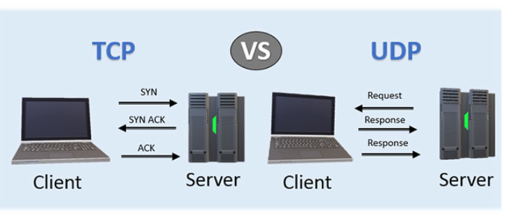
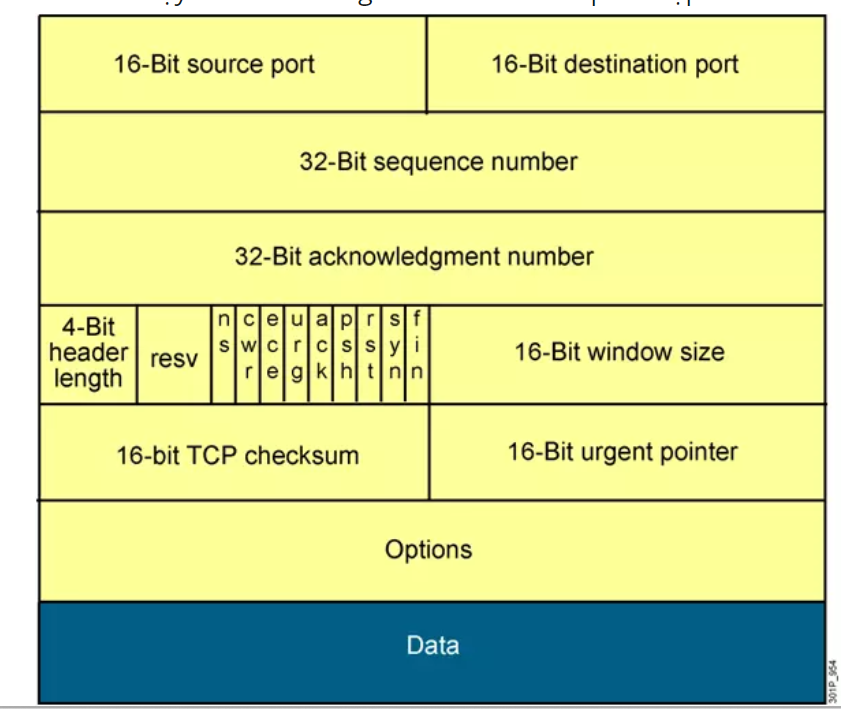
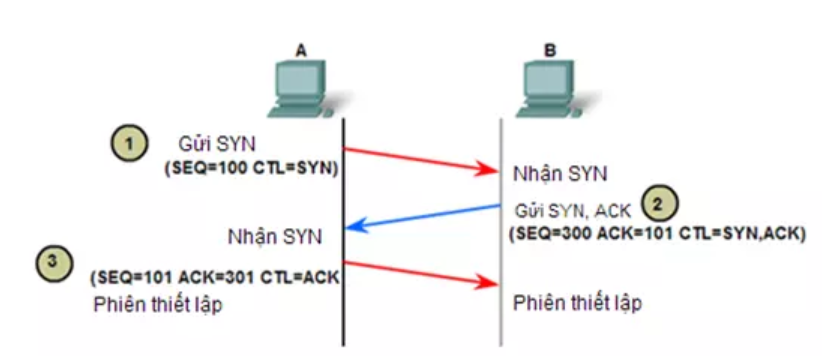
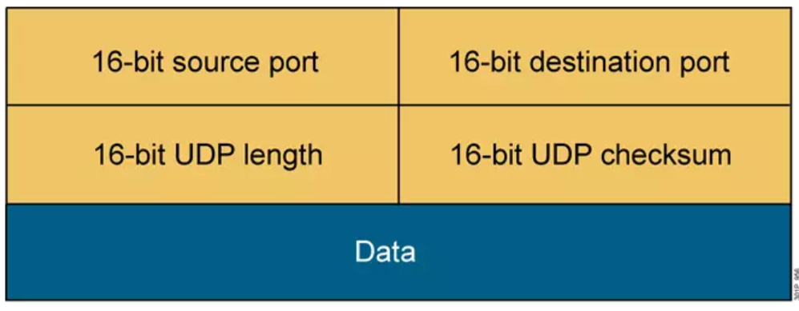

# **Tìm hiểu TCP**
## ***Khái niệm***

- TCP (Transmission Control Protocol) là một trong những giao thức truyền tải dữ liệu phổ biến nhất trên mạng Internet. TCP được sử dụng để truyền tải các ứng dụng có yêu cầu độ tin cậy cao như truyền tải file, truyền tải email, truyền tải web.
## ***Chức năng***
- Cung cấp cơ chế báo nhận (Acknowledgement) :Khi A gửi dữ liệu cho B, B nhận được thì gửi gói tin cho A xác nhận là đã nhận. Nếu không nhận được tin xác nhận thì A sẽ gửi cho đến khi B báo nhận thì thôi.
- Cung cấp cơ chế đánh số thứ tự gói tin (sequencing) cho các đơn vị dữ liệu được truyền, sử dụng để ráp các gói tin chính xác ở điểm nhận và loại bỏ gói tin trùng lặp.
- Có các cơ chế điều khiển luồng thích hợp (flow control) để tránh nghẽn xảy ra.
- Hỗ trợ cơ chế full-duplex ( truyền và nhận dữ liệu cùng một lúc)
- Phục hồi dữ liệu bị mất trên đường truyền ( A gửi B mà không thấy xác nhận sẽ gửi lại) .

## ***Cấu trúc gói tin TCP***

- **Source port và destination port** (đều dài 16 bit): được sử dụng để định danh cho session của giao thức nào đó trên lớp ứng dụng đang được truyền tải trong TCP segment đang xét
- **Sequence number (32 bit)**: dùng để đánh số thứ tự gói tin (từ số sequence nó sẽ tính ra được số byte đã được truyền).
- **Acknowledge number (32 bit)**: : dùng để báo đã nhận được gói tin nào và mong nhận được byte mang số thứ tự nào tiếp theo.
- **Header length (4 bit)**: cho biết toàn bộ header dài bao nhiêu tính theo đơn vị word(1 Word = 4 byte).
- **Các bit reserverd (4 bit)**: đều được thiết lập bằng 0
- **Các bit control (9 bit)**: các bit dùng để điều khiển cờ (flag) ACK, cờ Sequence ...
- **Window size (16 bit)**: số lượng byte được thiết bị sẵn sàng tiếp nhận
- **Checksum (16 bit)**: kiểm tra lỗi của toàn bộ TCP segment
- **Urgent pointer (16 bit)**: sử dụng trong trường hợp cần ưu tiên dữ liệu
- **Options (tối đa 32 bit)**: cho phép thêm vào TCP các tính năng khác
- **Data**: dữ liệu của lớp trên

## ***Cách thức hoạt động***

- TCP là giao thức được sử dụng phổ biến nhất trên Internet. Khi bạn yêu cầu một trang web trong trình duyệt, máy tính sẽ gửi các gói tin TCP đến địa chỉ của máy chủ web, yêu cầu nó gửi lại trang web. Máy chủ web phản hồi bằng cách gửi một luồng các gói tin TCP, mà trình duyệt web của bạn kết hợp với nhau để tạo thành trang web. Khi click vào liên kết, đăng nhập, đăng nhận xét hoặc làm bất kỳ điều gì khác, trình duyệt web của bạn sẽ gửi gói tin TCP tới máy chủ và máy chủ gửi lại các gói tin cho TCP.

- Giao thức TCP có độ tin cậy cao, các gói tin được gửi bằng TCP sẽ được theo dõi do vậy dữ liệu sẽ không bị mất hoặc hỏng trong quá trình vận chuyển. Đó là lý do tại sao file tải xuống không bị hỏng ngay cả khi mạng có vấn đề. Tất nhiên, nếu bên nhận hoàn toàn ngoại tuyến, máy tính của bạn sẽ từ bỏ và bạn sẽ thấy một thông báo lỗi ghi nó không thể giao tiếp với máy chủ lưu trữ từ xa.

- Giao thức TCP đạt được điều này theo hai cách. Đầu tiên, nó yêu cầu các gói tin bằng cách đánh số chúng. Thứ hai, nó kiểm tra lỗi bằng cách yêu cầu bên nhận gửi phản hồi đã nhận được cho bên gửi. Nếu bên gửi không nhận được phản hồi đúng, nó có thể gửi lại gói tin để đảm bảo bên nhận nhận chúng một cách chính xác.

  ## ***Đặc điểm của TCP***
- Đảm bảo tính toàn vẹn dữ liệu: TCP sử dụng các cơ chế kiểm soát lỗi, giúp đảm bảo tính toàn vẹn dữ liệu trong quá trình truyền tải. Nếu một gói dữ liệu bị mất hoặc bị hỏng, TCP sẽ yêu cầu thiết bị gửi gửi lại gói dữ liệu đó để đảm bảo tính toàn vẹn dữ liệu.

- Quản lý kết nối: TCP sử dụng cơ chế bắt tay 3 bước (3-way handshake) để thiết lập kết nối trước khi truyền tải dữ liệu. Khi kết nối được thiết lập, TCP sẽ tiến hành truyền tải dữ liệu theo thứ tự và đảm bảo tính toàn vẹn của dữ liệu.

- Kiểm soát luồng dữ liệu: TCP sử dụng cơ chế kiểm soát luồng dữ liệu, giúp đảm bảo rằng thiết bị nhận sẽ không bị quá tải khi thiết bị gửi truyền tải dữ liệu quá nhanh.

- Đảm bảo độ tin cậy: TCP sử dụng các cơ chế kiểm soát lỗi, bắt tay 3 bước và kiểm soát luồng dữ liệu để đảm bảo độ tin cậy của quá trình truyền tải dữ liệu.

- Hỗ trợ đa nhiệm: TCP cho phép các thiết bị trên mạng thực hiện nhiều kết nối cùng một lúc, giúp tăng cường hiệu suất và khả năng mở rộng của hệ thống.
# ***Tìm hiểu UDP***
## ***Khái niệm***

- UDP (User Datagram Protocol) là một trong những giao thức truyền tải dữ liệu phổ biến trên mạng Internet. UDP được sử dụng để truyền tải các ứng dụng có yêu cầu độ tin cậy không cao như truyền tải âm thanh, video, trò chơi trực tuyến, các ứng dụng thời gian thực.

## ***Chức năng UDP***
- Ngược lại với giao thức TCP thì UDP là giao thức truyền tải hướng không kết nối (connectionless). Nó sẽ không thực hiện thao tác xây dựng kết nối trước khi truyền dữ liệu mà thực hiện truyền ngay lập tức khi có dữ liệu cần truyền (kiểu truyền best effort) => truyền tải rất nhanh cho dữ liệu của lớp ứng dụng.
- Không đảm bảo tính tin cậy khi truyền dữ liệu và không có cơ chế phục hồi dữ liệu ( nó không quan tâm gói tin có đến đích hay không, không biết gói tin có bị mất mát trên đường đi hay không) => dễ bị lỗi.
- Không thực hiện các biện pháp đánh số thứ tự cho các đơn vị dữ liệu được truyền…
- Nhanh và hiệu quả hơn đối với các dữ liệu có kích thước nhỏ và yêu cầu khắt khe về thời gian.
- Bản chất không trạng thái nên UDP hữu dụng đối với việc trả lời các truy vấn nhỏ với số lượng lớn người yêu cầu.

## ***Cấu trúc gói tin UDP***

- **source port và destination port(đều 16 bit)**: cho phép định danh một session của một ứng dụng nào đó chạy trên UDP. Có thể coi port chính là địa chỉ của tâng Transport
- **UDP length(16 bit)**: cho biết chiều dài của toàn bộ UDP datagram tổng cộng bao nhiêu byte. (16 bit thì sẽ có tổng cộng 2^16 byte = 65536 giá trị (từ 0 -> 65535 byte)).
- **UDP checksum(16 bit)**: sử dụng thuật toán mã vòng CRC để kiểm lỗi cho toàn bộ UDP datagram và chỉ kiểm tra một cách hạn chế
- **Data**: dữ liệu tầng trên được đóng gói vào UDP datagram đang xét.

## ***Cách hoạt động UDP***
- UDP hoạt động tương tự như TCP nhưng nó không cung cấp kiểm tra lỗi khi truyền gói tin.

- Khi một ứng dụng sử dụng UDP, các gói tin chỉ được gửi đến người nhận. Người gửi không đợi để đảm bảo người nhận nhận được gói tin hay không, mà tiếp tục gửi các gói tiếp theo. Nếu người nhận miss mất một vài gói tin UDP thì gói tin đó coi như bị mất vì người gửi sẽ không gửi lại chúng. => Các thiết bị có thể giao tiếp nhanh hơn.

## ***Đặc điểm UDP***
- Không đảm bảo tính toàn vẹn dữ liệu: UDP không sử dụng các cơ chế kiểm soát lỗi và không yêu cầu thiết bị gửi gửi lại gói dữ liệu nếu gói dữ liệu bị mất hoặc bị hỏng. Do đó, UDP không đảm bảo tính toàn vẹn dữ liệu trong quá trình truyền tải.

- Không quản lý kết nối: UDP không sử dụng cơ chế bắt tay 3 bước (3-way handshake) để thiết lập kết nối trước khi truyền tải dữ liệu. Khi gửi dữ liệu, thiết bị chỉ cần chỉ định địa chỉ IP và cổng của thiết bị nhận, và gửi dữ liệu đến địa chỉ đó.

- Không kiểm soát luồng dữ liệu: UDP không sử dụng cơ chế kiểm soát luồng dữ liệu, do đó, thiết bị nhận sẽ phải tự xử lý nếu thiết bị gửi truyền tải dữ liệu quá nhanh.

- Không đảm bảo độ tin cậy: Do không sử dụng các cơ chế kiểm soát lỗi và bắt tay 3 bước, UDP không đảm bảo độ tin cậy của quá trình truyền tải dữ liệu.

- Hỗ trợ đa nhiệm: UDP cho phép các thiết bị trên mạng thực hiện nhiều kết nối cùng một lúc, giúp tăng cường hiệu suất và khả năng mở rộng của hệ thống.

# ***So sánh***
## ***Giống nhau***
- GIống nhau: đều là các giao thức mạng TCP/IP, có chức năng kết nối các máy lại với nhau và có thể gửi dữ liệu cho nhau….

## ***Khác nhau***
