# ***Cấu hình DHCP Server***
## ***1. Cài đặt gói DHCP***
```
yum install dhcp
```
Việc cài đặt gói dhcp sẽ tạo một tệp, /etc/dhcp/dhcpd.conf, tệp này chỉ là một tệp cấu hình trống
```
cat /etc/dhcp/dhcpd.conf
```
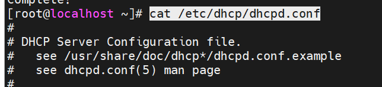
## ***2. Thành phần file cấu hình DHCP***
- Cấu hình toàn cục ( global ) : quy định những thông tin giá trị mặc định cho các khai báo lớp mạng ( subnet ) cấp pháp IP động DHCP .
- Cấu hình lớp mạng cấp phát IP động ( scope ) : quy định những giá trị thông tin cho việc cấp phát IP động thông qua DHCP .

## ***3. Chỉnh sửa file cấu hình /etc/dhcp/dhcpd.conf:***
 Do file cấu hình ban đầu sẽ không có thông số nên ta copy file mẫu và chỉnh sửa:
 ```
 cp /usr/share/doc/dhcp*/dhcpd.conf.example /etc/dhcp/dhcpd.conf
 ```
 ### ***3.1 Cấu hình Global***
 Cấu hình `domain name` và `domain name-server`:
 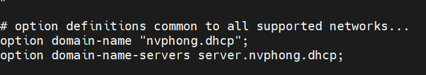

 Thời gian mặc định cấp IP cho 1 Client và Thời gian tối đa cấp IP cho 1 Client. (đơn vị: giây)
  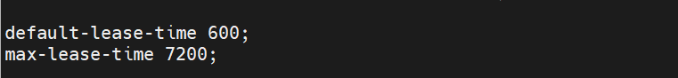
Nếu máy chủ là máy chủ chính thức trong mạng nội bộ, hãy bỏ comment tùy chọn `authoritative`:
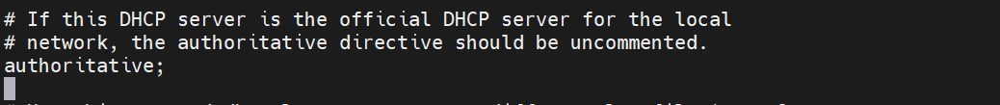
Log của DHCP tại `/var/log/boot.log`:
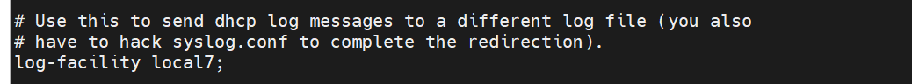
### ***3.2 Cấu hình Scope***
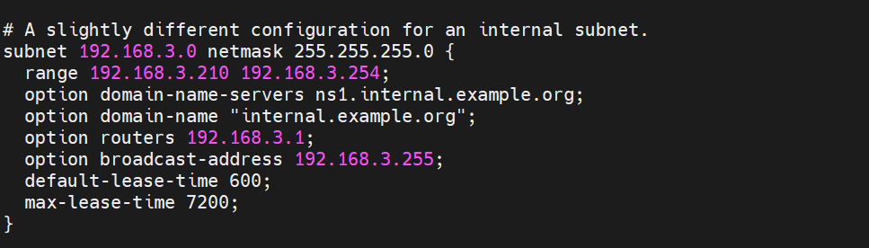
 Trong đó
 - range : vùng địa chỉ IP được dùng để cấp phát cho Client
- option domain-name-servers: DNS Server
- option domain-name : Tên Domain
- option routers : Default gateway
- option broadcast-address : Địa chỉ broadcast của dải mạng
- default-lease-time : Thời gian mặc định cấp IP cho một Client (ưu tiên hơn global) (đơn vị: giây)
- max-lease-time : Thời gian tối đa cấp IP cho một Client (ưu tiên hơn global) (đơn vị: giây)
## ***4. Khởi động dịch vụ***
```
systemctl start dhcpd
```
```
systemctl enable dhcpd
```
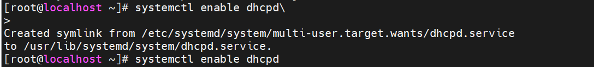

## ***5. Cấu hình Firewall cho dịch vụ dhcp:***
```
firewall-cmd --add-service=dhcp --permanent
firewall-cmd --reload
```


## ***6. Kiểm tra trạng thái dịch vụ:***

```
systemctl status dhcpd
```
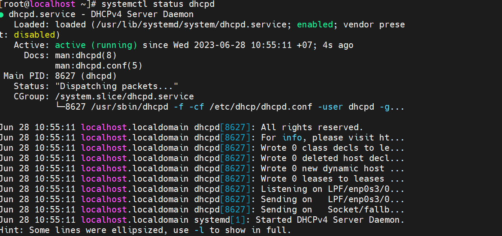


# ***Cấu hình trên DHCP client***

```
cat /etc/sysconfig/network-scripts/ifcfg-enp0s3
```
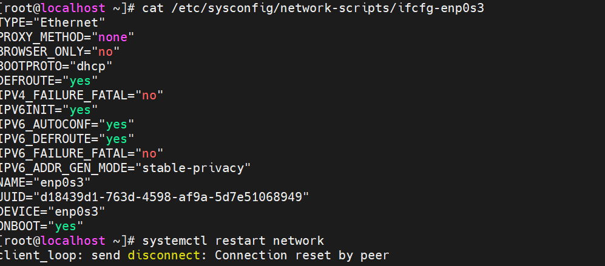

## ***1. Khởi động lại dịch vụ mạng***
```
systemctl restart network
```
## ***2. Kiểm tra địa chỉ ip trên client***
Địa chỉ ip ban đầu
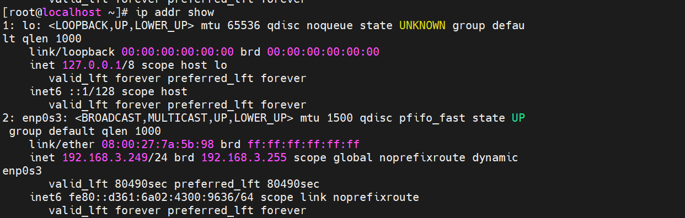
Địa chỉ ip sau khi cấp phát DHCP
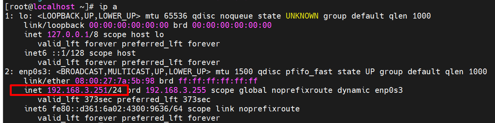
# ***Tài liệu tham khảo***
<https://access.redhat.com/documentation/en-us/red_hat_enterprise_linux/7/html/networking_guide/sec-dhcp-configuring-server>
<https://cuongquach.com/cai-dat-va-cau-hinh-dhcp-server-tren-centos-7.html#:~:text=M%C3%B4%20h%C3%ACnh%20lab%20d%E1%BB%8Bch%20v%E1%BB%A5%20DHCP%20Server%20tr%C3%AAn,CentOS%207%202.%20C%E1%BA%A5u%20h%C3%ACnh%20d%E1%BB%8Bch%20v%E1%BB%A5%20DHCP>
