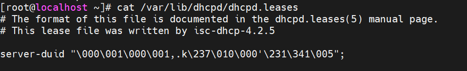
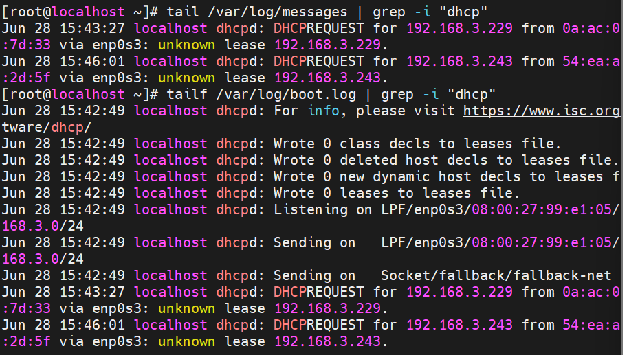
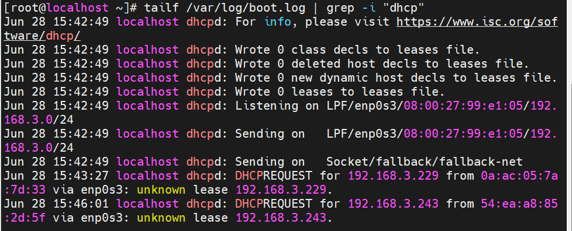

# ***Danh sách địa chỉ IP đã cấp phát bởi DHCP***
Để xem những địa chỉ IP đã được cấp phát bởi DHCP Server trên Centos7 ở file `/var/lib/dhcpd/dhcpd.leases`

# ***Quá trình cấp phát của dịch vụ DHCP***
File log quá trình cấp phát của dịch vụ DHCP thì xem log tại file log `message`
```
tail /var/log/messages | grep -i "dhcp"
```


# ***Log của DHCP***
Có thể xem log của DHCP tại `/var/log/boot.log`
Sử dụng lệnh `tailf` để theo dõi sự thay đổi của file log
```
tailf /var/log/boot.log | grep -i "dhcp"
```

