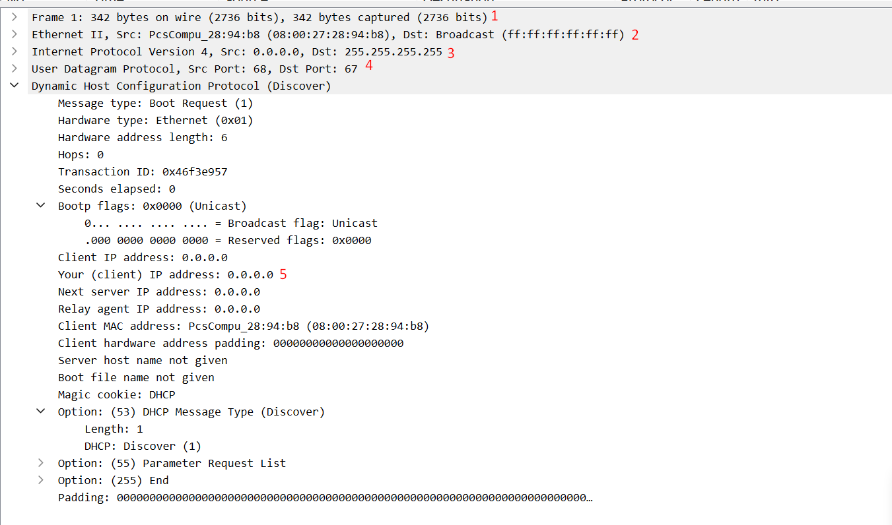
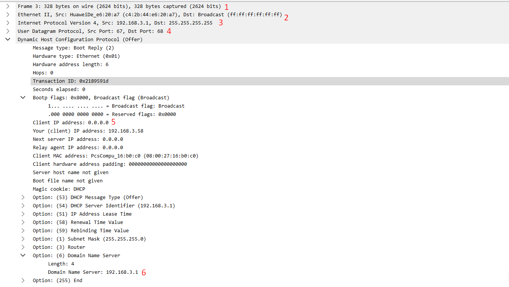
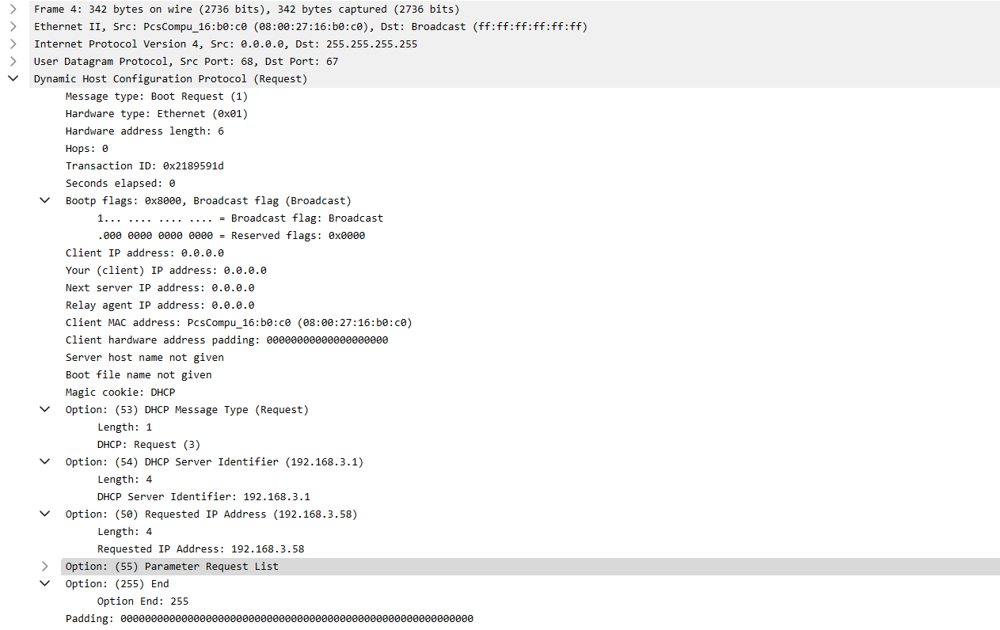
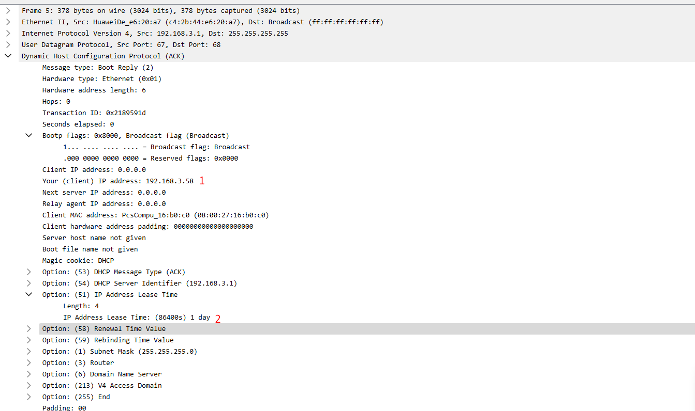

# ***1. Kiểm tra cài đặt `tcpdump`***
```
tcpdump -D
```
- Cài đặt gói `tcpdump`
```
yum install tcpdump
```
- Kiểm tra lại đã thấy các interface đang có sẵn để theo dõi


- Để bắt gói tin ta phải tắt không nhận địa chỉ IP từ DHCP Server

```
vi /etc/sysconfig/network-scripts/ifcfg-enp0s3
```

- Sau đó `reboot` lại.

- Bây giờ, interface enp0s3 chưa được set địa chỉ IP. Ta sẽ mở 2 terminal. 1 bên chỉnh sửa file cấu hình interface enp0s3- ta đặt BOOTPROTO = "dhcp", 1 bên 
# ***2. Cài đặt `tcpdump` bắt gói tín `DHCP`***
- Giải phóng IP đã gán cho card `enp0s3`

```
dhclient -r
```
- sau đó yêu cầu cấp lại địa chỉ IP
```
dhclient -v
```
- sử dụng tcpdump để bắt gói tin khi DHCP cung cấp IP


# ***3. Wireshark***
Sử dụng wireshark để đọc file `dhcp.pcap` 

## ***3.1 Phân tích gói tin `DHCP`***
### ***3.1.1 Phân tích gói tin `DHCP Discover`***


Trong đó:
- 1: kích thước gói tin
- 2: Card mạng nguồn, địa chỉ MAC nguồn, MAC đích
- 3: Là tin broadcast. địa chỉ ip nguồn (0.0.0.0) và địa chỉ ip đích (255.255.255.255)
- 4: Cổng nguồn (68) và cổng đích (67).
- 5: Địa chỉ IP client trong gói header.

### ***3.1.2 Phân tích gói tin `DHCP Offer`***

- 1: Kích thước gói tin
- 2: Card mạng nguồn, địa chỉ MAC nguồn, MAC đích
- 3: Là tin broadcast. địa chỉ ip nguồn (192.168.3.1) và địa chỉ ip đích (255.255.255.255)
- 4: Cổng nguồn (67) và cổng đích (68).
- 5: Địa chỉ IP client trong gói header.
- 6: Định danh dhcp server:chính là ip của server


### ***3.1.3 Phân tích gói tin `DHCP Request`***


### ***3.1.4 Phân tích gói tin `DHCP ACK`***

- 1: địa chỉ ip client
- 2: thời gian cho client thuê

# ***Tài liệu tham khảo***
<https://github.com/hocchudong/thuctap032016/blob/master/LTLinh/LTLinh-B%C3%A1o%20c%C3%A1o%20giao%20th%E1%BB%A9c%20DHCP/LTLinh-caidatwireshark-phantichgoitinDHCP.md>
<https://github.com/danghai1996/thuctapsinh/blob/master/HaiDD/DHCP/5-PhanTichGoiTinDHCP.md>
