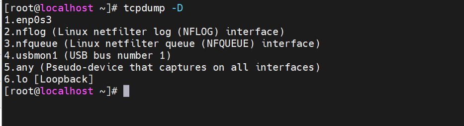
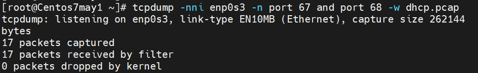
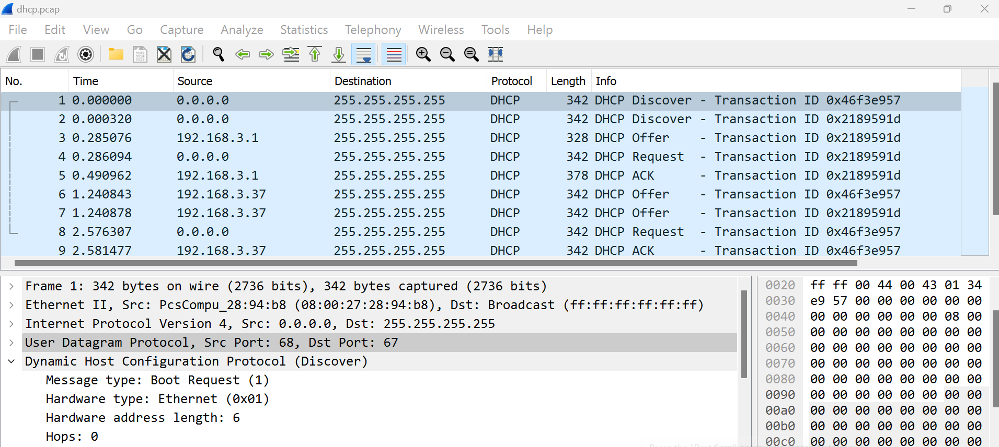
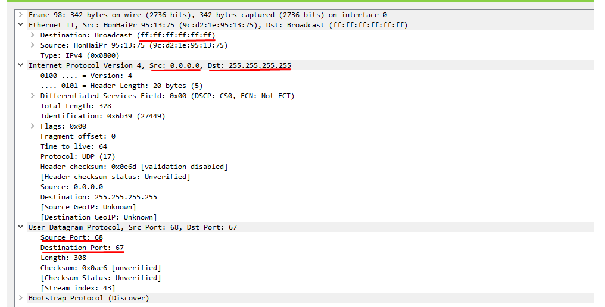
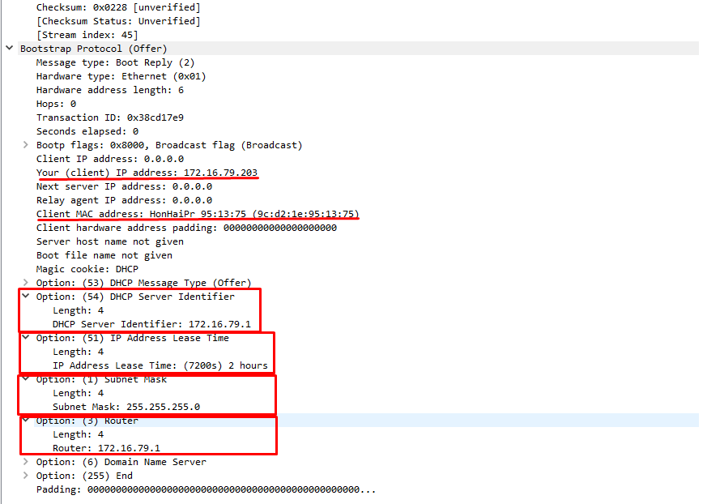
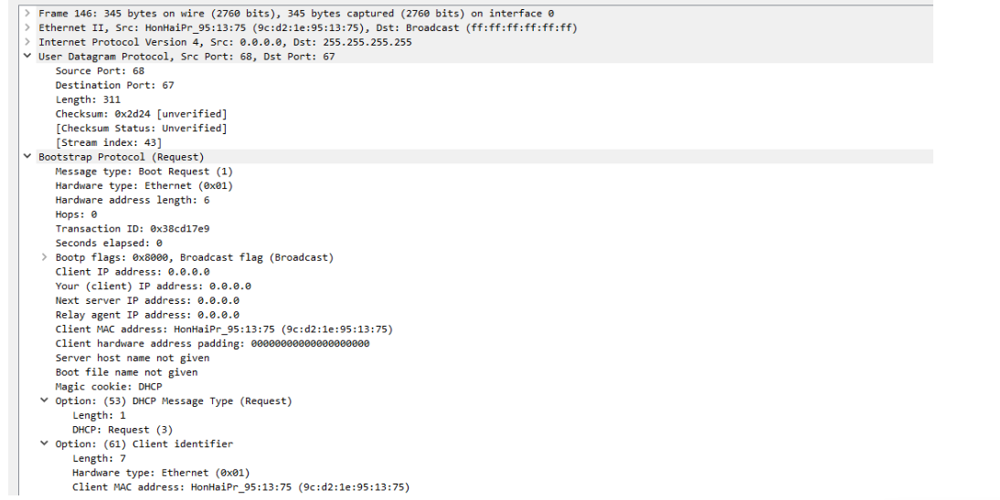
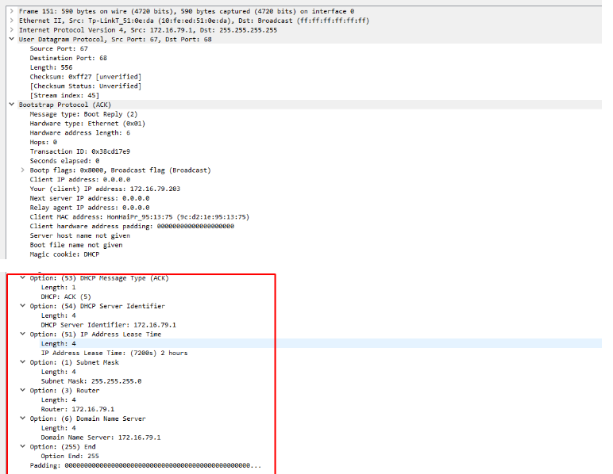

# ***1. Kiểm tra cài đặt `tcpdump`***
```
tcpdump -D
```
- Cài đặt gói `tcpdump`
```
yum install tcpdump
```
- Kiểm tra lại đã thấy các interface đang có sẵn để theo dõi


- Để bắt gói tin ta phải tắt không nhận địa chỉ IP từ DHCP Server

```
vi /etc/sysconfig/network-scripts/ifcfg-enp0s3
```

- Sau đó `reboot` lại.

- Bây giờ, interface enp0s3 chưa được set địa chỉ IP. Ta sẽ mở 2 terminal. 1 bên chỉnh sửa file cấu hình interface enp0s3- ta đặt BOOTPROTO = "dhcp", 1 bên 
# ***2. Cài đặt `tcpdump` bắt gói tín `DHCP`***
- Giải phóng IP đã gán cho card `enp0s3`

```
dhclient -r
```
- sau đó yêu cầu cấp lại địa chỉ IP
```
dhclient -v
```
- sử dụng tcpdump để bắt gói tin khi DHCP cung cấp IP



# ***3. Wireshark***
Sử dụng wireshark để đọc file `dhcp.pcap` 

## ***3.1 Phân tích gói tin `DHCP`***
### ***3.1.1 Phân tích gói tin `DHCP Discover`***
Ban đầu khi máy chưa được cấu hình, máy sẽ gửi bản tin DHCP DISCOVER để yêu cầu DHCP server cấp cho một địa chỉ IP:


Client gửi thông điệp theo hình thức Broadcast.có địa chỉ MAC `9c:d2:1e:95:13:75` gửi tới Đích `Broadcast` có địa chỉ MAC `ff:ff:ff:ff:ff:ff` - IP nguồn: `0.0.0.0` (Do lúc này Client chưa có địa chỉ IP) - port 68 - IP đích: `255.255.255.255` - port 67

### ***3.1.2 Phân tích gói tin `DHCP Offer`***
Bản tin DHCP OFFER gửi về từ server cung cấp IP 172.16.79.203 và một số thông tin cho client:

Server nhận được bản tin Discover sẽ gửi lại bản tin DHCP Offer có chứa IP `172.16.79.203` cho Client. 

### ***3.1.3 Phân tích gói tin `DHCP Request`***
 Client gửi request yêu cầu được cấp IP 172.16.79.203 lại cho server và yêu cầu cung cấp thêm một số thông tin trong phần Options:



### ***3.1.4 Phân tích gói tin `DHCP ACK`***
Server gửi ACK về cho client chấp nhận việc client đã được sử dụng IP 172.16.79.203 và các thông số mà client yêu cầu:


# ***Tài liệu tham khảo***
<https://github.com/hocchudong/thuctap032016/blob/master/LTLinh/LTLinh-B%C3%A1o%20c%C3%A1o%20giao%20th%E1%BB%A9c%20DHCP/LTLinh-caidatwireshark-phantichgoitinDHCP.md>
<https://github.com/danghai1996/thuctapsinh/blob/master/HaiDD/DHCP/5-PhanTichGoiTinDHCP.md>
