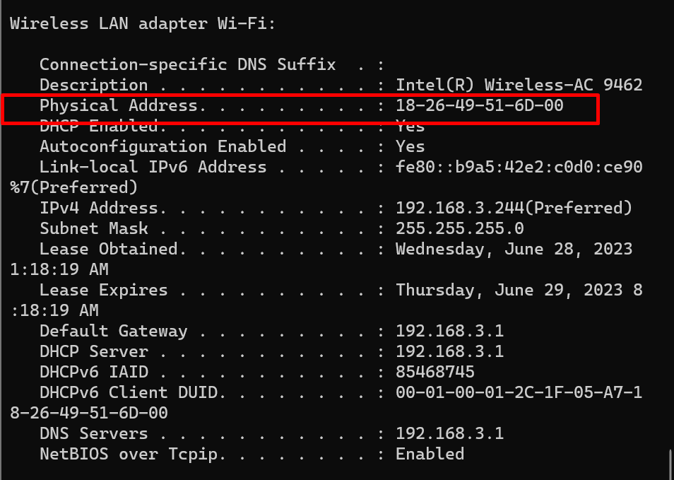
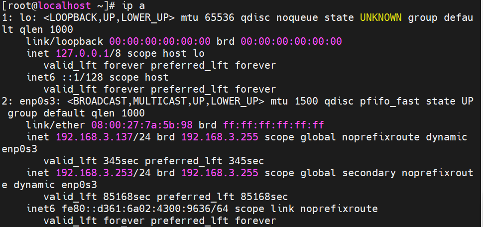
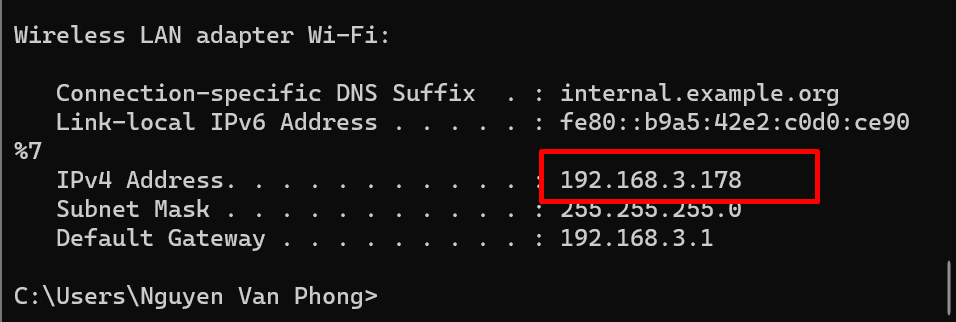

# ***Xác định địa chỉ Mac của Client***
## ***Trên Client Centos_7***
Ta dùng lệnh để kiểm tra địa chỉ MAC
```
cat /sys/class/net/enp0s3/address
```
ở đây địa chỉ MAC là: **08:00:27:7a:5b:98**

## ***Trên Windown***
Mở `cmd` gõ lệnh `ipconfig/all`

**Lưu ý**: Đổi các dấu `-` thành dấu `:` để tránh lỗi DHCP
```
18:26:49:51:6D:00
```

# ***Cấp IP theo MAC address***
***Trên DHCP Server***: ta chỉnh sửa file cấu hình DHCP trên DHCP Server
```
vi /etc/dhcp/dhcpd.conf
```
Sau đó thêm

host centos7 {
  hardware ethernet 08:00:27:7a:5b:98;
  fixed-addres 192.168.3.137;
}

host win11 {
  hardware ethernet 18:26:49:51:6D:00;
  fixed-address 192.168.3.178;
}
***Trong đó***
- Hardware ethernet: địa chỉ MAC của client
- Fixed-address: địa chỉ cấp phát cho Client đó.


Sau đó restart lại dịch vụ `dhcp`
## ***Trên Client Centos_7***
Ta xin cấp lại địa chỉ IP từ DHCP server
```
dhclient -r
dhclient -v
```
Kiểm tra lại địa chỉ ip


## ***Trên client Window11***
Ta xin cấp lại địa chỉ IP từ DHCP Server
Nhấn `window+r` và nhập `cmd`
và nhập các lệnh
```
ipconfig /release
ipconfig /renew
ipconfig
```

# ***Tài liệu tham khảo***
<https://github.com/danghai1996/thuctapsinh/blob/master/HaiDD/DHCP/3-LAB2_DHCP_BindIPtoMAC.md>
