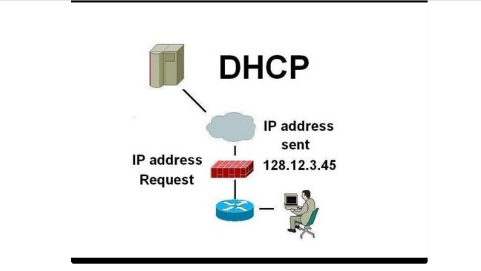

# ***DCHCP là gì***
DHCP chính là từ viết tắt của cụm từ Dynamic Host Configuration Protocol (được dịch là Giao thức Cấu hình Host Động). Theo đó, DHCP là giao thức có chức năng cấp phát địa chỉ IP cho tất cả các thiết bị truy cập trên cùng một mạng thông qua máy chủ DHCP được tích hợp trên router. 
# ***Cách thức hoạt động của DHCP***

Về cơ bản, cách thức hoạt động của DHCP đơn giản. Đó là, khi một thiết bị muốn truy cập mạng phát tín hiệu, DHCP sẽ thực hiện việc gửi yêu cầu từ router. Sau đó, router tiến hành gán cho địa chỉ IP khả dụng.

Cụ thể, khi có nhu cầu kết nối mạng, thiết bị thực hiện gửi yêu cầu DHCP DISCOVER đến máy chủ. Tiếp đến, DHCP server tiến hành tìm kiếm địa chỉ IP khả dụng, sau đó, cung cấp lại cho thiết bị và gói DHCP OFFER.

Khi đã có được địa chỉ, thiết bị sử dụng một gói tin DHCP REQUEST để trả lời lại cho máy chủ. Lúc này, máy chủ sẽ gửi xác nhận thiết bị đã có IP, cũng như thời gian sử dụng nó cho đến khi thay thế bằng địa chỉ mới.

Chính vì cơ chế hoạt động này nên đối với các mạng có quy mô nhỏ hoặc hộ gia đình thì router hoạt động như máy chủ DHCP. Còn với các mô hình mạng lớn hơn, một router sẽ không có khả năng quản lý tất cả các thiết bị nên cần đến máy chủ chuyên dụng để thực hiện việc cấp IP.
# ***Thành phần của DHCP***
Khi làm việc với DHCP, bạn cần hiểu tất cả thành phần của nó. Dưới đây là danh sách các thành phần của DHCP.

## ***DHCP server:***
 Một thiết bị mạng chạy dịch vụ DHCP chứa địa chỉ IP và thông tin cấu hình liên quan. Đây thường là máy chủ hoặc router nhưng có thể là bất cứ thứ gì hoạt động như máy chủ chẳng hạn như thiết bị SD-WAN.
## ***DHCP client:***
 Thiết bị nhận thông tin cấu hình từ máy chủ DHCP. Đây có thể máy tính, thiết bị di động, thiết bị IoT (Internet of Things) hoặc bất cứ thiết bị gì khác yêu cầu kết nối mạng. Hầu hết các thiết bị này được cấu hình để nhận thông tin DHCP theo mặc định.
## ***IP address pool:***
 Dãy địa chỉ có sẵn cho client DHCP. Những địa chỉ này thường được truyền tuần tự từ thấp nhất đến cao nhất.
## ***Subnet:***
 Mạng IP có thể được phân thành các phân đoạn được gọi là subnet (mạng con). Mạng con giúp mạng được quản lý dễ dàng hơn.
## ***Lease:***
 Khoảng thời gian client DHCP giữ thông tin địa chỉ IP. Khi khoảng thời gian này hết hạn, client phải làm mới nó.
## ***DHCP relay:***
 Router hoặc máy chủ nghe tin nhắn được phát trên mạng đó và sau đó chuyển chúng đến một máy chủ được cấu hình. Máy chủ này sau đó phản hồi lại relay agent để truyền chúng đến client. Nó được sử dụng để tập trung máy chủ DHCP thay vì để máy chủ trên mỗi mạng con.
# ***DHCP dùng để làm gì***
Nó cung cấp cho các host địa chỉ IP, Subnet Mask, default Gateway. Nó cung cấp 1 database trung tâm để theo dõi tất cả các máy tính trong hệ thống mạng. Mục đích là tránh trường hợp 2 máy tính khác nhau lại chung 1 địa chỉ IP. Ngoài việc cung cấp địa chỉ IP, DHCP còn cung cấp các thông tin cấu hình khác, cụ thể là DNS.

Và nó thường được cấp phát bởi DHPC server được tích hợp sẵn trên router.

DHCP giao tiếp bằng UDP và sử dụng port 67 và 68. DHCP server sử dụng port 67 để nghe thông tin từ các client và sử dụng port 68 để reply thông tin.
# ***Tài liệu tham khảo***
<https://hostingviet.vn/dhcp-la-gi>
<https://quantrimang.com/cong-nghe/dhcp-giao-thuc-cau-hinh-host-dong-la-gi-149708>