# ***Tìm hiểu về `dig` command***
Với lệnh dig, bạn có thể truy vấn thông tin về các bản ghi DNS, bao gồm: host addresses, mail exchanges, và name servers. Đây là công cụ được các quản trị viên hệ thống sử dụng phổ biến nhất để khắc phục sự cố DNS vì tính linh hoạt và dễ sử dụng của nó.
## ***1. Cài đặt gói để sử dụng lệnh `dig` trên Linux***
### ***Ubuntu***
```
apt-get install dnsutils
```
### ***CentOS 7***
```
yum install bind-utils
```
### ***CentOS 8***
```
dnf install bind-utils
```
### ***Kiểm tra version của dig :***
```
dig -v
```

## ***2. Tra cứu DNS cho 1 tên miền***
```
dig google.com
```
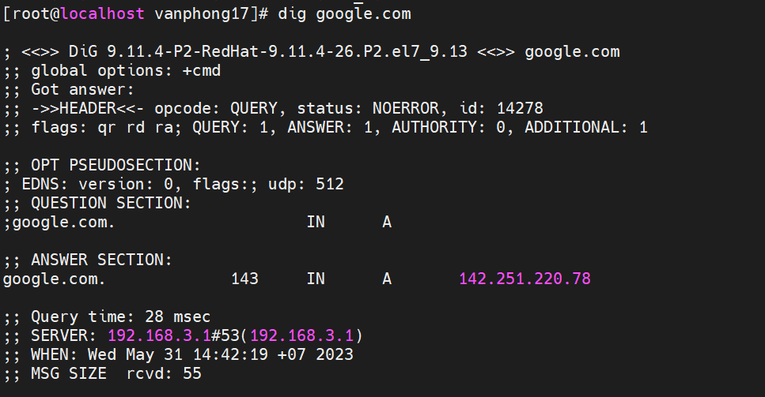
### ***Giải thích output:***

- Dòng đầu tiên của đầu ra hiển thị version đã cài đặt và truy vấn được gọi. Dòng thứ hai hiển thị các tùy chọn(theo mặc định chỉ cmd).
```
<<>> DiG 9.11.4-P2-RedHat-9.11.4-26.P2.el7_9.13 <<>> google.com +nocmd
;; global options: +cmd
```
Nếu bạn không muốn những dòng này xuất hiện ở output, có thể sử dụng tùy chọn `+nocmd` ở ngay sau câu lệnh `dig`.
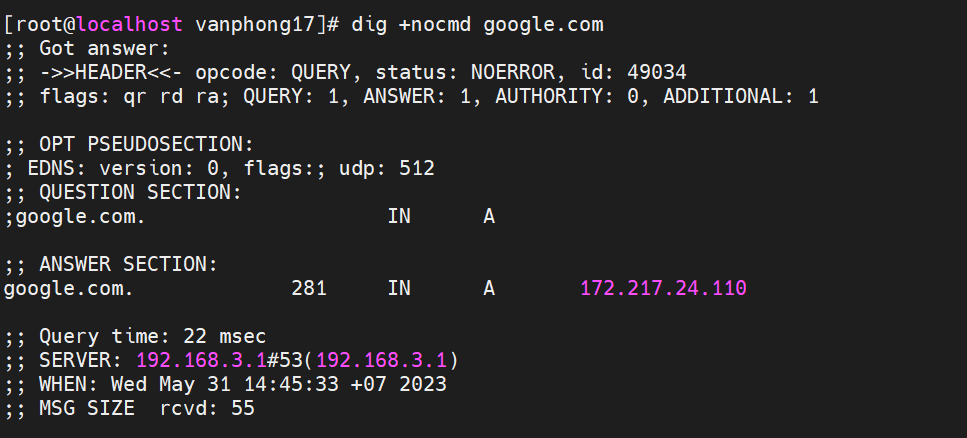

- Phần tiếp theo, dòng đầu tiên của phần này là tiêu đề, bao gồm `opcode` và trạng thái của hành động. Trong trường hợp này, trạng thái `NOERROR` có nghĩa là yêu cầu truy vấn truy vấn DNS không gặp lỗi.
```
;; Got answer:
;; ->>HEADER<<- opcode: QUERY, status: NOERROR, id: 49034
;; flags: qr rd ra; QUERY: 1, ANSWER: 1, AUTHORITY: 0, ADDITIONAL: 1
```

Bạn cũng có thể cho phép không hiển thị phần này ở output bằng cách sử dụng tùy chọn `+nocomments`, đồng thời nó cũng sẽ disable output của 1 vài phần header khác.
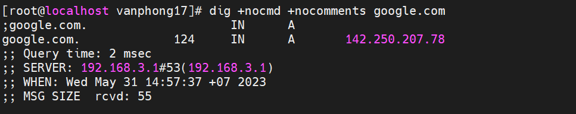

- Phần `OPT` được hiển thị theo mặc định chỉ trên các phiên bản mới hơn.
```
;; OPT PSEUDOSECTION:
; EDNS: version: 0, flags:; udp: 512
```
- Phần `QUESTION` là phần mà lệnh `dig` hiển thị truy vấn của chúng ta. Theo mặc định, dig sẽ yêu cầu bản ghi A.

```
;; QUESTION SECTION:
;google.com.                    IN      A

```

  Bạn có thể disable output của phần này bằng cách sử dụng tùy chọn `+noquestion`

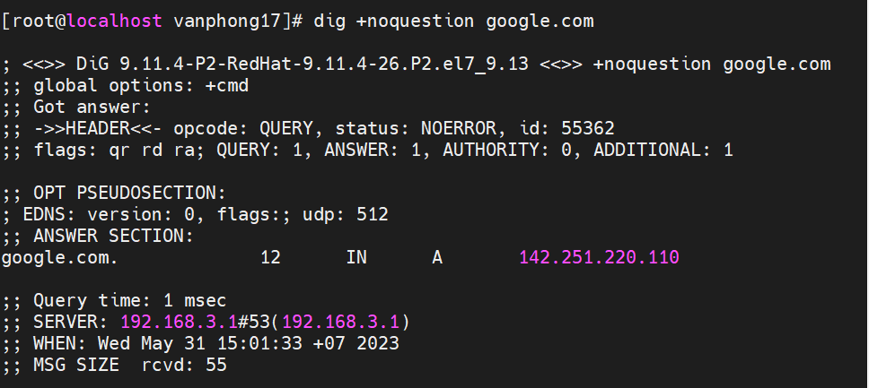

Phần `ANSWER` cung cấp cho chúng ta tên miền google.com. trỏ đến địa chỉ IP `142.251.220.110`
```
;; ANSWER SECTION:
google.com.             12      IN      A       142.251.220.110
```
Disable phần output này với tùy chọn `+noanswer `

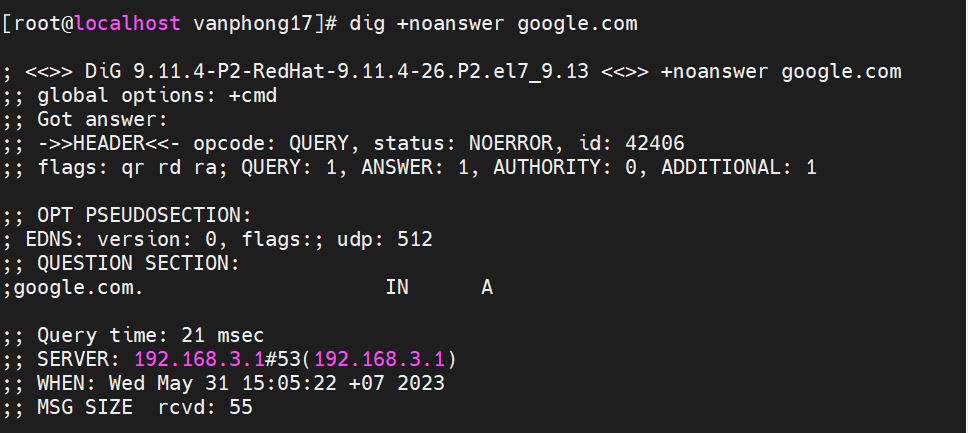

 - Phần cuối của OUTPUT bao gồm các số liệu đầu ra của truy vấn

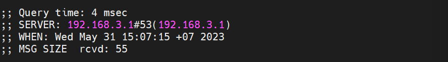

Bạn có thể disable phần này với tùy chọn `+nostats`

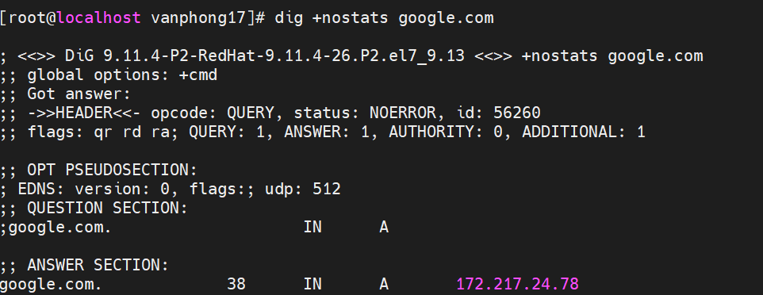


## ***3. Sử dụng dig với các truy vấn ngắn***
### ***3.1. Truy vấn lấy địa chỉ IP***
```
dig +short <domain>
```
#### ***Ví dụ:***
```
dig +short google.com
```
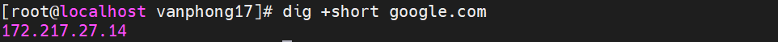
Có thể lấy kết quả chi tiết hơn, ta có thể dùng 2 tùy chọn sau: `+noall` và `+answer`
```
dig google.com +noall +answer
```
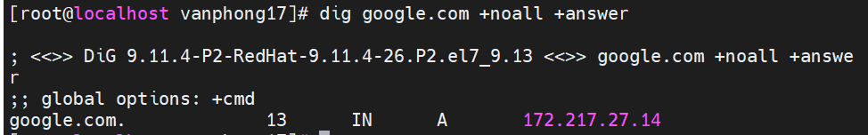

***Trong đó:***

`+noall` : tắt tất cả các section
`+answer` : chỉ mở với section ANSWER

### ***3.2. Truy vấn với name server cụ thể***

- Theo mặc định nếu khi sử dụng lệnh dig mà không chỉ rõ name server nào thì server sẽ sử dụng name server được khai báo trong file `/etc/resolv.conf`

- Để chỉ định name server mà truy vấn sẽ thực hiện, sử dụng biểu tượng `@ + <địa chỉ IP/hostname>`

Ví dụ: Truy vấn name server Google có địa chỉ là `8.8.8.8` để lấy thông tin về tên miền `google.com`
```
dig google.com @8.8.8.8
```
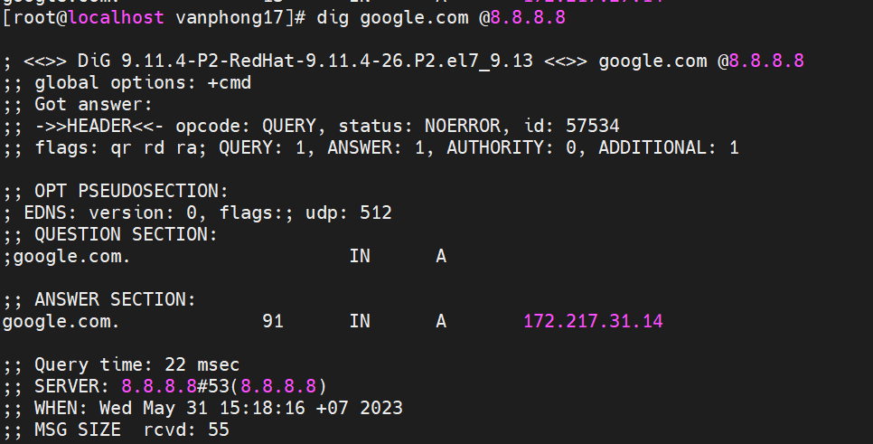
### ***3.3. Truy vấn theo bản ghi***

#### ***3.3.1 Truy vấn bản ghi A***
Để có danh sách địa chỉ cho 1 tên miền, sử dụng tùy chọn `a`
***Ví dụ:*** 
```
dig +nocmd google.com a +noall +answer
```
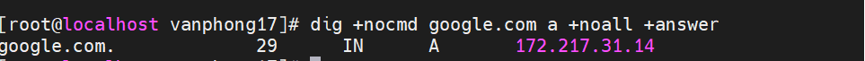
Tuy nhiên, bạn cũng có thể không cần dùng tùy chọn a, vì theo mặc định, nếu không có bản ghi nào được chọn, hệ thống mặc định chọn truy vấn bản ghi A

#### ***3.3.2 Truy vấn bản ghi CNAME***
Sử dụng tùy chọn `cname`
***Ví dụ:***
```
dig +nocmd mail.google.com cname +noall +answer
```

#### ***3.3.3 Truy vấn bản tin TXT***
```
dig +nocmd google.com txt +noall +answer
```
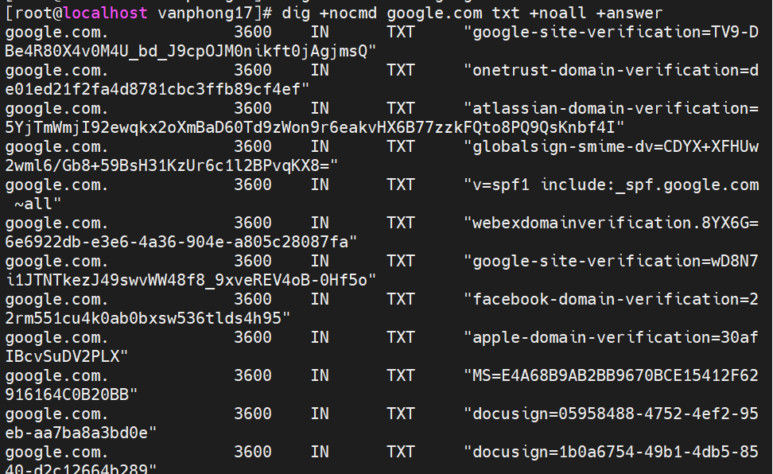


#### ***3.3.4 Truy vấn bản ghi MX***
```
dig +nocmd google.com mx +noall +answer
```
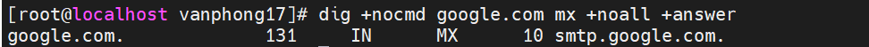

#### ***3.3.5 Truy vấn bản ghi NS***

```
dig +nocmd google.com ns +noall +answer
```
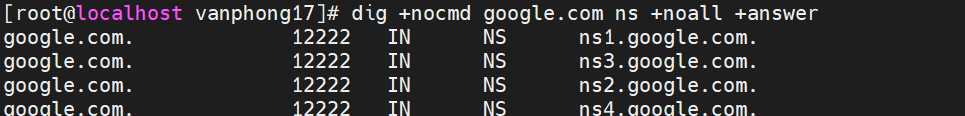

#### ***3.3.6 Truy vấn bản ghi SOA***
```
dig +nocmd google.com soa +noall +answer
```
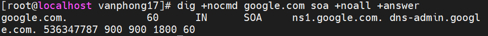
#### ***3.3.7 Truy vấn bản ghi TTL***
```
dig +nocmd google.com ttl +noall +answer 
```
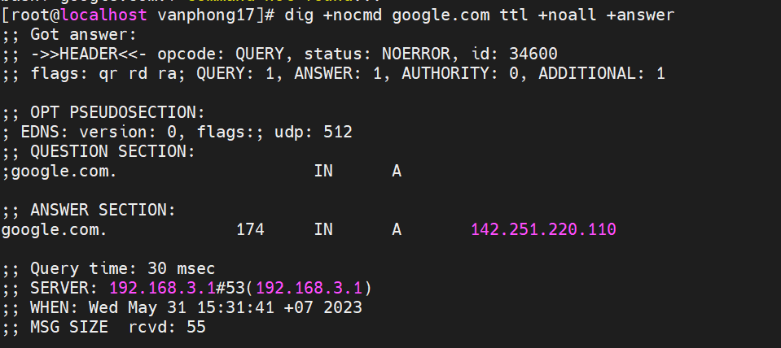
#### ***3.3.8 Truy vấn tất cả bản ghi***

Sử dụng tùy chọn `any`
```
dig +nocmd google.com any +noall +answer
```
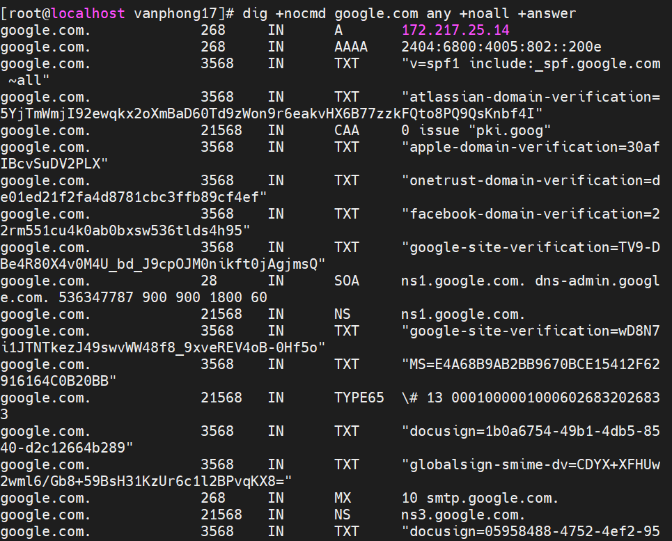

#### ***3.3.9 Tra cứu DNS ngược***
Để truy vấn tên máy chủ được liên kết với một địa chỉ IP cụ thể, hãy sử dụng tùy chọn `-x`.
Tra cứu IP `31.13.95.36` thành tên miền
```
dig -x 31.13.95.36 +noall +answer 
```
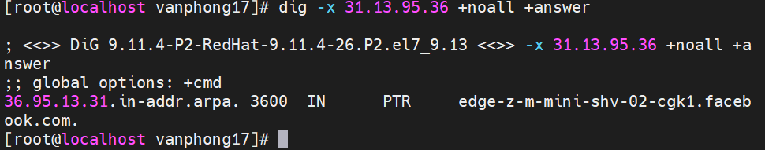

#### ***3.3.10 Truy vấn số lượng lớn tên miền***
Nếu bạn muốn truy vấn một số lượng lớn tên miền, bạn có thể thêm chúng vào một tệp và sử dụng tùy chọn `-f` để truy vấn.
```
dig -f domain.txt +noall +answer
```
#### ***3.3.11 Truy vấn DNS bằng TCP***
Theo mặc định thì lệnh dig truy vấn DNS qua udp, để có thể dùng lệnh dig truy vấn DNS qua tcp chúng ta thực hiện như sau:
```
dig +tcp [domain]
```
```
dig +tcp dns-server.nvphong.com
```
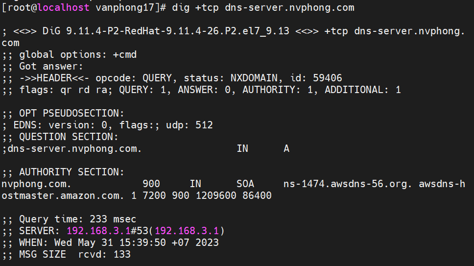
