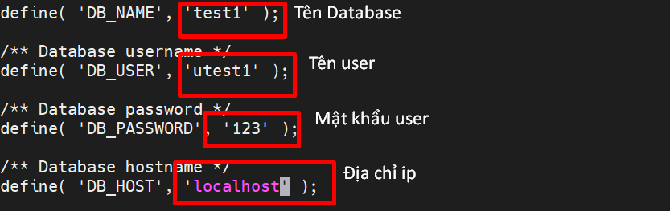
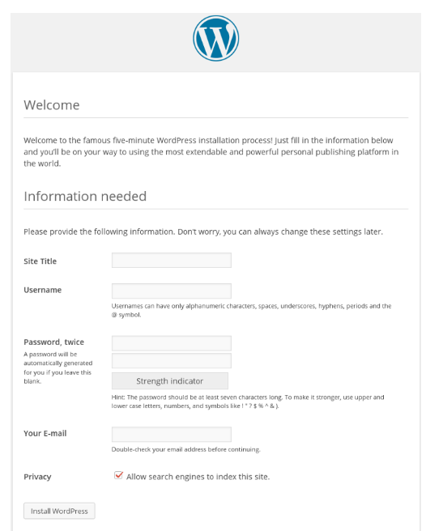
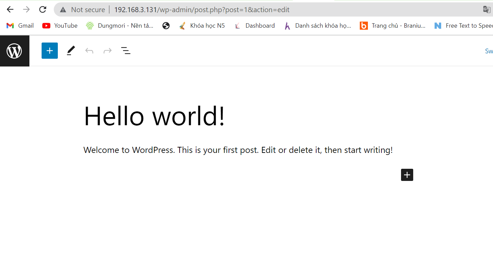
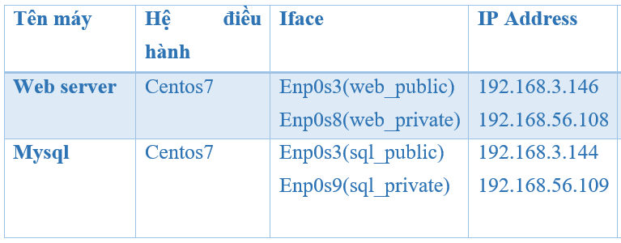
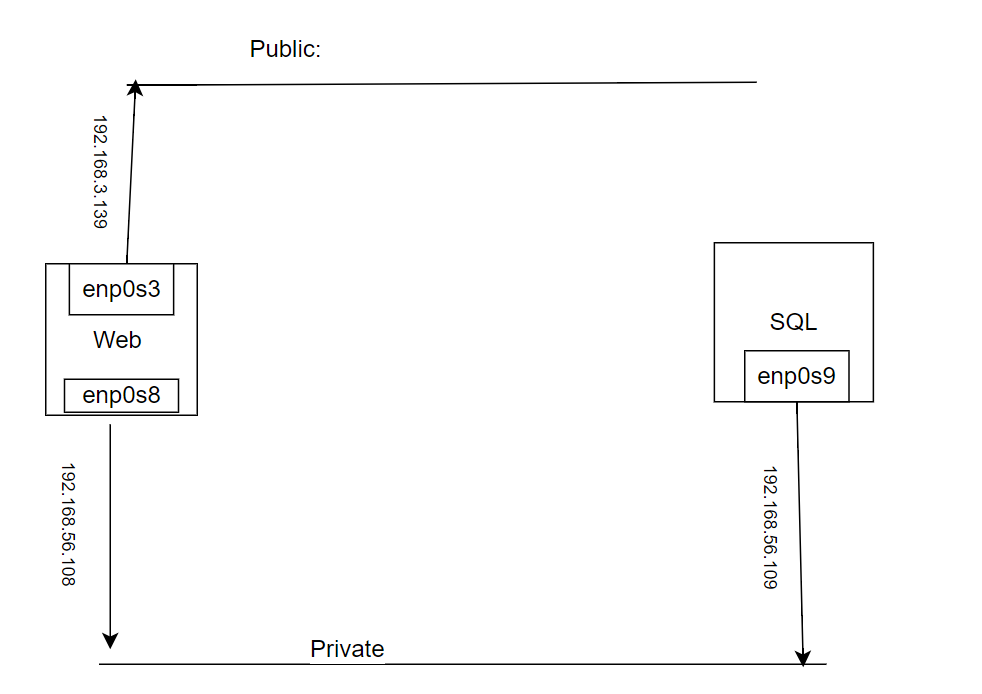
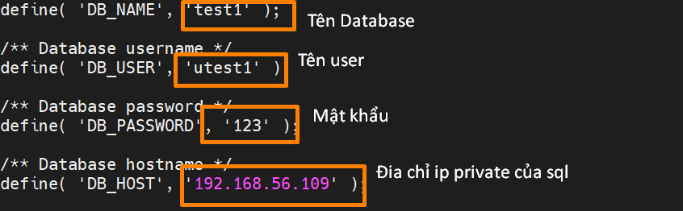
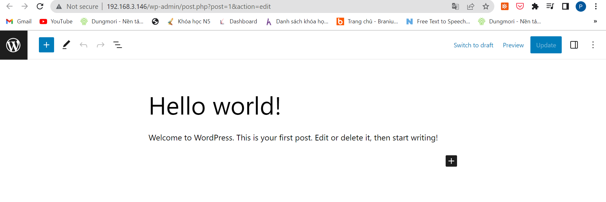

# ***Cấu hình trên 1 web server***
## ***Cài đặt Apache***
### ***1. Thực hiện câu lệnh sau để cài đặt***
```
yum install httpd -y
```
### ***2. Kích hoạt dịch vụ `httpd`***
```
systemctl enable httpd
```
### ***3. Bật dịch vụ `httpd`***
```
systemctl status httpd
```
### ***4.Kiểm tra dịch vụ `httpd`***
```
systemctl status httpd
```
### ***5.Kiểm tra dịch vụ `httpd` đã được cài đặt chưa***
```
http://địa chỉ ip
```

#### ***Sửa lỗi truy cập kiểm tra apache bằng địa chỉ ip nhưng bị lỗi***
##### ***1. Kiểm tra xem Apache đã được khởi động và đang chạy:***
```
systemctl status httpd
```
Nếu Apache không đang chạy, bạn có thể khởi động nó bằng lệnh sau:
```
systemctl start httpd
```
##### ***2. Kiểm tra xem Firewall có chặn kết nối đến Apache không:***
```
firewall-cmd --list-all | grep http
```
Nếu firewall đang chặn kết nối đến Apache, bạn có thể mở cổng 80 (hoặc cổng của Apache nếu bạn đã thay đổi cổng này) bằng lệnh sau:
```
firewall-cmd --add-service=http --permanent
firewall-cmd --reload
```
##### ***3. Kiểm tra xem SELinux có chặn kết nối đến Apache không:***
```
getsebool -a | grep httpd
```
Nếu SELinux đang chặn kết nối đến Apache, bạn có thể bật chế độ SELinux để cho phép Apache hoạt động bằng lệnh sau:
```
setsebool -P httpd_can_network_connect 1
```


## ***Cài đặt `mariadb`(mysql)***

### ***1. Thực hiện câu lệnh sau để cài đặt***
```
yum install mariadb-server
```
### ***2. Bật dịch vụ `mariadb`***
```
systemctl enable mariadb
systemctl start mariadb
```
### ***3. Kiểm tra dịch vụ `mariadb`***
```
systemctl status mariadb
```
### ***4. Đăng nhập dịch vụ `mariadb`***
```
mysql -u root -p
```
### ***5. Tạo user và database sử dụng cho WordPress***
```
create database test1;
create user 'utest1'@'localhost' identified by '123';
GRANT ALL PRIVILEGES on test1.* to 'utest1'@'localhost' identified by '123';
flush privileges;
```
## ***Cài đặt `wordpress`***

### ***1. Cài đặt  công cụ download `wget`***
```
yum install wget -y
```
### ***2. Thay đổi thư mục hiện tại thành thư mục web:***
```
cd /var/www/html
```
### ***3. Tải xuống tệp `WordPress` mới nhất bằng cách chạy lệnh sau***
```
wget https://wordpress.org/latest.tar.gz
```
### ***4. Giải nén tệp `WordPress` trong thư mục hiện tại:***
```
tar xvzf latest.tar.gz
```
### ***5. Di chuyển các tệp từ thư mục wordpress vào thư mục web:***
```
mv /var/www/html/wordpress/* /var/www/html
```
### ***6. Thay đổi tệp cấu hình WordPress bằng cơ sở dữ liệu đã tạo.***
```
mv wp-config-sample.php wp-config.php
```
### ***7. Mở tệp wp-config.php:Chỉnh sửa các thông số cấu hình***
```
vi wp-config.php
```


## ***Cài đặt `php`***

### ***1. Thêm Kho lưu trữ EPEL và REMI***
```
sudo yum -y install https://dl.fedoraproject.org/pub/epel/epel-release-latest-7.noarch.rpm
sudo yum -y install https://rpms.remirepo.net/enterprise/remi-release-7.rpm
```
### ***2.  kích hoạt kho lưu trữ PHP 7.4 Remi và cài đặt PHP 7.4 trên CentOS 7.***

```
sudo yum -y install yum-utils
sudo yum-config-manager --enable remi-php74
```
### ***3. Cài đặt PHP***
```
sudo yum update
sudo yum install php php-cli
yum install php php-mysql
```
### ***4. Kiểm tra phiên bản php hiện tại***

```
php -v
```
### ***5. Kiểm tra xem các mô-đun đã bật***
```
php --modules
```
### ***6. Kiểm tra xử lý PHP trên máy chủ web***
```
vi /var/www/html/info.php
```
Thêm dòng sau vào file cấu hình
```
<?php phpinfo(); ?>
```

## ***Hoàn thành quá trình cài đặt***





# ***Cấu hình trên 2 web server***
## ***Mô hình lab***


Tiến hành tắt tường lửa và selinux trên cả 2 máy Web và Sql :
```
systemctl stop firewalld
setenforce 0 
```
## ***Cấu hình***
### ***Trên máy SQL***
Cài đặt `mariadb` , tạo cơ sở dữ liệu và người dùng cho `wordpress`

#### ***Cài đặt `mariadb`(mysql)***

##### ***1. Thực hiện câu lệnh sau để cài đặt***
```
yum install mariadb-server
```
##### ***2. Bật dịch vụ `mariadb`***
```
systemctl enable mariadb
systemctl start mariadb
```
##### ***3. Kiểm tra dịch vụ `mariadb`***
```
systemctl status mariadb
```
##### ***4. Đăng nhập dịch vụ `mariadb`***
```
mysql -u root -p
```
##### ***5. Tạo user và database sử dụng cho WordPress***
```
create database test1;
create user 'utest1'@'192.168.56.108' identified 
by '123';
GRANT ALL PRIVILEGES on test1.* to 
'utest1'@'localhost' identified by '123';
flush privileges;
```
***Lưu ý***: 192.168.56.108 : là địa chỉ của của máy Web truy cập MySQL

### ***Trên máy Web***

#### ***Cài đặt Apache***
##### ***1. Thực hiện câu lệnh sau để cài đặt***
```
yum install httpd -y
```
##### ***2. Kích hoạt dịch vụ `httpd`***
```
systemctl enable httpd
```
##### ***3. Bật dịch vụ `httpd`***
```
systemctl status httpd
```
##### ***4.Kiểm tra dịch vụ `httpd`***
```
systemctl status httpd
```
##### ***5.Kiểm tra dịch vụ `httpd` đã được cài đặt chưa***
```
http://địa chỉ ip
```

###### ***Sửa lỗi truy cập kiểm tra apache bằng địa chỉ ip nhưng bị lỗi***
###### ***1. Kiểm tra xem Apache đã được khởi động và đang chạy:***
```
systemctl status httpd
```
Nếu Apache không đang chạy, bạn có thể khởi động 
nó bằng lệnh sau:
```
systemctl start httpd
```
###### ***2. Kiểm tra xem Firewall có chặn kết nối đến Apache không:***
```
firewall-cmd --list-all | grep http
```
Nếu firewall đang chặn kết nối đến Apache, bạn có 
thể mở cổng 80 (hoặc cổng của Apache nếu bạn đã 
thay đổi cổng này) bằng lệnh sau:
```
firewall-cmd --add-service=http --permanent
firewall-cmd --reload
```
###### ***3. Kiểm tra xem SELinux có chặn kết nối đến Apache không:***
```
getsebool -a | grep httpd
```
Nếu SELinux đang chặn kết nối đến Apache, bạn có 
thể bật chế độ SELinux để cho phép Apache hoạt 
động bằng lệnh sau:
```
setsebool -P httpd_can_network_connect 1
```


#### ***Cài đặt `mariadb`(mysql)***

##### ***1. Thực hiện câu lệnh sau để cài đặt***
```
yum install mariadb-server
```
##### ***2. Bật dịch vụ `mariadb`***
```
systemctl enable mariadb
systemctl start mariadb
```
##### ***3. Kiểm tra dịch vụ `mariadb`***
```
systemctl status mariadb
```
##### ***4. Đăng nhập dịch vụ `mariadb`***
```
mysql -u root -p
```
##### ***5. Tạo user và database sử dụng cho WordPress***
```
create database test1;
create user 'utest1'@'localhost' identified by 
'123';
GRANT ALL PRIVILEGES on test1.* to 
'utest1'@'localhost' identified by '123';
flush privileges;
```
#### ***Cài đặt `wordpress`***

##### ***1. Cài đặt  công cụ download `wget`***
```
yum install wget -y
```
##### ***2. Thay đổi thư mục hiện tại thành thư mục web:***
```
cd /var/www/html
```
##### ***3. Tải xuống tệp `WordPress` mới nhất bằng cách chạy lệnh sau***
```
wget https://wordpress.org/latest.tar.gz
```
##### ***4. Giải nén tệp `WordPress` trong thư mục hiện tại:***
```
tar xvzf latest.tar.gz
```
##### ***5. Di chuyển các tệp từ thư mục wordpress vào thư mục web:***
```
mv /var/www/html/wordpress/* /var/www/html
```
##### ***6. Thay đổi tệp cấu hình WordPress bằng cơ sở dữ liệu đã tạo.***
```
mv wp-config-sample.php wp-config.php
```
##### ***7. Mở tệp wp-config.php:Chỉnh sửa các thông số cấu hình***
```
vi wp-config.php
```

***Lưu ý*** : `192.168.56.109` là địa chỉ ip localhost của sql .
#### ***Cài đặt `php`***

##### ***1. Thêm Kho lưu trữ EPEL và REMI***
```
sudo yum -y install https://dl.fedoraproject.org/
pub/epel/epel-release-latest-7.noarch.rpm
sudo yum -y install https://rpms.remirepo.net/
enterprise/remi-release-7.rpm
```
##### ***2.  kích hoạt kho lưu trữ PHP 7.4 Remi và cài đặt PHP 7.4 trên CentOS 7.***

```
sudo yum -y install yum-utils
sudo yum-config-manager --enable remi-php74
```
##### ***3. Cài đặt PHP***
```
sudo yum update
sudo yum install php php-cli
yum install php php-mysql
```
##### ***4. Kiểm tra phiên bản php hiện tại***

```
php -v
```
##### ***5. Kiểm tra xem các mô-đun đã bật***
```
php --modules
```
##### ***6. Kiểm tra xử lý PHP trên máy chủ web***
```
vi /var/www/html/info.php
```
Thêm dòng sau vào file cấu hình
```
<?php phpinfo(); ?>
```

#### ***Hoàn thành quá trình cài đặt***





# ***Tài liệu tham khảo***
<https://computingforgeeks.com/how-to-install-php-7-4-on-centos-7/>
<https://www.letscloud.io/community/how-to-install-linux-apache-mysql-php-lamp-stack-on-centos-7>
<https://www.letscloud.io/community/how-to-install-wordpress-on-centos-7>
<https://news.cloud365.vn/cai-dat-wordpress-tren-2-server-bang-centos-7/>
