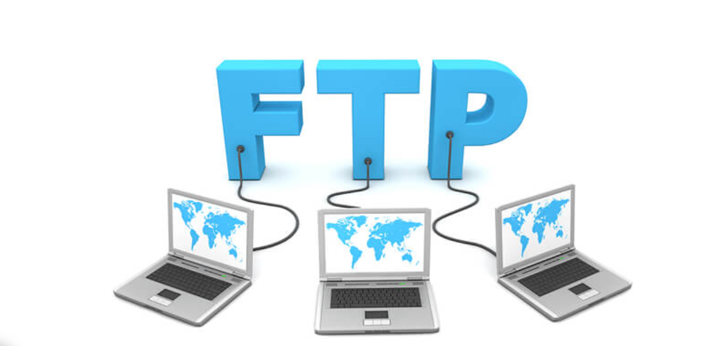
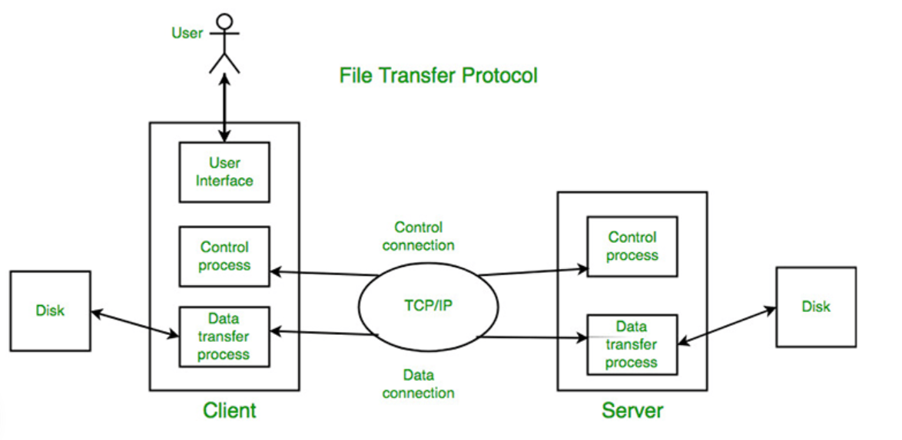

# ***Tìm hiểu giao thức FTP***
## ***1. Khái niệm***

FTP là từ viết tắt của cụm từ tiếng anh “File Transfer Protocol” (Giao thức truyền tải tập tin) được dùng trong việc trao đổi dữ liệu trong mạng thông qua giao thức TCP/IP, thường hoạt động trên 2 cổng là 20 và 21. Với giao thức này, các máy client trong mạng có thể truy cập đến máy chủ FTP để gửi hoặc lấy dữ liệu. Điểm nổi bật là người dùng có thể truy cập vào máy chủ FTP để truyền và nhận dữ liệu dù đang ở xa.

## ***2. Cách thức FTP hoạt động***

Giao thức FTP hoạt động dựa trên mô hình cơ bản của việc truyền và nhận dữ liệu từ máy Client đến máy Server. Quá trình truyền nhận dữ liệu giữa máy Client và Server lại được tạo nên từ 2 tiến trình TCP logic là Control Connection và Data Connection.

- `Control Connection`: Đây là phiên làm việc TCP logic đầu tiên được tạo ra khi quá trình truyền dữ liệu bắt đầu. Tuy nhiên, tiến trình này chỉ kiểm soát các thông tin điều khiển đi qua nó, ví dụ như các tập lệnh. Quá trình này sẽ được duy trì trong suốt quá trình phiên làm việc diễn ra.
- `Data Connection`: Khác với tiến trình Control Connection, Data Connection là một kết nối dữ liệu TCP được tạo ra với mục đích chuyên biệt là truyền tải dữ liệu giữa máy Client và máy Server. Kết nối sẽ tự động ngắt khi quá trình truyền tải dữ liệu hoàn tất.

## ***3. Các phương thức truyền dữ liệu với FTP***
Khi quá trình truyền dữ liệu được thiết lập, dữ liệu sẽ được truyền từ máy Client đến máy Server hoặc có thể ngược lại. Dựa trên việc truyền dữ liệu này, FTP có 3 phương thức truyền tải dữ liệu là stream mode, block mode, và compressed mode.

- Stream mode: Phương thức này hoạt động dựa vào tính tin cậy trong việc truyền dữ liệu trên giao thức TCP. Dữ liệu sẽ được truyền đi dưới dạng các byte có cấu trúc không liên tiếp. Thiết bị gửi chỉ đơn thuần đẩy luồng dữ liệu qua kết nối TCP tới phía nhận mà không có một trường tiêu đề nhất định.
- Block mode: Là phương thức truyền dữ liệu mang tính quy chuẩn hơn. Với phương thức này, dữ liệu được chia thành nhiều khối nhỏ và được đóng gói thành các FTP blocks. Mỗi block sẽ chứa thông tin về khối dữ liệu đang được gửi.
- Compressed mode:  Phương thức truyền sử dụng kỹ thuật nén dữ liệu khá đơn giản là “run-length encoding”. Với thuật toán này, các đoạn dữ liệu bị lặp sẽ được phát hiện và loại bỏ để giảm chiều dài của toàn bộ thông điệp khi gửi đi.

## ***4. FTP dùng để làm gì***
FTP được ứng dụng trong nhiều hoạt động kinh doanh của doanh nghiệp, giữa doanh nghiệp và đối tác cũng như giữa doanh nghiệp và nhân viên. Có 4 ứng dụng chủ yếu được doanh nghiệp áp dụng nhiều nhất:

- Doanh nghiệp sử dụng FTP cho phép nhân viên chia sẻ nguồn dữ liệu qua lại các máy thuộc các chi nhánh văn phòng và các địa điểm khác nhau.
- Nhân viên thuộc doanh nghiệp chia sẻ dữ liệu một cách an toàn cho đồng nghiệp và đối tác kinh doanh trong và ngoài nước.
- Nhân viên IT dùng FTP để chuyển dữ liệu gốc đến trung tâm khôi phục dữ liệu sau thảm họa (DR – Disaster Recovery).
- Nhân viên quản trị web sử dụng FTP để chuyển các trang con, các file ứng dụng web và hình ảnh đến máy chủ website của doanh nghiệp.

## ***5. Các loại FTP phổ biến***
- `FTP Plain`: là cấu hình tiêu chuẩn mà giao thức truyền thông này sử dụng. Tại đây, dữ liệu và thông tin đăng nhập của người dùng được chuyển tải mà không cần bất kỳ mã hóa nào. FTP Plain thường sử dụng cổng số 21 khi kết nối internet và có khả năng tương thích mạnh nhất trong ba loại FTP.
-  `FTPS`: FTP Secure là một tên gọi khác của FTP Secure Sockets Layer (SSL), sử dụng mã hóa SSL, không giống như FTP truyền thống. Có một số điểm khác biệt giữa FTPS và các loại FTP được mã hóa khác, nhưng đáng chú ý nhất là tính bảo mật đi kèm với FTPS. Nó thêm một số lệnh bổ sung vào FTP truyền thống để có thêm một số chức năng.
-   `FTPES`: là viết tắt của File Transfer Protocol over explicit transport layer security (TLS)/SSL. Nó sử dụng cổng 21 như một kết nối FTP thông thường, nhưng các lệnh đặc biệt sẽ biến nó thành một kết nối được mã hóa TLS/SSL. Nhiều người dùng thích FTPES hơn FTPS vì nó tương thích với tường lửa.

# ***Tài liệu tham khảo***
<https://mesidas.com/ftp/>

<https://bizflycloud.vn/tin-tuc/ftp-la-gi-20210829235931993.htm>
