# ***Cài đặt máy chủ FTP trên CentOS 7***
## ***1: Cài đặt dịch vụ FTP với VSFTPD***
### ***1.1 Cài đặt phần mềm VSFTPD bằng lệnh sau:***
`sudo yum install vsftpd`

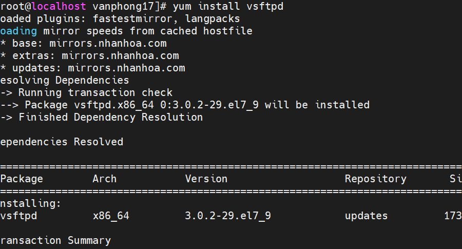

### ***1.2 Bắt đầu dịch vụ và thiết lập để khởi chạy khi hệ thống khởi động với các thao tác sau:***
`sudo systemctl start vsftpd`
`sudo systemctl enable vsftpd`

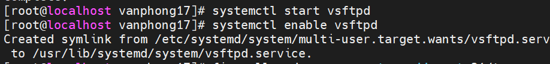

### ***1.3 Tạo quy tắc cho tường lửa của bạn để cho phép lưu lượng FTP trên Cổng 21:***
```
sudo firewall-cmd --zone=public --permanent --add-port=21/tcp

sudo firewall-cmd --zone=public --permanent --add-service=ftp

sudo firewall-cmd –-reload
```

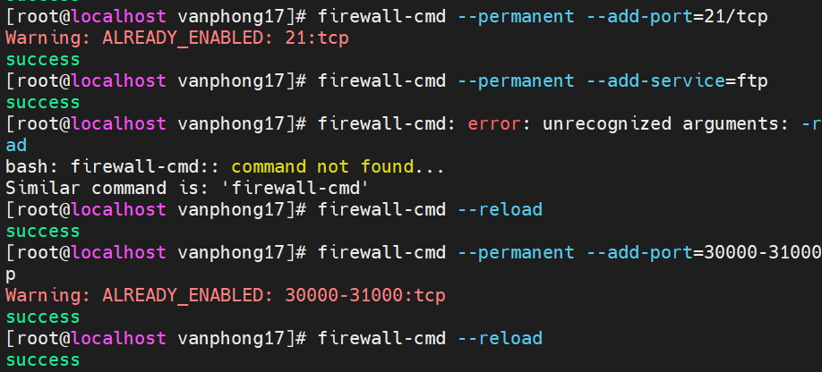

### ***1.4 Kiểm tra trạng thái dịch vụ:***
`systemctl status vsftpd`
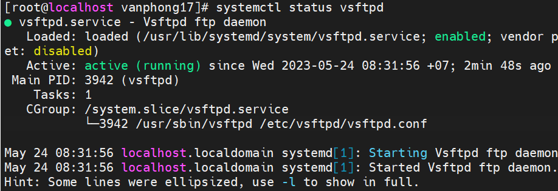
## ***2: Cấu hình VSFTPD***
### ***2.1. Trước khi bắt đầu, hãy tạo một bản sao của tệp cấu hình mặc định:***
`sudo cp /etc/vsftpd/vsftpd.conf /etc/vsftpd/vsftpd.conf.default`

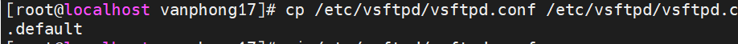

Điều này đảm bảo rằng bạn có cách quay lại cấu hình mặc định, trong trường hợp bạn thay đổi cài đặt có thể gây ra sự cố.

### ***2.2 Chỉnh sửa tệp cấu hình bằng lệnh sau:***
`vi /etc/vsftpd/vsftpd.conf`

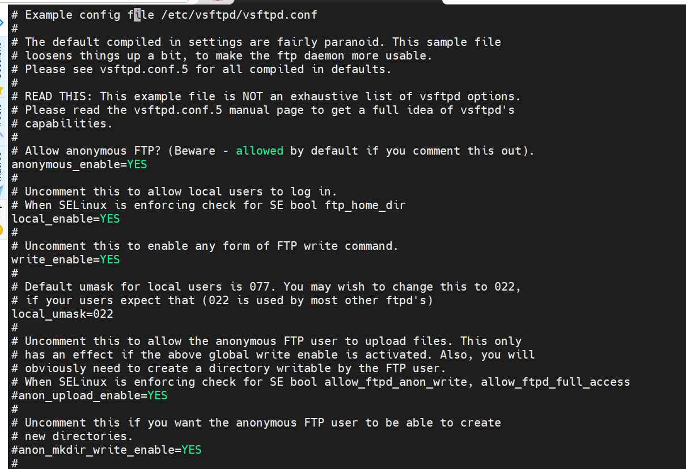

#### ***2.2.1 Đặt máy chủ FTP của bạn để tắt người dùng ẩn danh và cho phép người dùng cục bộ.***

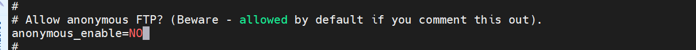
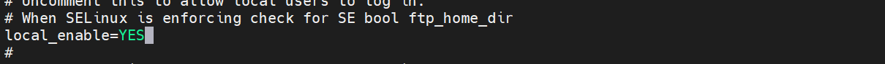
```
anonymous_enable=NO // Không cho kết nối nặc danh 
local_enable=YES        // Cho phép kết nối cục bộ
```
#### ***2.2.2 Cho phép người dùng đã đăng nhập tải tệp lên máy chủ FTP của bạn.***
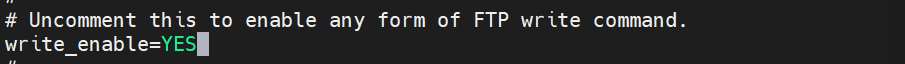

#### ***2.2.3 Giới hạn người dùng FTP trong thư mục chính của họ***
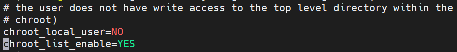

- Chroot cho tất cả User:
```
chroot_local_user=YES
chroot_list_enable=NO
```
- Chroot đối với 1 số User trong danh sách được tạo trong file `/etc/vsftpd.chroot_list`
```
chroot_local_user=NO
chroot_list_enable=YES
```
- Chroot tất cả User ngoại trừ các User có trong file `/etc/vsftpd.chroot_list`
```
chroot_local_user=YES
chroot_list_enable=YES
```

Tiện ích vsftpd cung cấp cách tạo danh sách người dùng được phê duyệt.Giới hạn User đăng nhập vào hệ thống: Để chỉ cho phép một số User nhất định đăng nhập vào máy chủ FTP. Để quản lý người dùng theo cách này,thêm 2 dòng sau vào sau dòng `userlist_enable=YES`. Khi đó, những user có trong `/etc/vsftpd/user_list` mới được truy cập vào hệ thống.
```
userlist_enable=YES

userlist_file=/etc/vsftpd/user_list

userlist_deny=NO
```

### ***2.3 Sau khi chỉnh sửa xong tệp cấu hình, hãy lưu các thay đổi. Khởi động lại dịch vụ vsftpd để áp dụng các thay đổi:***
 `systemctl restart vsftpd`
 
### ***2.4 Cho phép các cổng FTP đi qua tường lửa***
```
firewall-cmd --permanent --add-port=30000-31000/tcp
success
firewall-cmd --reload
success
```
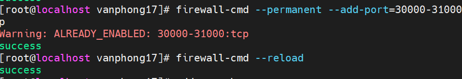

## ***3 Tạo một người dùng FTP mới***
```
sudo adduser phongnv
sudo passwd phongnv
```
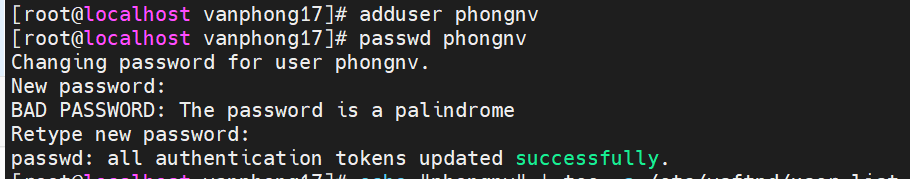
### ***3.1 Thêm user vào danh sách được truy cập FTP server tại `/etc/vsftpd/user_list`***

```
echo "phongnv" | tee -a /etc/vsftpd/user_list
```

### ***3.2 Tạo thư mục cho người dùng mới và điều chỉnh quyền:***
```
mkdir -p /home/phongnv/ftp/upload
chmod 550 /home/phongnv/ftp
chmod 750 /home/phongnv/ftp/upload
chown -R phongnv: /home/phongnv/ftp
```
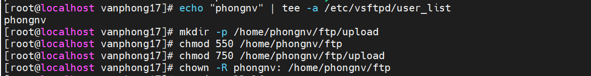


## ***4 Truy cập FTP Server***
- Cài đặt gói lftp:
`yum install lftp`
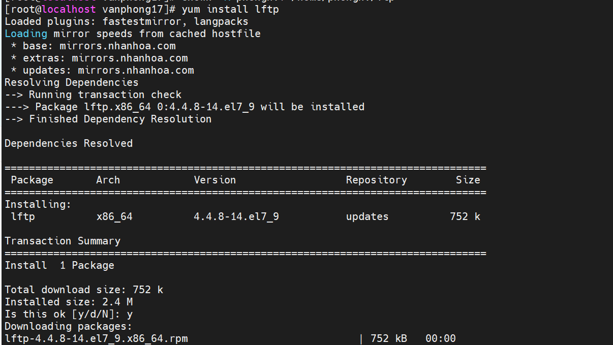
- Truy cập vào FTP Server:

`lftp ftp://phongnv@192.168.3.72`
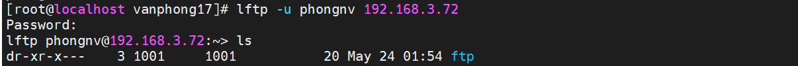
hoặc
`lftp -u phongnv 192.168.3.72`

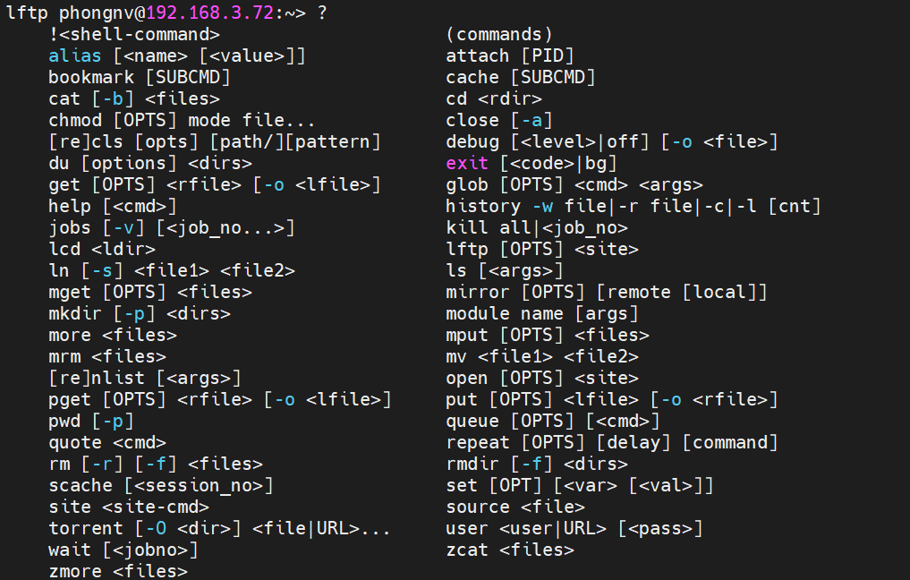


## ***5. Trên Window***
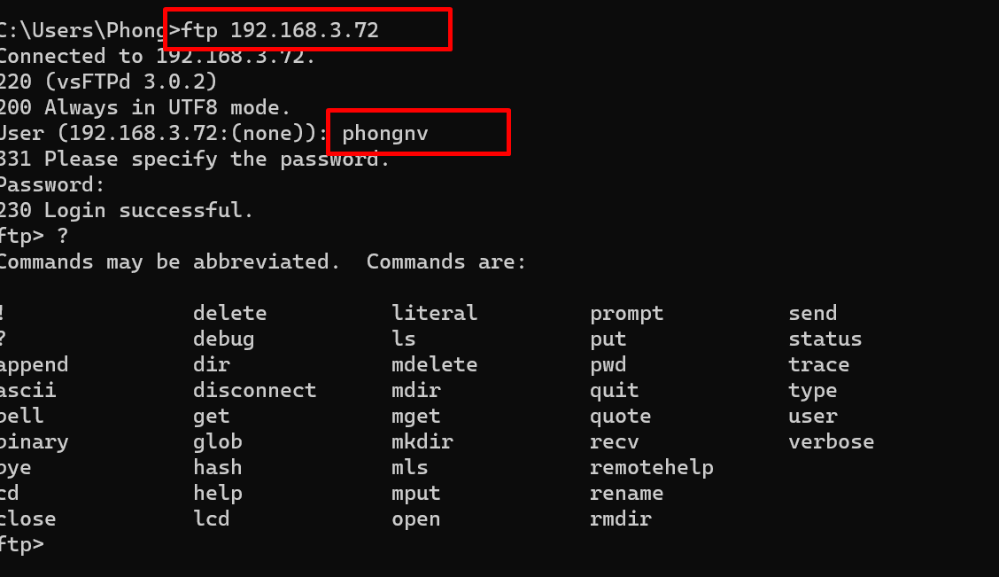


# ***Tài liệu tham khảo***

<https://phoenixnap.com/kb/how-to-setup-ftp-server-install-vsftpd-centos-7>

<https://github.com/danghai1996/thuctapsinh/blob/master/HaiDD/FTP/docs/1-FTP.md>


