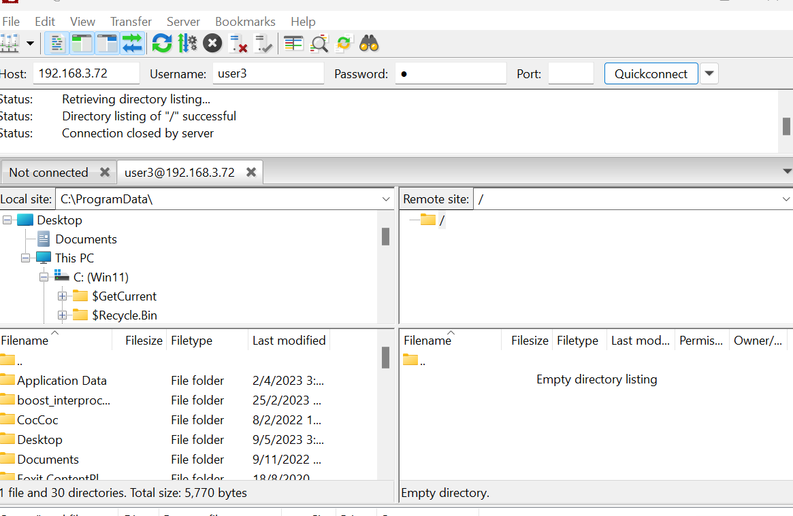

# ***1 Lab - FTP use VSFTPD (Very Secure File Transport Protocol Daemon)***
## ***1.1 Install VSFTPD***
- Cài đặt gói `vsftpd`
`yum install vsftpd`
- Copy file cấu hình để backups: `/etc/vsftpd/vsftpd.conf`

`cp /etc/vsftpd/vsftpd.conf /etc/vsftpd/vsftpd.conf.example`
## ***1.2 Configure vsftpd.conf***
```
# không cho user nặc danh truy cập ftp server
anonymous_enable=NO

# khi sử dụng local user
local_enable=YES

# cho phép local user upload, delete file thì để YES, còn chỉ cho user download thì chọn NO
write_enable=YES

# chroot và tạo 1 file /etc/vsftpd/chroot_list chứa danh sách các local user không bị giới hạn bởi chroot
chroot_local_user=YES
allow_writeable_chroot=YES
chroot_list_enable=YES
chroot_list_file=/etc/vsftpd/chroot_list

# Nếu chỉ sử dụng IPv4
listen=YES

# Không sử dụng IPv6
listen_ipv6=NO

# Chỉ cho các user có trong file /etc/vsftpd/user_list được truy cập FTP server
userlist_deny=NO
userlist_enable=YES
userlist_file=/etc/vsftpd/user_list

# Thư mục home của FTP Server
local_root=/var/ftp/

# Sử dụng thời gian của hệ thống
use_localtime=YES
```
## ***1.3 Create local user***
Tạo 3 user như đã nói ở trên, đồng thời thay đổi Home directory của các user sang home của FTP server
```
# useradd -d /var/ftp/user1 user1
# useradd -d /var/ftp/user2 user2
# useradd -d /var/ftp/user3 user3
```
Tạo mật khẩu cho user: Tại đây, mình đặt pass là `1`:
```
# passwd user1
# passwd user2
# passwd user3
```
Thêm các tài khoản vào file `/etc/vsftpd/user_list`, mỗi user trên 1 dòng
`vi /etc/vsftpd/user_list`
Nếu tài khoản đã tạo trước đó, ta có thể thay đổi Home directory của nó như sau:
`usermod -d /var/ftp/user user`

Ta sẽ tạo 2 group để phân quyền theo điều kiện đã đề ra:
```
// ftp_basic : user1, user2 có quyền bình thường
# groupadd ftp_basic

// ftp_onlyread : user3 chỉ có quyền đọc
# groupadd ftp_onlyread
```
Add user vào 2 group đã tạo:
```
# usermod -g ftp_basic user1
# usermod -g ftp_basic user2
# usermod -g ftp_onlyread user3
```
## ***1.4 Adjust permission***
Tạo 1 thư mục dùng chung cho user1 và user2:
```
mkdir /var/ftp/user12
```
## ***1.5 Thay đổi quyền sở hữu các thư mục:***
```
chown -R user1:ftp_basic /var/ftp/user1
chown -R user2:ftp_basic /var/ftp/user2
chown -R user3:ftp_onlyread /var/ftp/user3
chown -R :ftp_basic /var/ftp/user12
```
Thay đổi permission các thư mục:
```
chmod 705 /var/ftp/user1
chmod 705 /var/ftp/user2
chmod 550 /var/ftp/user3
chmod 775 /var/ftp/user12
```
## ***1.5 Start FTP Server***
- Khởi động vsftp :
```
# systemctl start vsftpd
# systemctl enable vsftpd
```
- Cấu hình tường lửa:
```
# firewall-cmd --permanent --add-port=21/tcp
# firewall-cmd --permanent --add-service=ftp
# firewall-cmd --reload
```

SELinux:

```
setsebool -P ftpd_full_access on
```
Khởi động lại và kiểm tra trạng thái:
```
systemctl restart vsftpd
systemctl status vsftpd
```
# ***2 Trên Client Window 11***
Ta sử dụng FileZilla để truy cập FTP Server. Ta điền IP của Server và username, password.

