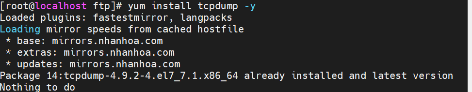
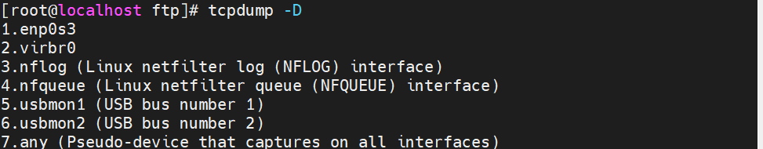
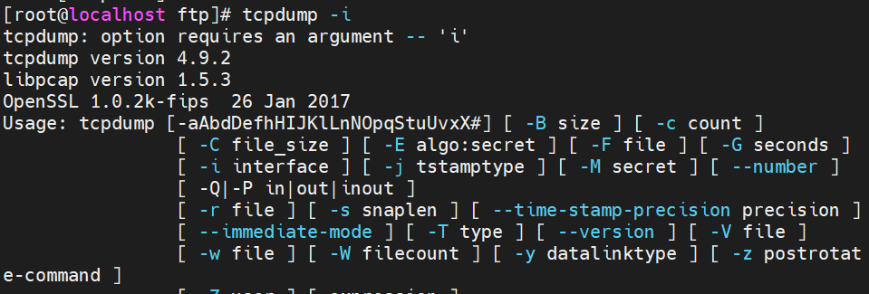
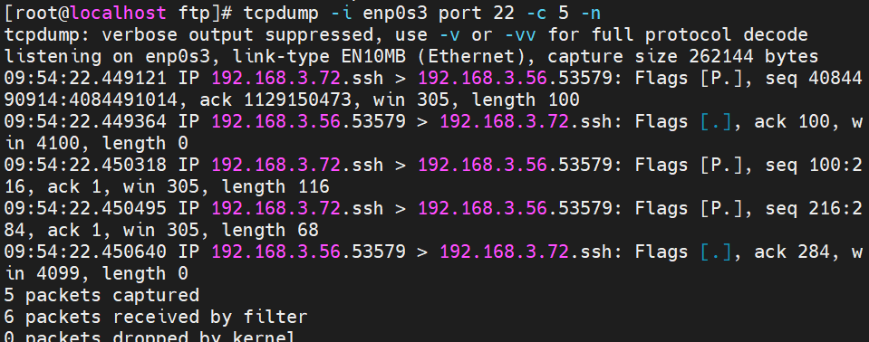
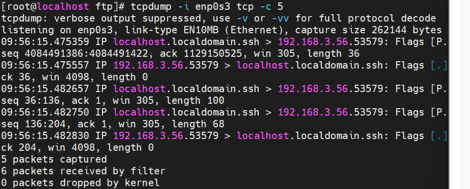
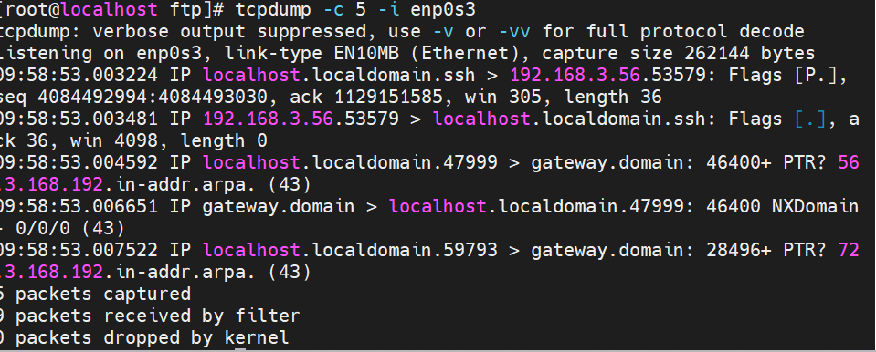
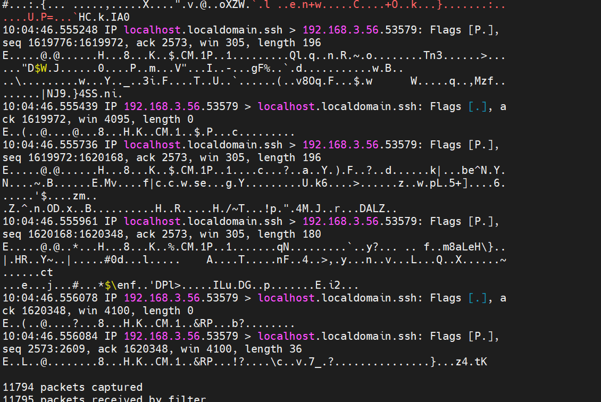
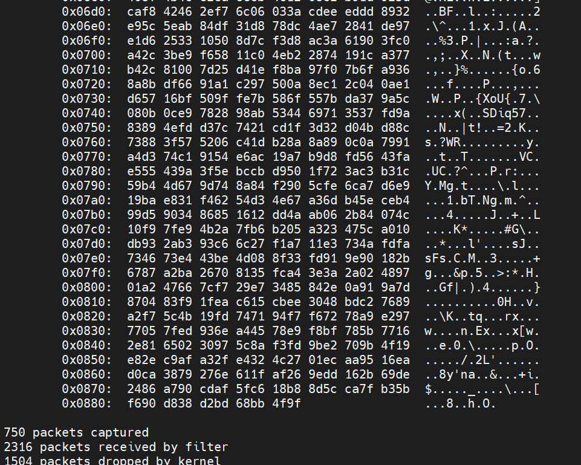
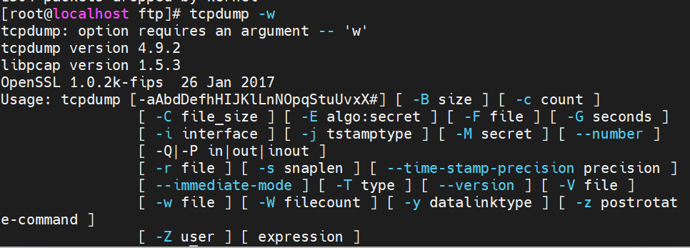
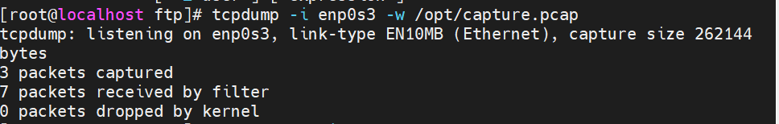

# ***Tìm hiểu về `tcpdump`***
## ***Tcpdump là gì?***
Tcpdump là công cụ hỗ trợ phân tích các gói dữ liệu mạng theo dòng lệnh, cho phép khách hàng chặn và lọc các gói tin TCP/IP được truyền đi hoặc được nhận trên một mạng mà máy tính có tham gia. tcmpdump sẽ lưu lại những gói tin đã bắt được, sau đó dùng để phân tích.

Hiểu đơn giản, Tcmpdump là công cụ dò mạng tìm Netwwork,  có vai trò trong việc gỡ rối và kiểm tra các vấn đề liên quan đến bảo mật và kết nối mạng.
## ***Lợi ích khi sử dụng TCPDUMP***
Một số lợi ích tuyệt vời của TCPDUMP bao gồm:

- Hỗ trợ xem các bản tin DUMP trên terminal
- Capture các bản tin và lưu dưới định dạng PCAP (hỗ trợ đọc bởi Wireshark)
- Tạo các bộ lọc Filter để capture các bản tin http, ftp, ssh…
- Hỗ trợ xem trực tiếp các bản tin điều khiển hệ thống Linux thông qua Wireshark

TCPDUMP là công cụ có khả năng capturing packets mạnh mẽ. Hoạt động trên network layer, TCPDUMP có thể capture tất cả các gói ra vào máy tính. Ngoài ra, TCPDUMP cũng được sử dụng để capture và save các gói tới một file cụ thể và phân tích sau.
## ***Tcpdump tồn tại ở hình thức nào?***
Để lựa chọn gói tin phù hợp với biểu thức logic mà khách hàng nhập vào, tcmpdump sẽ xuất ra màn hình một gói tin chạy trên card mạng mà máy chủ đang lắng nghe.  

Tùy vào các lựa chọn khác nhau khách hàng có thể xuất mô tả này ra một gói tin thành một file “pcap” để phân tích và có thể đọc nội dung “pcap” đó với option – r của lệnh tcpdump, hoặc sử dụng các phần mềm khác như là : Wireshark.

Đối với những trường hợp không có tùy chọn, lệnh tcpdump sẽ được chạy cho đến khi nhận được một tín hiệu ngắt từ khách hàng. Sau khi kết thúc việc bắt các gói tin, tcmpdump sẽ báo cáo các cột sau:

- Packet capture: số lượng gói tin bắt được và xử lý.

- Packet received by filter: số lượng gói tin được nhận bởi bộ lọc.

- Packet dropped by kernel: số lượng packet đã bị dropped bởi cơ chế bắt gói tin của hệ điều hành.
# ***Một số lệnh cơ bản của tcpdump***

Nếu muốn sử dụng được lệnh tcpdump trên Linux bạn phải cài một gói tên như dưới đây: 

- Ubuntu, ta dùng lệnh

`sudo apt-get install tcpdump -y`

- CentOS

`yum install tcpdump -y`

## ***Xem các interface đang hoạt động***
`tcpdump -D`

## ***Bắt gói tin trên interface***

`tcpdump -i`

 ## ***Bắt các gói theo port***
 `tcpdump -i enp0s3 port 22 -c 5 -n`
 -n: Hiển thị số port thay cho tên giao thức, IP thay cho Hostname
 

## ***Bắt theo các gói TCP giữa hai host***

`tcpdump -i enp0s3 tcp -c 5`
 

 ## ***Bắt gói tin với tùy chọn -c***
 Mặc định, tcmpdump sẽ bắt liên tiếp các gói tin. Thao tác tổ hợp phím Ctrl + C. Nhưng với tùy chọn -c, chúng ta có thể chỉ cho tcpdump biết là "Tôi chỉ muốn bắt n gói."

n - là số gói tin cần bắt

 Cú pháp như sau:

`tcpdump -c n -i enp0s3`
 
 ## ***Đọc các gói tin nhỏ hơn N byte***
 Bạn có thể chỉ nhận những gói tin nhỏ hơn N byte thông qua bộ lọc “less”.

`tcpdump -w l_1024.pcap  less 1024`

## ***Đọc các gói tin lớn hơn N byte***
 chỉ cho phép đọc các gói tin lớn hơn N bytes: `tcpdump -w g_512.pcap greater 512`

 ## ***Hiển thị các gói tin được bắt trong hệ ASCII***
  `tcpdump -A`
   
 ## ***Hiển thị các gói tin được bắt dưới dạng HEX và ASCII*** 
 `tcpdump -XX`
    

## ***Bắt gói tin và ghi vào một file***
 `tcpdump -w`
Việc lưu lại file "captured" có thể dùng để sử dụng phân tích sau, hoặc có thể mở bằng các phần mềm phân tích mạng khác như wireshark (định dạng thường gặp là *.pcap)
    

## ***Đọc các gói tin từ một file***
 `tcpdump -r`
tcpdump cho phép mở file "captured" trước đó hoặc mở file "captured" của các công cụ phân tích mạng khác như wireshark
## ***Lưu file .pcap (Wireshark)***

`tcpdump -i enp0s3 -w /opt/capture.pcap`
    

# ***Tài liệu tham khảo***
<https://nhanhoa.com/tin-tuc/tcpdump-la-gi.html>
<https://bizflycloud.vn/tin-tuc/tcpdump-la-gi-20220526145620225.htm>
<https://github.com/hocchudong/thuctap032016/blob/master/ThaiPH/ThaiPH_baocaotimhieutcpdump.md>

