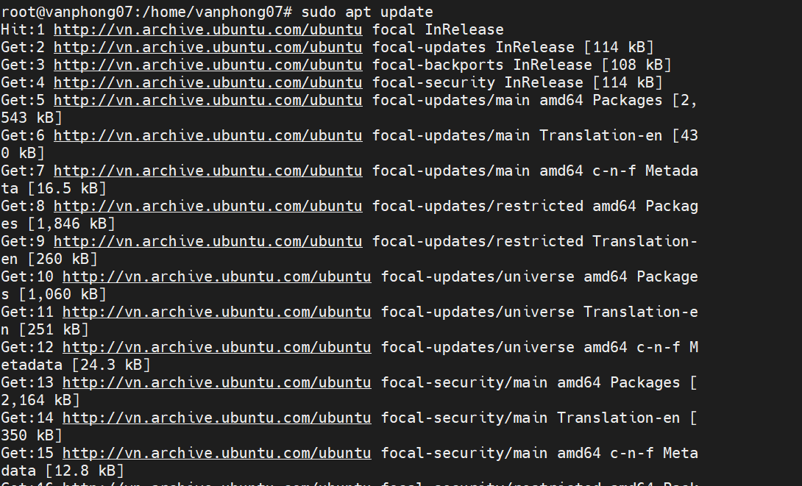
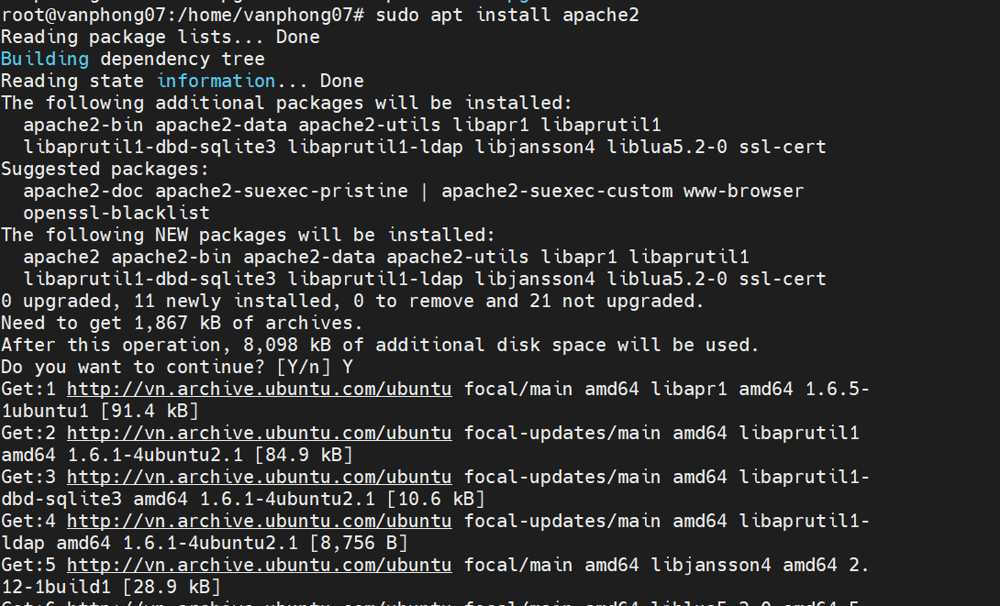
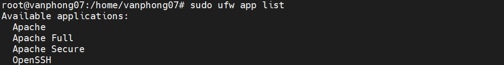
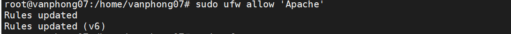
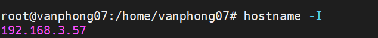
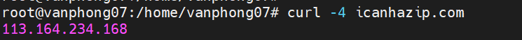
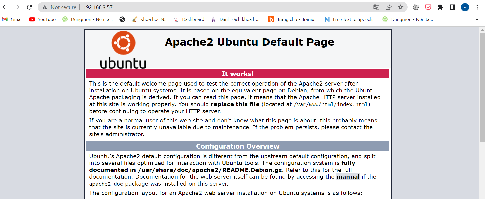
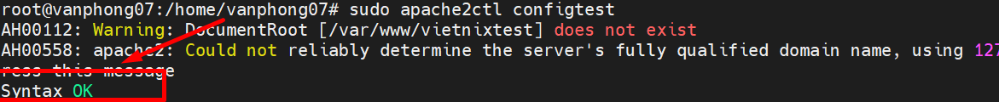

# ***Bước 1: Cài đặt Apache***

- Apache có thể được cài đặt trực tiếp từ repo của Ubuntu. Trước tiên hãy cập nhật index gói local để áp dụng các thay đổi mới nhất (sẽ cần chờ trong thời gian ngắn tùy thuộc các gói cần thiết trạng thái phiên bản từng gói):
`sudo apt update`


- Sau đó chạy lệnh dưới đây để cài đặt package apache2:
`sudo apt install apache2`


# ***Bước 2: Thay đổi cài đặt tường lửa***

Trước khi kiểm tra Apache, bạn cần chỉnh sửa một số cấu hình tường lửa để cho phép truy cập từ bên ngoài vào port mặc định của web.

Trong quá trình cài đặt, Apache sẽ tự đăng ký một số profile ứng dụng trong UFW để cho phép hoặc chặn quyền truy cập đến Apache qua tường lửa.

## ***Bạn có thể dùng lệnh sau để xem các profile `ufw` hiện có:***

```sudo ufw app list```


- Apache: Chỉ mở port 80 (lưu lượng không được mã hóa).
- Apache Full: Mở port 80 và port 443 (lưu lượng được mã hóa bằng TLS/SSL).
- Apache Secure: Chỉ mở port 443 (được mã hóa bằng TLS/SSL).

## ***Đến bước này ta vẫn chưa cấu hình SSL cho server nên bạn chỉ cần cho phép các lưu lượng trên port 80:***
```sudo ufw allow 'Apache'```



## ***Sau đó kiểm tra thay đổi:***
```sudo ufw status```

# ***Bước 3: Kiểm tra web server***
- Sau khi cài đặt xong thì Ubuntu sẽ tự khởi động Apache. Bạn có thể kiểm tra trạng thái của dịch vụ bằng lệnh sau:

```sudo systemctl status apache2```

- Bên cạnh đó, bạn cũng có thể thử truy cập landing page mặc định của Apache để xác nhận rằng phần mềm vẫn đang chạy bình thường qua địa chỉ IP của server. Nếu không biết địa chỉ IP thì bạn có thể chạy lệnh dưới đây trong command prompt của server:

```hostname -I```


Một cách khác nữa là dùng công cụ Icanhazip, cho phép xem địa chỉ IP public của server:
```curl -4 icanhazip.com```


- Sau khi có được địa chỉ IP của server, hãy nhập vào trong thanh địa chỉ của trình duyệt web:

```http://your_server_ip```



# ***Bước 4: Quản lý tiến trình Apache***
- Chạy lệnh sau để dừng web server:

```sudo systemctl stop apache2```

- Để khởi động server:

```sudo systemctl start apache2```
- Để restart dịch vụ:

```sudo systemctl restart apache2```

- Nếu bạn chỉ thực hiện các thay đổi cấu hình trên web server thì Apache có chế độ reload mà không cần ngắt kết nối bằng lệnh sau:

```sudo systemctl reload apache2```

- Theo mặc định, Apache được cấu hình để tự khởi động mỗi khi server boot. Bạn có thể disable tính năng này bằng lệnh:

```sudo systemctl disable apache2```

- Nếu muốn bật lại tính năng vừa rồi:

```sudo systemctl enable apache2```

# ***Bước 5: Thiết lập Virtual Host***
Khi sử dụng web server Apache, bạn có thể sử dụng các virtual host (tương tự như các server block – khối server – trong Nginx) để đóng gói các chi tiết cấu hình và lưu trữ nhiều miền từ một server.
- Tạo thư mục cho phongnv như sau:

```sudo mkdir /var/www/vietnixtest```
- Sau đó, gán quyền truy cập thư mục bằng biến môi trường $USER:

```sudo chown -R $USER:$USER /var/www/phongnv```

- Quyền truy cập các root của web nên chính xác nếu bạn chưa thay đổi bất kỳ giá trị umask nào. Để đảm bảo cho phép chủ sở hữu quyền đọc, ghi và thực thi, đồng thời cho quyền đọc và thực thi đối với group và những user khác thì bạn có thể dùng lệnh sau:

```sudo chmod -R 755 /var/www/phongnv```

- Sau đó tạo một trang mẫu `index.html `bằng một text editor bất kỳ:
```sudo nano /var/www/phongnv/index.html```
- Ở bên trong, thêm đoạn HTML sau:
```
<html>
    <head>
        <title>Welcome to vietnixtest!</title>
    </head>
    <body>
        <h1>Success!  The vietnixtest virtual host is working!</h1>
    </body>
</html>
```

Sau đó lưu rồi đóng lại file.

- Để Apache có thể cung cấp nội dung thì bạn cần tạo một file virtual host với các directive chính xác. Thay vì chỉnh sửa trực tiếp file cấu hình trong `/etc/apache2/sites-available.000-default.conf` thì bạn có thể tạo một file mới trong `/etc/apache2/sites-available/phongnv.conf`:

```sudo nano /etc/apache2/sites-available/phongnv.conf```

Lưu và đóng lại file sau khi hoàn tất.

- Bây giờ bạn có thể enable file bằng công cụ `a2ensite`:

```sudo a2ensite phongnv.conf```

- Disable trang mặc định được định nghĩa trong `000-default.conf`:

```sudo a2dissite 000-default.conf```

- Sau đó kiểm tra lỗi cấu hình nếu có:

```sudo apache2ctl configtest```
Nếu output là `Syntax OK` thì không có lỗi gì xảy ra.


- Cuối cùng là restart lại Apache để áp dụng các thay đổi:

```sudo systemctl restart apache2```


sssss


