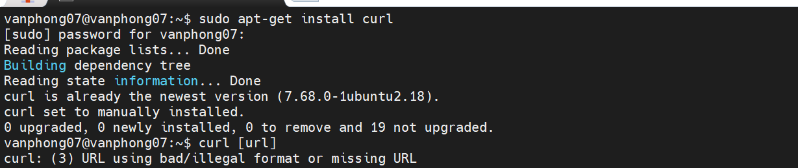
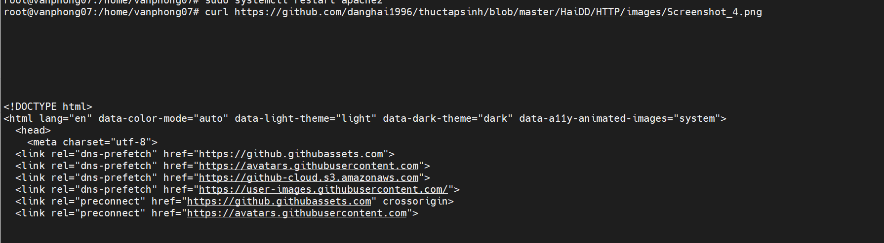
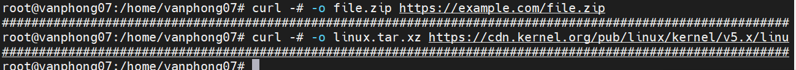
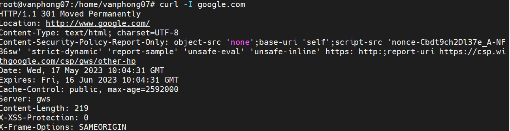

# ***Tìm hiểu về lệnh curl***
`Curl` là chữ viết tắt của “Client URL”, dùng để kiểm tra kết nối tới URL và curl command thường dùng để truyền tải dữ liệu.

Lệnh `curl` là một công cụ dòng lệnh để truyền dữ liệu đi hoặc từ một máy chủ, sử dụng cho bất kì giao thức nào được hỗ trợ (HTTP, FTP, IMAP, POP3, SCP, SFTP, SMTP, TFTP, TELNET, LDAP hoặc FILE). `curl` được cung cấp bởi Libcurl.

Lệnh này được ưa chuộng để tự động hóa, vì nó được thiết kế để hoạt động mà không có sự tương tác của người dùng. `curl` có thể vận chuyển nhiều tập tin cùng lúc.

## Cú pháp
```
curl [options] [URL...]
```
## ***Cài đặt***
Trên Debian/Unbuntu:

`sudo apt-get install curl`


## ***Ví dụ và các option***
`# curl [url]`


- Có thể tải nhiều nhiều trang tương tự nhau:
```curl http://site.{one, two, three}.com```
- Các trang với chuỗi số:



### 2. Đồng hồ đo tiến độ (Process Meter)
Nếu bạn muốn theo dõi quá trình tải file như tốc độ truyền, lượng dữ liệu được truyền, thời gian còn lại, ... Ta thêm option `-#`

Ví dụ:
```curl -# -o file.zip https://example.com/file.zip```




### 3. Lưu file tải về với tên tùy chọn
`curl -o [file_name] [url]`
```
curl -o example.zip http://www.example.com/example.zip
```


### 4. Tải file với tên giống trên URL
`curl -O [url]`
```
curl -O http://www.example.com/
example.zip
```


Tải xuống nhiều tệp:
```
# curl -O [url_1] -O [url_2] ...
```

### 5. Tiếp tục tải xuống các file bị gián đoạn
`curl -C - [url]`
```
curl -C - -o example.zip http://www.example.com/example.zip
```


### 6. Tải file có yêu cầu xác thực từ FTP Server
`# curl -u {username}:{password} [FTP_URL]`
Ví dụ: Tải file có xác thực theo cách thông thường sẽ bị lỗi
```
[root@localhost ~]# curl -O ftp://test.rebex.net/readme.txt
```


Sử dụng option `-u` và nhập username và password thì quá trình tải xuống không có lỗi.
```
# curl -u demo:password -O ftp://test.rebex.net/readme.txt
```


### 7. Truy vấn HTTP Header
`curl -I [URL]`
Ví dụ:




### 8. Lưu trữ 1 cookie
`# curl -c [tên_file_cookie] [url] -O`

`-c` = `--cookie`

Ví dụ
```
# curl --cookie-jar cnncookies.txt https://www.cnn.com/index.html -O
```


### 9. Gửi cookies
`# curl -c [tên_file_cookie] [url]`

Ví dụ:
```
# curl --cookie cnncookies.txt https://www.cnn.com
```

### 10. Giới hạn download
`curl --limit-rate [value] [URL]`

Tốc độ download sẽ được giữ xung quanh giới hạn ta đặt.

`value` : đơn vị là bytes.

Ví dụ:
```
curl --limit-rate 1000K -O http://www.example.com/example.zip

```


