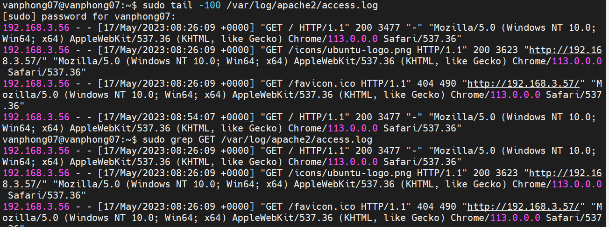
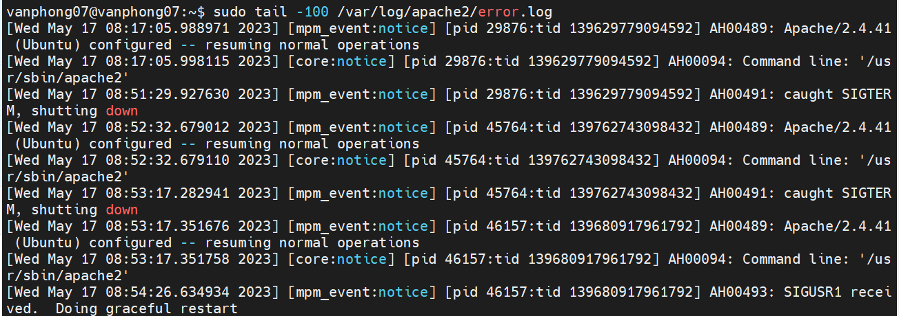

# ***Đường dẫn***

Theo mặc định, bạn có thể tìm thấy tệp nhật ký truy cập Apache tại đường dẫn sau:

`/var/log/apache/access.log`
`/var/log/Apache2/access.log`
`/etc/httpd/logs/access_log`

# ***Các câu lệnh thực hiện `file log apache`***

## ***Hiển thị 100 mục cuối cùng của Nhật ký truy cập***

`sudo tail -100 /var/log/apache2/access.log`

Lệnh `tail` yêu cầu máy đọc phần cuối cùng của tệp và -100lệnh chỉ đạo nó hiển thị 100 mục trước đó.

Phần cuối cùng, `/var/log/apache2/access.log` cho máy biết nơi tìm tệp nhật ký. Nếu tệp nhật ký của bạn ở một nơi khác, hãy đảm bảo thay thế đường dẫn máy của bạn thành tệp nhật ký Apache.

## ***Hiển thị Thuật ngữ cụ thể từ Nhật ký truy cập***

Đôi khi, bạn chỉ muốn hiển thị một loại mục cụ thể trong nhật ký. Bạn có thể sử dụng greplệnh để lọc báo cáo của mình theo các từ khóa nhất định.
`sudo grep GET /var/log/apache2/access.log`

Giống như lệnh trước, lệnh này xem tệp /var/log/apache2/access.log để hiển thị nội dung của nhật ký truy cập. Lệnh yêu grepcầu máy chỉ hiển thị các mục có GETyêu cầu.

Bạn cũng có thể thay thế các lệnh khác của Apache. Ví dụ: nếu bạn đang muốn theo dõi quyền truy cập vào hình ảnh .jpg, bạn có thể thay thế .jpg cho .jpg GET. Như trước đây, hãy sử dụng đường dẫn thực đến tệp nhật ký máy chủ của bạn.

## ***Cách xem nhật ký lỗi Apache***

`sudo tail -100 /var/log/apache2/error.log`

## ***Diễn giải Nhật ký truy cập trong Apache***

Có rất nhiều thông tin về các yêu cầu HTTP và một số trình soạn thảo văn bản (và thiết bị đầu cuối) sẽ ngắt văn bản xuống dòng tiếp theo. Điều này có thể gây nhầm lẫn khi đọc, nhưng mỗi phần thông tin được hiển thị theo một thứ tự cụ thể.

Phương pháp thông thường để thể hiện định dạng của tệp nhật ký truy cập là:
`"%h %l %u %t "%r" %>s %b "%{Referer}i" "%{User-agent}i""`
Mỗi dấu % tương ứng với một phần thông tin trong nhật ký:

- %h– Địa chỉ IP của máy khách (nguồn của yêu cầu truy cập).
- %l– Mục nhập tiếp theo này có thể chỉ là một dấu gạch ngang — điều đó có nghĩa là không có thông tin nào được truy xuất. Đây là kết quả của việc kiểm tra identdtrên máy khách.
- %u– Của khách hàng userid, nếu yêu cầu truy cập yêu cầu xác thực http.
- %t– Dấu thời gian của yêu cầu đến.
  %r– Dòng yêu cầu đã được sử dụng. Điều này cho bạn biết phương thức http (GET, POST, HEAD, v.v.), đường dẫn đến nội dung được yêu cầu và giao thức http đang được sử dụng.
- %>s– Mã trạng thái được trả về từ máy chủ cho máy khách.
- %b– Kích thước của tài nguyên được yêu cầu.
- "%{Referer}i"– Điều này cho bạn biết nếu truy cập đến từ việc nhấp vào liên kết trên trang web khác hoặc các cách khác mà khách hàng được giới thiệu đến trang của bạn.
- "%{User-agent}i"– Cho bạn biết thông tin về thực thể đưa ra yêu cầu, chẳng hạn như trình duyệt web, hệ điều hành, nguồn trang web (trong trường hợp là rô-bốt), v.v.
