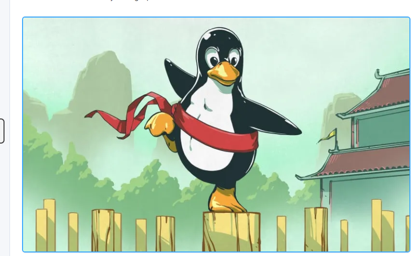
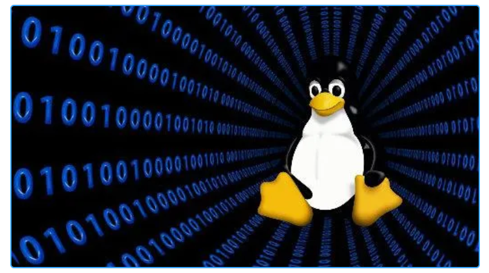
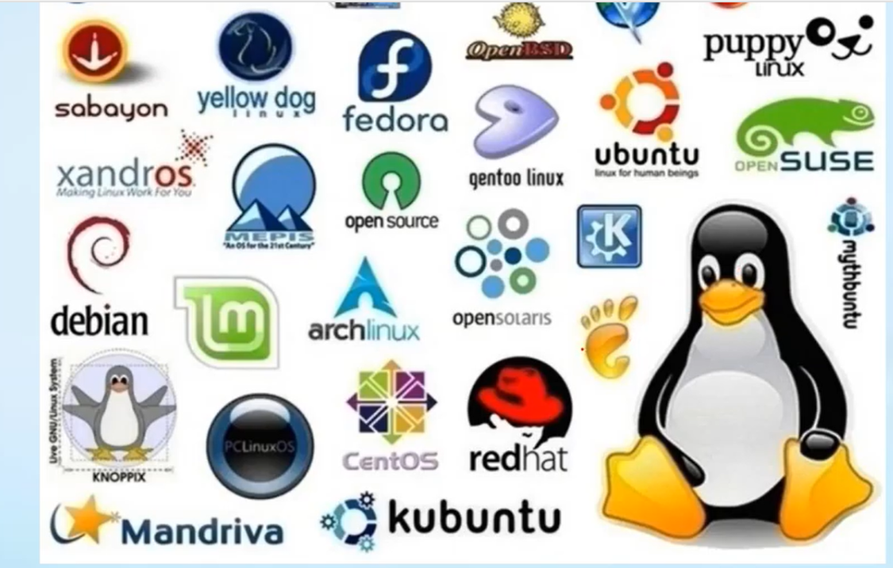
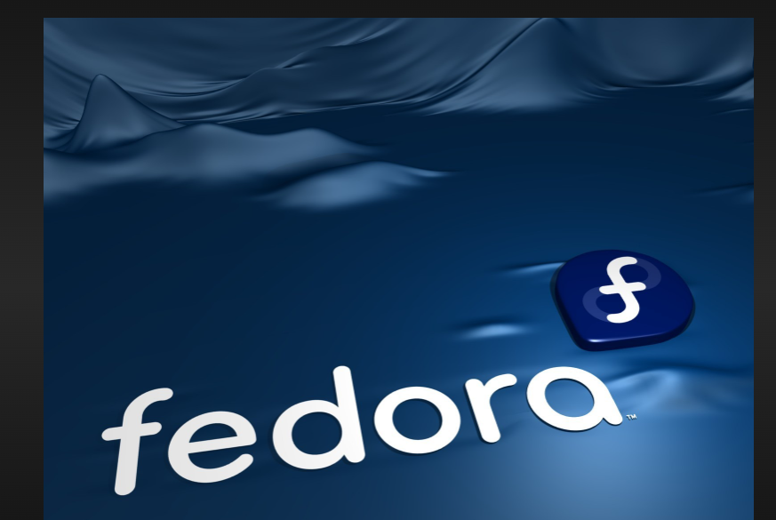
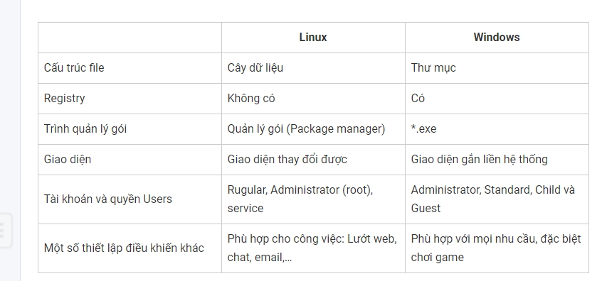

# ***Lý thuyết Linux***
## ***Linux là gì***
- Linux là một hệ điều hành máy tính được phát triển từ năm 1991, dựa trên hệ điều hành Unix và viết bằng ngôn ngữ C.

- Đây là một hệ điều hành được phát hành miễn phí và có nhiều ưu điểm vượt trội nên thường được sử dụng nhiều hơn là Windows hay những hệ điều hành nào khác.

Linux là một hệ điều hành mã nguồn mở và miễn phí, được phát triển từ năm 1991 bởi Linus Torvalds. Linux được thiết kế để chạy trên các máy tính và thiết bị di động khác nhau. Linux cung cấp cho người dùng một hệ thống tập tin phân cấp, bảo mật cao, cấu hình linh hoạt và khả năng tùy chỉnh cao.

Linux là một hệ điều hành đa nền tảng, có thể chạy trên nhiều loại máy tính và thiết bị khác nhau. Hệ điều hành này có những ưu điểm như tính bảo mật cao, độ ổn định và khả năng tùy chỉnh linh hoạt. Tuy nhiên, Linux cũng có những khó khăn như khó sử dụng đối với người dùng mới và hỗ trợ phần cứng không tốt bằng Windows.
## ***Lịch sử phát triển***
- Khi đang học đại học Helsinki, ông Linus Torvards có ý tưởng tạo ra một hệ điều hành mới thay thế cho hệ điều hành cũ cho nền giáo dục hiện tại thời đó. Vì thế, ông đã bắt đầu viết các câu lệnh Linux đầu tiền, đặt nền móng cho sự phát triển của Linux đến hiện nay.
- Hiện nay, Linux được chia ra thành các phiên bản như: Ubuntu, Linux Mint, Fedora, Debian,… nhưng phần lớn người sử dụng nhiều vẫn là Ubuntu. Linux là một trong những ví dụ nổi bật nhất của phần mềm nguồn mở và của việc phát triển mã nguồn mở. Mã nguồn có thể được dùng, sửa đổi và phân phối – thương mại hoặc phi thương mại – bởi bất kỳ ai, theo các điều khoản của giấy phép tương ứng

## ***Ưu và nhược điểm của hệ điều hành linux***
### ***Ưu điểm***
#### ***Hệ điều hành Linux miễn phí***
Với Linux bạn không phải mất phí để mua bản quyền Linux để bắt đầu quá trình sử dụng. Mà bạn hoàn toàn sử dụng một cách miễn phí với tất cả các chức năng của hệ điều hành này. Ngoài ra, được hỗ trợ các ứng dụng văn phòng OpenOffice và LibreOffice.
#### ***Tính linh hoạt***
Khi sử dụng Linux, người dùng có thể linh hoạt trong việc chỉnh sửa hệ điều hành theo nhu cầu của mình. Là một ưu điểm rất hữu ích trong quá trình sử dụng của các lập trình viên.

#### ***Tính bảo mật cao***
Tính bảo mật của Linux là cực cao nên tất cả các phần mềm mã độc, virus,… đều không thể hoat động trên Linux. Vì thế bạn hãy yên tâm tải Linux và sử dụng một cách thoải mái.

Linux hỗ trợ cho máy cấu hình yếu
Với Linux dù máy tính của bạn có cấu hình yếu nhưng Linux vẫn hỗ trợ cập nhật, nâng cấp và hỗ trợ liên tục và thường xuyên trong khi sử dụng. Hoạt động của Linux cũng vô cùng ổn định trên các máy tính yếu.
#### ***Tính ổn định cao***
Theo đó hệ điều hành này đang có khả năng cùng một lúc xử lý những khối lượng công việc lớn và ít xảy ra tình trạng mất ổn định, xuống cấp. Chính vì vậy nơi đang là sự lựa chọn vô cùng hoàn hảo dành cho những doanh nghiệp nhờ vào việc hạn chế những rủi ro xảy ra một cách tối đa của hệ điều hành. 
## ***Nhược điểm***
Một vài hạn chế của Linux như:

- Số ứng dụng được trên Linux còn hạn chế.
- Một số nhà sản xuất driver không phát triển và hỗ trợ cho Linux.
- Khó tiếp cận và làm quen khi bạn đã quá quen thuộc với Windows thì khi chuyển sang Linux bạn cần một thời gian để có thể làm quen được hệ điều hành này.
## ***Kiến trúc hệ điều hành Linux***

## ***Những tính năng chính***
- Chạy trên nhiều phần cứng khác nhau: intel, AMD...
- Là hệ điều hành mã nguồn mở, miễn phí
- Đa người dùng
- Đa nhiệm
- Tích hợp nhiều ngôn ngữ lập trình, môi trường phát triển phần mềm
- Bảo mật cao không bị nhiễm virus
- Tính ổn định cao: chạy nhiều năm không cần reboot
- Hỗ trợ các định dạng hệ thống tập tin khác nhau.
- Hỗ trợ đầy đủ các dịch vụ mạng server(FTP, DNS, Mail, DHCP)
- Dễ dàng quản lý từ xa: Remote từ xa bằng command line hoặc GUI

# ***Các loại distro Linux***

## ***Ubuntu***
Ubuntu hiện tại đang làm một bản phân phối vô cùng hiện đại và được nhiều người dùng biết tới. Mục tiêu của nó đó chính là đem đến cho người dùng những trải nghiệm tốt nhất ngay trên máy chủ và máy tính. 

Hiện tại Ubuntu đã được cải tiến để phù hợp với tất cả yêu cầu của người dùng. Nhưng nó vẫn không làm mất đi những bản sắc riêng của bản thân. 
Ubuntu: là một trong những distro Linux phổ biến nhất, có giao diện đồ họa dễ sử dụng và cung cấp nhiều ứng dụng miễn phí.

## ***Debian***
Debian đang là 1 hệ điều hành gồm có những phần mềm mã nguồn mở hoàn toàn miễn phí và hiện tại vẫn luôn được nhóm cộng đồng lập trình viên vô cùng yêu thích. Dù phát hành những phiên bản mới thường xuyên tuy nhiên Debian có một nhược điểm đó chính là cập nhật khá chậm so với những bản phân phối khác.
Debian: là một distro Linux ổn định và có tính bảo mật cao, được sử dụng phổ biến trong các máy chủ và các thiết bị nhúng.

## ***Fedora***
Fedora Đang là một phần mềm khá phổ biến và tập trung chủ yếu vào những phần mềm miễn phí vì vậy người dùng khi sử dụng thường xuyên gặp những khó khăn liên quan tới quá trình cài đặt những trình điều khiển về đồ họa độc quyền. Phiên bản này ở thời điểm hiện tại vẫn không ngừng được phát triển và cải tiến thêm. 
Fedora: là một distro Linux cập nhật thường xuyên và có tính năng tùy chỉnh cao, được sử dụng cho máy tính cá nhân và máy chủ.

## ***CentOS/Red Hat Enterprise Linux***
CentOS/ Red Hat Enterprise Linux là gì? Đây đang là 1 bản phân phối thương mại của Linux dành cho máy trạm và máy chủ.

 Hiện tại nó đang được phát triển dựa vào Fedora. Tuy nhiên có một nền tảng được hỗ trợ lâu dài và ổn định hơn. 
Red Hat Enterprise Linux (RHEL): là một distro Linux dành cho doanh nghiệp và tổ chức, được hỗ trợ bởi Red Hat.

## ***OpenSUSE/SUSE Linux Enterprise***
Theo đó hiện tại OpenSUSE đang là bạn phân phối khá mạnh thuộc hệ điều hành Linux. Nó được đánh giá là bản phân phối thuộc top thân thiện nhất với người dùng. 

## ***Mageia/Mandriva***
Mageia đang là bản phân phối có thiết kế đơn giản gọn nhẹ và linh hoạt hết mức có thể. Hiện tại nó được coi là một trong những tiền bối thuộc những bản phân phối của hệ điều hành Linux này.

Ngoài ra nó còn cung cấp những từ cấu hình sạch và được thiết kế để giúp cho người dùng dễ dàng chỉnh sửa. 

## ***Slackware Linux***
Ở thời điểm hiện tại Slackware đang là bản phân phối có tuổi đời lâu nhất của hệ điều hành Linux. Ngoài ra hiện tại nó vẫn được duy trì để sử dụng cũng như đều đặn đưa ra những bản phát hành mới nhất. 

## ***Puppy Linux***
Hiện tại đây đang là một trong những bản phân phối vô cùng nổi tiếng của hệ điều hành Linux và được phát triển dựa vào Slackware. 

Theo đó nó được thiết kế để có thể trở thành 1 hệ điều hành nhẹ, nhỏ và có khả năng hoạt động vô cùng mượt mà trên những chiếc máy tính cũ.

 Với những thông tin về khái niệm của hệ điều hành Linux là gì trên. Vậy hiện tại nên lựa chọn phiên bản Linux nào?

# ***Vấn đề phân phối và Giấy phép sử dụng***
 - Giấy phép GNU GPL (General Public License): Đây là giấy phép sử dụng được sử dụng phổ biến nhất trong cộng đồng Linux. Nó được thiết kế để bảo vệ quyền tự do và mã nguồn mở của phần mềm. Theo giấy phép này, các tác phẩm phải được phân phối theo cùng một giấy phép GPL.

- Giấy phép LGPL (Lesser General Public License): Giấy phép này tương tự như GPL, nhưng nó cho phép các thư viện được sử dụng bởi các chương trình khác mà không yêu cầu chương trình đó phải được phân phối theo giấy phép LGPL.

- Giấy phép Apache: Giấy phép Apache cho phép phần mềm được sử dụng và phân phối miễn phí hoặc thương mại. Nó yêu cầu các thành phần phần mềm được phân phối với các thông tin bản quyền và giấy phép tương ứng.

- Giấy phép MIT: Giấy phép MIT cho phép phần mềm được sử dụng, sao chép, sửa đổi, hợp nhất, xuất bản, phân phối, cấp quyền và / hoặc bán theo một số điều kiện.

- Giấy phép BSD: Giấy phép BSD cho phép phần mềm được sử dụng, sao chép, sửa đổi, phân phối và bán theo một số điều kiện.
# ***So sánh Widown với Linux***

## ***Cấu trúc file***
Cấu trúc của Linux khác hoàn toàn so với Windows. Nó được phát triển trên một mã gốc riếng với các nhà phát triển riêng lẻ. Với Linux thì các thư mục My Document ở ổ đĩa C và D được thay thế bằng cây dữ liệu. Các ổ đĩa sẽ được đặt vào đó kể cả thư mục Home và Desktop.
## ***Không sử dụng Registry***
Registry là một cơ sở dữ liệu chủ cho mọi thiết lập nằm trên máy tính với chức năng nắm giữ thông tin ứng dụng, mật khẩu, thiết bị,… Tuy nhiên trong Linux lại không sử dụng registry mà các dữ liệu được sử dụng dưới dạng module. Trong khi đó, Linux lưu dữ liệu người dùng thì Linux lưu các thiết lập của mình trên cơ sở chương trình phân cấp người dùng.

## ***Quản lý gói***
Với Linux, các chương trình sẽ được cài đặt dưới dạng .exe như Windows mà được tập hợp trong một chương trình quản lý gói (Package manager). Với tính năng này, người dùng không phải lên các trình duyệt web để tải nữa, mà chỉ cần tìm kiến trong các kho dữ liệu của trình quản lý gói và thực hiện tải về.

## ***Thay đổi được giao diện***
Giao diện Linux hoàn toàn tách rời với hệ thống lõi. Bạn có thể thay đổi giao diện mà không cần lo lắng về vấn đề cài đặt các chương trình. Có nhiều giao diện như GNOME, KDE hay Unity và nhiều giao diện khác để bạn có thể lựa chọn phù hợp.

## ***Tài khoản và quyền user***
Linux có ba loại user gồm:

Regular: Đây là tài khoản user thông thường được tạo khi cài đặt Ubuntu các file được lưu trữ trong /home là thư mục chính của tài khoản này. Loại user này, không có quyền truy cập vào các thư mục của user khác.
Root: Đây là tài khoản được tạo khi cài đặt Linu. Loại user này có thể truy cập vào những file bị giới hạn quyền, cài đặt phần mềm và có quyền quản trị. Với tài khoản này, bạn có thể cài đặt phần mềm, thay đổi file hệ thống, hoặc thực hiện các tác vụ cần quyền quản trị bất kỳ lúc nào.
Service: Linux là hệ điều hành chính trong máy chủ. Các dihcj vụ như Apache, Squid, email,… đều có những tài khoản dịch vụ cá nhân riêng. Giúp năng tính bảo mật cho máy tính của bạn.

# ***Tài liệu tham khảo***
<https://fptcloud.com/linux-la-gi/>
<https://vietnix.vn/linux-la-gi/>
<https://wiki.matbao.net/linux-la-gi-tong-hop-moi-kien-thuc-ve-he-dieu-hanh-linux/#he-dieu-hanh-linux-la-gi>
