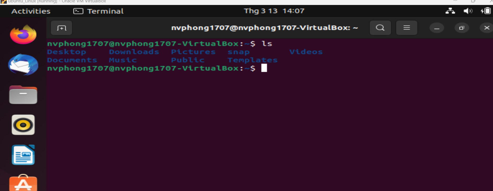
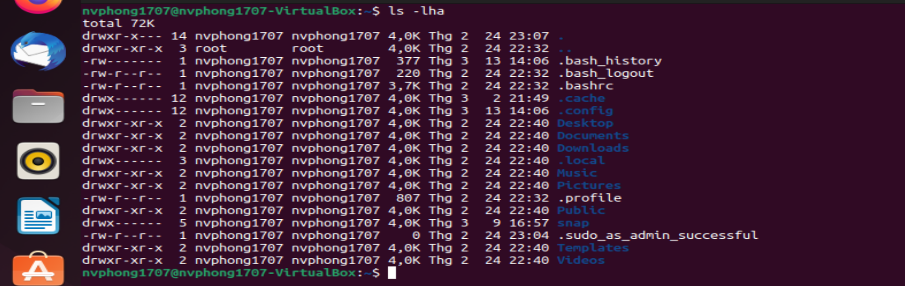
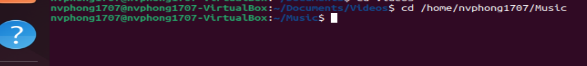
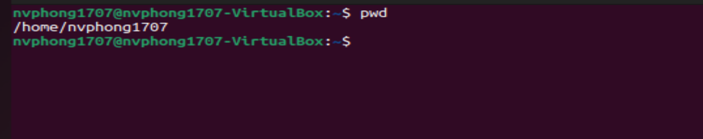
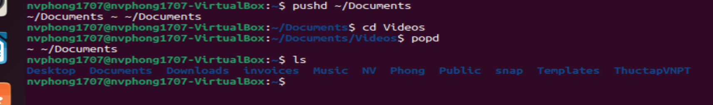
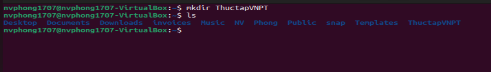

terminal: command line làm việc với thư mục (ls, cd, pwd, push, pop, mkdir)

# ***Khái niệm***
Command line trong Linux (hay còn gọi 
là Terminal) là một giao diện dòng 
lệnh cho phép người dùng tương tác với
hệ thống thông qua các lệnh và câu 
lệnh. Với command line, người dùng có 
thể thực hiện các tác vụ như xem, sao 
chép, di chuyển, xóa, tạo thư mục, 
thiết lập quyền truy cập, chạy chương 
trình, đặt lịch và tương tác với các 
ứng dụng và dịch vụ khác.
Terminal trong Linux là một ứng dụng dòng lệnh (command-line interface) cho phép người dùng tương tác với hệ thống. Nó cho phép người dùng nhập các lệnh bằng cách gõ trực tiếp từ bàn phím và xem kết quả trực tiếp trên màn hình. Terminal là một công cụ mạnh mẽ để quản lý hệ thống, quản lý các tệp tin và thư mục, cài đặt và quản lý các gói phần mềm, và thực hiện các tác vụ khác.
Terminal trong Linux là một chương trình dòng lệnh (command-line interface) giúp người dùng thao tác với hệ thống và các ứng dụng thông qua gõ các lệnh vào dòng lệnh.

## ***Một số tính năng của Terminal trong Linux bao gồm:***

- Giao diện dòng lệnh: Terminal cung cấp một giao diện dòng lệnh cho phép người dùng nhập các lệnh và xem kết quả trực tiếp.

- Đa nhiệm: Terminal cho phép người dùng thực hiện nhiều tác vụ cùng một lúc.

- Cấu hình: Terminal có thể được cấu hình để sử dụng các lệnh tùy chỉnh và cấu hình giao diện.

Lịch sử lệnh: Terminal lưu trữ lịch sử các lệnh đã nhập, cho phép người dùng lặp lại các lệnh đã nhập trước đó.

- Hỗ trợ đầy đủ các lệnh và các tùy chọn: Terminal hỗ trợ đầy đủ các lệnh và các tùy chọn, cho phép người dùng thực hiện nhiều tác vụ khác nhau.

Có nhiều Terminal khác nhau trong Linux, bao gồm GNOME Terminal, Konsole, xterm và nhiều hơn nữa. Mỗi loại Terminal có những đặc điểm khác nhau và có thể được cấu hình theo nhu cầu của người dùng.

## ***Một số khái niệm liên quan đến terminal trong Linux:***

- Shell: là một chương trình mà terminal sử dụng để hiển thị dòng lệnh và chạy các lệnh đó. Bash shell là shell phổ biến nhất trong Linux.

- Command-line interface (CLI): là giao diện người dùng mà người dùng nhập lệnh bằng cách gõ vào bàn phím. CLI thường được sử dụng trong các tác vụ quản lý hệ thống hoặc đối với các ứng dụng dòng lệnh.

- Terminal emulator: là một ứng dụng trên desktop của Linux giúp người dùng tạo ra một cửa sổ đưa ra dòng lệnh và hiển thị kết quả khi thực hiện lệnh. Các terminal emulator phổ biến trong Linux bao gồm gnome-terminal, konsole, xterm, iterm2, ...

# ***Tại sao cần sử dụng Terminal***
Terminal là một công cụ quan trọng trong Linux, cho phép người dùng tương tác với hệ thống dòng lệnh để thực hiện các nhiệm vụ khác nhau. Dưới đây là một số lý do tại sao cần sử dụng terminal trong Linux:

- Tính linh hoạt: Terminal cho phép người dùng thực hiện các nhiệm vụ tùy chỉnh và phức tạp một cách dễ dàng, không giới hạn bởi giao diện đồ họa hoặc giới hạn bởi các tùy chọn trên màn hình. Nó cung cấp cho người dùng một loạt các lệnh và công cụ mạnh mẽ để thực hiện các tác vụ quản lý hệ thống, tạo các kịch bản tự động hóa và nhiều hơn nữa.

- Tốc độ và hiệu suất: Terminal cho phép người dùng truy cập và quản lý các tệp tin và thư mục trực tiếp thông qua dòng lệnh, điều này giúp tiết kiệm thời gian và tăng hiệu suất cho các tác vụ quản lý tệp tin.

- Tính bảo mật: Terminal giúp người dùng tăng cường bảo mật cho hệ thống của họ bằng cách cung cấp các công cụ để quản lý quyền truy cập và các cấu hình hệ thống.

- Khả năng tùy chỉnh: Terminal cho phép người dùng tùy chỉnh giao diện và các cài đặt khác để đáp ứng các nhu cầu và sở thích của họ.

- Khả năng đa nhiệm: Terminal cho phép người dùng thực hiện nhiều tác vụ cùng một lúc trên cùng một hệ thống mà không bị giới hạn bởi giao diện đồ họa.

- Tiện ích cho các nhà phát triển: Terminal cung cấp môi trường phát triển tốt cho các nhà phát triển phần mềm Linux để phát triển và kiểm thử ứng dụng của họ.

Tóm lại, Terminal là một công cụ rất hữu ích trong Linux, cung cấp cho người dùng sự linh hoạt, hiệu suất, tính bảo mật và khả năng tùy chỉnh cao. Nó là một phần không thể thiếu trong việc quản lý và sử dụng hệ điều hành Linux.
# ***Command line***
## ***Lệnh ls***
Lệnh này được sử dụng để hiển thị danh sách các tệp và thư mục trong thư mục hiện tại.
Trong các câu lệnh trong Linux, đây chắc hẳn là lệnh đầu tiên mà phần lớn người dùng Linux gặp. Lệnh này có nhiệm vụ liệt kê các file và folder có ở trong directory được chỉ định. Theo mặc định, ls sẽ tìm ở trong directory hiện tại. Bên cạnh đó, còn có nhiều option khác có thể được sử dụng với lệnh ls. Trong đó phổ biến có:
- ls: Liệt kê các file và folder trong danh mục hiện tại:

- ls -1: Liệt kê các file và folder trong danh mục hiện tại, cùng option -l để hiển thị chi tiết hơn

- ls -lh: Option -h (human) để hiển thị kích thước các file thân thiện hơn với con người

- ls -lha: Liệt kê cả các file bị ẩn bằng option -a (all files)

## ***Lệnh cd***
Lệnh này được sử dụng để di chuyển đến một thư mục khác.
Lệnh cd (change directory) sẽ thay đổi directory hiện tại. Nói cách khác, nó sẽ đưa ta đến một vị trí mới ở trong filesystem.
Để chuyển hướng trong hệ thống tập tin Linux, bạn có thể sử dụng command cd. Nó sẽ cần nhập đường dẫn đầy đủ hoặc tên thư mục bạn muốn chuyển tới.

Nếu bạn đang ở trong /home/username/Documents và muốn đến Videos, thư mục con của Documents, chỉ cần gõ cd Videos.

Trường hợp khác là nếu bạn muốn chuyển sang danh mục hoàn toàn mới, như /home/username/Music. Lúc này, bạn phải gõ cd theo danh mục đường dẫn hoàn chỉnh như sau:
- cd /home/username/Music

- Để nhanh chóng quay về home directory, dùng dấu ~ như một tên directory.
  - Ví dụ: cd ~

## ***Lệnh pwd***
Lệnh này được sử dụng để hiển thị đường dẫn đến thư mục hiện tại.
Lệnh pwd (print working directory) sẽ in directory đang làm việc từ directory root:
Command pwd được dùng để tìm đường dẫn của thư mục hiện tại (folder) mà bạn đang ở trong đó. Command này sẽ trả về đường dẫn hoàn chỉnh (đầy đủ), bắt đầu bằng dấu gạch chéo (/).

## ***Lệnh pushd***
Đây là lệnh để làm việc với stack của các thư mục. Được sử dụng để đưa một thư mục vào stack và di chuyển đến một thư mục khác
## ***Lệnh popd***
Được sử dụng để xóa thư mục đầu tiên trong stack và di chuyển đến thư mục đó

## ***Lệnh mkdir***
Lệnh này cho phép bạn tạo một thư mục mới.
Lệnh mkdir (make directory) cho phép tạo các directory mới ở trong filesystem. Người dùng phải nhập tên của directory mới vào trong mkdir. Nếu directory mới không nằm trong directory hiện tại, hãy cung cấp thêm đường dẫn để đi đến directory mới đó.

# ***Lợi ích của command line***
- Cho phép người dùng tương tác với hệ thống một cách hiệu quả và linh hoạt hơn.
- Có thể tự động hóa các tác vụ bằng cách sử dụng các lệnh và câu lệnh trong các script.
- Có thể giúp người dùng tiết kiệm thời gian và tăng hiệu suất làm việc.
- Có thể truy cập và thực hiện các tác vụ từ xa thông qua kết nối SSH.
- Có thể sử dụng các công cụ và ứng dụng mạnh mẽ khác như grep, awk, sed và các tiện ích khác.

# ***Tài liệu tham khảo***
<https://vietnix.vn/cac-cau-lenh-trong-linux/>
<https://www.hostinger.vn/huong-dan/cac-lenh-co-ban-trong-linux>
 