# ***Cấu hình mạng***
## Lệnh `ip` : 
### Lệnh trả lại thông tin trên từng thiết bị Ethernet được kết nối.
`# ip addr show` 

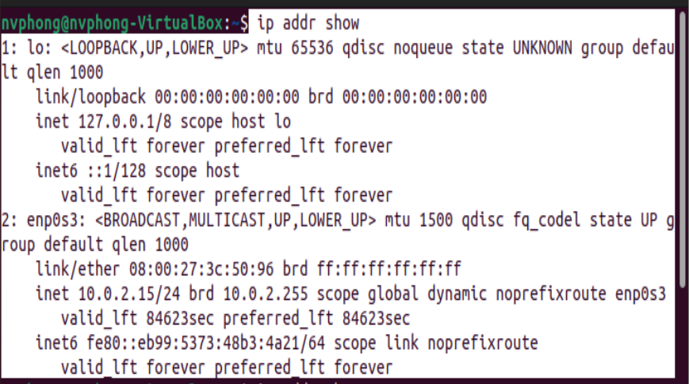
Để xem thông tin về `enp0s3`:
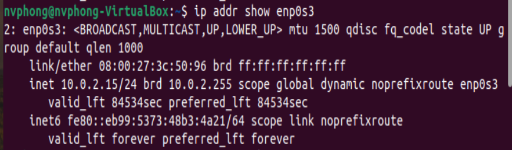
### Hiện thị bảng định tuyến
`ip route show`
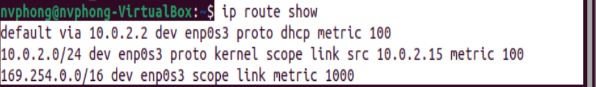
### Gán IP cho một giao diện mạng:
`# ip addr add 10.0.2.16 dev enp0s3`
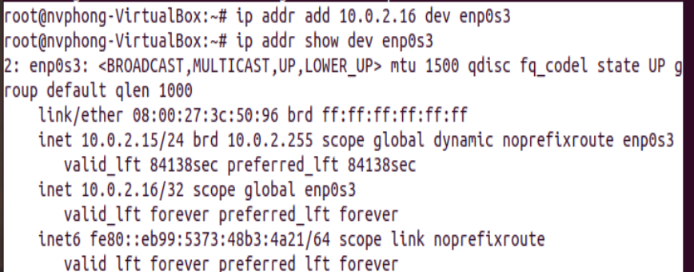

### Gán nhiều IP cho một giao diện mạng:
Để gán nhiều IP cho giao diện mạng ta làm tương tự như trên

### Gỡ bỏ IP từ giao diện mạng

`# ip addr del 192.168.37.133/32 dev ens33`

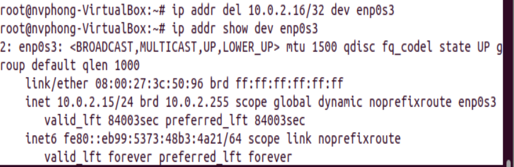

### Hiển thị thông tin về một giao diện mạng

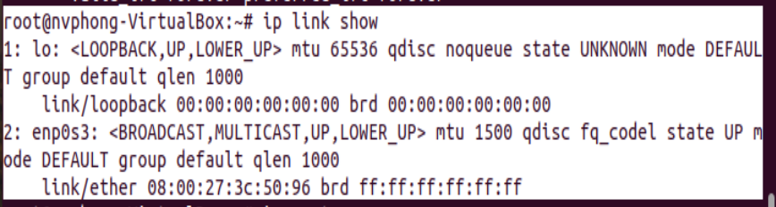

### Thay đổi trạng thái giao diện mạng (up/down)
`ip link set dev {DEVICE} {up|down}`

### Hiện thị bảng định tuyến
`# ip route`

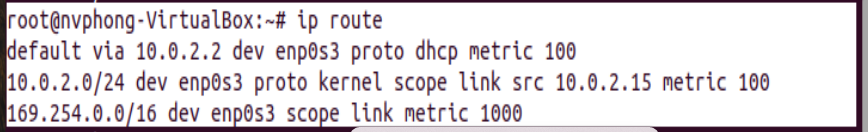

### Thêm một định tuyến mới
`# ip route add 10.0.2.0/24 via 10.0.2.2`
### Xóa một định tuyến
`ip route del default`

Hoặc chỉ định định tuyến cần xóa.

`ip route del <dia_chi_ip> via <gateway>`

# ***Tìm hiểu trên Cenos***
## ***Tìm hiểu `nmcli`***
nmcli là một công cụ dòng lệnh được sử dụng để kiểm soát Trình quản lý mạng. lệnh nmcli cũng có thể được sử dụng để hiển thị trạng thái thiết bị mạng, tạo, chỉnh sửa, kích hoạt/hủy kích hoạt và xóa kết nối mạng. 
**Sử dụng điển hình:**

Tập lệnh : Thay vì quản lý thủ công các kết nối mạng, nó sử dụng NetworkMaager qua nmcli.
Máy chủ , máy không đầu và thiết bị đầu cuối : Có thể được sử dụng để điều khiển Trình quản lý mạng không có GUI và điều khiển các kết nối trên toàn hệ thống.
**Cú pháp:**

`nmcli [TÙY CHỌN] ĐỐI TƯỢNG { LỆNH | giúp đỡ }`
- Để kiểm tra trạng thái thiết bị sử dụng lệnh nmcli .
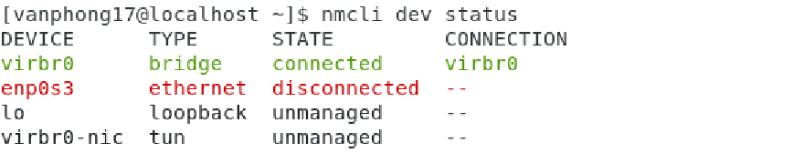
Chúng ta có thể thấy rằng đầu ra được hiển thị trong các cột khác nhau bao gồm tên thiết bị, loại thiết bị và trạng thái kết nối. Đầu ra có thể khác nhau với các máy khác nhau. 
- Để kiểm tra kết nối đang hoạt động trên thiết bị. 

## ***Tìm hiểu `nmtui`***
- B1: `nmcli`
- 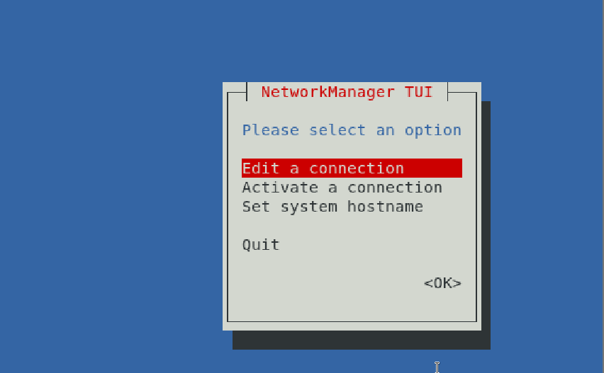
- 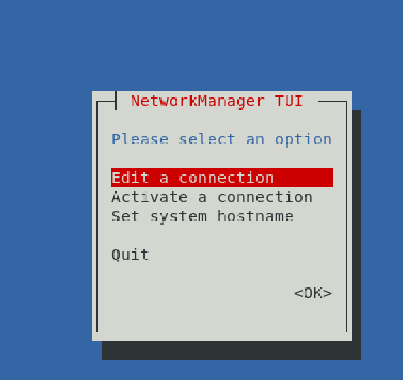
- 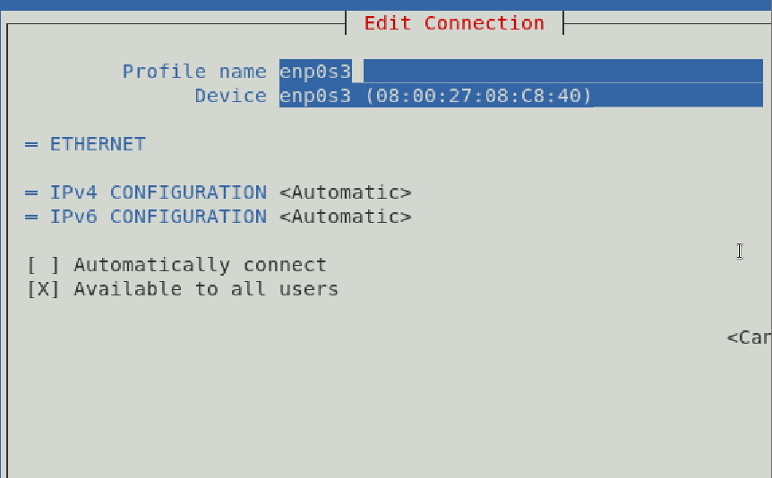

## ***Cấu hình file***
### ***NFS là gì?***
NFS (Network File System) là một hệ thống giao thức chia sẻ file phát triển bởi Sun Microsystems từ năm 1984, cho phép một người dùng trên một máy tính khách truy cập tới hệ thống file chia sẻ thông qua một mạng máy tính giống như truy cập trực tiếp trên ổ cứng.
### ***Những tính năng của NFS là gì?***
- NFS cho phép truy cập cục bộ đến các tệp từ xa, cho phép nhiều máy tính sử dụng cùng một tệp để mọi người trên mạng có thể truy cập vào cùng một dữ liệu
- Với sự trợ giúp của NFS, chúng ta có thể cấu hình các giải pháp lưu trữ tập trung.
- Giảm chi phí lưu trữ bằng cách để các máy tính chia sẻ ứng dụng thay vì cần dung lượng ổ đĩa cục bộ cho mỗi ứng dụng của người dùng
- Giảm chi phí quản lý hệ thống và minh bạch hệ thống tập tin
- Cung cấp tính nhất quán và độ tin cậy của dữ liệu vì tất cả người dùng đều có thể đọc cùng một bộ tệp
- Có thể bảo mật với Firewalls và Kerberos
### ***Khởi động và dừng NFS***
Việc khởi động dịch vụ NFS cũng khá đơn giản và đã được giới thiệu ở trên bằng cách
khởi động portmap và nfs.
`service nfs start`
hoặc
`/etc/init.d/nfs start`
Việc dừng (tắt) dịch vụ này cũng khá đơn giản, ta dùng lệnh sau:
#`service nfs stop`
hoặc
`/etc/init.d/nfs stop`
Ta có thể đặt cho dịch vụ này được tự động khởi động khi ta khởi động máy tính bằng
cách dùng lệnh:
`setup`
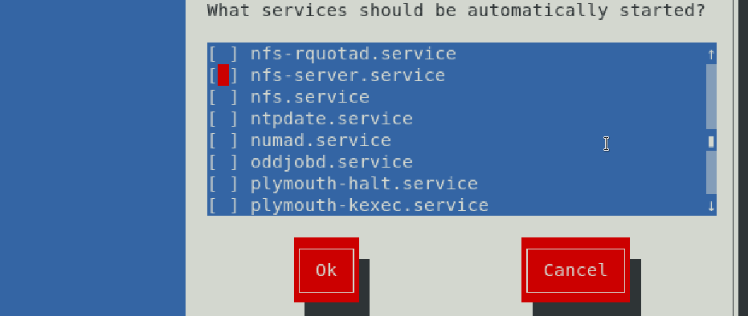
## ***Tìm hiểu `nmtui`***

- B1: `nmcli` Bắt đầu công cụ nmtui :
  - 
- 
- 

# ***Tìm hiểu trên Ubuntu***
## ***Cấu hình ifup và ifdown***
### ***Cài đặt ifup và ifdown***
`ip link set dev {DEVICE} {up|down}`
Cài đặt cấu hình ifup và ifdown
`sudo apt install ifupdown`
### ***Lệnh `ifup`***
Để kích hoạt hoặc thiết lập một giao diện
- Cú pháp

`ifup [option]`
- Cập nhật tất cả giao diện mạng
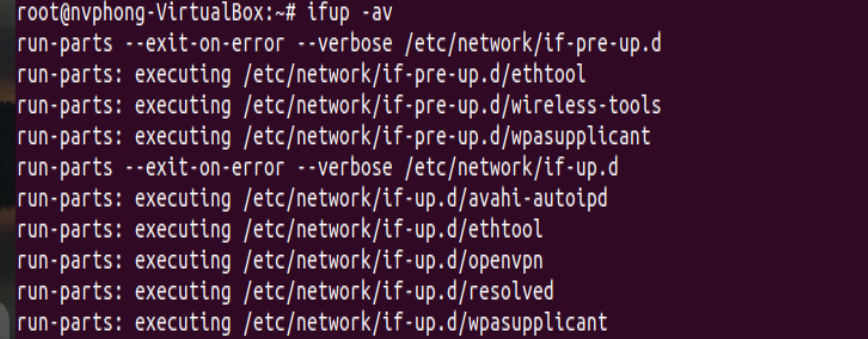

### ***Lệnh `ifdown`***
Để ngắt một giao diện
- Cú pháp

`ifdown [option]`
Ngắt kết nối tất cả các mạng

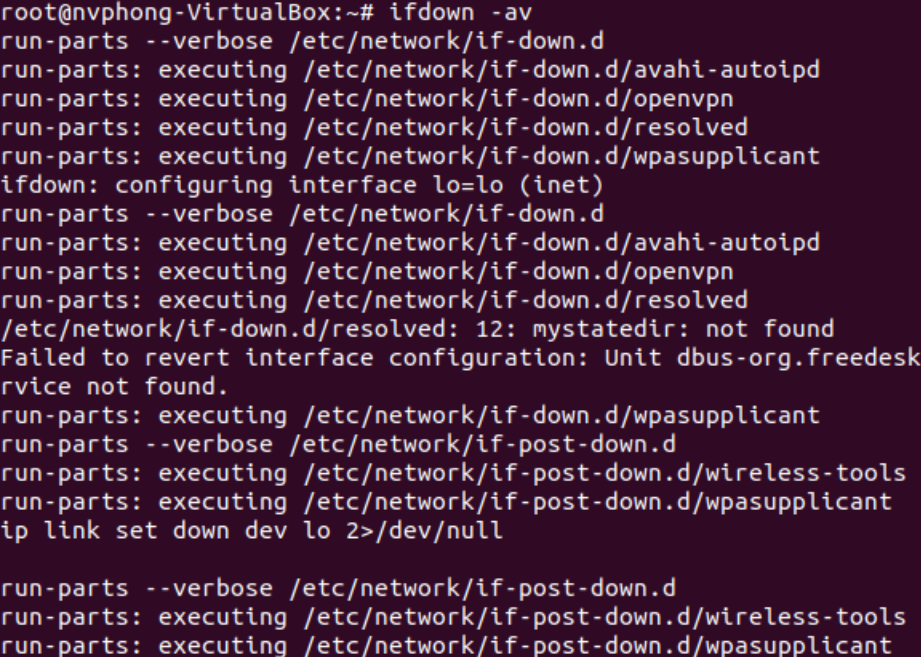

# ***Tìm hiểu `net plan`***

- Tệp cấu hình mặc định của Netplan nằm trong thư mục `/etc/netplan`.Có thể thấy rằng bằng cách sử dụng lệnh sau:`ls /etc/netplan/`

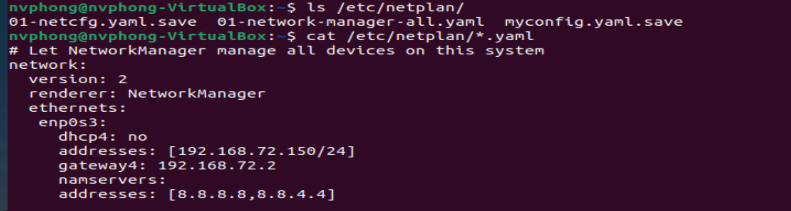

- Để xem nội dung của tệp cấu hình mạng Netplan,chạy lệnh sau: `cat /etc/netplan/*.yaml`
  
- Để chỉnh sửa tệp cấu hình: `sudo nano /etc/netplan/*.yaml`

  Cấu hình địa chỉ IP tĩnh: 
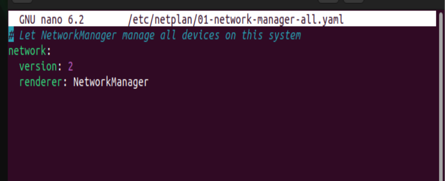
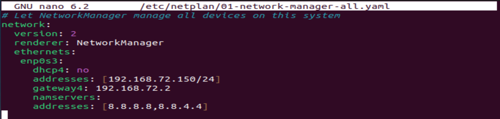

