# ***Cài đặt Ubuntu***
## ***Cài đặt Ubuntu 22.04***
**1. Download file iso để cài đặt**

**2. Truy cập vào phần mềm VirtualBox 
để tạo ra một máy ảo mới**
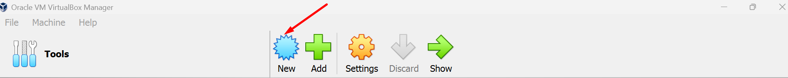
**3. Chọn file iso và cài đặt**
   
**4. Tạo tên tài khoản**
   
**5. Chọn dung lượng memory và CPU**
     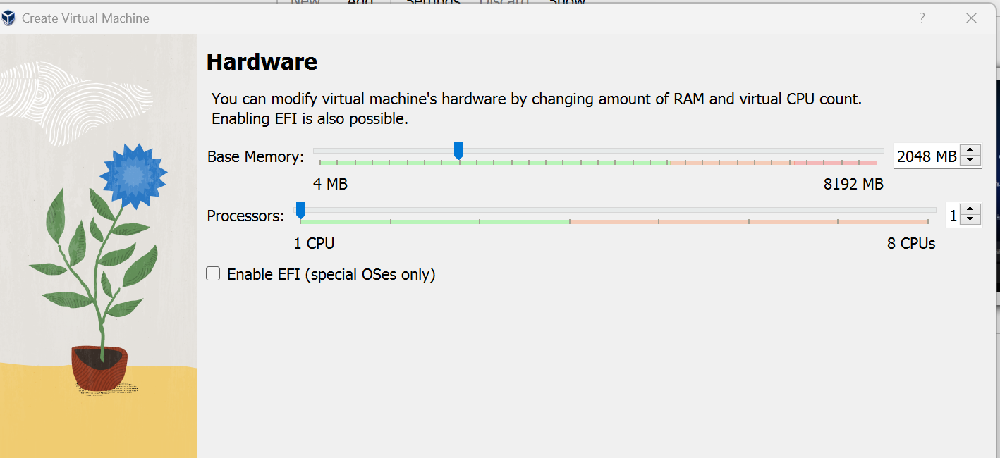
    
**6. Chọn `finish` để tạo**
    
**7. Chọn ngôn ngữ cho hệ điều hành. Ở 
đây chọn “English”**
    

**8. Cập nhật cài đặt. Chọn “Continue 
without updating”**
    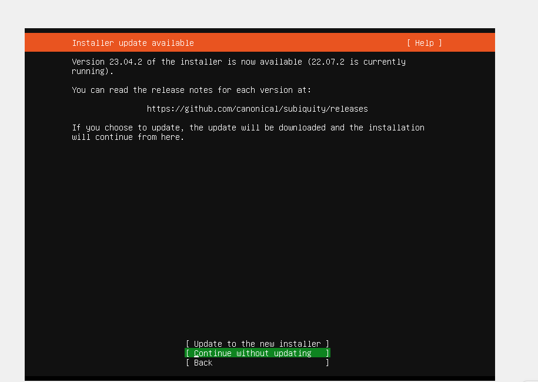

**9Tiếp theo nó sẽ hỏi bạn chọn 
Keyboard, tốt nhất là chọn English và 
nhấn Enter.**

    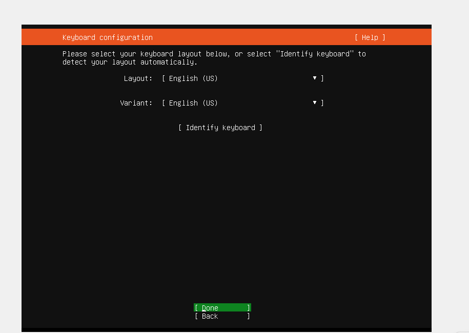

**10.Nếu máy tính của bạn đang kết nối 
vào Internet thì nó sẽ nhận địa chỉ IP 
từ máy chủ DHCP của bạn. Hãy nhấn Done 
để tiếp tục quá trình cài đặt.**
    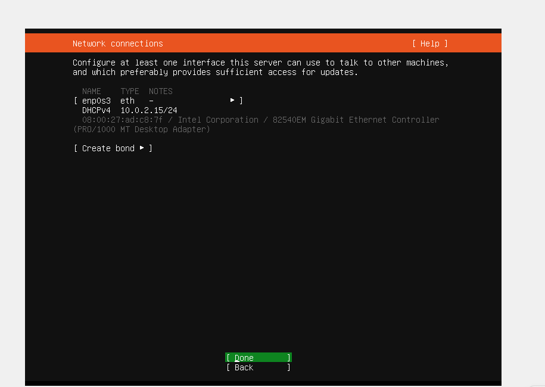

**11.Dựa vào thiết lập mạng internet 
của bạn: Nếu bạn cần một máy chủ proxy 
để kết nối với internet thì hãy nhập 
thông tin chi tiết của nó vào đây. Nếu 
không, hãy để trống và nhấn Done.**
 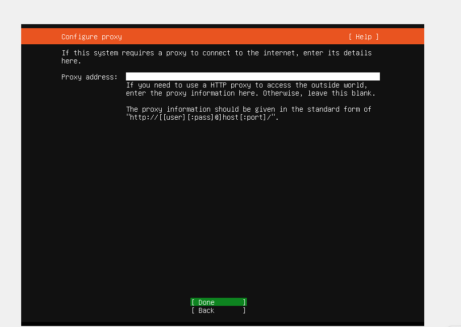

**12.Tiếp theo bạn cần cấu hình Ubuntu 
archive mirror, và thường nó sẽ chọn 
dựa vào quốc gia mà server bạn đang 
đặt. Như trong hình dưới đây là nó chọn 
từ US vì Server đặt ở US. Nhấn Done để 
tiếp tục.**
 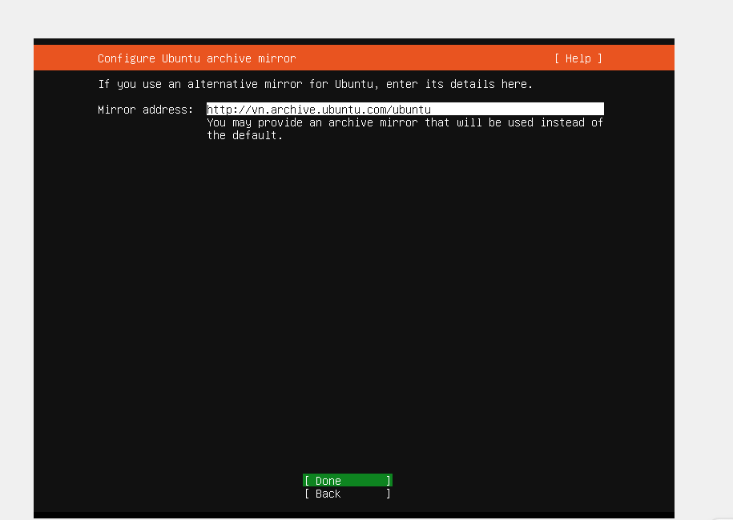

**13. Bây giờ là lúc để cấu hình phân 
vùng trên ổ cứng lưu trữ dữ liệu của 
bạn. Hãy thực hiện theo các bước như 
sau:**

- Chọn vào Use an entire disk
- Sau đó tích vào Set up this disk as 
an LVM group
 

Lúc này nó sẽ tạo một phân vùng gốc 
(root partition) với kích thước theo 
mặc định, bạn có thể chỉnh sửa kích 
thước của nó theo cách thủ công và cũng 
có thể đổi sang phân vùng khác.

 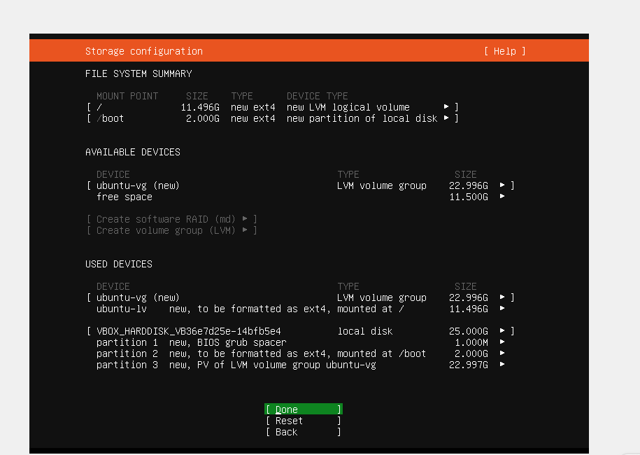
  **14. Bây giờ hãy nhập các thông tin 
cơ bản của bạn như: Tên của bạn, tên 
server, tên đăng nhập và mật khẩu. 
Sau đó chọn Done và nhấn Enter.**
   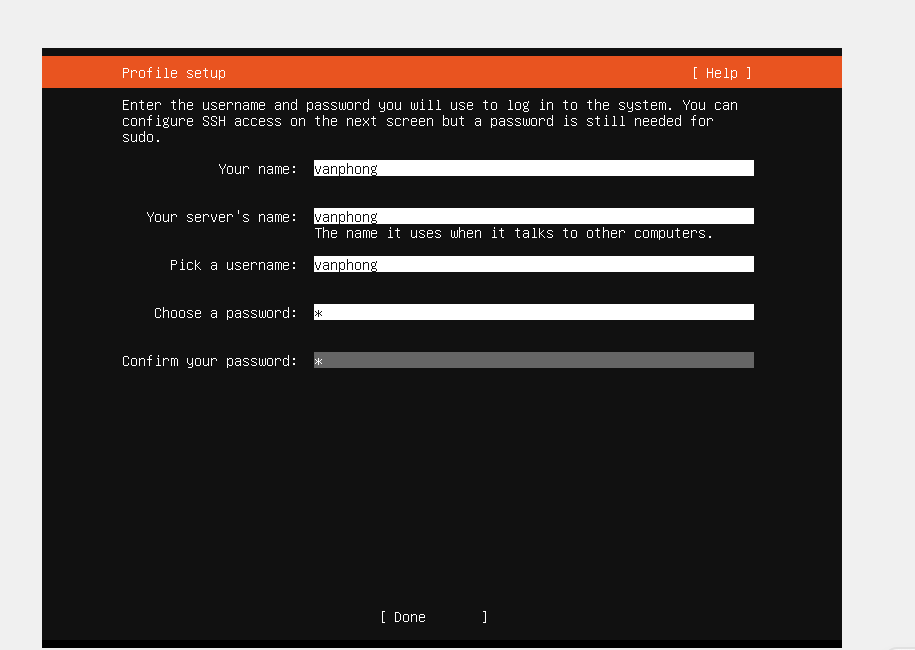
**15. Hệ thống sẽ hỏi bạn là cài đặt 
thêm OpenSSH package để sau này có thể 
truy cập remote đến server. Hãy sử dụng 
phím space để tick chọn, sau đó chọn 
Done và nhấn Enter.**

   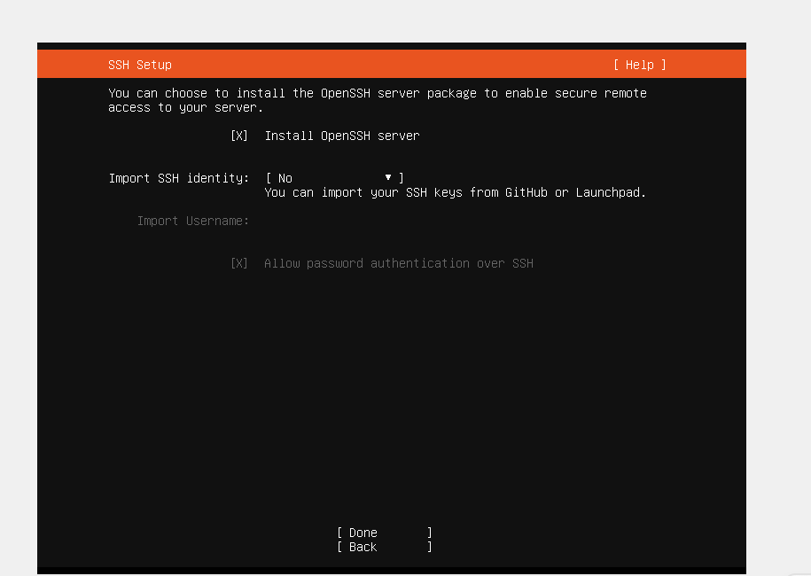
**16. Nếu bạn muốn cài đặt thêm snap 
nào thì hãy sử dụng phím space để chọn 
trong danh sách này, sau đó chọn Done 
và nhấn Enter.**
   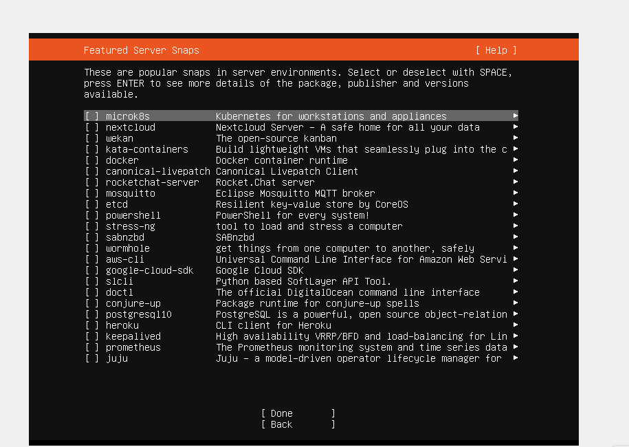
**17. Quá trình cài đặt đã bắt đầu**
   
**18. Sau khi nó báo cài xong bạn hãy 
nhấn Enter để reboot lại server.**
   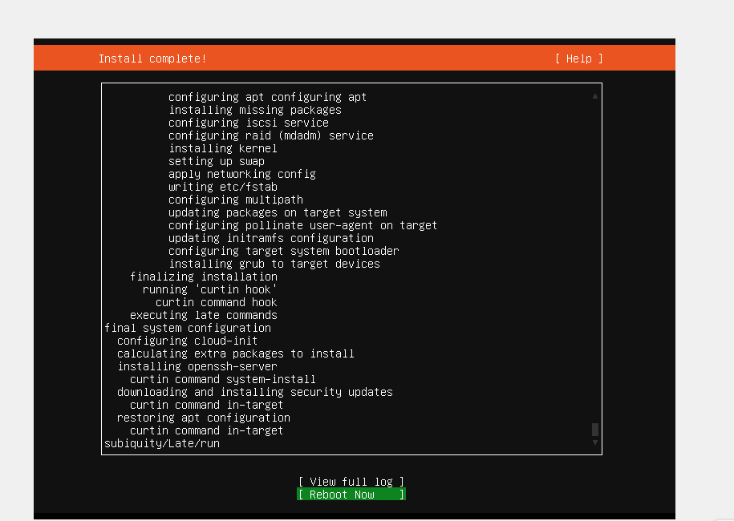
**19. Vậy là quá trình cài đặt đã hoàn 
tất**
   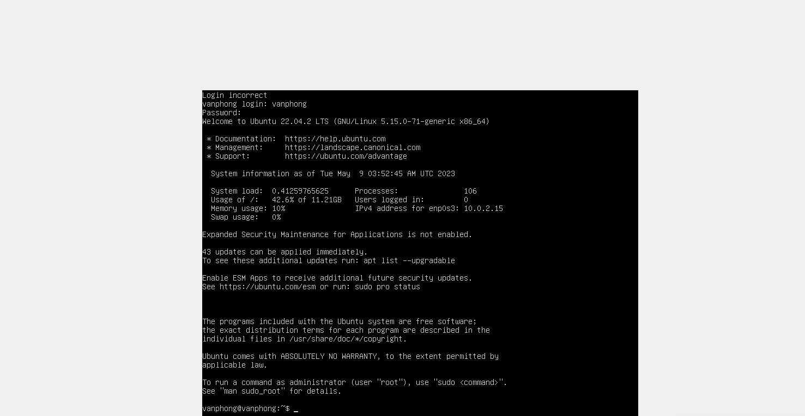

