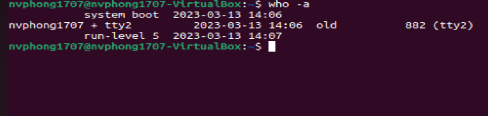
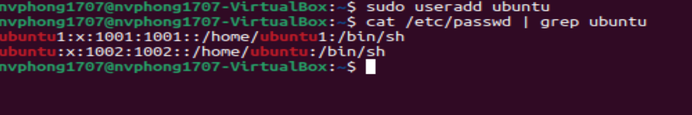
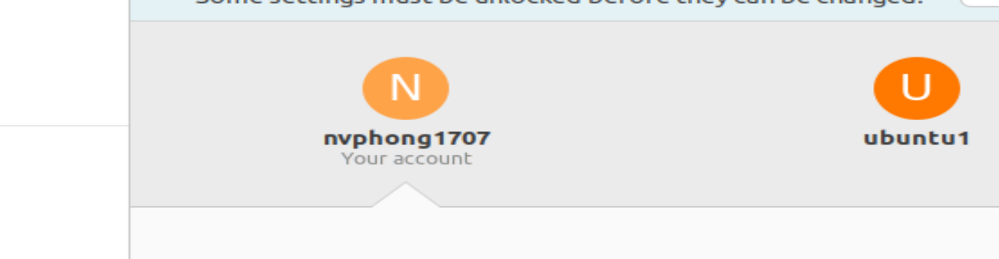

# ***Khái niệm***
- User (người dùng) trong Linux là một tài khoản được đăng ký và có quyền truy cập vào các tài nguyên của hệ thống, chẳng hạn như tệp tin, thư mục hoặc các dịch vụ. Mỗi user trong hệ thống Linux được định danh bằng một User ID (UID) duy nhất và có thể thuộc vào một hoặc nhiều nhóm (group).
- Group (nhóm) trong Linux là một tập hợp các user được phân loại theo một tiêu chí nhất định, chẳng hạn như cùng một phòng ban, cùng một dự án hoặc cùng một quyền truy cập vào một tài nguyên nào đó. Mỗi group trong hệ thống Linux được định danh bằng một Group ID (GID) duy nhất và có thể được phân quyền truy cập vào các tài nguyên hệ thống như tệp tin và thư mục.

# ***Tìm hiểu về user và group***
- Linux là một hệ điều hành đa người dùng, trong đó nhiều người dùng có thể đăng nhập cùng một lúc. Lệnh `who` liệt kê những người dùng hiện đang đăng nhập. Để xác định người dùng hiện tại, hãy sử dụng `who -a`lệnh.
  - Lệnh "who" hiển thị danh sách các người dùng hiện đang đăng nhập vào hệ thống, bao gồm tên người dùng, thiết bị đang sử dụng, thời gian bắt đầu phiên làm việc, và địa chỉ IP của người dùng.
  

  -   Lệnh "who -a" hiển thị thông tin tương tự như "who", nhưng cũng bao gồm các thông tin bổ sung về quá trình đăng nhập của người dùng, bao gồm cả thời gian kết nối cuối cùng của người dùng, các thông tin về tiến trình đang chạy trên phiên làm việc của người dùng và thời gian đăng nhập trước đó (nếu có).
  
- Linux sử dụng các nhóm để tổ chức người dùng. Nhóm là tập hợp các tài khoản có quyền được chia sẻ nhất định. Kiểm soát tư cách thành viên nhóm được quản lý thông qua tệp `/etc/group`, tệp này hiển thị danh sách các nhóm và thành viên của chúng. Theo mặc định, mọi người dùng đều thuộc nhóm mặc định hoặc nhóm chính. Khi người dùng đăng nhập, tư cách thành viên nhóm được đặt cho nhóm chính của họ và tất cả các thành viên đều có cùng mức độ truy cập và đặc quyền. Quyền trên các tệp và thư mục khác nhau có thể được sửa đổi ở cấp độ nhóm.
- Tất cả người dùng Linux được chỉ định một ID người dùng duy nhất, chỉ là một số nguyên, cũng như một hoặc nhiều ID của nhóm, bao gồm một ID mặc định giống với ID người dùng.
- Các nhóm được sử dụng để thiết lập một nhóm người dùng có chung sở thích vì mục đích truy cập quyền, đặc quyền và cân nhắc bảo mật. Quyền truy cập vào các tệp và thiết bị được cấp trên cơ sở người dùng và nhóm mà họ thuộc về.
- Chỉ người dùng root mới có thể thêm và xóa người dùng và nhóm. Thêm người dùng mới được thực hiện bằng `useradd `lệnh
 

- xóa người dùng bằng lệnh `userdel`

- Lệnh `id`không có đối số cung cấp thông tin về người dùng hiện tại. Nếu được cung cấp tên của người dùng khác làm đối số, id sẽ báo cáo thông tin về người dùng khác đó.

- Sử dụng lệnh `passwd` để thay đổi mật khẩu cho người dùng mới

- Việc thêm một nhóm mới được thực hiện bằng lệnh `groupadd`

- Xóa một nhóm bằng `groupdel`

- Việc thêm người dùng vào một nhóm đã tồn tại được thực hiện bằng lệnh `usermod`

- Còn để xóa ta Sử dụng lệnh "deluser" để xóa người dùng khỏi nhóm:

k xóa được(thắc mắc)
- Lệnh này `groupmod`có thể được sử dụng để thay đổi các thuộc tính của nhóm như ID nhóm hoặc tên

# ***Sự khác nhau giữa người dùng thông thường và quản trị viên***
- Quyền hạn: Quản trị viên có quyền hạn cao hơn người dùng thông thường trong việc sửa đổi và quản lý hệ thống. Quản trị viên có thể thực hiện các thao tác như cài đặt phần mềm, xóa tệp tin hệ thống, cấu hình mạng và các tác vụ quản trị hệ thống khác, trong khi người dùng thông thường có thể sử dụng các ứng dụng và tệp tin của họ.

- Tác vụ có thể thực hiện: Người dùng thông thường thường chỉ có thể thực hiện các tác vụ mà họ có quyền hạn để làm, trong khi quản trị viên có thể thực hiện nhiều tác vụ khác nhau trên hệ thống, kể cả các tác vụ mà không phải là người dùng thông thường không có quyền hạn.

- Đăng nhập và truy cập vào hệ thống: Người dùng thông thường đăng nhập vào hệ thống bằng tên đăng nhập và mật khẩu của riêng họ. Trong khi đó, quản trị viên có thể đăng nhập vào hệ thống bằng một tên đăng nhập và mật khẩu riêng, và có quyền hạn đặc biệt để truy cập vào các tài nguyên quản trị hệ thống.

Tóm lại, người dùng thông thường và quản trị viên có những khác biệt về quyền hạn, tác vụ có thể thực hiện và phạm vi truy cập vào hệ thống.
# ***Tài liệu tham khảo***
<https://blog.learncodeonline.in/a-complete-guide-to-manage-users-and-groups-on-linux>

<https://support.maxserver.com/767313--H%C6%B0%E1%BB%9Bng-d%E1%BA%ABn-qu%E1%BA%A3n-l%C3%BD-User-v%C3%A0-Group-tr%C3%AAn-Linux>