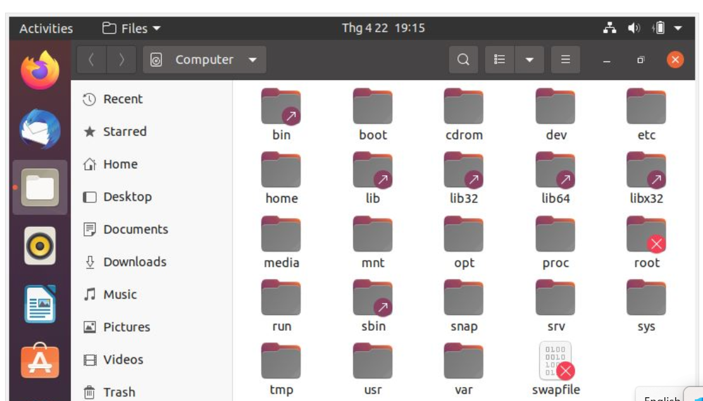
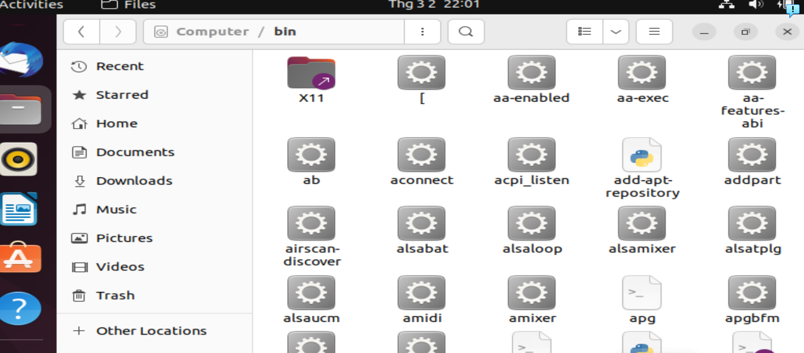
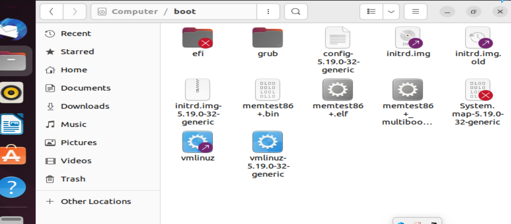
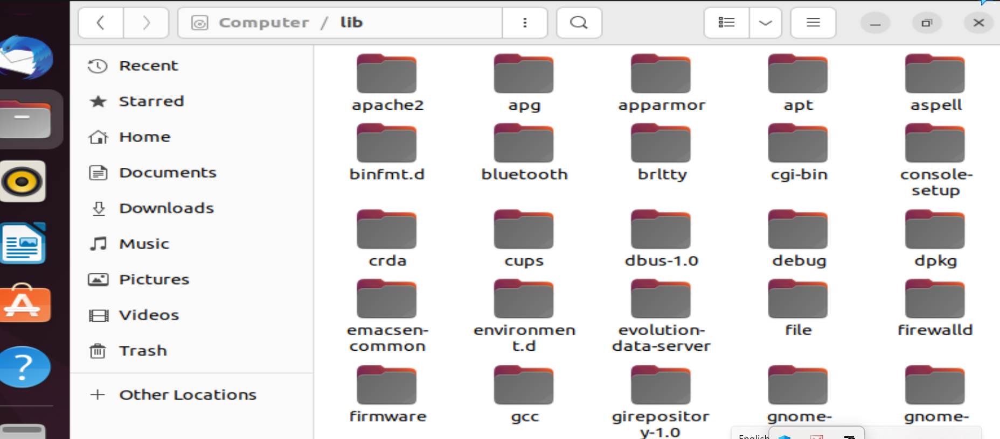
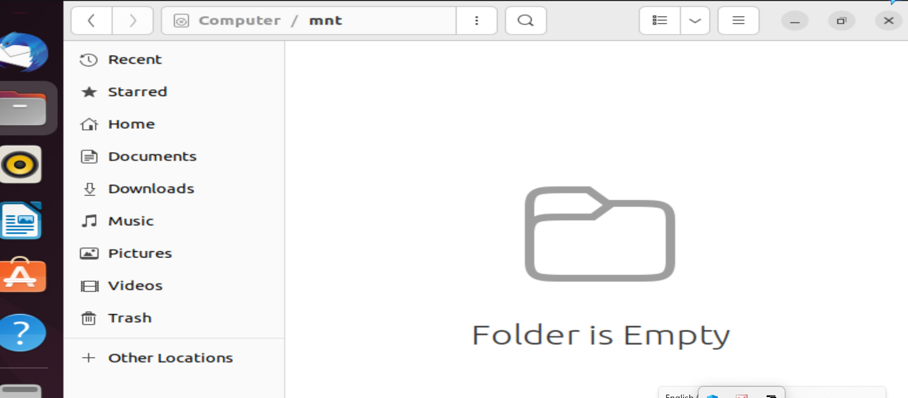
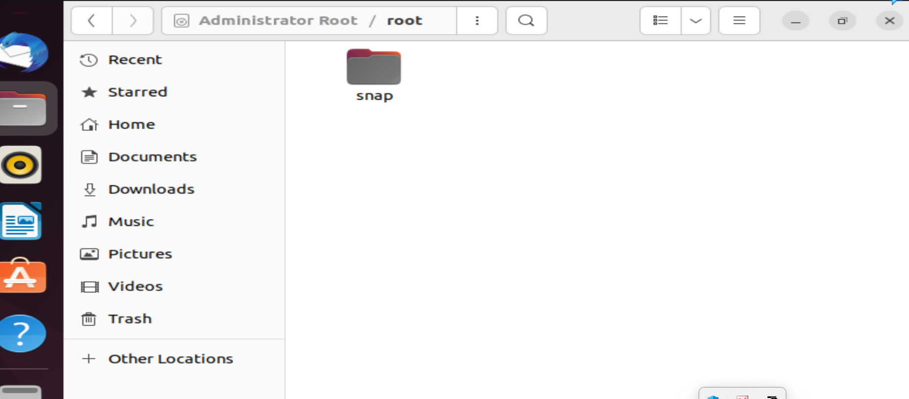
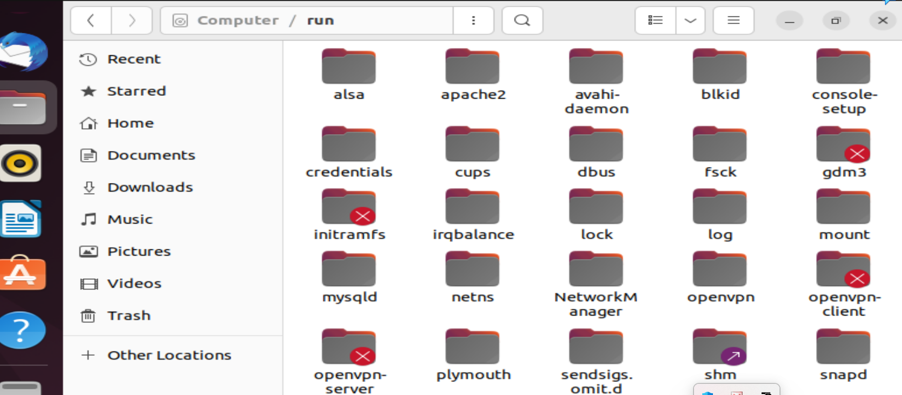
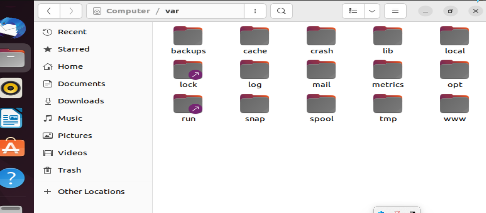

# ***Khái niệm***

Cấu trúc thư mục là cách sắp xếp các thư mục và tệp tin trong hệ thống tập tin của một hệ điều hành. Trong Linux, cấu trúc thư mục tuân thủ theo tiêu chuẩn Filesystem Hierarchy Standard (FHS), tiêu chuẩn này định nghĩa các thư mục hệ thống phải được đặt ở đâu và chức năng của chúng.

(FHS đặt ra một số quy tắc để giữ cho cấu trúc thư mục được sắp xếp một cách hợp lý và dễ dàng quản lý, giúp người dùng và các ứng dụng có thể dễ dàng tìm thấy các tệp tin và thư mục cần thiết.)
Cấu trúc thư mục Linux là một cấu trúc hệ thống tập tin tiêu chuẩn được sử dụng trong hệ điều hành Linux và các hệ thống tương tự Unix. Cấu trúc này được thiết kế để đơn giản hóa việc quản lý và sắp xếp các tập tin và thư mục trên hệ thống.

Cấu trúc thư mục trong Linux là danh sách các folder được xắp xếp bên trong hệ điều hành Linux, qua đó dữ liệu sẽ được lưu trữ đúng nơi vị trí của nó. Ví dụ các phần mềm được người dùng cài đặt thì sẽ lưu trong thư mục bin, cdrom sẽ là thư mục chứa thông tin về CD Room...
Mỗi hệ điều hành sẽ có một quy tắc riêng của nó và Linux cũng vậy. Với Windows thì bạn có thể tạo và sử dụng nhiều ổ đĩa cùng lúc như ổ C, ổ D, .. Còn Linux thì khác, khi được cài đặt thì nó chỉ sử dụng trên đúng ổ đĩa được cài đặt đó, và từ đó nó sẽ phân chia thành nhiều thư mục nhỏ khác.

# ***Cấu trúc thư mục***

Cấu trúc thư mục Linux bao gồm các thư mục sau:

- / : Thư mục gốc của hệ thống tập tin.

- /bin : Chứa các tập tin thực thi cần thiết để khởi động hệ thống và thực hiện các lệnh cơ bản.

- /boot : Chứa các tập tin cần thiết để khởi động hệ thống, bao gồm các tập tin hạt nhân và tập tin cấu hình grub.

- /dev : Chứa các tập tin thiết bị, bao gồm các tập tin thiết bị ổ đĩa, thiết bị âm thanh, thiết bị mạng, vv.

- /etc : Chứa các tập tin cấu hình hệ thống, bao gồm các tập tin cấu hình mạng, tài khoản người dùng và các dịch vụ hệ thống.

- /home : Chứa các thư mục người dùng cá nhân.

- /lib : Chứa các thư viện cần thiết cho các chương trình thực thi ở /bin và /sbin.

- /media : Chứa các thư mục để gắn kết các thiết bị lưu trữ tạm thời.

- /mnt : Chứa các thư mục để gắn kết các thiết bị lưu trữ tạm thời khác.

- /opt : Chứa các ứng dụng được cài đặt từ bên thứ ba.

- /proc : Chứa các tập tin hệ thống ảo liên quan đến quá trình hoạt động của hệ thống.

- /root : Thư mục cá nhân của người dùng root.

- /run : Chứa các tập tin và thư mục tạm thời liên quan đến quá trình khởi động hệ thống.

- /sbin : Chứa các tập tin thực thi cần thiết cho quản trị hệ thống.

- /srv : Chứa các dữ liệu được cung cấp bởi các dịch vụ trên hệ thống.

- /sys : Chứa các tập tin hệ thống liên quan đến phần cứng.

- /tmp : Chứa các tập tin tạm thời.

- /usr : Chứa các tập tin, thư mục và tài nguyên cần thiết cho các ứng dụng chạy trên hệ thống.

- /var : Chứa các tập tin thay đổi thường xuyên trong quá trình sử dụng hệ thống, bao gồm các tập tin log, tập tin ghi nhật ký, tập tin cơ sở dữ liệu, vv.

## ***Tại sao cần có cấu trúc thư mục***
Cấu trúc thư mục trong Linux là rất 
quan trọng vì nó giúp tổ chức và quản 
lý tập tin và thư mục trên hệ thống. 
Các cấu trúc thư mục giúp người dùng 
và hệ thống quản trị viên tìm kiếm, 
sắp xếp và truy cập tập tin và thư mục 
một cách dễ dàng và hiệu quả.

Cấu trúc thư mục Linux được thiết kế để phân chia các tài nguyên hệ thống thành các phân vùng độc lập, giúp cho việc quản lý, bảo trì và sao lưu hệ thống trở nên dễ dàng hơn. Đồng thời, cấu trúc thư mục Linux cũng hỗ trợ việc quản lý quyền truy cập và bảo mật thông qua việc sử dụng các quyền sở hữu, quyền truy cập và quyền thực thi trên các tập tin và thư mục trong hệ thống.

## ***Ưu điểm:***

- Tính tổ chức cao: Cấu trúc thư mục trong Linux rất có tổ chức và chuẩn mực. Điều này giúp người dùng dễ dàng tìm kiếm và quản lý các tập tin và thư mục.

- Tính bảo mật cao: Linux có cấu trúc thư mục với quyền truy cập và kiểm soát quyền truy cập tệp tin và thư mục rất chặt chẽ. Người dùng có thể định cấu hình các quyền truy cập cho từng tệp tin và thư mục.

- Tính đa nền tảng: Cấu trúc thư mục Linux được thiết kế để hoạt động trên nhiều nền tảng và kiến trúc khác nhau.

- Dễ dàng quản lý: Cấu trúc thư mục Linux rất dễ dàng để quản lý bằng cách sử dụng các lệnh dòng lệnh.

## ***Nhược điểm:***

- Hạn chế truy cập: Cấu trúc thư mục Linux có thể khiến việc truy cập đến một số tập tin và thư mục khó khăn đối với người dùng mới.

- Khó khăn trong việc di chuyển: Khi sử dụng các câu lệnh di chuyển hoặc sao chép tệp tin và thư mục trong Linux, người dùng có thể gặp phải khó khăn trong việc di chuyển giữa các thư mục.

- Phức tạp đối với người dùng mới: Với người dùng mới, cấu trúc thư mục Linux có thể khó hiểu và làm cho việc sử dụng hệ điều hành này trở nên phức tạp hơn.

# ***Tài liệu tham khảo***
<https://freetuts.net/cau-truc-thu-muc-trong-linux-3632.html>
<https://quantrimang.com/cong-nghe/cau-truc-cay-thu-muc-trong-linux-84056>
<https://blog.mypapit.net/2012/08/the-linux-file-system-hierarchy-graphical-guide.html>
<https://fossbytes.com/linux-lexicon-linux-directory-structure/>
