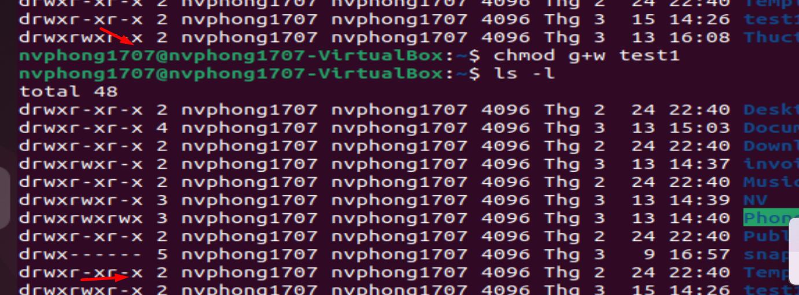
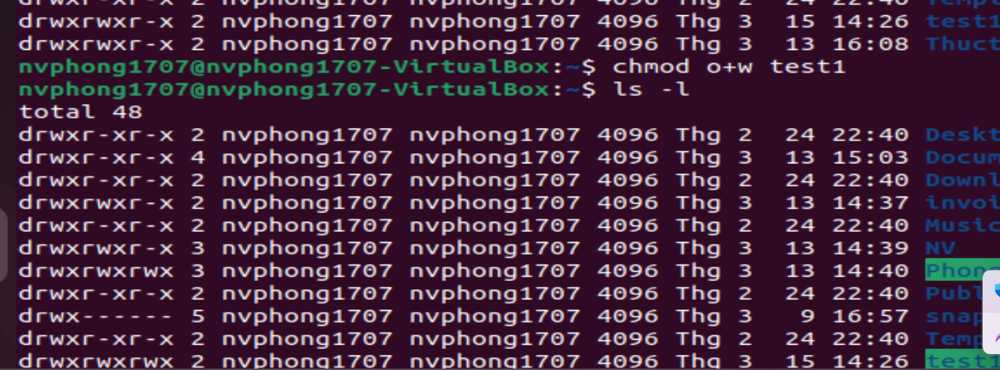
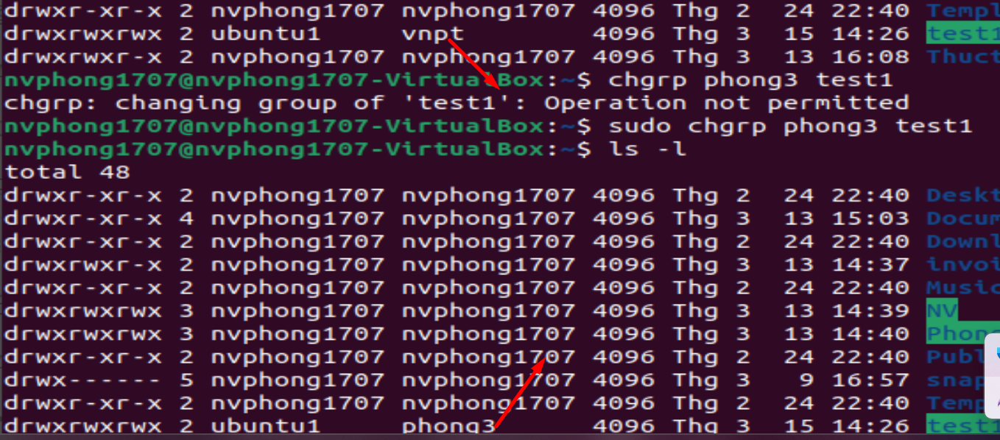

# ***Khái niệm***

  Phân quyền trên Linux là quá trình xác định quyền truy cập của các tài khoản người dùng và nhóm người dùng vào các tệp tin và thư mục trên hệ thống. Linux sử dụng một hệ thống quyền truy cập được quản lý bởi kernel. Có 3 loại quyền trong Linux là: read (đọc), write (ghi), và execute (thực thi). Các quyền này được phân chia cho 3 nhóm người dùng: owner (chủ sở hữu), group (nhóm) và others (người khác).
# ***Phân loại***
Mỗi file trong Linux có ba loại quyền đó là quyền đọc (r), quyền ghi (w), và quyền thực thi (x) và ba nhóm quyền được phân chia như sau:

## ***Quyền của chủ sở hữu (owner)***
 - Những người dùng nằm trong nhóm chủ sở hữu của file. Quyền này được đặt bằng cách sử dụng lệnh `chmod` với quyền `u`.

## ***Quyền của nhóm (group)***
Những người dùng nằm trong nhóm nhóm của file. Quyền này được đặt bằng cách sử dụng lệnh `chmod` với quyền `g`.

## ***Quyền của người khác (others)***
 Những người dùng không nằm trong nhóm chủ sở hữu và nhóm của file. Quyền này được đặt bằng cách sử dụng lệnh `chmod` với quyền `o`.
 

 # ***Cách thực hiện***
 ## ***Cách 1***
Các quyền được hiển thị thông qua 9 ký tự được phân tách bởi dấu gạch ngang, theo thứ tự là `rwx` cho chủ sở hữu, `rwx` cho nhóm và `rwx` cho người khác.

Ví dụ: `rwxr-xr--` có nghĩa là chủ sở hữu có quyền đọc, ghi và thực thi file, nhóm có quyền đọc và thực thi, và người khác chỉ có quyền đọc.

Để thay đổi quyền của một file hoặc thư mục, ta sử dụng lệnh `chmod`. Ví dụ, để cấp quyền thực thi cho tất cả người dùng trên một file, ta có thể sử dụng lệnh chmod a+w filename.

## ***Cách 2***
Loại cú pháp này có thể khó gõ và khó nhớ, vì vậy người ta thường sử dụng cách viết tắt cho phép bạn đặt tất cả các quyền trong một bước. Điều này được thực hiện với một thuật toán đơn giản và một chữ số duy nhất đủ để chỉ định cả ba bit quyền cho mỗi thực thể. Chữ số này là tổng của:

- 4 nếu muốn có quyền đọc.
- 2 nếu muốn có quyền ghi.
- 1 nếu muốn có quyền thực thi.
Do đó, 7 có nghĩa là đọc+ghi+thực thi, 6 có nghĩa là đọc+ghi và 5 có nghĩa là đọc+thực thi.

Ví dụ, chmod 754 filename có nghĩa là chủ sở hữu có quyền rwx (7), nhóm có quyền r-x (5), và người khác chỉ có quyền đọc (4).

Việc hiểu và quản lý file permissions là rất quan trọng trong Linux vì nó giúp đảm bảo bảo mật hệ thống và ngăn chặn người dùng không có quyền truy cập vào các file hay thư mục mà họ không được phép.
# ***Các lệnh thực hiện khác***
Ngoài ra, có một số lệnh hữu ích khác liên quan đến file permissions trong Linux như:

- ls -l: Hiển thị thông tin chi tiết về các file và thư mục, bao gồm quyền truy cập và chủ sở hữu.
- chown: Thay đổi chủ sở hữu của file hoặc thư mục.
*cú pháp*:`chown [chủ sở hữu]:[nhóm sở hữu] [tệp/tên thư mục]`

- chgrp: Thay đổi nhóm sở hữu của file hoặc thư mục.
*cú pháp*: `chgrp [options] [group] [file/directory]`

