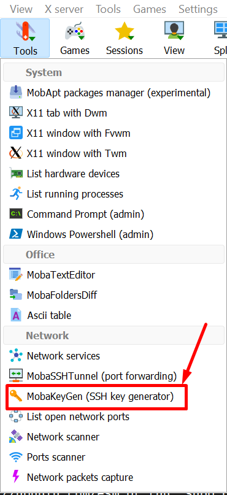
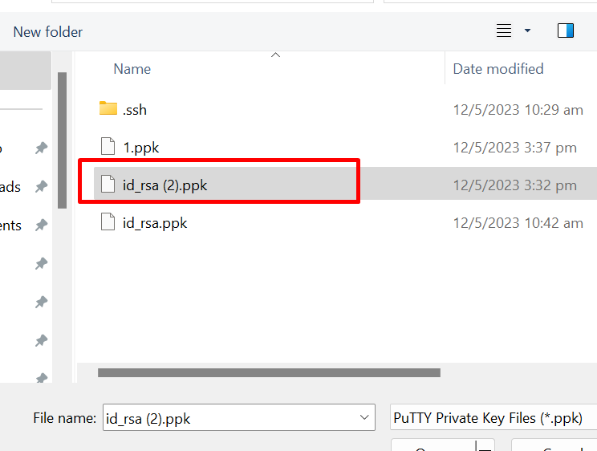
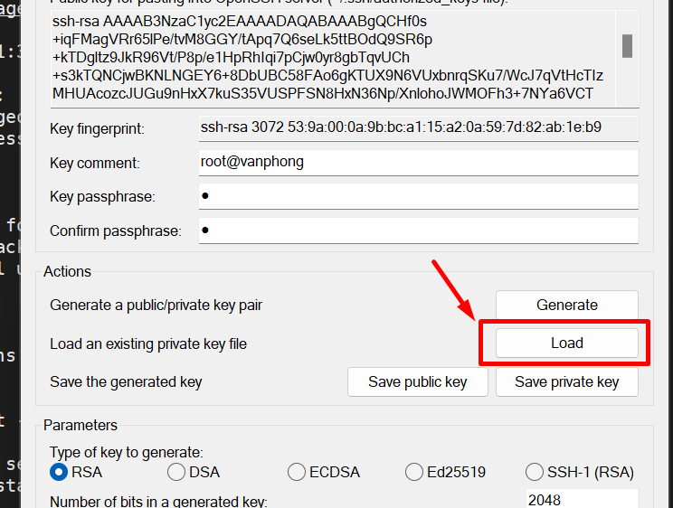
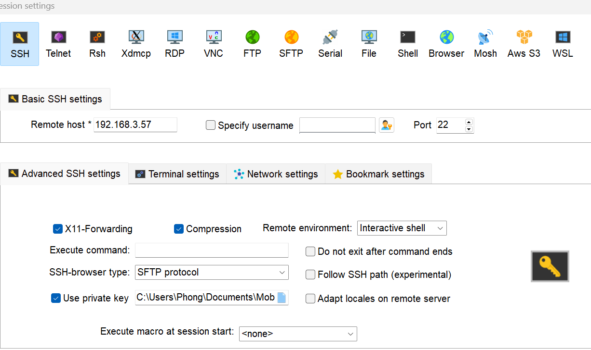
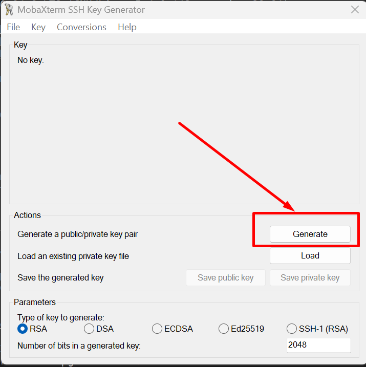
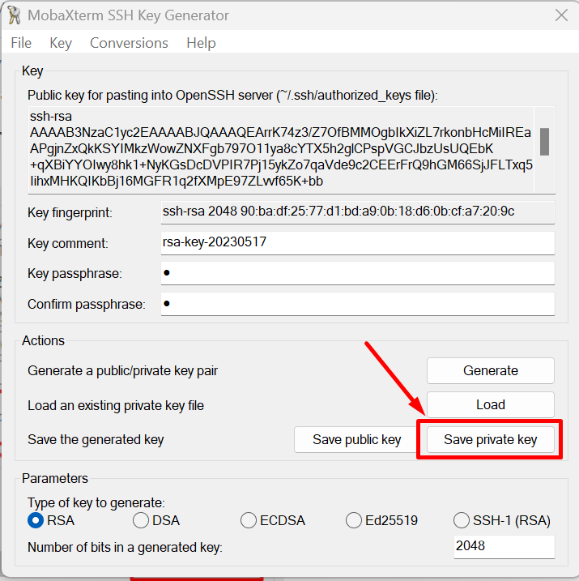
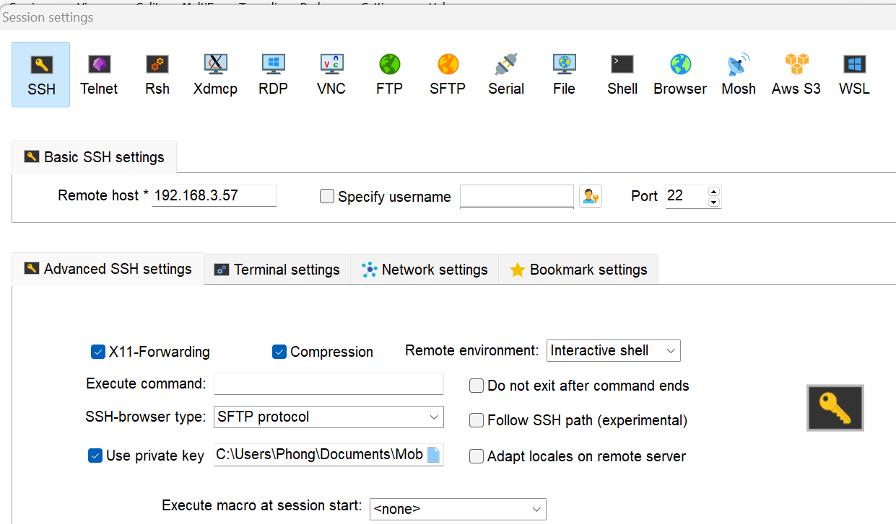

 

 # ***SSH bằng mật khẩu***
 ```
 ssh vanphong07@192.168.3.57
Warning: Permanently added '192.168.3.57' (RSA) to the list of known hosts.
vanphong07@192.168.3.57's password:
Welcome to Ubuntu 20.04.6 LTS (GNU/Linux 5.4.0-148-generic x86_64)

 * Documentation:  https://help.ubuntu.com
 * Management:     https://landscape.canonical.com
 * Support:        https://ubuntu.com/advantage

  System information as of Wed 17 May 2023 01:38:57 AM UTC

  System load:  0.58               Processes:               124
  Usage of /:   41.0% of 11.21GB   Users logged in:         1
  Memory usage: 12%                IPv4 address for enp0s3: 192.168.3.57
  Swap usage:   0%


 * Introducing Expanded Security Maintenance for Applications.
   Receive updates to over 25,000 software packages with your
   Ubuntu Pro subscription. Free for personal use.

     https://ubuntu.com/pro

Expanded Security Maintenance for Applications is not enabled.

19 updates can be applied immediately.
To see these additional updates run: apt list --upgradable

Enable ESM Apps to receive additional future security updates.
See https://ubuntu.com/esm or run: sudo pro status

New release '22.04.2 LTS' available.
Run 'do-release-upgrade' to upgrade to it.
```
# ***SSH bằng keypair***
## ***1. Tạo khóa trên server***
### ***Phía server***
- Tạo 1 cặp ssh keys
    ```
    ssh-keygen -t rsa
    ```
- Chọn nơi lưu key: (ở đây, ta sẽ để ở thư mục home của root `/root/.ssh/id_rsa`)
    - Keys được tạo sẽ được lưu tại thư mục của user tạo keys. (**Ví dụ**: tạo keys bằng tài khoản `root` thì keys sẽ được lưu tại `/root/tên_file`)
    - Gõ ENTER để lưu cặp key vào thư mục con .ssh/ nằm trong thự mục home của user hiện hành 


- Đây là tùy chọn thêm 1 chuỗi mật khẩu , được khuyến nghị để tăng tính bảo mật . Nếu nhập chuỗi passphrase này , bạn sẽ phải gõ thêm chúng bất kỳ lúc nào sử dụng key ( chỉ trừ khi sử dụng phần mềm để SSH đã lưu trữ passphrase ) . Nếu không muốn sử dụng passphrase , có thể ENTER để bỏ qua.

- Phân quyền cho cặp key.
    - **Lưu ý**: nếu bạn không chỉnh sửa cấu hình ssh thì bạn phải chuyển public keys tới thư mục mặc định (`~/.ssh/authorized_keys`) thì server mới có thể xác nhận.
    ```
    mv /root/.ssh/id_rsa.pub /root/.ssh/authorized_keys

    chmod 600 /root/.ssh/authorized_keys

    chmod 700 .ssh
    ```

- Cấu hình file `/etc/ssh/sshd_config` để khai báo thư mục đặt key, cũng như cho phép user `root` login.
    ```
    vi /etc/ssh/sshd_config
    ```


- Restart service ssh
    ```
    systemctl restart sshd
    ```

### Phía Client
#### 1. Window
Nếu bạn sử dụng Windows để SSH đến, tiến hành copy file private key ra máy và load bằng PuTTY hoặc MobaXterm. Ở đây mình dùng MobaXterm để load private key.

- Trên MobaXterm, ta vào **Tools** -> **MobaKeyGen**
    

- Chọn file private key

    
    


- Sau đó, lưu lại dưới dạng `ppk`
    
    

- SSH vào server :

    
## ***2. Tạo khóa trên Client***
### ***Phía Client***
#### ***1. Window***

- Nếu bạn dùng Windows, có thể dùng PuTTY hoặc MobaXterm để gen ssh keys. Ở đây mình dùng MobaXterm. Chọn loại key là RSA và click generate.

    

- Di chuột liên tục tại khoảng trống
    


- Copy toàn bộ nội dung trong ô “*Public key for pasting into OpenSSH authorized_keys file:*” và lưu lại dưới tên `authorized_keys` rồi gửi lên Server. Đây là Public Key dành riêng cho OpenSSH. Nút “**Save public key**” sẽ cho một Public Key dạng khác, ta không cần quan tâm đến nút này.

    


- Nhập passphrase và chọn **Save Private key**. Việc tạo bộ khóa hoàn tất.
       


- Đăng nhập, bạn mở session mới, nhập địa chỉ ssh server, chọn **Advanced SSH settings** -> **Use private key** rồi chọn tới `private key` đã save.
      


