# **Tài liệu đóng Image CentOS8**

# **Phần I. Khởi tạo Host**

## Bước 1: Trên KVM host tạo máy ảo CentOS7

1. Khởi tạo ổ cứng sử dụng cho máy ảo

Chọn cụm **KVM6818**

<div style="text-align:center"></div>

Trong giao diện của **KVM6818** chọn **Storages**  -> cụm **kvm**

<div style="text-align:center">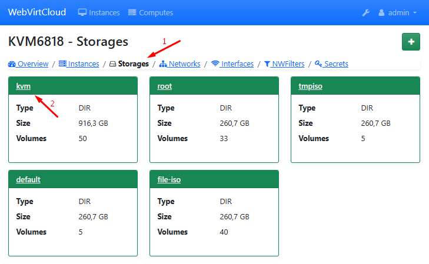</div>

Trong giao diện của **Storage: kvm** chọn vào dấu **+** để tạo **Volume**, điền các thông số như Name, Format (Để qcow2), Size (Để Volume nhỏ, khi đầy sẽ tự mở rộng thêm, tránh lãng phí tài nguyên) (Đơn vị: Gb)

<div style="text-align:center">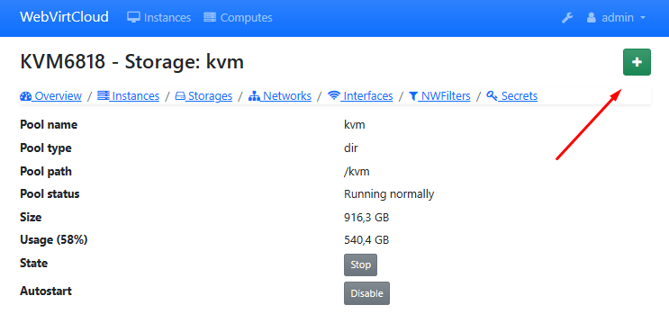</div>
<div style="text-align:center">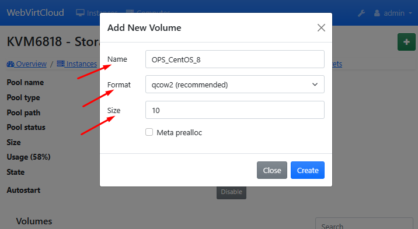</div>

Volumes sau khi tạo sẽ hiện ngay ở bảng bên dưới

<div style="text-align:center">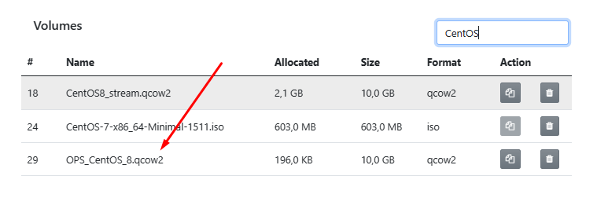</div>

2. Khởi tạo VM 

Tiếp tục chọn **Instances** và nhấn vào **+** để tạo máy ảo

<div style="text-align:center">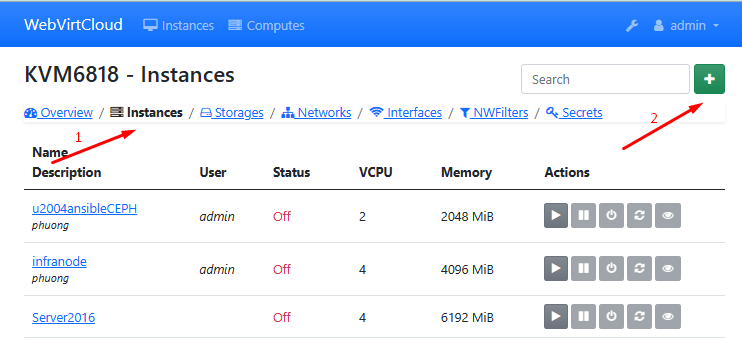</div>

Trong phần thiết lập máy ảo mới, chọn các thông số như hình 
<div style="text-align:center">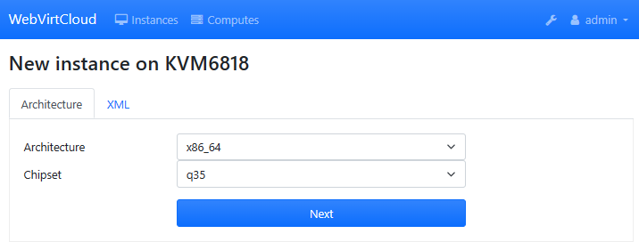</div>

Lưu ý: Vì chạy mỗi console nên **VCPU** chỉ cần ít (1 hoặc 2), **RAM** (2024 hoặc 4096 ) (Định dạng Mb), **HDD** chọn đúng với ổ cứng phần 1 chọn, **Add image** là tên Volume tạo ở phần 1, **Network** add VLAN tương ứng

Điền xong nhấn **Create**

<div style="text-align:center">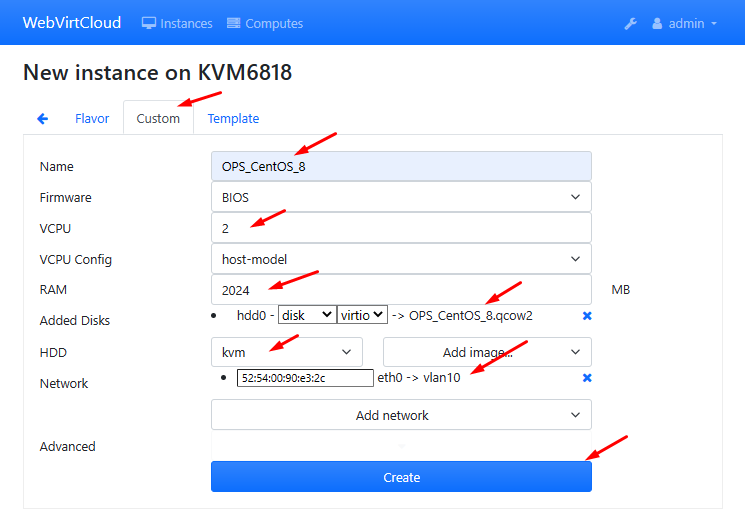</div>

Trong giao diện của Instence mới tạo

Vào phần **Setting** -> **Disk** -> Chọn file iso mới nhất được cập nhật (Nếu không có file iso mới nhất thì tải) -> Nhấn **Mount**

<div style="text-align:center">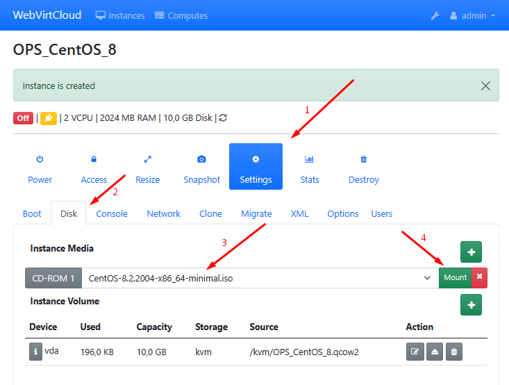</div>

Sang phần **Boot** chỉnh lại thứ tự `1:sda`, `2:vda` -> **Apply**

<div style="text-align:center">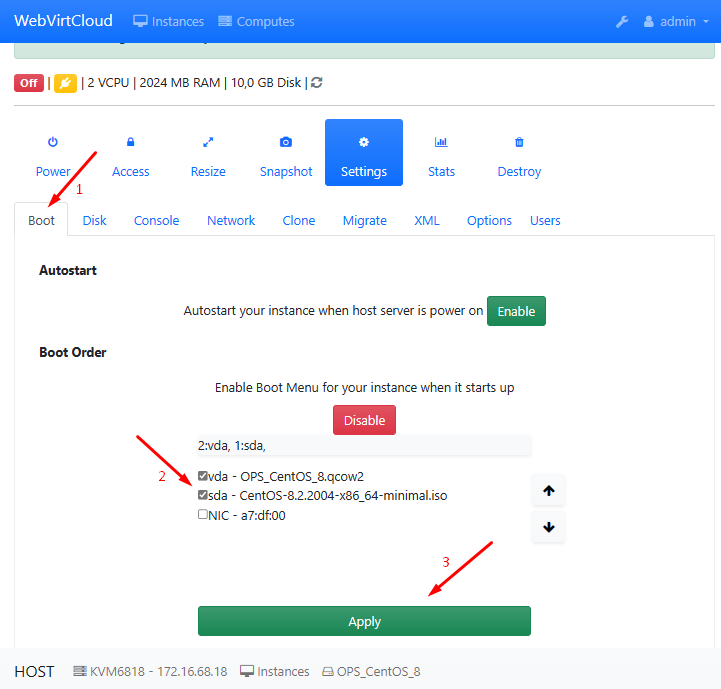</div>

Chỉnh sửa file **XML VM** 

Lưu ý:

Chỉnh sửa file .xml của máy ảo, bổ sung thêm channel trong (để máy host giao tiếp với máy ảo sử dụng qemu-guest-agent), sau đó save lại

Truy cập Settings > XML > EDIT SETTINGS

<div style="text-align:center">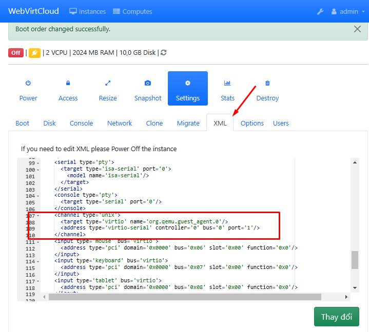</div>

Nếu đã tồn tại channel đổi port channel này về port='2' và add channel bình thường

Định dạng

```sh
<devices>
<channel type='unix'>
    <target type='virtio' name='org.qemu.guest_agent.0'/>
    <address type='virtio-serial' controller='0' bus='0' port='1'/>
</channel>
</devices>
```
Tiếp tục vào **Access** chọn **Console** để vào CentOS8
<div style="text-align:center">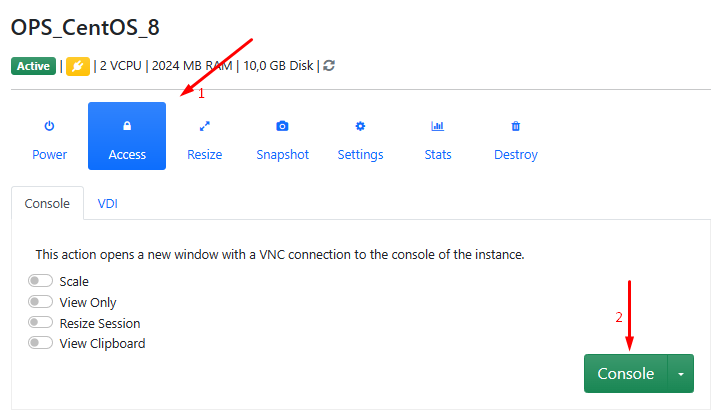</div>

# **Phần II: Setup môi trường CentOS8**

1. Cấu hình và cài đặt các gói

Cài đặt `epel-release` (Extra Packages for Enterprise Linux (EPEL), chứa các gói phần mềm bổ sung không được bao gồm trong kho lưu trữ mặc định) và update

```sh
yum install epel-release -y
yum update -y
yum install -y wget
sudo yum  install zip unzip -y
```
[Lỗi Failed to download metadata for repo ‘AppStream’ CentOS](https://kb.pavietnam.vn/xu-ly-loi-khi-yum-tren-centos-8-failed-to-download-metadata-for-repo-appstream-centos.html)

2. Disable firewalld, SElinux

Giúp đơn giản hóa quá trình đóng image

```sh
systemctl disable firewalld
systemctl stop firewalld

sed -i 's/SELINUX=enforcing/SELINUX=disabled/g' /etc/sysconfig/selinux
sed -i 's/SELINUX=permissive/SELINUX=disabled/g' /etc/sysconfig/selinux
sed -i 's/SELINUX=enforcing/SELINUX=disabled/g' /etc/selinux/config
sed -i 's/SELINUX=permissive/SELINUX=disabled/g' /etc/selinux/config
```

Reboot kiểm tra lại firewall và SElinux

3. Cấu hình SSH

```sh
sed -i 's/#ListenAddress 0.0.0.0/ListenAddress 0.0.0.0/g' /etc/ssh/sshd_config
#Cho phép ssh lắng nghe kết nối đến bất kỳ địa chỉ ip nào trên hệ thống 
sed -i 's/#PermitRootLogin yes/PermitRootLogin yes/g' /etc/ssh/sshd_config
#Cho phép người dùng đăng nhập vào hệ thống bằng tài khaorn root thông qua ssh 
systemctl restart sshd
```

4. Điều chỉnh timezone

```sh
timedatectl set-timezone Asia/Ho_Chi_Minh
```

5. Cài đặt Chronyd

Dịch vụ quản lý thời gian trong linux, được sử dụng để đồng bộ hóa thời gian trên hệ thống
```sh
yum install chrony -y
sed -i 's|server 1.vn.pool.ntp.org iburst|server 162.159.200.123 iburst|g' /etc/chrony.conf
systemctl enable --now chronyd 
hwclock --systohc #đồng bộ thời gian của hệ thống với tgian của Chrony
```
6. Cấu hình console và network

Để kích hoạt kết nối console-log trong Nova, bạn cần thay đổi tùy chọn của GRUB_CMDLINE_LINUX
```sh
sed -i 's/GRUB_CMDLINE_LINUX="crashkernel=auto rhgb quiet"/GRUB_CMDLINE_LINUX="crashkernel=auto console=tty0 console=ttyS0,115200n8"/g' /etc/default/grub
grub2-mkconfig -o /boot/grub2/grub.cfg
```
> Trong đó, `console=tty0` và `console=ttyS0,115200n8` là các tùy chọn để cho phép kết nối console thông qua cổng COM. Tùy chọn này sẽ cho phép bạn truy cập vào console của máy ảo khi sử dụng lệnh `nova console-log`


- Disable Default routing
```sh
echo "NOZEROCONF=yes" >> /etc/sysconfig/network
```
> *disable default routing, ta sẽ tạm thời tắt các kết nối mạng mặc định và chỉ cho phép các kết nối cục bộ. Việc này sẽ giúp đảm bảo rằng hệ thống sẽ không gửi bất kỳ gói tin nào ra ngoài mạng trong quá trình đóng images, đồng thời tăng tốc độ đóng images và giảm tải lưu lượng mạng.*
- Xóa thông tin card mạng
```sh
rm -f /etc/sysconfig/network-scripts/ifcfg-eth0
```
> *như trên*

- Tự động nhận diện và cấu hình đầy đủ NIC được gắn vào
```sh
cat << EOF >> /etc/rc.local
for iface in \$(ip -o link | cut -d: -f2 | tr -d ' ' | grep ^eth)
do
   test -f /etc/sysconfig/network-scripts/ifcfg-\$iface
   if [ \$? -ne 0 ]
   then
       touch /etc/sysconfig/network-scripts/ifcfg-\$iface
       echo -e "DEVICE=\$iface\nBOOTPROTO=dhcp\nONBOOT=yes\nIPV6INIT=yes\nIPV6_AUTOCONF=yes" > /etc/sysconfig/network-scripts/ifcfg-\$iface
       ifup \$iface
   fi
   ip -6 route add ::/0 dev \$iface metric 1
done
EOF
```
- Thêm quyền thực thi cho file `/etc/rc.local`
```sh
chmod +x /etc/rc.local
```
> *Việc thêm quyền thực thi cho file /etc/rc.local giúp kernel có thể thực thi file này sau khi khởi động hệ thống. Nếu không có quyền thực thi, kernel sẽ bỏ qua file này và không thực thi các lệnh trong đó*

- Xóa file hostname
```sh
rm -f /etc/hostname
```
- Chỉnh sửa nameserver tròn file `/etc/resolv.conf`

7.Tạo snapshot begin

# **Phần III: Cài đăth một số dịch vụ cần thiết cho Template**

- Cài đặt acpid cho phép hypervisor có thể reboot hoặc shutdown instance 
```sh
yum install acpid -y
systemctl enable acpid
```
>*acpid là một hệ thống quản lý sự kiện ACPI (Advanced Configuration and Power Interface) trên Linux, cho phép hệ thống có thể nhận được các tín hiệu ACPI từ máy chủ vật lý và thực hiện các hành động tương ứng, chẳng hạn như tắt hoặc khởi động lại hệ thống trong trường hợp gặp sự cố*
- Cài đặt **qemu guest agent**, kích hoạt và khởi động qemu-guest-agent service
```sh
yum install -y qemu-guest-agent
systemctl enable qemu-guest-agent.service
systemctl start qemu-guest-agent.service
```

**Lưu ý**

- Để sử sụng qemu-agent, phiên bản selinux phải > 3.12
```sh
rpm -qa | grep -i selinux-policy
```
- Để có thể thay đổi password máy ảo thì phiên bản qemu-guest-agent phải >= 2.5.0
```sh
qemu-ga --version
```
- Cài đặt CMDlog
```sh
curl -Lso- https://raw.githubusercontent.com/thang290298/Ghi-chep-Logs/main/CMD-Logs/cmdlog.sh | bash
```

Kiểm tra lỗ hổng CVE-2021 và dọn dẹp

```sh
sudoedit -s /
```
- Kết quả trả ra như sau:
```sh
TH1: "sudoedit: /: not a regular file" -> sudo có lỗ hổng
TH2:  "usage: sudoedit [-AknS] [-r role] [-t type] [-C num] [-g group] [-h host] [-p prompt] [-T timeout] [-u user] file" -> sudo đã được vá.
```
- Cài đặt cloud-init và cloud-utils
```sh
yum install -y cloud-init cloud-utils
```
> *Cloud-init là một công cụ cấu hình hệ thống tự động cho các instance cloud, cho phép tự động hóa quá trình cấu hình các thông tin cần thiết của hệ thống khi instance được tạo ra. Cloud-init giúp cho việc triển khai hệ thống nhanh hơn, giảm thiểu sự khác biệt giữa các hệ thống và giảm thiểu thời gian và công sức khi triển khai các instance cloud.*

> *Cloud-utils cung cấp các công cụ hữu ích cho việc quản lý cloud, bao gồm đọc thông tin cấu hình từ metadata của instance, tạo ra các thiết bị dựa trên các thông tin cấu hình và cung cấp các tùy chọn cho các file image được sử dụng để triển khai.*

Để máy ảo trên OpenStack có thể nhận được Cloud-init cần thay đổi cấu hình mặc định bằng cách sửa đổi file `/etc/cloud/cloud.cfg`

```sh
sed -i 's/disable_root: 1/disable_root: 0/g' /etc/cloud/cloud.cfg
#Cho phép đăng nhập vào tài khoản root bằng SSH
sed -i 's/ssh_pwauth:   0/ssh_pwauth:   1/g' /etc/cloud/cloud.cfg
#Cho phép đăng nhập bằng SSH sử dụng password
sed -i 's/name: centos/name: root/g' /etc/cloud/cloud.cfg
#Đổi tên user mặc định từ centos sang root
```

- Clean all
```sh
yum clean all
rm -f /var/log/wtmp /var/log/btmp
rm -f /root/.bash_history
> /var/log/cmdlog.log
history -c
```
> *Việc xóa các gói này giúp giảm dung lượng ổ cứng và đảm bảo tính nhất quán của images*

# **Phần III. Tối ưu và đẩy images

**Bước 1: Sử dụng lệnh virt-sysprep để xóa toàn bộ các thông tin máy ảo**

```sh
virt-sysprep -d OPS_CentOS_8
```

> *Khi sử dụng lệnh này, các thông tin định danh của máy ảo như hostname, địa chỉ IP, MAC address, SSH keys, user accounts, các lịch sử của các user, gói cài đặt, cấu hình, log và các thông tin khác sẽ được xóa bỏ*

> *Điều này giúp đảm bảo rằng image mới tạo ra sẽ có các thông tin mặc định và được cài đặt từ đầu, giảm thiểu các vấn đề phát sinh do các thông tin cũ còn tồn tại trên image mới.*

**Bước 2: Tối ưu kích thước image**

Giúp tăng hiệu suất và tiết kiêm tài nguyên
```sh
virt-sparsify --compress --convert qcow2 /kvm/OPS_CentOS_8.qcow2 OPS_CentOS_8
```
**Bước 3: Upload image lên glance và sử dụng**

- Convert image về định dạng raw
```sh
qemu-img convert -O raw OPS_CentOS_8 OPS_CentOS_8.raw
```
- Đẩy lên hệ thống và sử dụng
```sh
glance image-create --name OPS_CentOS_8 \
--file /root/OPS_CentOS_8.raw \
--disk-format raw \
--container-format bare \
--visibility=public \
--property hw_qemu_guest_agent=yes \
--min-disk 10 --min-ram 1024 --progress
```

**Bước 4: Nội dung Cloud-init**
```sh
#cloud-config
password: '{vps_password}'
chpasswd: { expire: False }
ssh_pwauth: True
```