# **Tài liệu đóng Image Windows Server 2019 Standrad**

# **Phần I: Khởi tạo Host Windows server 2019 standrad**

## Bước 1: Trên KVM host tạo máy ảo Win2019 standrad

1. Khởi tạo ổ cứng

Login vào Node KVM thực hiện lệnh tạo phân vùng Disk cho máy ảo
```sh
[root@kvmlab6818 ~]# qemu-img create -f qcow2 /kvm/OPS_Win2019_x64_standard.img 25G
Formatting '/kvm/OPS_Win2019_x64_standard.img', fmt=qcow2 cluster_size=65536 extended_l2=off compression_type=zlib size=26843545600 lazy_refcounts=off refcount_bits=16
```
2. Thực hiện khởi tạo VM

Trên host KVM, bật giao diện **virt-manager** và khởi tạo máy ảo.

```sh
virt-manager
```
<h3 align="center">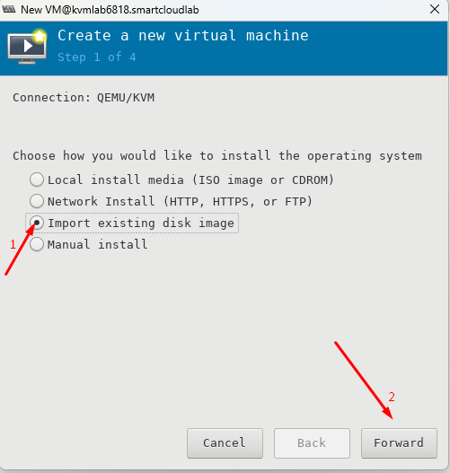</h3>

Chọn đường dẫn phân vùng disk và loại OS hỗ trợ cài đặt

<h3 align="center">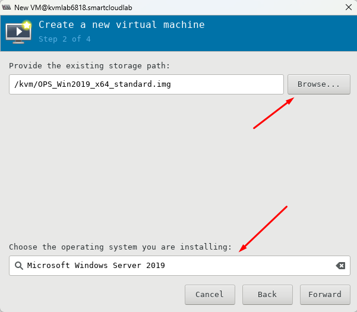</h3>

Tùy chỉnh thông số CPU và RAM hợp lý

<h3 align="center">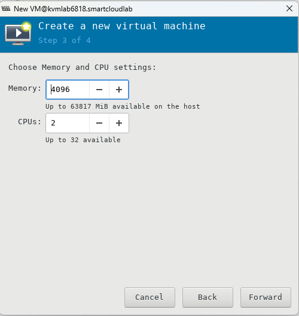</h3>

Đặt tên máy ảo và chọn Network -> **Finish**

<h3 align="center">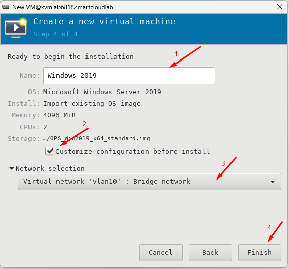</h3>

Chỉnh sửa **Disk bus** thành **VirtIO** -> **Apply**

> Nếu sử dụng SATA thì máy ảo sẽ sử dụng giao diện lưu trữ thông thường và hiệu suất sẽ bị giới hạn bởi tốc độ của ổ đĩa vật lý. Trong khi đó, nếu sử dụng VirtIO, máy ảo sẽ sử dụng giao diện tối ưu hóa để giao tiếp với ổ đĩa ảo và do đó có thể cải thiện hiệu suất đáng kể

<h3 align="center">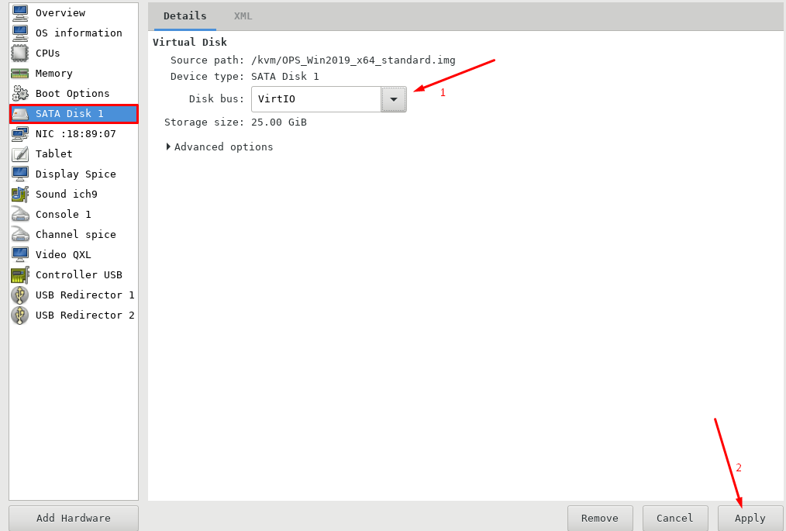</h3>

Trong NIC, chỉnh **Device model** sang **virtio** -> **Aplly**

> Nếu sử dụng e1000e thì máy ảo sẽ sử dụng giao diện mạng thông thường và hiệu suất sẽ bị giới hạn bởi tốc độ của card mạng vật lý. Trong khi đó, nếu sử dụng VirtIO, máy ảo sẽ sử dụng giao diện tối ưu hóa để giao tiếp với card mạng ảo và do đó có thể cải thiện hiệu suất đáng kể

<h3 align="center">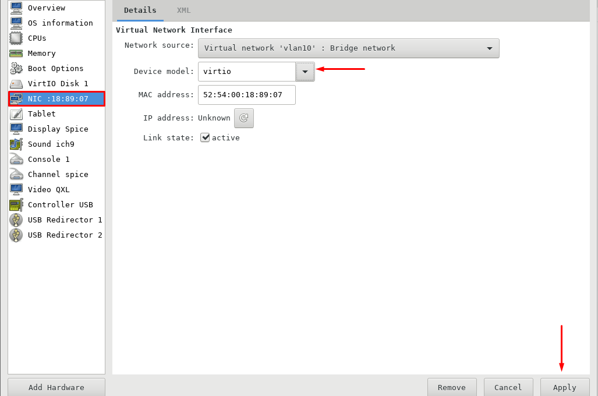</h3>

Thực hiện add ISO cài đặt `Windows Server 2019 Standrad`:

**Add Hardware** -> **Storage** -> ... -> **Finish**

<h3 align="center">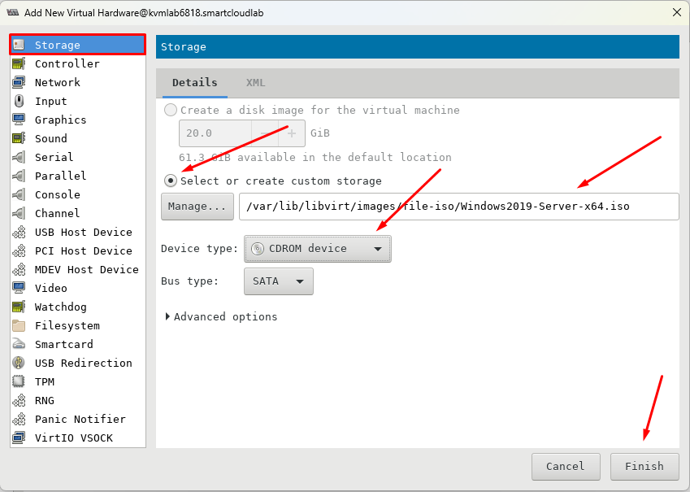</h3>

Thực hiện add ISO cài **VirtIO-Win** để cài driver cho Windows

<h3 align="center">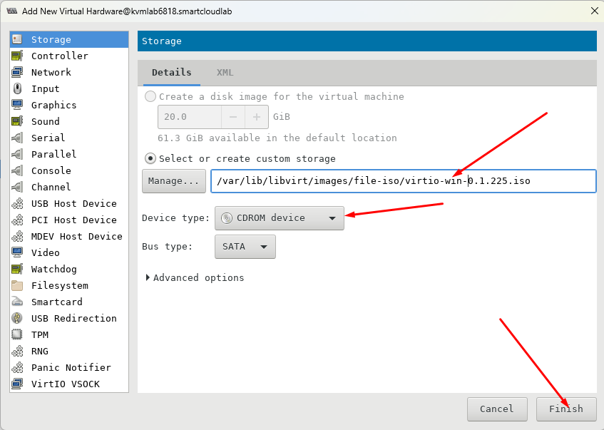</h3>

Trong **Boot Options** chỉnh lại thứ tự Boot -> **Apply** 

<h3 align="center">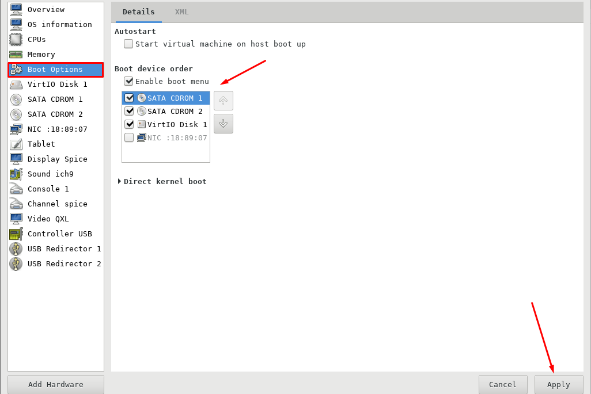</h3>

-> **Begin installation**

Cài đặt **OS**

<h3 align="center">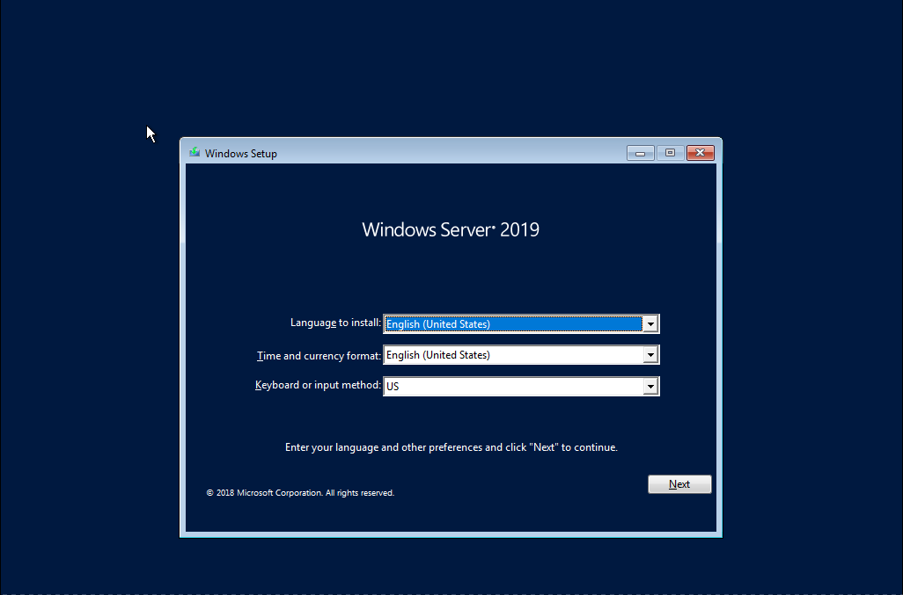</h3>
<h3 align="center">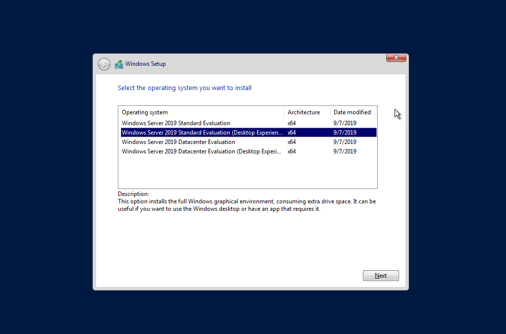</h3>
<h3 align="center">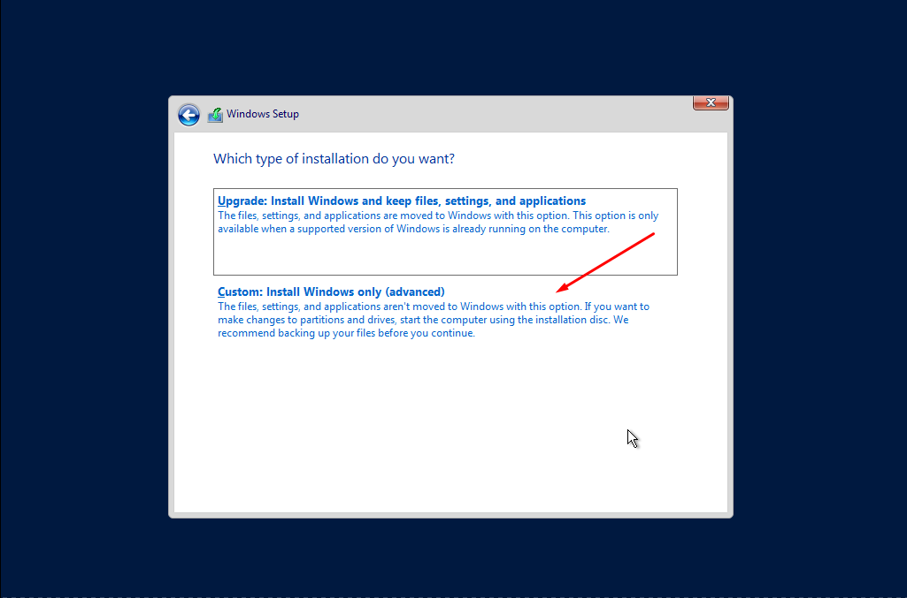</h3>
<h3 align="center">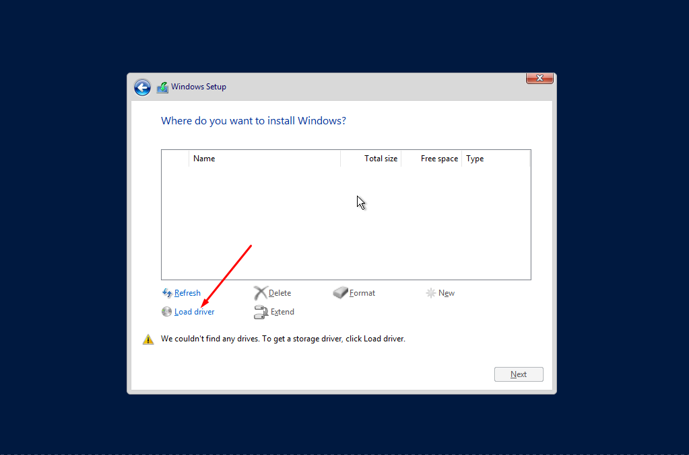</h3>

Chọn **Brower** trỏ đến thư mục `/viostor/2k19/amd64/viostor.inf` và bấm oke và tiếp tục bấm **Next**

<h3 align="center">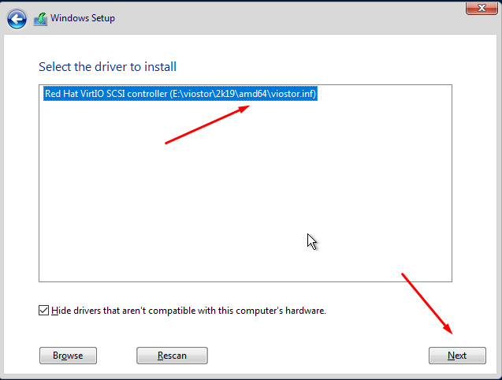</h3>

Lựa chọn disk cài **OS** -> **Next**

<h3 align="center">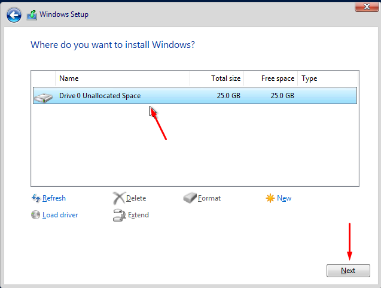</h3>

<h3 align="center"></h3>

Nhập **Password** 

<h3 align="center">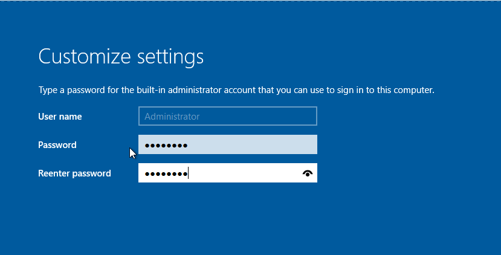</h3>

Nhấn **Ctrl + Alt + Del** để unlock

<h3 align="center">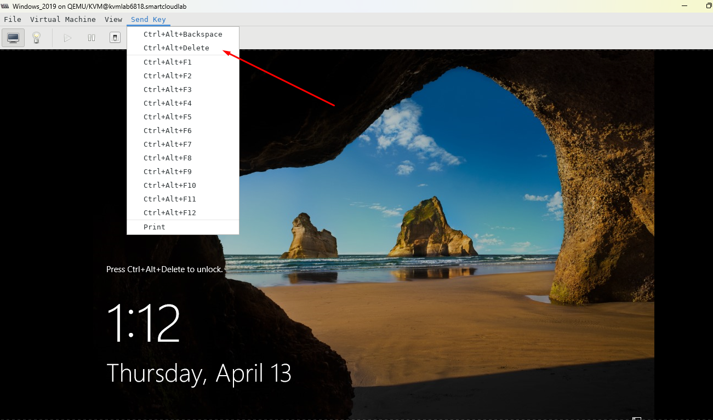</h3>

<h3 align="center">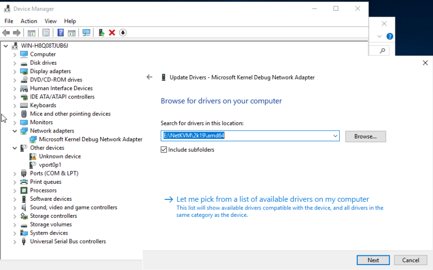</h3>
