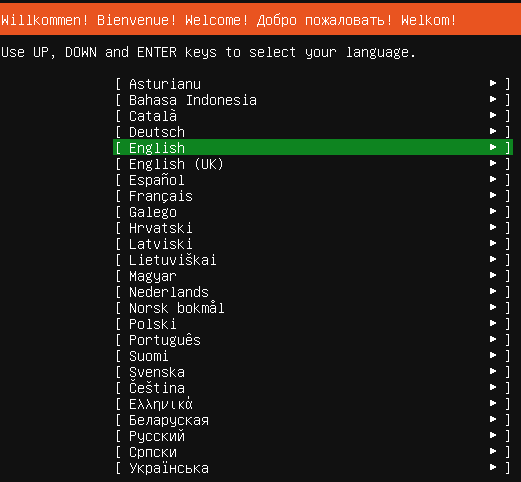
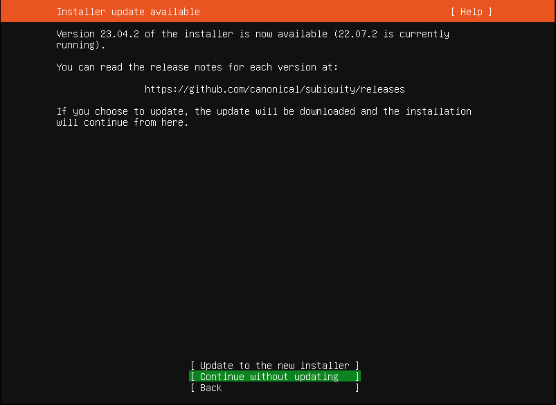
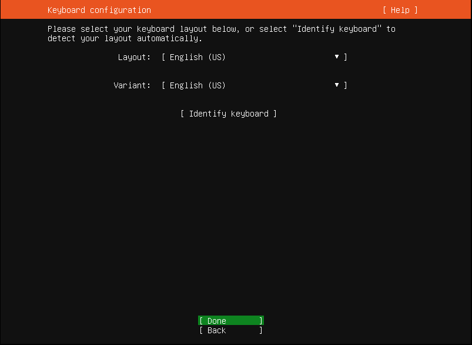

# Hướng dẫn cài đặt Ubuntu Server 20.04

Ubuntu Server 20.04 LTS (hỗ trợ dài hạn) được Canonical hỗ trợ đến năm 2025. Tuy nhiên có thể gia hạn các bản cập nhật bảo mật thêm 5 năm thông qua dịch vụ ESM (Extended Security Maintenance) như một phần đăng ký UA-I (Ubuntu Advantage for Infrastructure)

## 1. Những điểm mới trong Ubuntu Server 20.04 LTS

- Hỗ trợ 10 năm 
- Ubuntu Server Live Installer – cập nhật tự động
- Hỗ trợ cho tất cả các kiến ​​trúc chính: x64-64, ARM v7, ARM64, POWER 8, POWER 9, IBM s390x (LinuxONE) và giới thiệu hỗ trợ ban đầu cho RISC-V
- Cập nhật cho các ứng dụng khác nhau: QEMU (v4.2), libvirt (v6.0), PHP (v7.4), Ruby (v2.7), GCC (v9.3), Python (v3.8), MySQL (v8) .0) và NGINX (v1.17).
- Dựa trên nhân Linux dài hạn mới – 5.4 – để nhận các bản cập nhật bảo mật và hỗ trợ phần cứng mới nhất.
- Hỗ trợ cho phiên bản mới nhất của IMDS (dịch vụ siêu dữ liệu phiên bản) – IMDSv2 – trên AWS.
- Cải thiện hỗ trợ cho IPv6 trên Microsoft Azure.

## 2. Chuẩn bị

Trước tiên bạn càn truy cập vào trang chủ Ubuntu để tải về file ISO cài đặt phù hợp với hệ thống của mình. Bạn có thể bấm trực tiếp vào link sau: 

[Download Ubuntu Server 20.04 LTS](https://releases.ubuntu.com/20.04/)

## 3. Các bước cài đặt

Tạo máy ảo trên môi trường

### 3.1 Chọn ngôn ngữ

### 3.2. Chọn Keyboard

Nhấn chọn **Contine without updating**

Nhấn chọn **Keyboard** -> **Done**

    

