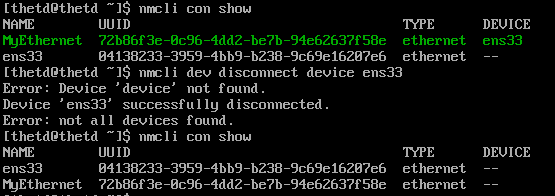

# **Managing_Networking**

## **Network interface name**

**Network interface name** là tên được gán cho mỗi card mạng trong hệ thống máy tính để phân biệt và quản lý chúng. Tên này có thể được sử dụng để cấu hình các thông số mạng và để xác định các kết nối mạng hiện có. Tùy vào hệ điều hành và cấu hình mạng của hệ thống, các tên giao diện mạng có thể được đặt theo các quy tắc nhất định, ví dụ như "eth0", "wlan0", "enp0s3",... Tên giao diện mạng là một phần quan trọng của việc cấu hình và quản lý mạng trong hệ thống máy tính

Mỗi cổng mạng trên một hệ thống đều có một tên, được sử dụng để cấu hình và xác định nó. Các phiên bản cũ hơn của Red Hat Enterprise Linux sử dụng các tên như eth0, eth1 và eth2 cho mỗi giao diện mạng. Tên eth0 là cổng mạng đầu tiên được phát hiện bởi hệ điều hành, eth1 là cổng mạng thứ hai, và cứ tiếp tục như vậy. Tuy nhiên, khi các thiết bị được thêm hoặc loại bỏ, cơ chế phát hiện và đặt tên cho các thiết bị này có thể thay đổi, dẫn đến việc giao diện mạng được đặt tên không nhất quán. Hơn nữa, tiêu chuẩn PCIe không đảm bảo thứ tự trong việc phát hiện các thiết bị PCIe khi khởi động, điều này có thể thay đổi đặt tên thiết bị một cách không mong muốn do các biến động trong quá trình khởi động hệ thống hoặc thiết bị.

Các phiên bản mới hơn của Red Hat Enterprise Linux sử dụng một hệ thống đặt tên khác. Thay vì dựa trên thứ tự phát hiện, các tên của các giao diện mạng được gán dựa trên thông tin từ firmware, cấu trúc topology bus PCI và loại thiết bị mạng.

Tên của giao diện mạng bắt đầu bằng loại giao diện:

- Giao diện Ethernet bắt đầu bằng **en**
- Giao diện WLAN bắt đầu bằng **wl**
- Giao diện WWAN bắt đầu bằng **ww**

Phần còn lại của tên giao diện sau loại sẽ dựa trên thông tin được cung cấp bởi firmware của máy chủ hoặc được xác định bởi vị trí của thiết bị trong topology bus PCI.

- **oN** chỉ ra rằng đây là một thiết bị onboard và firmware của máy chủ cung cấp số chỉ mục N cho thiết bị đó. Ví dụ: "eno1" là thiết bị Ethernet onboard 1. Tuy nhiên, nhiều máy chủ sẽ không cung cấp thông tin này.
- **sN** chỉ ra rằng thiết bị này nằm trong khe cắm hotplug PCI N. Ví dụ: "ens33" là một thẻ Ethernet trong khe cắm hotplug PCI số 33.
"pMsN" chỉ ra rằng đây là một thiết bị PCI trên bus M và slot N. Ví dụ: "wlp4s0" là một thẻ WLAN trên bus PCI số 4, slot số 0. Nếu thẻ là một thiết bị đa chức năng (có thể là một thẻ Ethernet với nhiều cổng hoặc các thiết bị có chức năng Ethernet và một số chức năng khác), bạn có thể thấy fN được thêm vào tên thiết bị. Ví dụ: "enp0s1f0" là chức năng 0 của thẻ Ethernet trên bus 0, slot 1. Có thể cũng có một giao diện thứ hai được đặt tên là "enp0s1f1" là chức năng 1 của cùng một thiết bị.

## **Host name and IP address**

Hầu hết mọi người thường muốn sử dụng tên miền thay vì các chuỗi số dài và khó nhớ khi liên lạc với các máy chủ. Vì vậy, Linux cung cấp một số cơ chế để ánh xạ tên miền về địa chỉ IP, được gọi chung là phân giải tên miền (**name resolution**).

Một cách để giải quyết tên miền là thiết lập một mục nhập tĩnh cho mỗi tên trong tệp `/etc/hosts` trên mỗi hệ thống. Điều này đòi hỏi bạn cập nhật bản sao của tệp trên mỗi máy chủ bằng cách thủ công.

Đối với hầu hết các máy chủ, bạn có thể tra cứu địa chỉ cho tên miền (hoặc tên miền từ địa chỉ) từ dịch vụ mạng được gọi là **Domain Name System (DNS)**. DNS là một mạng phân tán các máy chủ cung cấp ánh xạ tên miền về địa chỉ IP. Để cho dịch vụ tên miền hoạt động, một máy chủ cần được trỏ đến một máy chủ tên miền. Máy chủ tên miền này không cần phải ở cùng mạng con, chỉ cần được định tuyến đến từ máy chủ. Thông thường, điều này được cấu hình thông qua DHCP hoặc một cài đặt tĩnh trong tệp `/etc/resolv.conf`.

## **Network Configuration**
### **ID network interfaces**

Sử dụng lệnh `ip link show` hoặc `ifconfig` để liệt kê tất cả các interface hoạt động trên hệ thống

```sh
thetd ~]$ ip link show
1: lo: <LOOPBACK,UP,LOWER_UP> mtu 65536 qdisc noqueue state UNKNOWN mode DEFAULT group default qlen 1000
    link/loopback 00:00:00:00:00:00 brd 00:00:00:00:00:00
2: ens33: <BROADCAST,MULTICAST,UP,LOWER_UP> mtu 1500 qdisc pfifo_fast state UP mode DEFAULT group default qlen 1000
    link/ether 00:0c:29:8a:f5:b1 brd ff:ff:ff:ff:ff:ff
```
Thông tin được hiển thị bao gồm tên giao diện, loại giao diện, trạng thái, địa chỉ MAC, MTU (Maximum Transmission Unit), và các thông số khác liên quan đến giao diện mạng.

### **IP address**

Sử dụng lệnh `ip` để xem thông tin về địa chỉ và thiết bị

```sh
thetd ~]$ ip add show ens33
2: ens33: <BROADCAST,MULTICAST,UP,LOWER_UP> mtu 1500 qdisc pfifo_fast state UP group default qlen 1000
    link/ether 00:0c:29:8a:f5:b1 brd ff:ff:ff:ff:ff:ff
    inet 192.168.126.134/24 brd 192.168.126.255 scope global noprefixroute dynamic ens33
       valid_lft 1316sec preferred_lft 1316sec
    inet6 fe80::3c6e:36d3:61fc:a3dd/64 scope link noprefixroute
       valid_lft forever preferred_lft forever

```

### **Hiển thị thống kê hiệu suất**

Lệnh `ip` cũng có thể dùng để biết thêm thông tin về hiệu suất mạng.

```sh
thetd ~]$ ip -s link show ens33
2: ens33: <BROADCAST,MULTICAST,UP,LOWER_UP> mtu 1500 qdisc pfifo_fast state UP mode DEFAULT group default qlen 1000
    link/ether 00:0c:29:8a:f5:b1 brd ff:ff:ff:ff:ff:ff
    RX: bytes  packets  errors  dropped overrun mcast
    340537     4379     0       0       0       0
    TX: bytes  packets  errors  dropped carrier collsns
    177181     1609     0       0       0       0
```

## **Troubleshooting routing**

### **Routing table**

```sh
thetd ~]$ ip route
default via 192.168.126.2 dev ens33 proto dhcp metric 100 #1
192.168.126.0/24 dev ens33 proto kernel scope link src 192.168.126.134 metric 100 #2
```
- 1: Đây là đường mặc định để truy cập các mạng bên ngoài. Đường này được thiết lập để đi qua cổng mặc định (gateway) có địa chỉ là 192.168.126.2 trên giao diện ens33. Giao thức được sử dụng để thiết lập kết nối là DHCP và metric (độ ưu tiên) của đường này là 100.
- 2: Đây là đường để truy cập các máy tính khác trong cùng mạng. Đường này được thiết lập trên giao diện ens33, có địa chỉ IP là 192.168.126.134. Đường này được xác định bởi kernel và metric của nó cũng là 100.

**Tracing Routes Taken by Traffic**

Tracing Routes Taken by Traffic là một hoạt động giúp định vị các tuyến đường (routing) mà gói tin mạng đi qua từ điểm khởi đầu đến điểm đích. Điều này giúp người quản trị mạng phát hiện ra các vấn đề về mạng, xác định các nút (node) có thể gây ra sự cố, hay phát hiện ra bất kỳ vấn đề nào có thể làm giảm hiệu suất mạng. Tracing route cũng giúp người dùng đánh giá được chất lượng mạng hoặc tìm hiểu được tuyến đường mạng đang sử dụng. Ngoài ra, hoạt động này còn giúp cho người quản trị mạng hiểu được hệ thống mạng của mình hoạt động như thế nào và giúp họ xác định được các nơi có thể cần phải tối ưu hóa để tăng cường hiệu suất mạng.

```sh
tracert facebook.com

Tracing route to facebook.com [157.240.199.35]
over a maximum of 30 hops:

1    <1 ms    <1 ms    <1 ms  10.158.5.254
2    <1 ms    <1 ms    <1 ms  10.158.100.6
3    <1 ms    <1 ms    <1 ms  static.vnpt.vn [14.238.38.53]
4     *        *        *     Request timed out.
5    20 ms    20 ms    20 ms  static.vnpt.vn [113.171.5.119]
6    21 ms    20 ms    22 ms  ae6.pr02.hkg4.tfbnw.net [103.4.99.14]
7    21 ms    21 ms    21 ms  po102.psw03.hkg4.tfbnw.net [129.134.36.229]
8    23 ms    23 ms    22 ms  173.252.67.147
9    21 ms    21 ms    20 ms  edge-star-mini-shv-01-hkg4.facebook.com [157.240.199.35]

Trace complete.
```

**Troubleshooting ports and services**

Các dịch vụ TCP sử dụng các socket như là các điểm cuối để giao tiếp và được tạo thành từ địa chỉ IP, giao thức và số cổng. Các dịch vụ thường lắng nghe trên các cổng chuẩn trong khi các client sử dụng một cổng ngẫu nhiên có sẵn. Các tên cho các cổng chuẩn được liệt kê trong tệp `/etc/services`. Lệnh `ss` được sử dụng để hiển thị thống kê socket. Lệnh `ss` được thiết kế để thay thế công cụ cũ hơn là **netstat**, một phần của gói **net-tools**

```sh
~]$ ss -ta
State      Recv-Q Send-Q                                   Local Address:Port                                                    Peer Address:Port
LISTEN     0      128                                                  *:ssh                                                                *:*
LISTEN     0      100                                          127.0.0.1:smtp                                                               *:*
ESTAB      0      0                                      192.168.126.134:ssh                                                    192.168.126.1:50341
ESTAB      0      36                                     192.168.126.134:ssh                                                    192.168.126.1:50340
LISTEN     0      128                                               [::]:ssh                                                             [::]:*
LISTEN     0      100                                              [::1]:smtp                                                            [::]:*
```
Kết quả của lệnh "ss -ta" bao gồm các thông tin sau:

- **State**: trạng thái của kết nối. Các trạng thái có thể bao gồm LISTEN (đang lắng nghe), ESTAB (đã thiết lập kết nối), CLOSE-WAIT (chờ đóng kết nối), và nhiều trạng thái khác.
- **Recv-Q**: số lượng byte đã được nhận và đang chờ xử lý bởi ứng dụng.
- **Send-Q**: số lượng byte đang chờ được gửi đi.
- **Local Address**:Port: địa chỉ IP và cổng của máy đang chạy lệnh ss.
- **Peer Address**:Port: địa chỉ IP và cổng của máy đang kết nối.

Từ các thông tin trên, ta có thể giải thích các kết quả như sau:

- Có một kết nối SSH đang lắng nghe trên tất cả các địa chỉ IPv4 và IPv6 của máy.
- Có một kết nối SMTP đang lắng nghe trên giao diện loopback IPv4 của máy, với địa chỉ 127.0.0.1.
- Có hai kết nối SSH đã được thiết lập từ máy có địa chỉ IP là 192.168.126.1 đến máy đang chạy lệnh ss với địa chỉ IP là 192.168.126.134. Một trong số chúng có cổng nguồn là 50341 và kết nối còn lại có cổng nguồn là 50340.
- Có một kết nối SSH đang lắng nghe trên tất cả các địa chỉ IPv6 của máy.
- Có một kết nối SMTP đang lắng nghe trên giao diện loopback IPv6 của máy, với địa chỉ ::1.

**Các option cho `ss` và `netstat`**

**Option**|**Description**
----------|---------------
-n|Hiển thị số thay vì tên giao diện và cổng
-t|Hiển thị TCP sockets
-u|Hiển thị UDP sockets
-l|Chỉ hiển thị Listening sockets
-a|Hiển thị tất cả sockets (Listening và Established)
-p|Hiển thị tiến trình dùng sockets
-A inet|

## **Cấu hình Network**

**NetworkManager** là một daemon (chương trình nền) trong hệ thống Linux/Unix, được sử dụng để giám sát và quản lý các thiết lập mạng. Ngoài daemon, còn có một applet GNOME Notification Area cung cấp thông tin trạng thái mạng. Các công cụ dòng lệnh và đồ họa truyền thông với NetworkManager và lưu các tệp cấu hình trong thư mục /etc/sysconfig/network-scripts.

- Một thiết bị là một giao diện mạng.
- Một kết nối là một tập hợp các thiết lập có thể được cấu hình cho một thiết bị.
- Chỉ có một kết nối có thể được kích hoạt cho một thiết bị tại một thời điểm. Có thể tồn tại nhiều kết nối để sử dụng cho các thiết bị khác nhau hoặc để cho phép cấu hình được thay đổi cho cùng một thiết bị. Nếu bạn cần thay đổi tạm thời các thiết lập mạng thay vì thay đổi cấu hình của một kết nối, bạn có thể thay đổi kết nối nào đang được kích hoạt cho thiết bị. Ví dụ, một thiết bị cho một giao diện mạng không dây trên một máy tính xách tay có thể sử dụng các kết nối khác nhau cho mạng không dây tại một địa điểm làm việc và cho mạng không dây tại nhà.
- Mỗi kết nối có một tên hoặc ID để xác định nó.
- Công cụ **nmcli "Network Manager Command-Line Interface"**. Đây là một công cụ dòng lệnh trên Linux được sử dụng để quản lý mạng thông qua Network Manager, một tiện ích quản lý mạng trên các phiên bản Linux phổ biến. **nmcli** cung cấp các lệnh để hiển thị, tạo và chỉnh sửa các kết nối mạng, thông tin mạng, cài đặt VPN, tạo các kết nối bridge, bond và VLAN, v.v. **nmcli** cũng được sử dụng để cấu hình các thông số mạng như địa chỉ IP, subnet mask, gateway và DNS.

### **Xem thông tin mạng** 

Ngoài các lệnh như `ifconfig`, `ip`, `netstat`, `traceroute`, `ping`, `nslookup`, `dig`, thì còn lệnh `nmcli dev status` để hiển thị thông tin các mạng trong thiết bị
```sh
thetd ~]$ nmcli dev status
DEVICE  TYPE      STATE      CONNECTION
ens33   ethernet  connected  ens33
lo      loopback  unmanaged  --
```

Lệnh `nmcli con show` hiển thị danh sách các kết nối. Thêm option `--active` liệt kê những hoạt động kết nối

```sh
~]$ nmcli con show
NAME   UUID                                  TYPE      DEVICE
ens33  04138233-3959-4bb9-b238-9c69e16207e6  ethernet  ens33
[thetd@thetd ~]$ nmcli con show --active
NAME   UUID                                  TYPE      DEVICE
ens33  04138233-3959-4bb9-b238-9c69e16207e6  ethernet  ens33
```
### **Thêm kết nối mạng**

Lệnh **nmcli con add** được sử dụng để thêm các kết nối mạng mới. 

```sh
sudo nmcli connection add con-name <tên-kết-nối> ifname <tên-giao-diện-mạng> type <kiểu-kết-nối> <các-tham-số-kết-nối>
```
Trong đó:

- <tên-kết-nối>: là tên của kết nối mạng bạn muốn thêm.
- <tên-giao-diện-mạng>: là tên giao diện mạng (interface) bạn muốn sử dụng cho kết nối mạng.
- <kiểu-kết-nối>: là kiểu kết nối mạng bạn muốn thêm, ví dụ như Ethernet, Wi-Fi, VPN, v.v.
- <các-tham-số-kết-nối>: là các tham số cấu hình kết nối, ví dụ như địa chỉ IP, subnet mask, gateway, DNS, v.v.

Tên của tệp tin cấu hình dựa trên giá trị của tùy chọn con-name và được lưu ở tệp /etc/sysconfig/network-scripts/ifcfg-<tên-giao-diện-mạng>

VD:
```sh
~]$ sudo nmcli connection add con-name MyEthernet ifname ens3 type ethernet
Connection 'MyEthernet' (72b86f3e-0c96-4dd2-be7b-94e62637f58e) successfully added.
```
Bạn cũng có thể thêm các thông số cấu hình kết nối như địa chỉ IP, subnet mask, gateway, DNS, v.v. vào lệnh trên bằng cách thêm các tham số tương ứng. Ví dụ, để thêm địa chỉ IP cho kết nối mạng này, bạn có thể sử dụng lệnh sau
```sh
sudo nmcli connection modify MyEthernet ipv4.addresses 192.168.0.2/24 ipv4.gateway 192.168.0.1 ipv4.dns 8.8.8.8
```

### **Kiểm soát kết nối mạng**

Lệnh `nmcli con up name` được sử dụng để kích hoạt (activate) một kết nối mạng đã được tạo ra trên hệ thống. Để sử dụng lệnh này, bạn cần biết tên của kết nối mạng mà bạn muốn kích hoạt

VD:
```sh
thetd]# nmcli con up MyEthernet
Connection reset by 192.168.126.136 port 22
```
Sau đấy ta dùng lệnh `nmcli con show` để kiểm tra kết nối
```sh
 ~]$ nmcli con show
NAME        UUID                                  TYPE      DEVICE
MyEthernet  72b86f3e-0c96-4dd2-be7b-94e62637f58e  ethernet  ens33
ens33       04138233-3959-4bb9-b238-9c69e16207e6  ethernet  --
```

Lệnh `nmcli dev disconnect` được sử dụng để ngắt kết nối của một thiết bị mạng. Cú pháp chung của lệnh như sau
```sh
nmcli dev disconnect device <tên-thiết-bị>
```
Trong đó <tên-thiết-bị> là tên của thiết bị mạng mà bạn muốn ngắt kết nối.



Lệnh này sẽ ngắt kết nối của thiết bị mạng "eth0" và làm cho thiết bị này không thể kết nối với mạng cho đến khi bạn kích hoạt lại nó bằng cách sử dụng lệnh nmcli con up hoặc các cách khác

### **Chỉnh sửa cài đặt mạng**

Các cài đặt kết nối của NetworkManager. 

Có hai loại cài đặt khác nhau được sử dụng cho kết nối, bao gồm cài đặt tĩnh (static) và cài đặt động (active).

Cài đặt tĩnh là các thuộc tính được cấu hình bởi quản trị viên và lưu trữ trong các tệp cấu hình trong `/etc/sysconfig/network-scripts/ifcfg-*`. Các thuộc tính này được lưu trữ trên đĩa cứng và giữ nguyên giá trị cho đến khi được thay đổi bởi quản trị viên.

Các cài đặt động là dữ liệu kết nối mà kết nối nhận từ máy chủ DHCP và không được lưu trữ lâu dài. Các cài đặt này là tạm thời và được sử dụng trong thời gian hoạt động của kết nối.

Để liệt kê các cài đặt hiện tại cho một kết nối, bạn có thể chạy lệnh `nmcli con show name`, trong đó "name" là tên của kết nối. Các cài đặt được viết bằng chữ thường là các thuộc tính tĩnh có thể được thay đổi bởi quản trị viên. Các cài đặt viết hoa là các cài đặt động được sử dụng tạm thời cho phiên kết nối hiện tại.

```sh
 ~]$ nmcli con show ens33
connection.id:                          ens33
connection.uuid:                        04138233-3959-4bb9-b238-9c69e16207e6
connection.stable-id:                   --
connection.type:                        802-3-ethernet
connection.interface-name:              ens33
connection.autoconnect:                 yes
connection.autoconnect-priority:        0
connection.autoconnect-retries:         -1 (default)
connection.multi-connect:               0 (default)
connection.auth-retries:                -1
connection.timestamp:                   1680146481
connection.read-only:                   no
connection.permissions:                 --
connection.zone:                        --
proxy.pac-url:                          --
proxy.pac-script:                       --
...
GENERAL.NAME:                           ens33
GENERAL.UUID:                           04138233-3959-4bb9-b238-9c69e16207e6
GENERAL.DEVICES:                        ens33
GENERAL.STATE:                          activated
GENERAL.DEFAULT:                        yes
GENERAL.DEFAULT6:                       no
GENERAL.SPEC-OBJECT:                    --
GENERAL.VPN:                            no
GENERAL.DBUS-PATH:                      /org/freedesktop/NetworkManager/ActiveConnection/8
GENERAL.CON-PATH:                       /org/freedesktop/NetworkManager/Settings/1
GENERAL.ZONE:                           --
GENERAL.MASTER-PATH:                    --
IP4.ADDRESS[1]:                         192.168.126.136/24
IP4.GATEWAY:                            192.168.126.2
IP4.ROUTE[1]:                           dst = 0.0.0.0/0, nh = 192.168.126.2, mt = 100
IP4.ROUTE[2]:                           dst = 192.168.126.0/24, nh = 0.0.0.0, mt = 100
IP4.DNS[1]:                             192.168.126.2
IP4.DOMAIN[1]:                          localdomain
DHCP4.OPTION[1]:                        broadcast_address = 192.168.126.255
DHCP4.OPTION[2]:                        dhcp_lease_time = 1800
DHCP4.OPTION[3]:                        dhcp_message_type = 5
DHCP4.OPTION[4]:                        dhcp_server_identifier = 192.168.126.254
```

Bạn có thể sử dụng lệnh này để xác định cài đặt hiện tại của một kết nối mạng, bao gồm địa chỉ IP, network mask, gateway mặc định, DNS, tên giao diện mạng, vv. Từ đó, bạn có thể thực hiện các hành động như thay đổi cài đặt kết nối hoặc kiểm tra lỗi kết nối

Lệnh `nmcli con mod name` được sử dụng để sửa đổi cài đặt của một kết nối mạng trong **NetworkManager** trên hệ thống Linux. Với lệnh này, bạn có thể sửa đổi các thuộc tính của kết nối như địa chỉ IP, cổng mặc định, DNS, tên miền, proxy và nhiều hơn nữa. Thay đổi được áp dụng trực tiếp vào cấu hình của kết nối được lưu trữ trong tệp cấu hình `ifcfg-*` trong `/etc/sysconfig/network-scripts/`.

Cú pháp của lệnh như sau: `nmcli con mod name <tùy chọn> <giá trị>`. Trong đó, **name** là tên của kết nối mà bạn muốn sửa đổi, tùy chọn và giá trị là các thuộc tính cụ thể mà bạn muốn thay đổi. Các tùy chọn và giá trị có thể khác nhau tùy thuộc vào các thuộc tính hiện có của kết nối và các yêu cầu của hệ thống.

VD:
```sh
nmcli con mod ens33 ipv4.addresses 192.168.1.100/24 ipv4.gateway 192.168.1.1
```
Lệnh này sẽ sửa đổi cài đặt kết nối ens33, đặt địa chỉ IP là 192.168.1.100 với subnetmask mặc định là 24 và đặt gateway IPv4 là 192.168.1.1

### **Xóa kết nối mạng**

Lệnh `nmcli con del name` dùng để xóa một kết nối mạng đã được cấu hình trong **NetworkManager**. Thông tin về kết nối đó sẽ bị xóa khỏi tệp cấu hình của **NetworkManager**. Tệp cấu hình này thường được lưu trữ trong thư mục `/etc/sysconfig/network-scripts/ifcfg-<tên kết nối>`

VD:
```sh
thetd]# cat /etc/sysconfig//network-scripts/ifcfg-MyEthernet
TYPE=Ethernet
PROXY_METHOD=none
BROWSER_ONLY=no
BOOTPROTO=dhcp
DEFROUTE=yes
IPV4_FAILURE_FATAL=no
IPV6INIT=yes
IPV6_AUTOCONF=yes
IPV6_DEFROUTE=yes
IPV6_FAILURE_FATAL=no
IPV6_ADDR_GEN_MODE=stable-privacy
NAME=MyEthernet
UUID=72b86f3e-0c96-4dd2-be7b-94e62637f58e
DEVICE=ens33
ONBOOT=yes
[root@thetd thetd]# nmcli con del MyEthernet
Connection 'MyEthernet' (72b86f3e-0c96-4dd2-be7b-94e62637f58e) successfully deleted
```
### **Tóm tắt các lệnh nmcli**

**Command**|**Purpose**
-----------|-----------
**nmcli dev status**|Hiển thị trạng thái NetwworkManager của tất cả các giao diện mạng
**nmcli con show**|Hiển thị tất cả các kết nối
**nmcli con show name**|Liệt kê các cài đặt hiện tại cho kết nối
**nmcli con add con-name name**|Thêm kết nối mới
**nmcli con mod name**|Chỉnh sửa kết nối
**nmcli con reload**|Tải lại các tệp cấu hình (Sau khi chỉnh sửa tệp thủ công)
**nmcli con up name**|kích hoạt kết nối
**nmcli dev dis dev**| Tắt và ngắt kết nối hiện tại trên giao diện mạng
**nmcli con del name**|Xóa kết nối và tệp cấu hình của nó


## **Cấu hình máy và phân giải tên miền**
### **Thay đổi tên máy chủ hệ thống**

Lệnh `hostname` được sử dụng để hiển thị hoặc cài đặt tên của máy tính
```sh
]# hostname
thetd
```
Tên máy chủ tĩnh được chỉ định trong tệp `/etc/hostname`. Lệnh `hostnamectl` được sử dụng để sửa đổi tệp này và có thể được sử dụng để xem trạng thái của tên máy chủ đầy đủ của hệ thống

Để thiết lập hoặc thay đổi tên máy chủ trong hệ thống, ta sử dụng lện `hostnamectl set-hostname` để thiết lập, nhưng lệnh này chỉ có hiệu lực khi bạn khởi động lại hệ thống. Nếu muốn giữ hostname sau khi khởi động lại, bạn cần phải lưu trong tệp cấu hình `/etc/hostname`.
```sh
[root@thetd thetd]# hostnamectl set-hostname test
[root@thetd thetd]# hostnamectl status
   Static hostname: test
         Icon name: computer-vm
           Chassis: vm
        Machine ID: 155463d791a64732ab86ca15b8fce8c8
           Boot ID: dc17dd3a62f646d082a3eccf7df97b09
    Virtualization: vmware
  Operating System: CentOS Linux 7 (Core)
       CPE OS Name: cpe:/o:centos:centos:7
            Kernel: Linux 3.10.0-1160.88.1.el7.x86_64
      Architecture: x86-64
```
### **Phân giải tên miền**

Là quá trình chuyển đổi tên miền và tên máy chủ thành địa chỉ IP để có thể kết nối mạng. Có nhiều cách để giải quyết tên trên Linux, nhưng hai cách phổ biến là sử dụng tệp /etc/host và DNS

**stub resolver** được sử dụng để chuyển đổi tên máy chủ thành địa chỉ IP hoặc ngược lại. Nó xác định nơi để tìm kiếm dựa trên cấu hình của tệp `/etc/nsswitch.conf`. Mặc định, nội dung của tệp `/etc/hosts` được kiểm tra đầu tiên

Tệp `/etc/nsswitch.conf` là tệp cấu hình cho các dịch vụ tìm kiếm hệ thống như **name service switch (NSS)**. Nó xác định cách thức tìm kiếm và xác minh các thông tin như tên người dùng, mật khẩu, địa chỉ IP và tên miền. NSS sử dụng tệp này để xác định trình tự các nguồn dữ liệu sẽ được sử dụng để tìm kiếm thông tin.

Các cài đặt mặc định trong tệp này có thể được ghi đè bởi các tệp cấu hình cụ thể cho từng dịch vụ như `/etc/resolv.conf`, `/etc/hosts`, `/etc/passwd`, `/etc/group`

```sh
thetd]# cat /etc/hosts
127.0.0.1   localhost localhost.localdomain localhost4 localhost4.localdomain4
::1         localhost localhost.localdomain localhost6 localhost6.localdomain6
#Đây là nội dung mặc định của tệp /etc/hosts
```

File `/etc/resolv.conf` chứa thông tin cấu hình cho việc giải quyết tên miền (name resolution) bằng cách định tuyến các truy vấn đến các máy chủ DNS. Trong trường hợp này, file `/etc/resolv.conf` được tạo ra bởi **NetworkManager** và chứa hai mục sau:

```sh
thetd]# cat /etc/resolv.conf
# Generated by NetworkManager
search localdomain
nameserver 192.168.126.2
```

- **search localdomain**: Đây là danh sách các tên miền được sử dụng để tìm kiếm một máy chủ khi tên máy chủ chỉ được cung cấp với một tên ngắn. Trong trường hợp này, nếu một truy vấn tìm kiếm một tên ngắn như "example", nó sẽ được mở rộng thành "example.localdomain" trước khi truy vấn được gửi đến máy chủ DNS.

- **nameserver 192.168.126.2**: Đây là địa chỉ IP của máy chủ DNS được sử dụng để giải quyết tên miền. Trong trường hợp này, máy chủ DNS có địa chỉ IP là 192.168.126.2 được sử dụng. Nếu một truy vấn tìm kiếm tên miền, nó sẽ được gửi đến máy chủ DNS này để được giải quyết.

**Thay đổi địa chỉ DNS của một kết nối mạng**

Ta dùng lệnh `nmcli con mod ID ipv4.dns IP` được sử dụng để sửa đổi cài đặt DNS cho kết nối có ID tương ứng. 

`cat /etc/sysconfig/network-scripts/ifcfg-ID` được sử dụng để kiểm tra xem cấu hình của tệp cấu hình kết nối đã được cập nhật với địa chỉ DNS mới chưa. Nếu đã cập nhật, địa chỉ DNS mới sẽ được hiển thị trong tệp cấu hình tương ứng

```sh
thetd]# nmcli con mod ens33 ipv4.dns 8.8.8.8
thetd]# cat /etc/sysconfig/network-scripts/ifcfg-ens33
DNS1=8.8.8.8
```
Lệnh nmcli con mod ID ipv4.dns IP mặc định sẽ thay thế bất kỳ cài đặt DNS trước đó nào bằng danh sách IP mới được cung cấp. Dấu + hoặc - trước đối số ipv4.dns sẽ thêm hoặc xóa một mục nhập cá nhân. Ví dụ, nếu bạn muốn thêm một địa chỉ DNS khác vào danh sách DNS hiện có, bạn có thể sử dụng lệnh nmcli con mod ID ipv4.dns "+ IP mới". Nếu bạn muốn xóa một địa chỉ DNS khỏi danh sách, bạn có thể sử dụng lệnh nmcli con mod ID ipv4.dns "- IP cần xóa". Lưu ý rằng danh sách DNS được cung cấp phải được đặt trong dấu ngoặc kép và các địa chỉ IP phải được phân tách bằng dấu phẩy

Ví dụ bạn muốn thêm DNS server 1.1.1.1 vào kết nối có ID là ens33, bạn có thể sử dụng lệnh
```sh
nmcli con mod myconnection ipv4.dns +1.1.1.1
```
Nếu bạn muốn xóa DNS server 8.8.8.8 khỏi danh sách DNS server của kết nối ens33, bạn có thể sử dụng lệnh:
```sh
nmcli con mod myconnection ipv4.dns -8.8.8.8
```
### **Kiểm tra phân giải tên miền**

Để kiểm tra việc phân giải tên miền DNS, bạn có thể dùng lệnh `host`, `nslookup`, `dig`. Kết quả trả về sẽ cho biết địa chỉ IP tương ứng của tên miền
```sh
thetd]# host facebook.com
facebook.com has address 157.240.199.35
facebook.com has IPv6 address 2a03:2880:f15e:83:face:b00c:0:25de
facebook.com mail is handled by 10 smtpin.vvv.facebook.com.
thetd]# host 157.240.199.35
35.199.240.157.in-addr.arpa domain name pointer edge-star-mini-shv-01-hkg4.facebook.com.
```
```sh
thetd]# nslookup facebook.com
Server:         192.168.126.2
Address:        192.168.126.2#53

Non-authoritative answer:
Name:   facebook.com
Address: 157.240.199.35
Name:   facebook.com
Address: 2a03:2880:f15e:83:face:b00c:0:25de
```

# **Tài liệu tham khảo**
1. [Fiona Allen, Marc Kesler, Saumik Paul, Snehangshu Karmakar,
Victor Costea "Red Hat System Administration I" Red Hat Enterprise Linux 8.0 RH124, 07 May 2019](https://www.redhat.com/en/services/training/rh124-red-hat-system-administration-i)