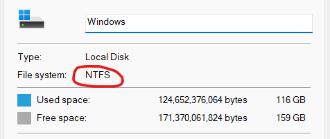
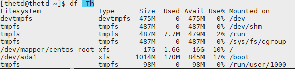

# Các công cụ quản lý, phân vùng ổ cứng

Trong hệ điều hành Linux, có nhiều công cụ quản lý ổ cứng mạnh mẽ và linh hoạt giúp người dùng thao tác với các phân vùng, ổ đĩa, định dạng file system và các hoạt động khác liên quan đến quản lý ổ cứng.

Các công cụ quản lý ổ cứng phổ biến nhất trong Linux bao gồm fdisk, gdisk và gparted. Mỗi công cụ có tính năng riêng và được sử dụng cho một số công việc cụ thể.

Tùy thuộc vào mục đích sử dụng, người dùng Linux có thể lựa chọn công cụ quản lý ổ cứng phù hợp để thực hiện các thao tác như tạo mới phân vùng, định dạng ổ cứng, xem thông tin ổ cứng, sửa đổi cấu trúc phân vùng và các hoạt động khác liên quan đến quản lý ổ cứng

# 1. File system

File System là một tập hợp logic của các files nằm trên một phân vùng hoặc trên đĩa. Hệ điều hành sử dụng File System để lưu trữ và truy xuất dữu liệu. Nếu không có File System thì dữ liệu được lưu trữ thành một khối chung mà không có cách nào biết nó bắt đầu hay kết thúc ở đâu.

Đối với hệ điều hành Windows thì file system chủ yếu ở format `FAT32` và `NTFS`. Còn đối với Linux thì ta có nhiều format hơn như `ext2`, `ext3`, `ext4`, `xfs`, `vfat`, `swap` , `ZFS` và `GlusterFS`.

|**Windows**|**Linux**|
|-----------|---------|
|||

# 2. Bảng phân vùng

Bảng phân vùng (Partition Table) là một khu vực trên đĩa cứng được sử dụng để xác định các phân vùng trên đó. Nó định nghĩa cách mà đĩa cứng được chia thành các phân vùng khác nhau và được sử dụng bởi hệ thống để xác định vị trí các phân vùng trên đĩa cứng.

Có nhiều loại bảng phân vùng khác nhau được sử dụng trên các hệ thống khác nhau, bao gồm:
MBR (Master Boot Record), GPT (GUID Partition Table), LVM (Logical Volume Manager), RAID (Redundant Array of Independent Disks).

## 2.1. MBR (Master Boot Record)
 
MBR (Master Boot Record) là một khu vực đặc biệt trên đĩa cứng được sử dụng để lưu trữ thông tin về phân vùng và cấu trúc boot loader của hệ thống. MBR là một phần quan trọng của quá trình khởi động máy tính và nó nằm ở vị trí đầu tiên của ổ đĩa cứng.

MBR chỉ có thể quản lý tối đa 4 phân vùng trên một ổ đĩa cứng và chỉ hỗ trợ địa chỉ ổ đĩa cứng 32 bit. Vì vậy, nếu ổ đĩa cứng của bạn có dung lượng lớn hơn 2TB, bạn cần sử dụng GPT (GUID Partition Table) thay vì MBR. (2^32 * 512)

## 2.2. GPT (GUID Partition Table)

GPT (GUID Partition Table) là một chuẩn phân vùng đĩa mới hơn được sử dụng trên hệ thống EFI (Extensible Firmware Interface). GPT có thể hỗ trợ cho các ổ đĩa có dung lượng lớn hơn và có thể có nhiều hơn 4 phân vùng chính. Mỗi phân vùng được đánh dấu bằng một GUID (Globally Unique Identifier) duy nhất, thay vì sử dụng các thông số vùng phân vùng như MBR. GPT cũng bao gồm một bản sao của bảng phân vùng trong phần cuối của ổ đĩa để đảm bảo tính toàn vẹn dữ liệu khi bảng phân vùng chính bị hỏng.

GPT có thể có 128 phân vùng

GPT sử dụng 64 bit cho địa chỉ khối

Đối với các đĩa cứng có các sectors 512 byte, GPT xử lý tối đa 9,4 ZB (9,4 × 10^21 byte) hoặc 8ZiB

## 2.3. Định dạng đĩa trong Linux là gì?

Định dạng đĩa là quá trình chuẩn bị phân vùng lưu trữ để sử dụng. Định dạng xóa dữ liệu hiện có trên phân vùng và thiết lập hệ thống tệp.

Một số hệ thống tệp phổ biến nhất cho Linux bao gồm:

- Ext4 - Ext4 là một hệ thống tệp mặc định phổ biến trên nhiều bản phân phối Linux hiện đại. Nó hỗ trợ kích thước tệp lên tới 16TB và âm lượng lên tới 1EB. Nó không được hỗ trợ trên Windows theo mặc định.
- NTFS - NTFS là một hệ thống tập tin phổ biến được phát triển bởi Microsoft. Nó hỗ trợ kích thước tệp và âm lượng tối đa 8PB. Nhân Linux đã thêm hỗ trợ đầy đủ cho NTFS trong phiên bản 5.15. 
- FAT32 - Là một hệ thống tệp cũ hơn, nhưng bạn vẫn có thể thấy nó được sử dụng phổ biến. Nó hỗ trợ kích thước tệp tối đa 4GB và kích thước âm lượng tối đa 2TB. Nhiều hệ điều hành *nix và Windows hỗ trợ FAT32.

## 2.4. Phân vùng trong Linux là gì?

Phân vùng là quá trình tạo ranh giới logic trên thiết bị lưu trữ. Các ví dụ phổ biến về thiết bị lưu trữ bao gồm ổ đĩa cứng (HDD), ổ đĩa thể rắn (SSD), ổ flash USB và thẻ SD. Việc tạo một phân vùng trên một ổ đĩa sẽ tách nó ra khỏi các phân vùng khác một cách hợp lý. Sự tách biệt hợp lý này có thể hữu ích cho nhiều tình huống khác nhau, bao gồm hạn chế sự phát triển của hệ thống tệp và cài đặt nhiều hệ điều hành trên một ổ đĩa.

# 3. Quản lý phân vùng đĩa cứng bằng fdisk, gdisk, GParted

## 3.1. Fdisk

**fdisk** là một tiện ích dòng lệnh trên hệ điều hành Linux và các hệ điều hành tương tự Unix để quản lý các phân vùng đĩa. Với **fdisk**, bạn có thể xem, tạo, sửa đổi và xóa các phân vùng trên đĩa cứng hoặc ổ đĩa khác. Nó cũng cho phép bạn xem và thay đổi các thuộc tính của các phân vùng, chẳng hạn như định dạng hệ thống tập tin hoặc kích thước phân vùng.

Tuy nhiên, **fdisk** không được khuyến khích sử dụng trong môi trường sản xuất hiện đại vì nó không hỗ trợ phân vùng trên ổ đĩa lớn hơn 2 TB hoặc các phân vùng GPT

**Xem tất cả các phân vùng trên linux**

Trước khi bạn thực hiện bất kì hoạt động phân vùng thì bạn cần phải biết danh sách những phân vùng đang có trên thiết bị. Để liệt kê tất cả các thông tin chi tiết các phân vùng đang có sẵn trong hệ thống bạn sử dụng lệnh `fdisk -l`

```sh
[root@thetd thetd]# fdisk -l

Disk /dev/sda: 21.5 GB, 21474836480 bytes, 41943040 sectors
Units = sectors of 1 * 512 = 512 bytes
Sector size (logical/physical): 512 bytes / 512 bytes
I/O size (minimum/optimal): 512 bytes / 512 bytes
Disk label type: dos
Disk identifier: 0x000df435

   Device Boot      Start         End      Blocks   Id  System
/dev/sda1   *        2048     2099199     1048576   83  Linux
/dev/sda2         2099200    41943039    19921920   8e  Linux LVM

Disk /dev/mapper/centos-root: 18.2 GB, 18249416704 bytes, 35643392 sectors
Units = sectors of 1 * 512 = 512 bytes
Sector size (logical/physical): 512 bytes / 512 bytes
I/O size (minimum/optimal): 512 bytes / 512 bytes


Disk /dev/mapper/centos-swap: 2147 MB, 2147483648 bytes, 4194304 sectors
Units = sectors of 1 * 512 = 512 bytes
Sector size (logical/physical): 512 bytes / 512 bytes
I/O size (minimum/optimal): 512 bytes / 512 bytes
```
Bảng phân vùng của thiết bị /dev/sda được định dạng dạng MBR và có hai phân vùng:

- `/dev/sda1` với kích thước 1048576 block (tương đương 512MB) được đánh dấu là phân vùng khởi động (bootable) và đang sử dụng hệ thống tập tin `Linux`.
- `/dev/sda2` với kích thước 19921920 block (tương đương 9.5GB) được đánh dấu là phân vùng LVM và đang sử dụng hệ thống tập tin `Linux LVM`.

Sau đó, bạn có hai thiết bị ảo (virtual devices) được tạo bởi LVM:

- `/dev/mapper/centos-root`: được sử dụng làm phân vùng `root` và có kích thước là 18.2GB.
- `/dev/mapper/centos-swap`: được sử dụng làm phân vùng `swap` và có kích thước là 2147MB.

**Vào chế độ chỉnh sửa phân vùng của ổ đĩa

Ta có thể sử dụng lệnh `fdisk [address]` với address là địa chỉ bạn muốn vào chế độ chỉnh sửa. Ở ví dụ dưới mình đang vào chế độ chỉnh sửa cho ổ đĩa **/dev/sda**

```sh
[root@thetd thetd]# fdisk /dev/sda
Welcome to fdisk (util-linux 2.23.2).

Changes will remain in memory only, until you decide to write them.
Be careful before using the write command.


Command (m for help):
```
Sau khi nhập `m` thì sẽ hiện ra menu lệnh
```sh
Command action
   a   toggle a bootable flag #Chuyển đổi trạng thái đánh dấu bootable của một phân vùng
   b   edit bsd disklabel #Chỉnh sửa BSD disklabel
   c   toggle the dos compatibility flag #Chuyển đổi trạng thái đồng thời với DOS compatibility flag
   d   delete a partition #Xóa một phân vùng
   g   create a new empty GPT partition table #Tạo một bảng phân vùng GPT mới trống
   G   create an IRIX (SGI) partition table #Tạo mọt bảng phân vùng IRIX (SGI)
   l   list known partition types #Liệt kê các loại phân vùng đã biết
   m   print this menu #In ra menu của fdisk
   n   add a new partition #Thêm một phân vùng mới
   o   create a new empty DOS partition table #Tạo một bản phân vùng DOS mới
   p   print the partition table #In ra bảng phân vùng hiện tại
   q   quit without saving changes #Thoát fdisk mà không lưu các thay đổi
   s   create a new empty Sun disklabel #Tạo một Sun disklabel mới trống
   t   change a partition's system id #Thay đổi Systen ID của một phân vùng
   u   change display/entry units #Thay đổi đơn vị hiển thị/nhập
   v   verify the partition table # Xác minh bảng phân vùng
   w   write table to disk and exit #Ghi bảng phân vùng vào ổ đĩa và thoát
   x   extra functionality (experts only) #Chức năng bổ sung (dành cho chuyên gia)

```

**Tạo một phân vùng mới**

Để tạo một phân vùng mới bạn cần vào chế độ chỉnh sửa . Ví dụ dụ ở dưới đây mình sẽ thao tác với ổ đĩa là `/dev/sda`.

Sau khi dùng lệnh `fdisk /dev/sda`, hệ thống sẽ đưa bạn vào chế độ thao tác với các phân vùng trên ổ đĩa `/dev/sda`.

Và dùng lệnh `n` để tạo phân vùng mới

```sh
Command (m for help): n
Partition type:
   p   primary (2 primary, 0 extended, 2 free)
   e   extended
Select (default p):
```
Khi chọn loại phân vùng xong, **fdisk** sẽ yêu cần bạn nhập vào hai thông số là `First sector` và `Last sector`.

- `First sector` là vị trí sector đầu của phân vùng.

- `Last sector` là vị trí sector cuối của phân vùng.

Từ hai vị trí này sẽ tính ra được dung lượng của phân vùng. Ở đây mình chọn `First Sector` mặc định là 2048 còn `Last Sector` là +5000 tức 2048+5000=7048. Ngoài ra bạn cũng có thể chỉ định size như +5G hay +512MB.
```sh
First sector (2048-1048575, default 2048):  2048
Last sector, +/-sectors or +/-size{K,M,G,T,P} (2048-1048575, default 1048575): +5000
```
Cuối cùng bạn bấm phím w để lưu. Bạn cần chờ ít phút để hệ thống tạo phân vùng. Như vậy chúng ta đã tạo mới 1 phân vùng rồi, ta cùng quan sát kết quả nhé:

Kết quả
```sh
Device        Boot Start   End Sectors  Size Id Type
/dev/sda1  p1       2048  7048    5001  2.5M  5 Extended

Command (m for help):        
```   

**Xóa một phân vùng**

Xoá phân vùng thực hiện cũng tương tự như tạo, đầu tiên bạn truy cập vào chế độ chỉnh sửa bằng `fdisk [address]` sau đó bấm phím d để vào **Menu xoá phân vùng**
```sh
fdisk /dev/sda
Welcome to fdisk (util-linux 2.4).
Changes will remain in memory only until you decide to write them.
Be careful before using the write command.
Command (m for help): d
```

Kết quả
```sh
Partition number (1,3, default 3): 3
```
Bạn nhập số thứ tự phân vùng bạn muốn xoá (Mình chọn phân vùng số 3). Sau khi thông báo xoá thành công, bạn bấm phím w để lưu. Đây là kết quả trước khi mình xoá phân vùng số 3:

Kết quả
```sh
Device     Boot   Start       End   Sectors  Size Id Type
/dev/sda1  *       2048   1050623   1048576  512M  b W95 FAT32
/dev/sda2       1052670 104855551 103802882 49.5G  5 Extended
/dev/sda3       1052672 104855551 103802880 49.5G 83 Linux
```
Và sau khi xoá nó:

Kết quả
```sh
Device     Boot   Start       End   Sectors  Size Id Type
/dev/sda1  *       2048   1050623   1048576  512M  b W95 FAT32
/dev/sda2       1052670 104855551 103802882 49.5G  5 Extended
```


**Format một phân vùng**

Format phân vùng hay còn gọi là định dạng phân vùng. Thao tác này sẽ đưa các phân vùng chưa định dạng về một định dạng file system nhất định (ví dụ ext4). Trong ví dụ này chúng ta dùng `mkfs.ext4` để định dạng phân vùng `/dev/sda1` sang dùng file system `ext4`

```sh
mkfs.ext4 /dev/sda1

Device        Boot Start   End Sectors  Size Id Type
/dev/sda1  p1       2048  7048    5001  2.5M  5 ext4

Command (m for help): 
```          
Lưu ý: Sau khi format thì dữ liệu trên phân vùng sẽ bị xoá, vì vậy bạn hãy cẩn thận chọn đúng phân vùng để format.

## 3.2. Gdisk

Gdisk là một công cụ quản lý phân vùng đĩa cứng dòng lệnh được sử dụng trong Linux để tạo, sửa đổi và xóa phân vùng trên các định dạng bảng phân vùng GUID (GPT). Công cụ này cũng hỗ trợ các tính năng như sửa chữa và khôi phục bảng phân vùng GPT.

Cả hai công cụ fdisk và gdisk đều được sử dụng để quản lý phân vùng trên ổ đĩa, tuy nhiên chúng có một số khác biệt như sau:

- Hỗ trợ phân vùng GPT: fdisk chỉ hỗ trợ phân vùng MBR, trong khi gdisk có thể quản lý phân vùng MBR và GPT.
- Cú pháp khác nhau: các lệnh và cú pháp sử dụng trong fdisk và gdisk khác nhau, do đó người dùng cần phải học cách sử dụng riêng cho từng công cụ.
- Khả năng tương thích với hệ thống: fdisk được cài đặt mặc định trên hầu hết các hệ thống Linux, trong khi gdisk có thể cần phải cài đặt thêm trên một số hệ thống.
- Độ tin cậy: gdisk được đánh giá là đáng tin cậy hơn trong việc quản lý phân vùng, đặc biệt là khi làm việc với phân vùng GPT.

Tóm lại, fdisk và gdisk đều là công cụ quản lý phân vùng đĩa cứng, tuy nhiên gdisk hỗ trợ nhiều hơn cho phân vùng GPT và được đánh giá là đáng tin cậy hơn

**Tạo một phân vùng**
```sh
$ sudo gdisk /dev/sda

Command (? for help): n
Partition number (3-128, default 3): 
First sector (34-41943006, default = 2099200) or {+-}size{KMGTP}: 
Last sector (2099200-41943006, default = 41943006) or {+-}size{KMGTP}: +5G
Current type is 'Linux filesystem'
Hex code or GUID (L to show codes, Enter = 8300): 
Changed type of partition to 'Linux filesystem'

Command (? for help): w

Final checks complete. About to write GPT data. THIS WILL OVERWRITE EXISTING
PARTITIONS!!

Do you want to proceed? (Y/N): y

GPT data structures destroyed! You may now partition the disk using fdisk or
other utilities.
```
Trong đó lệnh gdisk yêu cầu chọn một mã hex code hoặc GUID để định dạng loại phân vùng, trong khi lệnh fdisk yêu cầu chọn một kiểu phân vùng (primary hoặc extended) và một mã hệ thống tệp cho phân vùng. Ngoài ra, lệnh gdisk sử dụng GPT làm bảng phân vùng, trong khi lệnh fdisk có thể sử dụng MBR hoặc GPT tùy thuộc vào phiên bản và tùy chọn sử dụng

## 3.3. Parted

Parted là một công cụ quản lý phân vùng đĩa cứng trên các hệ thống Linux và Unix. Nó cung cấp cho người dùng một giao diện dòng lệnh để tạo, xóa, thay đổi kích thước và di chuyển các phân vùng. Nó hỗ trợ nhiều định dạng phân vùng, bao gồm cả GPT và MBR.

Parted cho phép người dùng thực hiện các thao tác phân vùng một cách linh hoạt và chính xác hơn so với fdisk hoặc cfdisk, đặc biệt là khi làm việc với các đĩa lớn hơn 2TB hoặc các định dạng phân vùng mới như GPT. Nó cũng hỗ trợ nhiều loại hệ thống tệp khác nhau, bao gồm ext2, ext3, ext4, btrfs, xfs và nhiều hơn nữa.

Để sử dụng Parted, bạn có thể cài đặt nó trên hệ thống của mình thông qua trình quản lý gói của hệ điều hành, ví dụ như yum trên CentOS hoặc apt trên Ubuntu. Sau khi cài đặt, bạn có thể sử dụng lệnh parted để truy cập công cụ và bắt đầu thao tác với các phân vùng đĩa cứng.

Để sử dụng các tính năng của Parted, bạn cần khởi chạy nó bằng lệnh parted
```sh
[root@thetd thetd]# parted
GNU Parted 3.1
Using /dev/sda
Welcome to GNU Parted! Type 'help' to view a list of commands.
(parted)
```
Ta sử dụng lệnh print để liệt kê thông tin ổ cứng hiện tại.

```sh
(parted) print
Model: VMware, VMware Virtual S (scsi)
Disk /dev/sda: 21.5GB
Sector size (logical/physical): 512B/512B
Partition Table: msdos
Disk Flags:

Number  Start   End     Size    Type     File system  Flags
 1      1049kB  1075MB  1074MB  primary  xfs          boot
 2      1075MB  21.5GB  20.4GB  primary               lvm
```
Nếu muốn đổi sang phân vùng khác bạn có thể sử dụng `select [address]`. Ví dụ muốn đổi từ ổ đĩa hiện tại là `/dev/sda` sang ổ đĩa mới là `/dev/sda1` ta nhập như sau

```sh
(parted) select /dev/sda1
Using /dev/sda1
(parted) print
Model: Unknown (unknown)
Disk /dev/sda1: 1074MB
Sector size (logical/physical): 512B/512B
Partition Table: loop
Disk Flags:

Number  Start  End     Size    File system  Flags
 1      0.00B  1074MB  1074MB  xfs
```

**Tạo một phân vùng mới**

Để tạo một phân vùng mới thì Parted sử dụng **mklable** và **mkpart**. Được rồi, chúng ta bắt đầu từng bước nhé:

**Bước 1**: Chọn lable cho phân vùng bằng `mklabel [label-type]`.

LABEL-TYPE bao gồm: `aix`, `amiga`, `bsd`, `dvh`, `gpt`, `mac`, `msdos`, `pc98`, `sun`, `atari`, `loop`. 

```sh
mklabel msdos
```

**Bước 2**: Tạo phân vùng mới bằng mkpart.
```sh
mkpart
Partition type?  primary/extended? primary
File system type?  [ext2]?
Start? 1
End? 10000
```
**Bước 3**: Tiếp theo, thoát từng phần bằng lệnh exit. Chúng ta sẽ định dạng phân vùng mới của mình trong hệ thống tệp ext4 bằng mkfs. Để thực hiện điều này, hãy chạy lệnh sau:
bash (root)
mkfs.ext4 /dev/sdb1

Ta sẽ được kết quả sau:

Kết quả
```sh
Model: ABC
Disk /dev/sdb: 34.4GB
Sector size (logical/physical): 512B/512B
Partition Table: msdos
Disk Flags:
Number        Start       End       Size          Туре    File system   Flags   
1            1049KB     10.0GB     9999MB        primary    ext4
```
**Xóa một phân vùng**

Để xóa một phân vùng. Bạn cần vào chế độ thao tác với ổ đĩa bằng lệnh `parted` theo hướng dẫn trên. Ở đây mình sẽ xóa một phân vùng trên ổ đĩa `/dev/sda` nên mình sẽ dùng lệnh `select /dev/sda`

Tiếp theo dùng lệnh print để liệt kê danh sách các phân vùng kèm số thứ tự của nó.
```sh
print
Model: ABC
Disk /dev/sda: 53.7GB
Sector size (logical/physical): 512B/512B
Partition Table: msdos
Disk Flags: 

Number  Start   End     Size    Type      File system  Flags
 1      0.0B  53.7GB   53.7GB   primary   fat32       
```
Lệnh `rm [number]` là một lệnh dùng để xoá phân vùng số number. 

Thực hiện xóa phân vùng số 1 bằng lệnh :
```sh
rm 1
```
Ta thu được kết quả:

Kết quả
```sh
(parted) print
Model: ABC
Disk /dev/sda: 53.7GB
Sector size (logical/physical): 512B/512B
Partition Table: msdos
Disk Flags:
Number Start End Size File system Flags
```
Như vậy đã xóa thành công. Phân vùng số 1 đã mất.

**Thay đổi kích thước phân vùng**

Trong Parted, có khá nhiều công cụ để thay đổi kích thước nhưng có lẽ resizepart là nổi tiếng và dễ sử dụng nhất. Ví dụ như muốn thay đổi một phân vùng số 1 thì ta làm như sau:
```sh
resizepart 
Partition number? 1
End?  [10.0GB]? 15000
```
Trong đó, khi hệ thống hỏi:

Partition number?: Bạn điền thứ tự phân vùng mình cần thay đổi kích thước. Ở đây mình điền 1 để thay đổi kích thước phân vùng số 1.

End? 10.0GB]?: Dung lượng bạn muốn thay đổi (đơn vị là MB). Ở đây mình điền 15000, tương đương với 15GB để thay đổi kích thước phân vùng từ 10GB sang 15GB.

Như vậy ta đã thay đổi size của phân vùng số 1 từ 10GB lên 15GB.

Rescue một phân vùng

Rescue là một lệnh để ứng cứu phân vùng. Nếu bạn lỡ như xoá hay vì một lý do nào đó mà phân vùng bị mất thì đây là một lệnh cứu cánh cực kì hiệu quả. Chỉ cần phân vùng nằm trong Start và End thì lệnh rescue sẽ cố gắng phục hồi nó. Ví dụ:

```sh
rescue
Start? 1
End? 53700
(parted) print
Model: ABC
Disk /dev/sda: 53.7GB
Sector size (logical/physical): 512B/512B
Partition Table: msdos
Disk Flags: 

Number Start End Size File system Flags
1 0.00B 53.7GB 53.7GB ext4
```
**Thay đổi flag của phân vùng**

Trong bảng phân vùng, bạn sẽ thấy một trường tên là Flag. Flag là để boot loader xác định phân vùng nào để boot. Có tổng cộng 11 flags:

`boot`, `root`, `swap`, `hidden`, `raid`, `lvm`, `lba`, `legacy_boot`, `irst`, `esp`, `palo`

Để đặt flag cho một phần vùng ta sử dụng 2 logic on và off bằng lệnh sau:

```sh
set [number] [flag][on/off]
```
Ví dụ mình đặt flag boot cho phân vùng số 2 thì mình thực hiện lệnh sau:

```sh
set 2 boot on
```
Kết quả
```sh
(parted) print
Model: ABC
Disk /dev/sdb: 53.7GB
Sector size (logical/physical): 512B/512B
Partition Table: msdos
Disk Flags:
Number  Start   End     Size    Type      File system  Flags
1      1049kB  538MB   537MB   primary    fat32
2      539MB   53.7GB  53.1GB  extended               boot
```

# **Tài liệu tham khảo**
1. Tuấn Ngọc Nguyễn, 2021-11-20, Hướng dẫn quản lý phân vùng đĩa cứng trên Linux, https://123host.vn/community/tutorial/huong-dan-quan-ly-phan-vung-dia-cung-tren-linux.html#master-boot-record-mbr-la-gi, 2023-04-04.