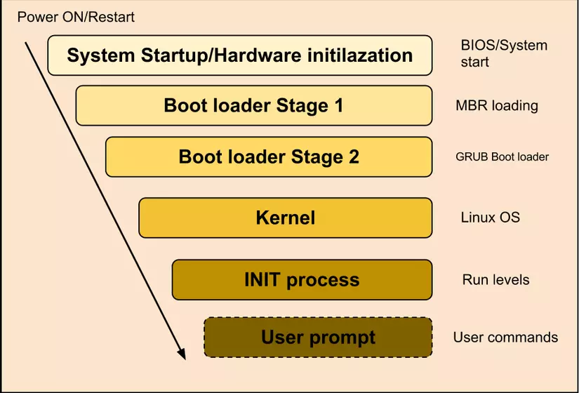

# **Tìm hiểu về GRUB Bootloader**

## **GRUB là gì?**
GRUB (GRand Unified Bootloader) là một chương trình khởi động máy tính được phát triển bởi dự án GNU. GRUB cung cấp cho người dùng một lựa chọn cho phép khởi động một trong nhiều hệ điều hành được cài trên một máy tính hoặc lựa chọn một cấu hình hạt nhân cụ thể có sẵn trên các phân vùng của một hệ điều hành cụ thể.

GNU GRUB được phát triển từ một gói phần mềm được gọi là Grand Unified Bootloader (dựa trên Lý thuyết thống nhất lớn). nó được sử dụng chủ yếu cho các hệ thống tương tự Unix. Các hệ điều hành GNU sử dụng GNU GRUB làm trình khởi động mặc định, cũng như hầu hết các bản phân phối Linux. Hệ điều hành Solaris cũng đã dùng GRUB làm trình khởi động trên các hệ thống x86, bắt đầu từ phiên bản Solaris 10 1/06.

**Các tính năng của GRUB**

- Hỗ trợ nhiều hệ điều hành – bằng cách khởi động trực tiếp nhân hệ điều hành hoặc bằng cách nạp chuỗi (chain-loading).
- Hỗ trợ nhiều hệ thống tập tin: BSD FFS, DOS FAT16 và FAT32, Minix fs, Linux ext2fs và ext3fs, ReiserFS, JSF, XFS, và VSTa fs.
- Cung cấp giao diện dòng lệnh linh hoạt lẫn giao diện thực đơn, đồng thời cũng hỗ trợ tập tin cấu hình.
**Các phiên bản của GRUB**

Có hai phiên bản của GRUB đang được sử dụng phổ biến:
- GRUB phiên bản 1 hay còn được gọi là GRUB legacy, chỉ phổ biến ở các phiên bản cũ của các bản phân phối Linux, trong đó một số vẫn còn đang được sử dụng và hỗ trợ, ví dụ như trong CentOS 5.
- GRUB phiên bản 2, được gọi là GRUB 2, được viết lại từ đầu và có ý định thay thế phiên bản tiền nhiệm của nó GRUB 1, và hiện nay nó được sử dụng bởi đa số các bản phân phối Linux.
## **Cách thức hoạt động:**



Trên sector thứ nhất của đĩa cứng chứa, ngoài bảng phân vùng, một đoạn mã thực thi được gọi là giai đoạn đầu tiên của quá trình khởi động máy tính, hoặc đoạn mã IPL (initial program load). Đoạn mã chuẩn này là cái mà lệnh fdisk /mbr trên DOS tạo ra. Khi thiết lập trong BIOS quy định khởi động từ đĩa cứng đó, BIOS sẽ trao quyền điều khiển cho IPL hoặc đoạn mã giai đoạn một. Khi đoạn mã chuẩn được nạp, nó sẽ quyết định phân vùng nào là chủ động (active) và trao quyền điều khiển cho đoạn mã thực thi được nằm ở trong hoặc gần sector thứ nhất của phân vùng chủ động. Những gì xảy ra tiếp theo phụ thuộc vào hệ điều hành.

Ở các hệ điều hành DOS cũ, phần cốt lõi thi hành được của hệ điều hành nằm ngay tại vị trí đầu tiên của đĩa và được khởi động trực tiếp từ giai đoạn một. Trong các trường hợp điển hình hơn, một chương trình khởi động giai đoạn hai sẽ được nạp và đến lượt nó sẽ biết nơi nào để tìm nhân hoặc các thành phần cốt lõi của hệ điều hành và khởi động chúng. Khi GRUB hoặc một trình khởi động được cài đặt, đoạn mã của trình khởi động đó sẽ thay thế đoạn mã IPL chuẩn. Nó phải vừa vặn trong 512 byte và còn phải chia sẻ chung với bảng phân vùng. Khác biệt chính giữa một trình khởi động và đoạn mã IPL chuẩn là quyền điều khiển sẽ đi đâu tiếp sau đó. Trong trường hợp của GRUB, quyền điều khiển sẽ được trao cho trình Giai đoạn 2 (hoặc Giai đoạn 1.5).

Giai đoạn 1 được cài vào MBR hoặc vào sector khởi động của phân vùng, còn Giai đoạn 2 được đặt trên một hệ thống tập tin. Giai đoạn 1.5 có thể được cài trong một hệ thống tập tin (chẳng hạn như ở phân vùng /boot), trong vùng khởi động của FFS hoặc ReiserFS, và trong các sector ngay sau MBR vì Giai đoạn 1.5 đủ nhỏ và các sector ngay sau MBR thường không được sử dụng. Kích thước của vùng này là số sector cho mỗi head trừ đi 1. Giai đoạn 1.5 hoặc Giai đoạn 2 có thể được đặt ở bất cứ nơi đâu, và Giai đoạn 2 có thể nạp tập tin cấu hình từ bất cứ nơi đâu trên đĩa cứng (tập tin cấu hình không cần phải được đặt trong một hệ thống tập tin).

Vì vậy tất cả công việc mà Giai đoạn 1 phải làm là tải Giai đoạn 2 hoặc Giai đoạn 1.5. Giai đoạn 1 mã hoá vị trí của Giai đoạn 2 (hay Giai đoạn 1.5) ở dạng danh sách khối, nên nó không hiểu bất cứ cấu trúc hệ thống tập tin nào. Vì GRUB hỗ trợ cả chế độ CHS lẫn LBA nên Giai đoạn 1 trong GRUB, sau khi thăm dò thông số và chế độ truy cập của đĩa cứng, chỉ tải sector đầu tiên của Giai đoạn 2 (hoặc Giai đoạn 1.5) và Giai đoạn 2 tự nó tải phần còn lại (tức là tải từ địa chỉ bắt đầu của nó cộng thêm 512 byte).

Giai đoạn 1.5 là cầu nối giữa stage1 và stage2, nghĩa là Giai đoạn 1.5 được Giai đoạn 1 nạp và Giai đoạn 1.5 nạp Giai đoạn 2. stage1 không hiểu bất kì hệ thông tập tin nào nhưng _stage1_5 hiểu một hệ thống tập tin (chẳng hạn e2fs_stage_15 hiểu ext2fs). Giai đoạn 1.5 cho phép Giai đoạn 2 có thể được nạp từ một hệ thống tập tin bằng đường dẫn thông thường mà không cần phải dùng danh sách khối. Vì vậy có thể an toàn di chuyển vị trí của stage2 đến một nơi khác (chẳng hạn như khi giải phân mảnh hệ thống tập tin), ngay cả sau khi GRUB đã được cài đặt. Gai đoạn 1 nạp Giai đoạn 1.5 vào bộ nhớ nếu cần. Một số phần cứng cần bước trung gian để nạp Giai đoạn 2, chẳng hạn như khi phân vùng /boot nằm ở vị trí quá 1024 cylinder đầu của ổ cứng hoặc khi sử dụng chế độ LBA.
## **Sử dụng GRUB:**
Có 2 cách để cài đặt GRUB làm trình khởi động cho máy tính:

- Dùng môi trường nguyên thủy của grub (khuyên dùng) : cần tạo đĩa hoặc usb khởi động grub.
- Cài đặt trong mội trường HĐH giống Unix : sử dụng grub-install hoặc shell grub. Tuy nhiên cách này có thể khiến chúng ta thăm dò sai BIOS.

### **Cài GRUB trong môi trường nguyên thủy:**

**Cài GRUB dùng lệnh setup:**

- Cài stage1 của GRUB theo cách này sẽ xoá sector khởi động đang được một hệ điều hành sử dụng. Hiện tại GRUB có thể trực tiếp khởi động GNU Mach, Linux, FreeBSD, NetBSD, và OpenBSD, vì vậy dùng GRUB trên sector khởi động thường là an toàn. Nhưng nói chung nên sao lưu sector đầu tiên của phân vùng sắp cài stage1 của GRUB. Điều này không quan trọng lắm nến cài GRUB vào sector đầu tiên của đĩa cứng, vì dễ dàng khôi phục nó (chẳng hạn như chạy fdisk /mbr trong DOS).
- Để cài GRUB trong môi trường nguyên thuỷ, cần tạo đĩa khởi động GRUB và khởi động lại máy tính với đĩa khởi động đó. Một khi đã được khởi động, GRUB sẽ trình bày giao diện dòng lệnh.
- Đầu tiên, định thiết bị root cho thư mục khởi động: grub> root (hd0,0)
Có thể dùng lệnh find nếu không chắc phân vùng nào thực sự chứa các tập tin này: grub> find /boot/grub/stage1
- Cần lưu ý là thiết bị root của GRUB không nhất thiết là phân vùng root của hệ điều hành (nếu cần xác định phân vùng root cho hệ điều hành, thêm thông số đó vào lệnh kernel).
- Một khi đã thiết lập thiết bị root chính xác, chạy lệnh setup: `grub> setup (hd0)`
- Lệnh này sẽ cài GRUB lên MBR của ổ đĩa thứ nhất. Nếu muốn cài GRUB vào sector khởi động của một phân vùng thay vì vào MBR, chỉ định phân vùng muốn cài GRUB: grub> setup (hd0,0)
- Nếu cài GRUB vào phân vùng hoặc ổ đĩa không phải là ổ đĩa đầu tiên, cần nạp chuỗi GRUB từ một trình khởi động khác.
- Bây giờ có thể khởi động GRUB mà không cần đĩa mềm GRUB.

**Cài GRUB dùng lệnh install:**

`install [--force-lba] [--stage2=tập_tin_stage2_hđh] tập_tin_stage1 [d] thiết_bị_đích tập_tin_stage2 [địa_chỉ] [p] [tập_tin_cấu_hình] [tập_tin_cấu_hình_thực]`

- Lệnh này sẽ thực hiện một cài đặt đầy đủ với giả định Giai đoạn 2 hay 1.5 đã có tại vị trí cài đặt cuối cùng.
- Đi vào chi tiết hơn, nó sẽ tải tập_tin_stage1, xác nhận rằng nó là Giai đoạn 1 đúng số phiên bản của GRUB, cài đặt một danh sách khối để nạp tập_tin_stage2 làm Giai đoạn 2 (nghĩa là tập_tin_stage2 sẽ trao cho Giai đoạn 1 vị trí của Giai đoạn 2). Nếu có tuỳ chọn d, Giai đoạn 1 luôn luôn tìm đĩa thực tế đã cài tập_tin_stage2 hơn là dùng ổ đĩa khởi động. Giai đoạn 2 sẽ được nạp tại địa chỉ địa_chỉ, phải là 0x8000 đối với Giai đoạn 2 thực, và 0x2000 đối với Giai đoạn 1.5. Nếu địa_chỉ không được chỉ định, GRUB sẽ xác định địa chỉ tự động. Sau đó nó viết Giai đoạn 1 đã hoàn chỉnh vào khối đầu tiên của thiết bị thiết_bị_đích. Nếu tuỳ chọn p hoặc tập_tin_cấu_hình được chỉ định, nó sẽ đọc khối đầu tiên của stage2, thay đổi nó bằng giá trị của phân vùng mà ở đó tập_tin_stage2 được tìm thấy (đối với p) hoặc đặt chuỗi tập_tin_cấu_hình vào vùng cho stage2 biết nơi tìm tập tin cấu hình lúc khởi động. Cũng như vậy, nếu tập_tin_cấu_hình_thực được chỉ định và tập_tin_stage2 là Giai đoạn 1.5, thì tập_tin_cấu_hình được vá bằng tên tập tin cấu hình tập_tin_cấu_hình_thực. Để dễ hiểu hơn cho trường hợp nhúng Giai đoạn 1.5: tập_tin_stage2 là vị trí nhúng stage1_5, tập_tin_cấu_hình là vị trí của stage2 (theo lô-gic, stage2 là tập tin cấu hình cho stage1_5), tập_tin_cấu_hình_thực là vị trí của menu.lst. Lệnh install không phát sinh sector bitmap cho stage2, tức là tham số tập_tin_cấu_hình, mà nó cần viết chuỗi tập_tin_cấu_hình và tập_tin_cấu_hình_thực (không ở dạng block bitmap mà ở dạng tên tập tin thuần tuý) tương ứng vào stage1_5 và stage2. stage2 nằm trên hệ thống tập tin, vì vậy tuỳ chọn --stage2 giúp cho việc viết được an toàn hơn.
- Lệnh này giữ lại DOS BPB (và đối với đĩa cứng là bảng phân vùng) của sector sẽ được cài Giai đoạn 1.
- Lưu ý:
    - Một số BIOS bị lỗi cần phải chỉ định tuỳ chọn d cho dù Giai đoạn 2 nằm ở ổ đĩa khởi động hay không Khiếm khuyết này gặp ở: Fujitsu LifeBook 400 BIOS version 31J0103A, HP Vectra XU 6/200 BIOS version GG.06.11.
    - Một số BIOS không trả về bitmap hỗ trợ LBA đúng ngay cả chúng thực sự có hỗ trợ; vì vậy GRUB cung cấp giải pháp để bỏ qua bitmap sai, đó là tuỳ chọn --force-lba. Đừng dùng tuỳ chọn này nếu BIOS không hỗ trợ LBA (chế độ LBA dùng firmware để vượt qua giới hạn 1024 cylinder của BIOS).
- Phải chỉ định tuỳ chọn --stage2 trong shell grub nếu không thể tháo gán hệ thống tập tin nơi chứa tập tin stage2. Đối số là tên tập tin trong hệ điều hành.
- Thí dụ về sử dụng lệnh install:
```sh
root (hd0,1)
embed /boot/grub/reiserfs_stage1_5 (hd0) # or e2fs_stage1_5
```
(và lưu ý số sector)
```sh
install /boot/grub/stage1 (hd0) (hd0)1+<số sector có từ lệnh embed> p /boot/grub/stage2 /boot/grub/menu.lst
```
(hoặc dùng setup (hd0))

### **Cài GRUB trong môi trường hệ điều hành giống Unix:**

**Cài GRUB dùng lệnh grub-install:**

Cách này hoàn toàn không được khuyến khích, vì có thể máy tính sẽ không thể khởi động được với GRUB. Thí dụ, hầu hết các hệ điều hành không cho GRUB biết cách ánh xạ chính xác ổ đĩa BIOS sang thiết bị của hệ điều hành, GRUB chỉ đoán cách ánh xạ. Trong hầu hết các trường hợp thì quá trình này thành công, nhưng không luôn luôn như vậy. Do đó GRUB cung cấp tập tin ánh xạ do người dùng định nghĩa device.map; nếu tập tin này cho thấy ánh xạ sai bạn cần phải sửa nó lại. Nếu không may phải cài đặt GRUB trong môi trường hệ điều hành giống UNIX, gọi lệnh grub-install với tư cách siêu người dùng (root). Cách sử dụng rất dễ dàng, bạn chỉ cần chỉ định một đối số về nơi cài đặt GRUB. Đối số có thể là tập tin thiết bị hay ổ đĩa/phân vùng theo GRUB. 

Cú pháp:

`grub-install thiết_bị_cài_đặt`

- Thí dụ: cài GRUB vào MBR của ổ đĩa IDE thứ nhất trong Linux:
    `# grub-install /dev/hda`


- Nếu đây cũng là ổ đĩa BIOS thứ nhất:
    `# grub-install 'hd(0)'`

Các thí dụ trên giả định rằng dùng các hình ảnh GRUB ở thư mục root. Nếu muốn GRUB dùng hình ảnh ở thư mục không phải là thư mục root, cần chỉ định tuỳ chọn --root-directory. Cách dùng điển hình là tạo đĩa mềm khởi động GRUB với một hệ thống tập tin. Thí dụ:
```sh
# mke2fs /dev/fd0
# mount -t ext2 /dev/fd0 /mnt
# grub-install --root-directory=/mnt '(fd0)'
# umount /mnt
```
Một thí dụ khác là khi có một phân vùng khởi động được gán tại /boot. Vì GRUB là một trình nạp khởi động, nó không biết gì về các điểm gán, nên cần chạy lệnh `grub-install` như sau:
```sh
# grub-install --root-directory=/boot /dev/hda
```

## **Cấu hình GRUB:**

- Ở giao diện dòng lệnh cần phải gõ vài lệnh để khởi động hệ điều hành. GRUB cũng cung cấp giao diện thực đơn mà chỉ cần chọn một đề mục là mọi thứ được thực hiện để khởi động hệ điều hành.

- Để có thể sử dụng giao diện thực đơn cần phải có tập tin cấu hình menu.lst ở thư mục khởi động. Khi hệ thống được khởi động, GRUB đọc nội dung của tập tin cấu hình. Không cần phải cài GRUB lại mỗi khi thay đổi nội dung tập tin này. Tập tin này mặc định nằm ở thư mục /boot/grub, nhưng có thể đặt ở bất cứ nơi đâu cũng như có thể đặt bất cứ tên gì cho nó. Phân tích thí dụ về một tập tin cấu hình:

- Tập tin này bắt đầu bằng các thiết lập chung, các tuỳ chọn liên hệ đến giao diện thực đơn. Các lệnh này có thể được đặt trước bất cứ đề mục nào (bắt đầu với lệnh title).

- GRUB bỏ qua các dùng bắt đầu với kí tự # và các dòng trống. default 0

- Đề mục thứ nhất (lưu ý là đếm bắt đầu từ 0 chứ không phải 1) sẽ là lựa chọn mặc định. timeout 30

- GRUB sẽ khởi động tự động sau 30 giây, trừ khi bị ngắt bởi một nhấn phím. fallback 1

- Nếu vì bất cứ lí do nào mà đề mục mặc định không hoạt động, quay lại đề mục thứ hai. Ở phần định nghĩa cho hệ điều hành, mỗi đề mục bắt đầu bằng một lệnh đặc biệt title. Không có lệnh boot ở cuối đề mục vì nó sẽ tự động thực hiện nếu GRUB nạp thành công các lệnh khác. Đối số cho lệnh title được dùng để trình bày một tựa/miêu tả ngắn cho đề mục.
```sh
title GNU/Linux
kernel (hd1,0)/vmlinuz root=/dev/hdb1
```
- Khởi động GNU/Linux từ đĩa cứng thứ hai.
```sh
title  FreeBSD
root   (hd0,2,a)
kernel /boot/loader
```
- Khởi động nhân FreeBSD tải từ phân vùng a trên PC slice thứ ba của đĩa cứng thứ nhất.
```sh
title OS/2
root  (hd0,1)
makeactive
```
- Khởi động OS/2 chainloader +1
- Nạp chuỗi trình khởi động OS/2 từ sector thứ nhất
```sh
title Windows NT / Windows 95
root (hd0,0)
makeactive
chainloader +1
```
- Khởi động Windows NT/Windows 95
- Các tuỳ chọn cách nhau bằng khoảng trắng. Số có thể ở dạng thập phân hoặc thập lục phân. Số thập lục phân phải khởi đầu bằng 0x, và phân biệt chữ hoa-thường.
- Nếu quá trình cài GRUB đã không quy định tập tin cấu hình, vẫn có thể tải tập tin cấu hình trong môi trường GRUB bằng lệnh configfile, thí dụ: grub> configfile (fd0)/boot/grub/menu.lst

# **Tài liệu tham khảo**
1. Ngo The Hai Anh, 2018-01-30, Tìm hiểu về GRUB Bootloader
, https://viblo.asia/p/tim-hieu-ve-grub-bootloader-jvElaOYYKkw, 2023-04-05