# **Command line trong thư mục**

## **`ls` - Listing Files**

**Lựa chọn**|**Mô tả**|**Ví dụ**|
------------|---------|---------|
|-a, --all|Liệt kê tất cả các mục kể cả những mục bắt đầu bằng dấu chấm|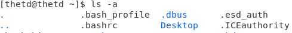|
|-A, --almost-all|Liệt kê tất cả các mục trừ . và ..|
|-c|Sắp xếp tệp theo thời gian thay đổi|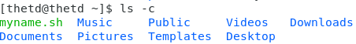
|-d, --directory|Liệt kê các mục thư mục|
|-h, --human-readable|Hiển thị kích thước ở dưới dạng con người có thể đọc được (i.e K, M)|
|-H|Hiển thị các tên file và thư mục theo cách đầy đủ, bao gồm cả các ký tự đặc biệt và khoảng trắng trong tên file hoặc thư mục. Nếu không sử dụng tùy chọn này, các ký tự đặc biệt và khoảng trắng sẽ được hiển thị dưới dạng các ký tự thoát, chẳng hạn như "file\ name"|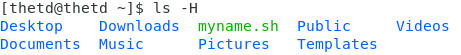|
|ls -l|Hiển thị nội dung ở định dạng danh sách dài||
|ls -o|Định dạng danh sách dài không có thông tin nhóm||
|ls -r, --reverse|Hiển thị nội dung theo thứ tự ngược lại||
|ls -s, --size|Kích thước của mỗi tệp theo khối||
|ls -S|Sắp xếp theo kích thước tệp||
|ls -t|Sắp xếp theo thời gian sửa đổi||
|ls -u|Sắp xếp theo thời gian truy cập cuối cùng|
|ls -v|Sắp xếp theo phiên bản||
|ls -1|Liệt kê một tệp trên mỗi dòng||

### **`ls -l: Các tệp ở dạng danh sách dài**

**`ls -l /etc`**

Lệnh `ls -l /etc` sẽ liệt kê các tập tin và thư mục trong thư mục `/etc` kèm theo thông tin chi tiết về chúng, bao gồm quyền truy cập, chủ sở hữu, nhóm, kích thước và thời gian sửa đổi.

**Cột**|**Ví dụ**|**Miêu tả**|
-------|---------|-----------|
1.1|d|Loại tệp
1.2|rwxr-xr-x|Chuỗi quyền
2|3|Số liên kết cứng
3|root|Tên chủ sở hữu
4|root|Nhóm chủ sở hữu
5|101|Kích thước tệp tính bằng byte
6|Mar 10 10:37|Thời gian sửa đổi
7|abrt|Tên file

**File type**

Loại tệp có thể là một trong các ký tự sau.

**Character**|**File Type**
|------------|-------------|
|-|Tệp tin thông thường|
|b|Chặn tập tin đặc biệt|
|c|Tập tin ký tự đặc biệt|
|C|Tệp hiệu suất cao ("dữ liệu liền kề")|
|d|Danh mục|
|D|Cửa (tệp IPC đặc biệt chỉ có trong Solaris 2.5+)|
|l|Liên kết tượng trưng|
|M|Tệp ngoại tuyến ("đã di chuyển") (Cray DMF)|
|n|Tệp mạng đặc biệt (HP-UX)|
|p|Xuất hiện trong các hệ thống Unix (nhưng không phải trong Linux) và đại diện cho một file socket (hoặc FIFO - First In First Out)|
|P|Cổng (tệp hệ thống đặc biệt chỉ trong Solaris 10+)|
|s|Socket|
|?|Một số loại tệp khác|

### **Liệt kê mười tệp được sửa đổi gần đây nhất**

Sử dụng một danh sách dài định dạng (-l) và sắp xếp theo thời gian (-t)

`ls -lt | head`

### **Liệt kê tất cả các tệp bao gồm Dotfiles**

**Dotfile** là một tệp có tên bắt đầu bằng .. Các tệp này thường bị ẩn bởi `ls` và không được liệt kê trừ khi được yêu cầu.

Ví dụ: `ls`

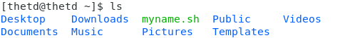

Tùy chọn -a hoặc --all sẽ liệt kê tất cả các tệp, bao gồm cả tệp dotfile.

Tùy chọn -A hoặc --almost-all sẽ liệt kê tất cả các tệp, bao gồm tệp dotfile, nhưng không liệt kê các tệp . và ... Lưu ý rằng . là thư mục hiện tại và .. là thư mục mẹ

### **Liệt kê các tệp tin định dạng tree**

Lệnh `tree` liệt kê nội dung của một thư mục được chỉ định ở định dạng giống như cây. Nếu không có thư mục nào được chỉ định thì, theo mặc định, nội dung của thư mục hiện tại được liệt kê.

VD:

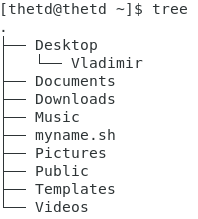

Sử dụng tùy chọn -L của lệnh cây để giới hạn độ sâu hiển thị và tùy chọn -d để chỉ liệt kê các thư mục.

### **Liệt kê các tệp được sắp xếp theo kích thước**

Tùy chọn -S của lệnh ls sắp xếp các tệp theo thứ tự kích thước tệp giảm dần

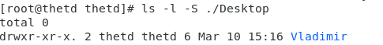

Khi được sử dụng với tùy chọn -r, thứ tự sắp xếp bị đảo ngược

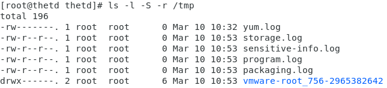

## **Điều hướng thư mục**

### **Thư mục tuyệt đối và tương đối**

Để thay đổi một thư mục được chỉ định tuyệt đối, hãy sử dụng toàn bộ tên, bắt đầu bằng dấu gạch chéo /, do đó

Nếu bạn muốn thay đổi một thư mục gần hiện tại của mình, bạn có thể chỉ định một vị trí tương đối. Ví dụ, nếu bạn đang đã có trong /home/thetd/, do đó bạn có thể nhập thư mục con 

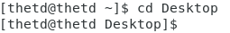

Nếu bạn muốn đến thư mục phía trên thư mục hiện tại, bạn có thể sử dụng bí danh ... Ví dụ: Nếu bạn ở trong /home/thetd/Desktop và muốn truy cập /home/thetd, thì bạn sẽ làm như sau:

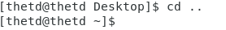

### **Trở về thư mục chính**

Có 3 cách để trở về thư mục chính

`cd`

`cd %HOME`

`cd ~`

## **`PWD (Print Working Directory)**

Lệnh **PWD (Print Working Directory**) dùng để hiển thị đường dẫn đầy đủ của thư mục hiện tại đang làm việc trên Terminal hoặc Command Prompt

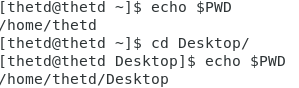

## **Lệnh `mkdir` để tạo thư mục**

`mkdir <tên tệp>`

- Tạo 1 thư mục blabla ngay tại thư mục hiện hành

- Tạo 1 thư mục blabla tại thư mục /home/thetd/Desktop

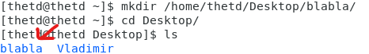

- Tạo nhiều thư mục cùng lúc

`mkdir <path name 1> <path name 2> <path name 3>`

- Tạo nhiều thư mục tại thư mục khác

VD: `mkdir /home/thetd/Desktop/{the1,the2,the3}

- Tạo thư mục kèm cấp thư mục cha.

Để tạo một thư mục kèm theo một thư mục cấp cha của nó phải được tạo ra ngay cả khi thư mục cha chưa tồn tại. Thì mình có thể dùng option "`-p`"
 
**Cú pháp**

`mkdir -p <path name>`

- Nếu ta tạo tiếp thư mục như trên sẽ hiện lỗi sau

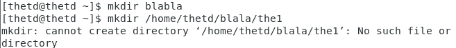

- Nên ta phải dùng option "`-p`" và "`-v`" để xem lệnh `mkdir` xử lý. Đầu tiên nó sẽ tạo thư mục cấp cha là `blabla` nếu nó chưa tồn tại. Sau đó nó sẽ tạo thư mục con `the1` kế đến

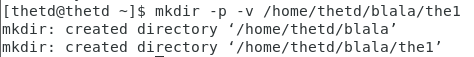

Dùng lệnh `TREE` để kiểm tra

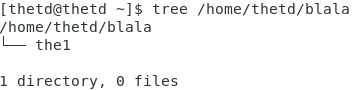

- Tạo thư mục với phân quyền cụ thể

**Cú pháp lệnh**

`mkdir -p <permission_value> <path name>

VD

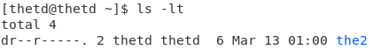

- Hiển thị quá trình tạo thư mục

Với `-v` của lệnh **mkdir** sẽ buộc phải in ra output thông tin như khởi tạo thư mục thành công hay không, thất bại, thư mục đã tồn tại

[mkdir](https://cuongquach.com/lenh-mkdir-trong-linux-tao-thu-muc.html)

