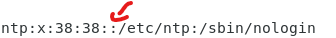

# **User and Group**

Trong Linux, các tài khoản người dùng và nhóm được sử dụng để quản lý truy cập vào các tài nguyên hệ thống.

Mỗi người dùng trên hệ thống Linux có một tài khoản người dùng riêng, được xác định bởi tên người dùng (username) và mật khẩu (password). Tài khoản người dùng cũng có một UID (User ID) duy nhất được gán cho nó bởi hệ thống.

Các tài khoản người dùng được quản lý bởi hệ thống Linux thông qua các quyền truy cập được gán cho từng tài khoản. Mỗi tài khoản người dùng được xác định bởi UID của nó.

Các nhóm trên hệ thống Linux được sử dụng để quản lý các quyền truy cập vào các tài nguyên hệ thống. Một nhóm là một tập hợp các tài khoản người dùng và có một GID (Group ID) duy nhất được gán cho nó bởi hệ thống.

Mỗi tài khoản người dùng có thể thuộc nhiều nhóm khác nhau, và mỗi nhóm có thể chứa nhiều tài khoản người dùng khác nhau. Khi một tài nguyên được tạo trên hệ thống, người dùng và nhóm được gán quyền truy cập vào tài nguyên đó.

Thông thường, các tệp và thư mục trên hệ thống Linux được sở hữu bởi một người dùng cụ thể và một nhóm cụ thể. Từ đó, quyền truy cập vào tệp và thư mục sẽ được kiểm soát bởi người sở hữu và nhóm sở hữu của chúng.

Người dùng và nhóm được quản lý bởi các tệp và thư mục `/etc/passwd` và `/etc/group` trên hệ thống Linux.

## **File `/etc/paswd`

Chứa thông tin về các tài khoản người dùng trên hệ thống Linux. Các thông tin trong tệp này được phân tách bằng dấu hai chấm (:), theo định dạng

    username:password:UID:GID:comment:home:shell
    
Bao gồm các trường sau:
1. Tên người dùng (username): là tên duy nhất được gán cho tài khoản người dùng.
2. Mật khẩu (password): là mật khẩu được mã hóa hoặc xác định rằng tài khoản không có mật khẩu.
3. UID (User ID): là số duy nhất được gán cho tài khoản người dùng.
4. GID (Group ID): là ID của nhóm mà tài khoản người dùng thuộc về.
5. Mô tả (gecos): là một chuỗi các thông tin bổ sung về người dùng, như tên đầy đủ, số điện thoại, v.v.
6. Thư mục home: là đường dẫn đến thư mục home của người dùng.
7. Shell: là chương trình được sử dụng khi người dùng đăng nhập vào hệ thống
    
Ví dụ:

Trường nào khồn có giá trị sẽ được để trống, VD:

## **File `/etc/shadow`**

Trên các hệ thống Linux hiện đại, thông thường mật khẩu của tài khoản người dùng sẽ không được lưu trực tiếp trong tệp `/etc/passwd` mà thay vào đó sẽ được lưu trữ trong tệp `/etc/shadow`. Điều này là để đảm bảo tính bảo mật của mật khẩu người dùng, vì nếu mật khẩu được lưu trực tiếp trong tệp `/etc/passwd`, thì nó có thể bị truy cập bởi những người không được phép truy cập đến tệp này.

Trên hệ thống sử dụng tệp `/etc/shadow`, trường mật khẩu trong tệp `/etc/passwd` sẽ thường được thay bằng một ký tự đặc biệt, ví dụ như "x". Trường này không còn được sử dụng để lưu trữ mật khẩu, mà chỉ được sử dụng để đánh dấu rằng mật khẩu được lưu trữ trong tệp `/etc/shadow`.

Trong tệp `/etc/shadow`, mật khẩu của người dùng sẽ được lưu trữ ở dạng đã được mã hóa, và chỉ có các quyền đặc biệt được cấp cho các quản trị viên hệ thống để có thể đọc được tệp này.

Định dạng của các bản ghi trong file `/etc/shadow`

    username:password:last password change:min:max:warning:inactive:expired

Với **change:min:max:'warning':inactive:expired** là các thông tin liên quan đến việc thay đổi password

## **Tạo, sửa, xóa user**

### **Thêm user**

Cú pháp tạo mới User

    $ sudo useradd [options] <username>

Trong đó, các Options có thể là:

|**Option**|**Mô tả**|
|----------|---------|
|`-u UID`|chỉ định UID (User ID) cho người dùng mới được tạo. Giá trị UID phải là một số nguyên dương không trùng với UID của người dùng khác trên hệ thống|
|`-g GID`|chỉ định GID (Group ID) cho người dùng mới được tạo. Giá trị GID phải là một số nguyên dương tương ứng với GID của một nhóm đã tồn tại trên hệ thống.|
|`-c "COMMENT"`|đặt một thông tin mô tả ngắn gọn về người dùng mới|
|`-d HOME_DIR`|chỉ định thư mục home cho người dùng mới được tạo. Thư mục này sẽ được tạo tự động nếu không tồn tại|
|`-s SHELL`|chỉ định shell mặc định cho người dùng mới được tạo|
|`-m`| tạo thư mục home cho người dùng mới nếu nó chưa tồn tại|
|`-p PASSWORD`|thiết lập mật khẩu cho người dùng mới. Lưu ý rằng lệnh này không được khuyến khích sử dụng do nguy cơ bảo mật|
|`-e EXPIRE_DATE`|chỉ định ngày hết hạn cho tài khoản người dùng. Nếu tài khoản không được sử dụng trong thời gian này, tài khoản sẽ bị khóa|
|`-f INACTIVE_DAYS`|chỉ định số ngày không hoạt động trước khi tài khoản người dùng bị khóa|
|`-l`|khi tạo người dùng mới, không tạo file `lastlog` và `faillog`|
|`-k SKEL_DIR`|chỉ định thư mục mẫu chứa các file cấu hình được sao chép sang thư mục home của người dùng mới|
|`-z`|chỉ định người dùng SELinux cho người dùng mới. Chỉ sử dụng trên hệ thống hỗ trợ SELinux.|
|`-r`|tạo một người dùng hệ thống|
|`-o`|cho phép sử dụng UID không duy nhất, tức là cho phép tạo người dùng mới với UID giống với một người dùng đã tồn tại trên hệ thống|
|`-M`|không tạo thư mục home cho người dùng mới|
|`-U`|tạo một nhóm có tên trùng với tên người dùng mới, và gán người dùng mới vào nhóm này|
|`-G GROUPS`|chỉ định một danh sách các nhóm mà người dùng mới sẽ được gán vào. Các nhóm cách nhau bởi dấu phẩy (,)|
|`-P`|chỉ định đường dẫn tiền tố cho tên người dùng mới|
|`-R`|chỉ định thư mục gốc của hệ thống tùy chọn|

VD: Tạo người dùng và đặt thông tin chủ sở hữu cho thư mục home

    sudo useradd -m -d /home/myuser -o -u 2000 -g 1000 myuser

Tạo người dùng mới và gán một số thông tin

    sudo useradd -m -c "Tran Duc The" -s /bin/bash myuser

...

Để cập nhật password cho user 

    $ passwd <username>

**Cập nhật user**

    $ sudo usermod [options] <username>

Trong phần cập nhật user, có phần thêm user vào group.

Để thêm user vào group mới, đồng thời out hết các group khác, sử dụng cú pháp

    $ sudo usermod -G <group-name> <user-name>

Thêm user vào group mới, vẫn là thành viên group cũ

    $ sudo usermod -aG <group-name> <user-name>

**Xóa User**

    $ sudo userdel [options] <username>

Trong đó, các options bao gồm:
- --force (-f): xóa user (và home directory) kể cả có người đang đăng nhập
- --remove (-r): xóa user (và home directory) nhưng user phải log out ra từ trước

**Password policies - các yêu cầu đối với mật khẩu**

Hai cách thiết lập password policies phổ biến nhất là cấu hình file /etc/login.defs và sử dụng PAM (Pluggable Authentication Module)

Với file /etc/login.defs, ta cập nhật giá trị cho các biến định nghĩa sẵn để thiết lập cấu hình cho mật khẩu, ví dụ:
- PASS_MAX_DAYS số ngày tối đa mật khẩu có thể sử dụng, sau đấy là phải đổi.
- PASS_MIN_DAYS số ngày tối thiểu trước khi đổi sang mật khẩu mới.
- PASS_MIN_LEN độ dài nhỏ nhất của mật khẩu.
- PASS_WARN_AGE số ngày cảnh báo trước khi mật khẩu hết hạn.

## **Group**

### **File `/etc/group`**

Linux lưu trữ thông tin group trên file /etc/group với định dạng:

    groupname:password:GID:group members

Ví dụ:

    editors:x:2002:damon,tyler

### **Thêm, xóa, sửa**

**Thêm**

    $ sudo groupadd [options] <group-name>

Trong đó phổ biến nhất là Option
- --gid: Group id

**Cập nhật**

    $ sudo groupmod [options] <group-name>

Trong đó các option có thể là 
- --gid (-g): cập nhật group id
- --new-name (-n): cập nhật group name

**Xóa**

    $ sudo groupdel <group-name>

# **Tài liệu tham khảo**

1. [User group management](https://www.redhat.com/sysadmin/linux-user-group-management)
2. [User group management](https://viblo.asia/p/quan-tri-user-group-tren-linux-cho-nguoi-ngao-2oKLn0nW4QO)