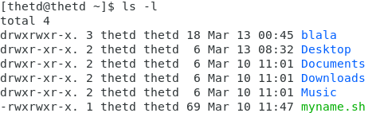
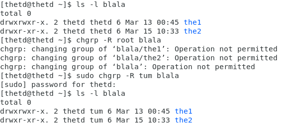
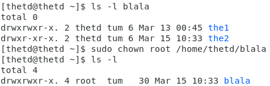
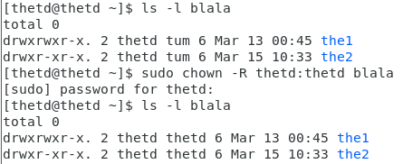
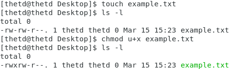
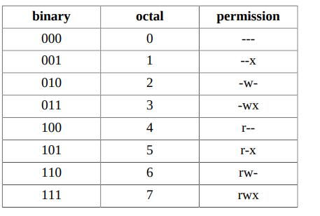
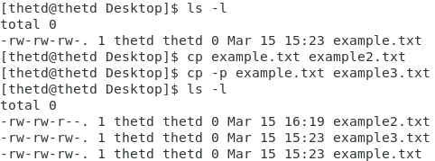

# **File Permission**

## **I. Phân quyền cơ bản**

### **1. Quyền hạn là gì và tại sao phải phân quyền trên linux**

Quyền hạn trong Linux là khả năng *truy cập* vào một "file" của một người dùng trong hệ thống. Vì các hệ điều hành đều hướng đến hỗ trợ nhiều người dùng sử dụng đồng thời nên phân quyền là rất quan trọng.

### **2. Các loại file**

Tất cả mọi thứ trong Linux đều được coi là **file**. Khi sử dụng lệnh `ls -l`, có 10 ký tự hiển thị trước người và nhóm sở hữu.



*dot(.)* là thuộc tính mở rộng

**Character**|**File Type**
|------------|-------------|
|-|Tệp tin thông thường|
|b|Chặn tập tin đặc biệt|
|c|Tập tin ký tự đặc biệt|
|C|Tệp hiệu suất cao ("dữ liệu liền kề")|
|d|Danh mục|
|D|Cửa (tệp IPC đặc biệt chỉ có trong Solaris 2.5+)|
|l|Liên kết tượng trưng|
|M|Tệp ngoại tuyến ("đã di chuyển") (Cray DMF)|
|n|Tệp mạng đặc biệt (HP-UX)|
|p|Xuất hiện trong các hệ thống Unix (nhưng không phải trong Linux) và đại diện cho một file socket (hoặc FIFO - First In First Out)|
|P|Cổng (tệp hệ thống đặc biệt chỉ trong Solaris 10+)|
|s|Socket|
|?|Một số loại tệp khác|

### **3. Sở hữu tập tin**

Trong linux có ba nhóm phân quyền chính không bao nhau:


```sh
- User: chỉ cấp quyền cho người sở hữu của file
- Group: chỉ cấp quyền cho nhóm sở hữu của file
- Other: cấp quyền cho những người dùng và nhóm không thuộc 2 nhóm trên
```
Tuy nhiên vẫn có 1 ngoại lệ, đó là người dùng ***root*** (siêu người dùng). Người dùng này có mọi quyền hạn trên mọi file trong hệ thống, không bị rầng buộc bởi bất cứ sự phân quyền nào

#### **3.1 User owner và Group owner**

Các user và group có thể sở hữu các file. Và mọi file đều có User owner và Group owner, có thẻ xem bằng lệnh `ls -l`

#### **3.2 `chgrp` và `chown`**

**Sử dụng lệnh `chgrp` để thay đổi group owner của một file**

Cú pháp cơ bản của lệnh

    chgrp [options] GROUP FILE...

Trong đó:
- `Group`: Tên của nhóm mới sẽ được gán cho các tệp hoặc thư mục
- `File...`: Danh sách các tệp hoặc thư mục bạn muốn thay đổi nhóm chủ sở hữu
- `options`: Một số Option phổ biến như
    - `-v`: Hiển thị thông báo cho mỗi tệp hoặc thư mục mà nhóm sở hữu được thay đổi.
    - `-R`: Thay đổi nhóm sở hữu cho các tệp và thư mục đệ quy trong thư mục được chỉ định.
    - `--dereference`: Thay đổi nhóm sở hữu của tệp được liên kết tới thay vì liên kết đến tệp.
    - `--no-dereference`: Thay đổi nhóm sở hữu của liên kết tới tệp thay vì tệp.

Ví dụ: Thay dổi nhóm sở hữu của thư mục `blala` và tất cả các tệp con của nó thành `tum`

    chgrp -R tum blala



**Sử dụng lệnh `chown` để thay đổi user owner của file**

Cú pháp sử dụng:

    chown [options] [user][:group] file

Trong đó: 
- `user` là tên người dùng mới mà bạn muốn đặt làm chủ sở hữu của tệp hoặc thư mục.
- `group` là tên nhóm mới mà bạn muốn đặt làm nhóm sở hữu của tệp hoặc thư mục.
- `file` là tên của tệp hoặc thư mục mà bạn muốn thay đổi quyền sở hữu.

VD: 



Có thể sử dụng `chown` để thay đổi cả user owner và group owner



#### **3.3 Phân quyền**


Chín ký tự sau ký tự kiểu file tượng trưng cho quyền trong bộ ba. Quyền ở một bộ ba có thể  có **r** là quyền đọc, **w** là quyền ghi, **x** là quyền thực thi. Với thực mục, quyền **r** là để xem nội dung trong thư mục, **x** là để vào thư mục và **w** là để tạo hoặc xóa file ở trong thư mục

|permission | trên một file |trên một thư mục|
|---|--|--|
|r (read)| read file contents (cat) |read directory contents (ls)|
|w (write) |change file contents (vi) | create files in (touch)|
|x (execute) |execute the file |enter the directory (cd)|

Lệnh output của lệnh `ls -l` bắt đầu với 10 ký tự, chức năng của nó được liệt kê trong bảng dưới đây.

|Vị trí |Chức năng|
|-|-|
|1    | Hiển thị loại file
|2-4  |Quyền cho user owner
|5-7  |quyền cho the group owner
|8-10 |quyền cho những user khác

- Quyền cho người sở hữu được(2-4) áp dụng cho user owner của file hay thư mục, tất cả những quyền còn lại không ảnh hưởng đến quyền của user owner
- Những user thuộc group owner của một file thì quyền cho group owner (5-7) được áp dụng cho các user đó và những quyền còn lại không ảnh hưởng đến quyền truy cập file của các user này
- Các user không phải là user owner cũng không thuộc vào group owner của file sẽ được áp dụng quyền theo quyền cho các user khác (8-10). Những quyền còn lại không ảnh hưởng đến quyền của các user này khi truy cập file

**Thiết lập quyền (chmod)**

Quyền được thay đổi với lệnh 
    
    chmod <mode> <tên file>.

Trong đó:
- `mode` là quyền truy cập mới mà bạn muốn áp dụng cho file hoặc thư mục, được định dạng bằng các ký tự hoặc số. Các ký tự được sử dụng để đại diện cho các quyền truy cập cụ thể, bao gồm:
    - `r`: Quyền đọc (read)
    - `w`: Quyền ghi (write)
    - `x`: Quyền thực thi (execute)

Ký tự:
    - `+` được sử dụng để thêm quyền truy cập
    - `-` được sử dụng để loại bỏ quyền truy cập
    - `=` được sử dụng để thiết lập quyền truy cập mới

Đối tượng
    - `u`: User
    - `g`: Group
    - `o`: Others
Ví dụ:  

`u+rwx` sẽ thêm quyền đọc, ghi và thực thi cho chủ sở hữu của file, `g-x` sẽ loại bỏ quyền thực thi cho nhóm, `o=r` sẽ thiết lập quyền đọc cho tất cả các người dùng khác.



**Phân quyền dùng số bát phân**

Những người quản trị hệ thống Unix, Linux thường dùng số bát phân để phân quyền. Với **r** bằng 4, **w** bằng 2 và **x** bằng 1



Ví dụ khi set quyền 777 nghĩa là rwxrwxrwx, hay 644 có nghĩa là rw-r--r--. Lệnh `chmod` cũng chấp nhận những số này:
 
```sh
 $ chmod 777 example.txt
 -rwxrwxrwx 1 thetd thetd 0 Mar 15 15:23 example.txt
 $ chmod 640 example.txt
 -rw-r----- 1 thetd thetd 0 Mar 15 15:23 example.txt
```
**`mkdir -m`**

Khi tạo một thư mục bằng `mkdir` có thể sử dụng tùy chọn -m để cài đặt quyền cho nó.
```
$ mkdir -m 700 MyDir
$ mkdir -m 777 Public
$ ls -dl MyDir/ Public/
drwx------ 2 thetd thetd 4096 2023-03-15 15:23 MyDir/
drwxrwxrwx 2 thetd thetd 4096 2023-03-15 15:23 Public/
```
**`cp -p`**

Khi copy một file thì file mới cũng được phân quyền theo umask. Để giữ lại quyền và thời gian giống file trước thì dùng `cp -p`



## **File permission nâng cao**

1. Sticky bit trên thư mục

Bit Sticky: Sticky bit được cài trên một thư mục để ngăn chặn việc xóa file hay thư mục con bên trong thư mục đó bởi người dùng không có quyền sở hữu. Sticky bit được hiển thị cùng vị trí với quyền x(execute) của nhóm người dùng o (other), được biểu diễn bởi t( có cả quyền x cho o) hoặc T (không có quyền x cho o).

Sticky bit cũng có thể được thiết lập bằng sô octal bằng cách thêm số "1" trước ba số phân quyền. ví dụ: `chmod 1776 a.txt` thì file a.txt sẽ có quyền là`-rwxrwxrwT`

2. Setgid bit trên thư mục

setgid để đảm bảo các file trong thư mục đó đều thuộc quyền sở hữu của group owner của thư mục. Setgid được hiển thị ở vị trí quyền x của g, được đại diện bởi s ( có quyền x cho g) hoặc S( không có quyền x cho g). Setgid cũng có thể thiết lập bằng số 2 trước bộ ba số phân quyền. Ví dụ `chmod 2664 a.txt` thì file a.txt sẽ có quyền là `-rw-rwSr--`

3. Setgit và setuid trên cùng một file

Setgid và setuid là các bit quyền đặc biệt được sử dụng để thay đổi quyền thực thi của file trong Linux. Khi một file được đánh dấu setgid hoặc setuid, người dùng thực thi file đó sẽ thừa hưởng quyền của người sở hữu file đó (setgid) hoặc quyền của người sở hữu quyền thực thi file (setuid).

Nếu một file được đánh dấu setgid và setuid cùng một lúc, khi người dùng thực thi file đó, họ sẽ thừa hưởng cả quyền setgid và setuid. Nghĩa là, người dùng sẽ được thừa hưởng quyền của người sở hữu file đó cũng như quyền của người sở hữu quyền thực thi file.

Tuy nhiên, việc sử dụng cả setgid và setuid trên cùng một file là không phổ biến và cần được cân nhắc cẩn thận vì nó có thể dẫn đến vấn đề về bảo mật. Việc sử dụng quyền đặc biệt như setgid và setuid cần phải được xác định rõ ràng và được áp dụng đúng mục đích để đảm bảo an toàn cho hệ thống.

# **Tài liệu tham khảo**
1. https://www.redhat.com/sysadmin/linux-file-permissions-explained#:~:text=All%20Linux%20files%20belong%20to,write%2C%20and%20x%20for%20execute.
2. https://viblo.asia/p/phan-quyen-trong-linux-yMnKMbDNZ7P
3. https://madeeshafernando.medium.com/basics-of-linux-file-permission-5db00bd9749f