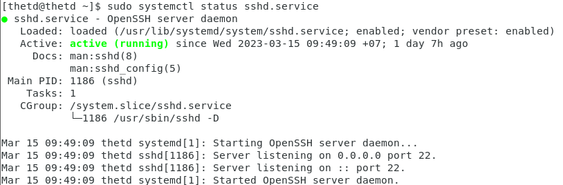

# **1. Giới thiệu về Systemd**

**Systemd (System deamon)** là một hệ thống khởi động và quản lý dịch vụ cho các hệ thống Linux. Nó được thiết kế để thay thế cho các hệ thống khởi động truyền thống như SysVinit và Upstart. Systemd quản lý các dịch vụ (services) của hệ thống bao gồm các quá trình đang chạy, các tệp cấu hình và các phần mềm khác được kết nối với hệ thống.

- *SysVinit (System V Initialization) là một hệ thống khởi động và quản lý dịch vụ cho các hệ thống Unix và Linux. Nó là hệ thống khởi động truyền thống được sử dụng trong các bản phân phối Linux trước khi systemd ra đời*

- *Upstart là một hệ thống khởi động và quản lý dịch vụ cho các hệ thống Linux, được phát triển bởi Canonical (công ty phát triển Ubuntu). Upstart đã được sử dụng trong các phiên bản Ubuntu từ 6.10 đến 14.10 trước khi bị systemd thay thế*

## **Các loại đơn vị Systemd có sẵn**


**Unit Type**|**File Extension**|**Description**
-------------|------------------|---------------
Service unit|`.service`|Các file quản lý hoạt động của 1 số chương trình
Target unit|`.target`|Quản lý tạo liên kết
Automount unit|`.automount`|Tự động gắn thiết bị
Device unit|`.device`|Quản lý thiết bị
Mount unit|`.mount`|Gắn thiết bị
Path unit|`.path`|Quản lý các đường dẫn
Scope unit|`.scope`|Quy định không gian hoạt động
Slice unit|`.slice`|Dùng cho quản lý tiến trình
Snapshot unit|`.snapshot`|Sao lưu
Socket unit|`.socket`|Quản lý các kết nối
Swap unit|`.swap`|Vùng không gian bộ nhớ trên đĩa cứng
Timer unit|`.timer`|Một bộ đếm thời gian Systemd

## **Vị trí tệp Systemd unit**

`/user/lib/systemd/system/`

```sh
~]$ ls /user/lib/systemd/system/
abrt-cpp.service
amanda.socket
chrony-dnssrv@.timer
```
- Là một trong các thư mục chứa các file cấu hình của systemd trên hệ thống Linux
- Chứa các file cấu hình định nghĩa các dịch vụ và các unit của systemd mà được cài đặt từ các gói phần mềm trên hệ thống
- Các file cấu hình trong thư mục này có thể bị ghi đè bởi các file cấu hình trong thư mục /etc/systemd/system hoặc trong thư mục /run/systemd/system.

`/run/systemd/system/`

```sh
~]$ ls /run/systemd/system/
session-4.scope
user-1000.slice
```
- Là một trong những thư mục quan trọng của systemd trong hệ thóng Linux
- Chứa các file cấu hình định nghĩa các dịch vụ và các unit của các systemd được tạo rs và quản lý bởi systemd trên thời điểm chạy của hệ thống.
- Các file cấu hình trong thư mục này có thể bị ghi đè bởi các file cấu hình trong thư mục /etc/systemd/system, tuy nhiên, các file trong thư mục /run/systemd/system được đọc trước khi các file trong thư mục /etc/systemd/system được đọc, vì vậy nếu có các file trùng tên trong cả hai thư mục thì file trong thư mục run/systemd/system sẽ được sử dụng.
- Thư mục /run/systemd/system được tạo ra khi systemd được khởi động và sẽ bị xóa khi hệ thống được tắt. Các file cấu hình trong thư mục này được tạo ra tự dộng bởi systemd và không nên sửa đổi thủ công

`/etc/systemd/system`
```sh
~]$ ls /etc/systemd/system
runlevel0.target
rngd.service
```
-  Là một trong những thư mục quan trọng nhất của systemd trên hệ thống Linux. Thư mục này chứa các file cấu hình đơn lẻ hoặc các thư mục chứa các file cấu hình dùng chung cho toàn bộ hệ thống
- Các file trong thư mục /etc/systemd/system được sử dụng để định nghĩa các dịch vụ và các unit của systemd. Unit là thành phần cơ bản của systemd và bao gồm các dịch vụ, timer, socket, device và các unit khác
- Thư mục /etc/systemd/system thường được ưu tiên hơn so với các thư mục khác như /usr/lib/systemd/system hoặc /run/systemd/system, vì các file cấu hình trong thư mục này có ưu tiên hơn và sẽ được systemd đọc trước

## **Ghi đè cấu hình systemd mặc định bằng system.conf**

File cấu hình system.conf trong systemd được sử dụng để ghi đè các thiết lập mặc định cho hệ thống. Nó được đặt tại đường dẫn /etc/systemd/system.conf

Khi hệ thống khởi động, systemd sẽ đọc các thiết lập trong file này trước khi bắt đầu quản lý các dịch vụ. Các thiết lập trong file này trước khi bắt đầu quản lý các dịch vụ. Các thiết lập trong file này có thể được sử dụng để thay đổi các thiết lập mặc định của systemd trên hệ thống.

Một số thiết lập phổ biến trong file system.conf bao gồm:

- Cấu hình thời gian chờ của các tiến trình
- Đặt giới hạn cho số lượng tiến trình được tạo ra trong một thời điểm
- Điều chỉnh giới hạn tài nguyên như bộ nhớ, CPU và I/O
- Cấu hình cơ chế journaling để lưu trữ log

Ví dụ, để giảm thời gian chờ mặc định của systemd trước khi tắt hệ thống từ 90 giây xuống còn 30 giây, bạn có thể ghi đè giá trị mặc định bằng cách tạo một file `/etc/systemd/system.conf.d/custom.conf` với nội dung như sau

```sh
DefaultTimeoutStopSec=30s
```
```sh
~]$ systemctl show
TimeoutStopSec=1min 30s
~]$ sudo nano /etc/systemd/system.conf 
#Sửa lại giá trị TimeoutStopSec=30
~]$ systemctl show
TimeoutStopSec=30s
```
## **Các thành phần của Systemd**

Về cơ bản thì systemd tương đương với một chương trình quản lý hệ thống và các dịch vụ trong Linux. Nó cung cấp một số các tiện ích như sau

### `systemctl`

**systemctl** là một công cụ quản lý dịch vụ (service) trong hệ thống systemd. Nó được sử dụng để quản lý các unit của systemd như các dịch vụ (service), máy chủ (socket), tác vụ (timer), ứng dụng (application) và các unit khác.

Với **systemctl**, bạn có thể khởi động, dừng, khởi động lại, kiểm tra trạng thái, bật/tắt khởi động cùng với hệ thống và nhiều tác vụ quản lý khác liên quan đến các unit của systemd.

Dưới đây là một số câu lệnh phổ biến trong systemctl:

- systemctl start <tên dịch vụ>: Khởi động dịch vụ.
- systemctl stop <tên dịch vụ>: Dừng dịch vụ.
- systemctl restart <tên dịch vụ>: Khởi động lại dịch vụ.
- systemctl status <tên dịch vụ>: Hiển thị trạng thái của dịch vụ.
- systemctl enable <tên dịch vụ>: Kích hoạt dịch vụ để tự động khởi động cùng hệ thống.
- systemctl disable <tên dịch vụ>: Vô hiệu hóa dịch vụ để không tự động khởi động cùng hệ thống.
- systemctl is-active <tên dịch vụ>: Kiểm tra xem dịch vụ đang hoạt động hay không.
- systemctl is-enabled <tên dịch vụ>: Kiểm tra xem dịch vụ đã được kích hoạt để tự động - khởi động cùng hệ thống hay không.
- systemctl list-units --type=service: Liệt kê tất cả các dịch vụ.
- systemctl reload <tên dịch vụ>: Tải lại cấu hình của dịch vụ mà không cần khởi động lại.
- systemctl mask <tên dịch vụ>: Khóa dịch vụ để không thể khởi động lại.
- systemctl unmask <tên dịch vụ>: Mở khóa dịch vụ để có thể khởi động lại.

Ví dụ:

- Để khởi động dịch vụ SSH, bạn có thể sử dụng lệnh `sudo systemctl start sshd.service`.
- Để dừng dịch vụ SSH, bạn có thể sử dụng lệnh `sudo systemctl stop sshd.service`.
- Để khởi động lại dịch vụ SSH, bạn có thể sử dụng lệnh `sudo systemctl restart sshd.service`
- Để kiểm tra trạng thái của dịch vụ SSH, bạn có thể sử dụng lệnh `sudo systemctl status sshd.service`.
- Để bật dịch vụ SSH khởi động cùng với hệ thống, bạn có thể sử dụng lệnh `sudo systemctl enable sshd.service`.
Để tắt dịch vụ SSH không khởi động cùng với hệ thống, bạn có thể sử dụng lệnh `sudo systemctl disable sshd.service`.



**Xem nội dung của một file cấu hình dịch vụ systemd**

`systemctl cat <tên_dịch_vụ>`

```sh
~]$systemctl cat sshd.service
# /usr/lib/systemd/system/sshd.service
[Unit]
Description=OpenSSH server daemon 
Documentation=man:sshd(8) man:sshd_config(5)
After=network.target sshd-keygen.service
Wants=sshd-keygen.service

[Service]
Type=notify
EnvironmentFile=/etc/sysconfig/sshd
ExecStart=/usr/sbin/sshd -D $OPTIONS
ExecReload=/bin/kill -HUP $MAINPID
KillMode=process
Restart=on-failure
RestartSec=42s

[Install]
WantedBy=multi-user.target
```

Trong đó:

**Unit**: Khai báo thông tin về đơn vị (unit) của dịch vụ, bao gồm tên và mô tả
- **Description**: Mô tả đơn vị của dịch vụ, thường là một câu miêu tả ngắn gọn về dịch vụ.
- **Documentation**: Thông tin tài liệu về dịch vụ.
- **After**: Chỉ ra rằng đơn vị dịch vụ phải được khởi động sau đơn vị dịch vụ khác được liệt kê ở đây.
- **Requires**: Chỉ ra rằng đơn vị dịch vụ này đòi hỏi một hay nhiều đơn vị dịch vụ khác phải được khởi động trước khi khởi động đơn vị dịch vụ này. Khi một đơn vị dịch vụ khác được yêu cầu mà không khả dụng, đơn vị dịch vụ này sẽ không được khởi động.
- **Wants**: Chỉ ra rằng đơn vị dịch vụ này có thể hoạt động được với một hay nhiều đơn vị dịch vụ khác nhưng không yêu cầu chúng phải khởi động trước đơn vị dịch vụ này.
- **PartOf**: Chỉ ra rằng đơn vị dịch vụ này là một phần của một hay nhiều đơn vị dịch vụ khác và không thể được khởi động một cách độc lập.
- **Before**: Chỉ ra rằng đơn vị dịch vụ phải được khởi động trước khi đơn vị dịch vụ khác được liệt kê ở đây được khởi động.

**Service**: Mục này chứa các thông số liên quan đến quá trình chạy dịch vụ.

- **Type**: Chỉ định kiểu dịch vụ. Các kiểu dịch vụ thông thường là simple, forking, oneshot, dbus, notify, idle
- **ExecStart**: Chứa câu lệnh cần thiết để khởi động dịch vụ.
- **ExecReload**: Chứa câu lệnh cần thiết để khởi động lại dịch vụ.
- **PIDFile**: Chứa đường dẫn tới file PID của quá trình chạy dịch vụ.
- **Restart**: Chứa thông tin về việc khởi động lại dịch vụ khi có lỗi.
- **User**: Chứa tên người dùng chạy quá trình dịch vụ.
- **Group**: Chứa tên nhóm của người dùng chạy quá trình dịch vụ.
- **LimitNOFILE**: Giới hạn số lượng file mà quá trình dịch vụ có thể mở

**Install**: Mục này chứa thông tin về cách cài đặt dịch vụ.

- **WantedBy**: Chứa đường dẫn tới các đối tượng cần phải có để có thể chạy dịch vụ.
- **Alias**: Chứa tên rút gọn được định nghĩa để trỏ đến dịch vụ.
- **RequiredBy**: Chứa đường dẫn tới các đối tượng cần thiết phải có trước khi cài đặt dịch vụ.
**Also**: Chứa thông tin về các đối tượng cũng cần phải cài đặt cùng dịch vụ
### `journald`

**journald** là một daemon trong systemd được sử dụng để quản lý và lưu trữ các thông điệp hệ thống (system messages) và nhật ký (logs) trên hệ thống Linux

**journald** hoạt động bằng cách lưu trữ các bản ghi hoạt động của hệ thống trong một cơ sở dữ liệu nhật ký tại /run/log/journal hoặc /var/log/journal. Nó cung cấp các tính năng như tìm kiếm và truy xuất nhanh, tạo mẫu, quản lý chế độ khẩn cấp và các trạng thái khởi động của dịch vụ. Các bản ghi được lưu trữ trong một định dạng dữ liệu cấu trúc, làm cho việc truy vấn và phân tích dữ liệu dễ dàng hơn

Sử dụng lệnh `journalctl` để xem các bản ghi hoạt động của hệ thống được lưu trữ trong journald

`journalctl <option>`

Một số option phổ biến nhất bao gồm:

-u <unit>: Hiển thị log cho một systemd unit cụ thể.

-f: Theo dõi và hiển thị log realtime.

-n <number>: Giới hạn số lượng log hiển thị.

-S <timestamp>: Lọc log theo thời gian bắt đầu từ timestamp chỉ định.

-U <timestamp>: Lọc log theo thời gian kết thúc trước timestamp chỉ định.

-p <priority>: Lọc log theo mức độ ưu tiên chỉ định.

-k <key>: Lọc log theo từ khóa chỉ định.

-o <output>: Xác định định dạng xuất log (mặc định là "short").

-b: Chỉ hiển thị log trong boot hiện tại.

-r: Hiển thị log của máy chủ từ xa (nếu được kích hoạt).

### `logind`

**logind** là một daemon trong systemd, chịu trách nhiệm quản lý phiên đăng nhập và quyền truy cập vào các thiết bị như bàn phím, chuột, cổng USB trên hệ thống Linux.

**logind** giúp quản lý các phiên đăng nhập của người dùng trên hệ thống, bao gồm các thông tin như đăng nhập và đăng xuất, thông tin phiên làm việc và thời gian hoạt 

### `networkd`

**networkd** là một daemon trong systemd, chịu trách nhiệm quản lý cấu hình mạng trên hệ thống Linux. Điều này bao gồm cấu hình các thiết bị mạng, địa chỉ IP, bảng định tuyến và các cài đặt mạng khác.

### `timedated`

**timedated** là một trong các systemd daemons quản lý thời gian trên hệ thống Linux. Nó chịu trách nhiệm quản lý đồng hồ thời gian hệ thống, tự động cập nhật thời gian từ các nguồn thời gian đáng tin cậy và cho phép người dùng cấu hình các thiết lập về múi giờ, định dạng thời gian, giờ mùa và các tùy chọn khác liên quan đến thời gian

### `udev`

**udev (viết tắt từ "userspace device manager")** là một phần của hệ thống quản lý systemd, được sử dụng để quản lý thiết bị trong hệ thống Linux. Khi một thiết bị mới được kết nối với hệ thống, udev sẽ phát hiện và định cấu hình cho nó, giúp hệ thống nhận dạng và sử dụng được thiết bị đó


# **Tài liệu tham khảo**

1. https://access.redhat.com/documentation/en-us/red_hat_enterprise_linux/7/html/system_administrators_guide/chap-managing_services_with_systemd#sect-Managing_Services_wit
2. https://en.wikipedia.org/wiki/Systemd
3. https://www.ithands-on.com/2021/01/linux-101-systemd-components-overview.html

