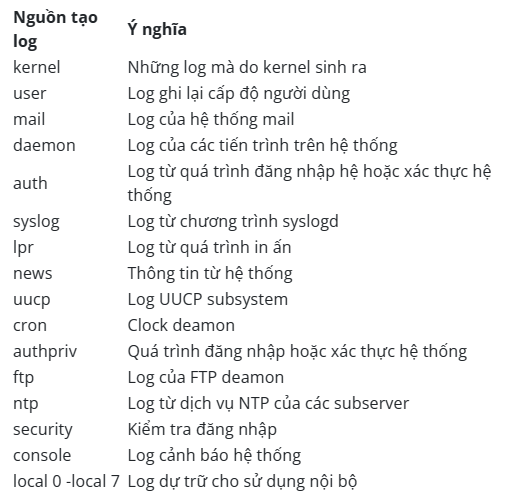

# **Sử dụng journal để đọc và phân tích Systemd Logs**

# **Giới thiệu**
**Journal logs** là một cơ chế logging mới được giới thiệu trong systemd, một hệ thống init cho Linux. Journal logs cung cấp một phương pháp để thu thập và quản lý các log trong hệ thống, thay thế cho các cơ chế logging truyền thống như syslog.

**Journal logs** được lưu trữ trong một cơ sở dữ liệu trên đĩa, thay vì được ghi vào các tệp log trên đĩa như syslog. Cơ sở dữ liệu này được thiết kế để hỗ trợ các tính năng như tìm kiếm nhanh, cấu trúc dữ liệu đồng nhất, và tự động xoá các log cũ khi không còn cần thiết.

**Journal logs** cũng hỗ trợ các tính năng khác như metadata rõ ràng (như thời gian, hostname, PID của tiến trình), mã hóa log để bảo vệ dữ liệu quan trọng, và chế độ tương tác để xem các log theo thời gian thực

## **File cấu hình của journald**

File cấu hình của journald được lưu ở đường dẫn /etc/systemd/journald.conf. Nó rất nhiều tham số để cho chúng ta biết quá trình logging diễn ra như thế nào, bạn không nên chỉnh sửa files này trừ khi bạn biết chắc mình đang làm việc gì

```sh
 [Journal]
#Storage=persistent
#Compress=yes
#Seal=yes
#SplitMode=uid
#SyncIntervalSec=5m
#RateLimitInterval=30s
#RateLimitBurst=1000
#SystemMaxUse=
#SystemKeepFree=
#SystemMaxFileSize=
```
- `Storage` - Xác định phương thức lưu trữ cho các journal logs. Giá trị mặc định là "auto", có nghĩa là systemd-journald sẽ tự động quyết định phương thức lưu trữ phù hợp nhất. Các giá trị khác bao gồm "volatile" (lưu trữ trong bộ nhớ), "persistent" (lưu trữ trên đĩa), và "none" (không lưu trữ).
- `SystemMaxUse` - Xác định dung lượng tối đa cho các journal logs trong hệ thống. Khi dung lượng này đạt đến giới hạn, các logs cũ sẽ được xóa để giải phóng không gian. Giá trị mặc định là 10% dung lượng ổ đĩa hoặc 4GB (tùy thuộc vào giá trị nào nhỏ hơn).
- `MaxRetentionSec` - Xác định thời gian tối đa để lưu trữ các journal logs trên hệ thống. Khi thời gian này hết hạn, các logs cũ sẽ được xóa để giải phóng không gian. Giá trị mặc định là 4 tuần.
- `Compress` - Xác định xem các journal logs có nên được nén lại không. Giá trị mặc định là "yes".
- `ForwardToSyslog` - Xác định xem các journal logs có nên được chuyển tiếp đến syslog không. Giá trị mặc định là "no".
- `RateLimitIntervalSec` và `RateLimitBurst` - Xác định giới hạn tốc độ ghi log của systemd-journald. Khi giới hạn này đạt đến, các logs mới sẽ bị từ chối để tránh quá tải hệ thống. Giá trị mặc định là 30s cho `RateLimitIntervalSec` và 1000 cho `RateLimitBurst`.

## **Nơi journald lưu trữ các files log**

journald lưu trữ các files log ở dạng mã nhị phân, nó được lưu trữ ở đường dẫn /var/log/journal. 

# **Sử dụng journalctl để đọc và phân tích systemd logs**

Câu lệnh cơ bản để đọc logs của journal deamon là

    `journactl`

```sh
]$ journalctl 
-- Logs begin at Wed 2023-03-22 08:17:38 +07, end at Wed 2023-03-22 09:43:52 +07. --
Mar 22 08:17:38 thetd systemd-journal[90]: Runtime journal is using 6.0M (max allowed 48.6M, trying to leave 72.9M free of 479.9M available → current 
Mar 22 08:17:38 thetd kernel: Initializing cgroup subsys cpuset
Mar 22 08:17:38 thetd kernel: Initializing cgroup subsys cpu
Mar 22 08:17:38 thetd kernel: Initializing cgroup subsys cpuacct
Mar 22 08:17:38 thetd kernel: Linux version 3.10.0-1160.88.1.el7.x86_64 (mockbuild@kbuilder.bsys.centos.org) (gcc version 4.8.5 20150623 (Red Hat 4.8.
Mar 22 08:17:38 thetd kernel: Command line: BOOT_IMAGE=/vmlinuz-3.10.0-1160.88.1.el7.x86_64 root=/dev/mapper/centos-root ro crashkernel=auto spectre_v
Mar 22 08:17:38 thetd kernel: Disabled fast string operations
Mar 22 08:17:38 thetd kernel: e820: BIOS-provided physical RAM map
```

Cung cấp toàn bộ những mục như lỗi, cảnh báo, vv từ tất cả các ứng dụng và tiến trình. Nó sẽ xuất ra danh sách từ những log cũ nhất phía trên và dòng logs mới nhất ở dưới cuối.

**Các nguồn tạo log (Facility Level)**



**Journald theo múi giờ**

Mặc định, journalctl hiển thị log time theo múi giờ hiện tại của bạn. Tuy nhiên, bạn có thể dễ dàng yêu cầu chương trình hiển thị theo múi giờ bạn chỉ định, ví dụ để xem ở múi giờ UTC, dùng câu lệnh dưới đây

    journalctl --utc

Khi ta dùng lệnh `journalctl` thì chỉ xem được thông tin từ boot hiện tại, nhưng đôi khi những boot trước đó cũng rất hữu ích. Journal có thể lưu trữ thông tin từ nhiều boot trước đó.

Một số bản phân phối cho phép lưu trữ thông tin boot trước đó mặc định, trong khi một số khác tắt tính năng này. Để kích hoạc thông tin boot bền vững, bạn có thể tạo thư mục để lưu trưc journal bằng cách nhập lệnh

    sudo mkdir -p /var/log/journal

Hoặc ta có thể sửa tập lệnh cấu hình journal

    sudo nano /etc/systemd/journald.conf

Trong phần [Journal], đặt Storage thành persistent để bật ghi nhật ký kiên tục
 ```sh
 /etc/systemd/journald.conf

[Journal]
Storage=persistent
```
Khi chức năng lưu trữ phiên khởi động trước được bật trên máy chủ của bạn, journalctl cung cấp một số lệnh để bạn có thể làm việc với các phiên khởi động như một đơn vị chia nhỏ. Để xem danh sách các phiên khởi dộng được Journalctl ghi nhận, bạn có thể sử dụng tùy chọn `---list-boots`

```sh
~]$ journalctl --list-boots
 0 1329d119bb2846a9b12fc55a6d182331 Wed 2023-03-22 10:44:52 +07—Wed 2023-03-22 10:47:59 +07
```
Mỗi dòng sẽ hiển thị thông tin của một phiên khởi động. Cột đầu tiên là offset cho phiên khởi động, bạn có thể sử dụng nó để dễ dàng tham chiếu đến phiên khởi động đó với journalctl. Nếu bạn cần một tham chiếu tuyệt đối, ID của phiên khởi động sẽ ở cột thứ hai. Bạn có thể xác định thời gian phiên khởi động đang tham chiếu đến thông qua hai thông số thời gian được liệt kê ở cuối.

Để hiển thị thông tin từ các phiên khởi động này, bạn có thể sử dụng thông tin từ cột đầu tiên hoặc cột thứ hai.

Ví dụ, để xem nhật ký từ phiên khởi động trước đó, bạn có thể sử dụng con trỏ tương đối 0 với tùy chọn -b

    journalctl -b 0

Bạn cũng có thể sử dụng ID khởi động để gọi lại dữ liệu từ một lần khởi động:

    journalctl -b 1329d119bb2846a9b12fc55a6d182331

### **Lọc theo tin nhắn quan tâm**

**Theo unit**

Phương pháp lọc log hiệu quả nhất là lọc theo unit mà bạn quan tâm. Bạn có thể sử dụng tùy chọn -u để lọc nhật ký của unit đó.

Ví dụ, để xem tất cả các log từ một sshd trên hệ thống, bạn chỉ cần gõ lệnh

    journactl -u <unit>

```sh
]$ journalctl -u sshd.service 
-- Logs begin at Wed 2023-03-22 10:44:52 +07, end at Wed 2023-03-22 14:18
Mar 22 10:45:04 thetd systemd[1]: Starting OpenSSH server daemon...
Mar 22 10:45:04 thetd sshd[1153]: Server listening on 0.0.0.0 port 22.
Mar 22 10:45:04 thetd sshd[1153]: Server listening on :: port 22.
Mar 22 10:45:04 thetd systemd[1]: Started OpenSSH server daemon.
```
Còn nếu muốn kiểm tra hoạt động dịch vụ của ngày hôm nay, thì dùng lệnh

    journalctl -u sshd.service --since today

**Theo process, User, GroupID**

Xem Journal logs bằng PID: `journalctl _PID=<name_service>`

Xem Journal logs bằng UID: `~]$ journalctl _PID=1`

Xem Journal logs bằng GID: `~]$ journalctl _GID=1`

Xem journal logs của một thực thi:

```sh
~]$ journalctl /usr/bin/gnome-shell --since today
-- Logs begin at Wed 2023-03-22 10:44:52 +07, end at Wed 2023-03-22 14:53:49 +07. --
Mar 22 10:45:30 thetd gnome-shell[1483]: JS WARNING: [resource:///org/gnome/shell/ui/status/network.js 1913]: reference to undefined property "undefin
Mar 22 10:45:30 thetd gnome-shell[1483]: JS ERROR: TypeError: this._devices[section] is undefined
                                         _connectionRemoved@resource:///org/gnome/shell/ui/status/network.js:1913:17
                                         wrapper@resource:///org/gnome/gjs/modules/_legacy.js:82:22
Mar 22 10:46:04 thetd gnome-shell[2076]: GNOME Shell started at Wed Mar 22 2023 10:45:59 GMT+0700
Mar 22 14:40:47 thetd gnome-shell[2076]: pushModal: invocation of begin_modal failed
```
Xem journal logs về phần nhân (Kernel): `journalctl -k`

**Theo mức độ ưu tiên**

journalctl cho phép lọc theo mức độ ưu tiên (priority) của các thông báo trong nhật ký. Mỗi thông báo trong nhật ký được gắn một mức độ ưu tiên nhất định để chỉ ra mức độ quan trọng của nó. Bằng cách lọc theo mức độ ưu tiên, bạn có thể tìm kiếm các thông báo quan trọng hoặc các thông báo cần được xử lý ngay lập tức.

Bạn có thể sử dụng các tùy chọn `-p` hoặc `--priority` để lọc theo mức độ ưu tiên. Các mức độ ưu tiên có thể là số nguyên hoặc các giá trị từ khóa, bao gồm:

- 0 hoặc emerg: Thông báo khẩn cấp
- 1 hoặc alert: Thông báo cảnh báo
- 2 hoặc crit: Thông báo lỗi nghiêm trọng
- 3 hoặc err: Thông báo lỗi
- 4 hoặc warning: Thông báo cảnh báo
- 5 hoặc notice: Thông báo thông tin
- 6 hoặc info: Thông báo thông tin chi tiết
- 7 hoặc debug: Thông báo gỡ lỗi

Ví dụ, để xem tất cả các thông báo có mức độ ưu tiên là lỗi hoặc cao hơn (bao gồm cả cảnh báo và thông báo khẩn cấp), bạn có thể gõ lệnh:

```sh
~]$ journalctl -p err
-- Logs begin at Wed 2023-03-22 10:44:52 +07, end at Wed 2023-03-22 15:04:16 +07. --
Mar 22 10:44:53 thetd kernel: sd 0:0:0:0: [sda] Assuming drive cache: write through
Mar 22 10:44:55 thetd kernel: piix4_smbus 0000:00:07.3: SMBus Host Controller not enabled!
Mar 22 10:45:04 thetd systemd[1]: Failed to start Crash recovery kernel arming.
Mar 22 10:45:11 thetd spice-vdagent[1655]: Cannot access vdagent virtio channel /dev/virtio-ports/com.redhat.spice.0
Mar 22 10:45:11 thetd spice-streaming-agent[1659]: Failed to open the streaming device "/dev/virtio-ports/org.spice-space.stream.0": 2 - No such file 
Mar 22 10:46:00 thetd spice-vdagent[2345]: Cannot access vdagent virtio channel /dev/virtio-ports/com.redhat.spice.0
```
**Xóa log cũ**

Để xóa các journal logs cũ trong hệ thống, bạn có thể sử dụng lệnh journalctl để xóa các logs cũ hơn một ngày, một tuần, hay một tháng trước đó. Dưới đây là các bước để xóa các journal logs cũ

    sudo journalctl --vacuum-time=1d/1w/1m

# **Kết luận**

Systemd journal rất hữu ích để thu thập và quản lý dữ liệu hệ thống và ứng dụng của bạn. Phần lớn tính linh hoạt đến từ các siêu dữ liệu được tự động ghi lại và tính trung tâm của log. Lệnh journalctl giúp dễ dàng tận dụng các tính năng nâng cao của journal và thực hiện phân tích và gỡ lỗi liên kết cho các thành phần ứng dụng khác nhau.

# **Tài liệu tham khảo**

1. https://www.digitalocean.com/community/tutorials/how-to-use-journalctl-to-view-and-manipulate-systemd-logs
2. https://blog.cloud365.vn/logging/nhap-mon-logging-phan3/
