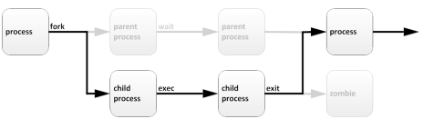
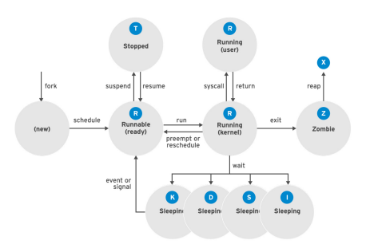

# **Listing Processes**

là một tính năng của hệ điều hành Linux, cho phép người dùng hiển thị thông tin chi tiết về các tiến trình đang chạy trên hệ thống của họ. Khi sử dụng tính năng này, người dùng có thể xem danh sách các tiến trình hiện đang chạy trên hệ thống, cùng với thông tin chi tiết về mỗi tiến trình đó như PID (Process ID), tên tiến trình, tài nguyên mà tiến trình đang sử dụng (bộ nhớ, CPU, etc.), người dùng và nhóm sở hữu tiến trình, và trạng thái của tiến trình (đang chạy, đang chờ, đã dừng, etc.).

**Định nghĩa**

Một tiến trình (process) là một chương trình hoặc tác vụ đang chạy trên hệ thống. Một tiến trình bao gồm:
- Một không gian địa chỉ của bộ nhớ được cấp phát
- Các thuộc tính bảo mật bao gồm thông tin đăng nhập và đặc quyền về quyền sở hữu
- Một hoặc nhiều luồng thực thi của mã chương trình
- Trạng thái tiến trình
 
Môi trường của một tiến trình bao gồm:
- Biến cục bộ và biến toàn cục
- Bối cảnh lập lịch biểu hiện tại
- Tài nguyên hệ thống được phân bổ, chẳng hạn như bộ mô tả tệp và cổng mạng

Mỗi tiến trình đều có một tiến trình cha (parent process) với định danh là PPID (Parent process identify). Các tiến trình con (child process) thường được start bởi tiến trình cha (parent process). Một parent process có thể có nhiều child process nhưng một child process chỉ có một parent process

Việc tạo tiến trình con không chỉ giúp chia nhỏ công việc và phân tải tài nguyên trên hệ thống mà còn cung cấp cho người dùng khả năng quản lý các tiến trình con độc lập một cách dễ dàng.

<p align="center">

</p>

Thông qua hàm `fork`, một tiến trình con được tạo ra và sẽ kế thừa các thông tin và tài nguyên của tiến trình cha bao gồm: các quyền định danh bảo mật, các bộ mô tả tệp tin trước đó và hiện tại, các quyền đặc quyền cổng và tài nguyên, biến môi trường và mã chương trình. Sau khi tiến trình con được tạo, nó có thể thực thi chương trình mã riêng của mình thông qua hàm `exec`.

Tiến trình cha thường ngủ `sleep` trong khi tiến trình con đang chạy và đặt yêu cầu `wait` để được báo hiệu khi tiến trình con hoàn thành. Khi tiến trình con kết thúc, nó đã đóng hoặc loại bỏ tài nguyên và môi trường của nó. Các tài nguyên này bao gồm các file descriptor, bộ nhớ, sockets, pipes và các tài nguyên khác. Tuy nhiên, tiến trình con vẫn còn một tài nguyên gọi là "zombie", đó là một bản ghi trong bảng tiến trình.

Sau khi quá trình con kết thúc và trở thành zombie, tiến trình cha được báo hiệu và tiến hành xoá bản ghi của tiến trình con trong bảng tiến trình. Tiến trình cha hoàn tất việc giải phóng tài nguyên của tiến trình con. Sau đó, tiến trình cha tiếp tục thực thi chương trình mã riêng của nó.

**Các trạng thái của Processes**

Trong một hệ thống hoạt động đa nhiệm, mỗi CPU (hoặc lõi CPU) có thể đang thực thi một tiến trình vào một thời điểm duy nhất. Khi một tiến trình đang chạy, các yêu cầu ngay lập tức của nó về thời gian CPU và phân bổ tài nguyên thay đổi. Tiến trình được gán một trạng thái, mà thay đổi khi các hoàn cảnh yêu cầu.
<p align="center">

</p>

**Name**|**Flag**|**Describe**
--------|--------|------------
Running|**R**|Cho biết tiến trình đó đang được thực thi trên CPU và đang chạy hoặc sẵn sàng chạy tại thời điểm kiểm tra trạng thái của nó. Đây là trạng thái mà các tiến trình thường muốn đạt được để tối đa hóa thời gian CPU và hoàn thành công việc của mình.
Sleeping|**S**|Cờ S (interruptible Sleep) cho biết tiến trình đang chờ đợi cho một sự kiện nào đó, ví dụ như dữ liệu từ I/O hoặc tín hiệu từ kernel hoặc user space. Trong trạng thái này, tiến trình có thể bị gián đoạn bởi tín hiệu
|Sleeping|**D**|Uninterruptible Sleep, hay còn gọi là (disk sleep): Thường được gắn với tiến trình đang chờ đợi I/O từ thiết bị lưu trữ (ví dụ như đĩa cứng) và không thể bị gián đoạn bởi tín hiệu ngắt (interrupt). Thông thường các tiến trình có cờ D sẽ chỉ kết thúc khi hoàn thành yêu cầu I/O của mình hoặc khi có lỗi xảy ra.
|Sleeping|**K**|Thường được gắn với các tiến trình bị buộc phải kết thúc (kill) bởi một tín hiệu từ hệ thống hoặc một tiến trình khác
|Sleeping|**I**|Được gắn với các tiến trình đang chờ đợi tài nguyên CPU nhưng không thể sử dụng CPU được bởi các tiến trình khác đang được thực thi trước đó. Thông thường các tiến trình có cờ I sẽ chỉ chuyển sang trạng thái running khi CPU đã được giải phóng
Stopped|**T**|T (traced): Khi một tiến trình bị dừng và đang được giám sát bởi một trình giám sát, ví dụ như một trình debug, tiến trình đó sẽ được đánh dấu với cờ T
|Stopped|**T**|t (stopped): Khi một tiến trình bị tạm dừng bởi một tín hiệu (ví dụ như khi người dùng nhấn Ctrl+Z), tiến trình đó sẽ được đánh dấu với cờ t (hoặc cờ đánh dấu tạm dừng)
Zombie|**Z**| cờ đánh dấu cho biết một tiến trình đang ở trạng thái zombie, tức là tiến trình đã kết thúc nhưng vẫn còn một bản ghi tiến trình trong bảng tiến trình
|Zombie|**X**| cờ đánh dấu cho biết một tiến trình đã bị giết bởi một tín hiệu bất thường (signal). Tín hiệu này có thể do một lỗi hoặc hành động của người dùng, hoặc do một vấn đề trong chính tiến trình đó. Tiến trình được đánh dấu là x sẽ được giữ lại trong bảng tiến trình cho đến khi cha mẹ của nó gọi hàm wait() để giải phóng tài nguyên và loại bỏ bản ghi tiến trình.

**Những tiến trình đang hoạt động**

Trong quá trình sửa chữa sự cố hệ thống, việc hiểu cách kernel liên lạc với các tiến trình và cách các tiến trình liên lạc với nhau là rất quan trọng. Khi một tiến trình được tạo ra, hệ thống sẽ gán cho nó một trạng thái. Một chương trình đặc biệt là `top` có thể giúp chúng ta biết được hệ thống hiện tại có chương trình nào đang hoạt động 

Để tìm ID của những tiến trình đang chạy cụ thể, ta có thể dùng lệnh:

```sh
~]$ pidof <process>
hoặc
~]$ pgrep <process>
```
```sh
 ~]$ top
top - 15:30:18 up  2:18,  5 users,  load average: 0.00, 0.01, 0.05
Tasks: 110 total,   1 running, 109 sleeping,   0 stopped,   0 zombie
%Cpu(s):  0.0 us,  0.3 sy,  0.0 ni, 99.7 id,  0.0 wa,  0.0 hi,  0.0 si,  0.0 st
KiB Mem :   995640 total,   172548 free,   230980 used,   592112 buff/cache
KiB Swap:  2097148 total,  2096884 free,      264 used.   601964 avail Mem

PID   USER      PR  NI    VIRT    RES    SHR S %CPU %MEM    TIME+  COMMAND
41321 thetd     20   0  162080   2212   1548 R  0.3  0.2   0:00.01  top                                                       
1     root      20   0   46188   6604   4004 S  0.0  0.7   0:01.74 systemd
2     root      20   0     0      0      0   S  0.0  0.0   0:00.00 kthreadd
4     root       0 -20     0      0      0   S  0.0  0.0   0:00.00 kworker/0:0H
6     root      20   0     0      0      0   S  0.0  0.0   0:00.38 ksoftirqd/0
7     root      rt   0     0      0      0   S  0.0  0.0   0:00.00 migration/0
```

Lệnh `top` cho ta biết thông tin của tiến trình:
- Dòng thứ nhất cho biết thời gian `up time` (từ lúc khởi động) cũng như số người dùng thực tế đang hoạt động.
- Dòng thứ hai là thống kê về số lượng tiến trình, bao gồm tổng số tiến trình (total), số đang hoạt động (running), số đang ngủ/chờ (sleeping), số đã dừng (stopped) và số không thể dừng hẳn (zombie)
- Dòng thứ 3-5 lần lượt cho biết thông tin về CPU, RAM và bộ nhớ Swap
- Các dòng còn lại liệt kê chi tiết về các tiến trình như định danh (PID), người dùng thực thi (USER), độ ưu tiên (PR), dòng lệnh thực thi (COMMAND), Tổng lượng bộ nhớ ảo được sử dụng bởi tiến trình (VIRT), Lượng bộ nhớ thực sự được sử dụng bởi tiến trình (RES), lượng bộ nhớ được sử dụng chung với các tiến trình khác (SHR)

Lệnh `ps` (processes status) cũng giúp liệt kê chi tiết các tiến trình. Trong khi lệnh `ps` hiển thị thông tin tĩnh về các tiến trình đang chạy, lệnh `top` cung cấp thông tin động, cập nhật liên tục về các tiến trình đang chạy trên hệ thống
```sh
@thetd ~]$ ps aux
USER        PID %CPU %MEM    VSZ   RSS TTY      STAT START   TIME COMMAND
root          1  0.0  0.6  46188  6604 ?        Ss   13:12   0:01 /usr/lib/systemd/systemd --system --deserialize 15
root          2  0.0  0.0      0     0 ?        S    13:12   0:00 [kthreadd]
root          4  0.0  0.0      0     0 ?        S<   13:12   0:00 [kworker/0:0H]
...
polkitd     656  0.1  1.6 613012 16008 ?        Ssl  16:11   0:00 /usr/lib/polkit-1/polkitd --no-debug
thetd      1291  0.4  0.2 115680  2248 tty1     Ss+  16:11   0:00 -bash
```

Ngoài ra còn có các lệnh như:

- `ps -e` hoặc `ps -A`: hiển thị tất cả các tiến trình trên hệ thống, bao gồm cả các tiến trình không phải của người dùng hiện tại.
- `ps -f`: hiển thị thông tin chi tiết về các tiến trình trong một định dạng dài hơn. Thông tin bao gồm UID, PID, PPID, C, PRI, NI, ADDR, SZ, WCHAN, TTY, TIME và CMD.
- `ps -u <username>`: hiển thị các tiến trình của một người dùng cụ thể.
- `ps -ef`: hiển thị tất cả các tiến trình trên hệ thống, bao gồm cả các tiến trình không phải của người dùng hiện tại, và hiển thị chi tiết đầy đủ về các tiến trình.
- `ps -p <PID>`: hiển thị thông tin về tiến trình với ID tiến trình (PID) cụ thể.
- `ps -o`: cho phép tùy chỉnh định dạng hiển thị thông tin về tiến trình.

# **Controlling Jobs**

Khái niệm liên quan đến quản lý các tiến trình đang chạy trong môi trường hệ thống LINUX. Khi một tiến trình được bắt đầu, nó được gán một job ID (JID), có thể sử dụng để kiểm soát các hoạt động liên quan đến tiến trình đó

**Job** là một tác vụ hoặc tiến trình được thực thi trong môi trường shell. Nó có thể là một lệnh hoặc một nhóm các lệnh được thực thi liên tiếp hoặc đồng thời trong cùng một shell.

Khi một job được thực thi, nó sẽ được gắn một số thứ tự job (job ID) duy nhất bởi shell. Các job cũng có thể được phân loại thành hai loại: job nền (background job) và job tiền (foreground job). Job nền là các job được thực thi trong nền và không yêu cầu nhập xuất từ người dùng, trong khi job tiền được thực thi trực tiếp trong terminal và yêu cầu nhập xuất từ người dùng.

Khi một job đang chạy trong foreground, terminal sẽ bị khóa cho đến khi job đó kết thúc hoặc được dừng lại. Người dùng có thể sử dụng các lệnh để tạm dừng, tiếp tục, hoặc dừng vĩnh viễn các job đang chạy trong foreground hoặc background

**Running jobs in the background**

**Chạy các tác vụ trong nền** (Running Jobs in the Background) là một trong những tính năng mạnh mẽ của hệ điều hành Linux và cho phép người dùng thực hiện các công việc khác trong khi vẫn giữ được quyền kiểm soát các tiến trình đang chạy. Thay vì chạy các tác vụ trực tiếp trên terminal và chờ đợi chúng hoàn thành, bạn có thể chạy chúng trong nền và tiếp tục sử dụng terminal để thực hiện các tác vụ khác.

Để chạy một tác vụ trong nền, ta chỉ cần thêm ký tự "&" vào cuối lệnh. 

```sh
~]$ sleep 10000 &
[1] 1882
```
Trong ví dụ này, ta sử dụng lệnh `sleep 10000` để chạy một tiến trình chờ đợi trong 10000 giây, và "&" để chạy tiến trình đó trong nền. Ta sẽ thấy số tiến trình (trong ví dụ này là 1) và mã số tiến trình được hiển thị trong ngoặc vuông (trong ví dụ này là 1882). Số tiến trình này được sử dụng để quản lý các tiến trình khi chúng được chạy trong nền.

Để liệt kê các tác vụ đang chạy trong nền, ta sử dụng lệnh jobs. 

```sh
hetd ~]$ jobs
[1]+  Running                 sleep 10000 &
```
Để tạm dừng hoặc tiếp tục một tiến trình đang chạy trong nền, ta sử dụng lệnh `kill` với tùy chọn `-STOP` hoặc `-CONT`

```sh
$ kill -STOP %1
[1]+  Stopped                 sleep 30
$ kill -CONT %1
[1]+  Running                 sleep 30 &
```

Lệnh `bg`: Dùng để chạy một job nền, hoặc để tiếp tục chạy một job đã bị tạm dừng trong background. Cú pháp: `bg %[job_id]` hoặc `bg [job_id]`, trong đó `[job_id]` là số thứ tự của job trong danh sách job.
Ví dụ: `bg %1` để chạy lại job số 1 trong danh sách job ở chế độ nền.

Lệnh `fg`: Dùng để đưa một job nền hoặc tạm dừng về foreground để tiếp tục thao tác với job đó. Cú pháp: `fg %[job_id]` hoặc `fg [job_id]`, trong đó `[job_id]` là số thứ tự của job trong danh sách job.
Ví dụ: `fg %1` để đưa job số 1 trong danh sách job về foreground.

**Killing processes**

Killing Processes (tiến trình chấm dứt) là hành động dừng hoặc chấm dứt một tiến trình đang chạy trên hệ thống máy tính. Người quản trị hệ thống và người dùng có thể tắt một tiến trình nếu tiến trình đó đang gây ra vấn đề cho hệ thống hoặc không phản hồi

Lệnh kill cho phép người dùng kết thúc một tiến trình bằng cách gửi một tín hiệu (signal) đến tiến trình đó.

**Tín hiệu số**|**Tín hiệu**|**Mô tả**
---------------|-----------|---------
1|SIGHUP|Tín hiệu này được gửi đến một tiến trình khi session của tiến trình đó bị đóng Thông thường, SIGHUP được sử dụng để yêu cầu tiến trình tải lại cấu hình hoặc khởi động lại. `kill -1 <PID>
2|SIGINT|Tín hiệu này cũng được gửi khi người dùng nhấn Ctrl + C. Tuy nhiên, khác với SIGTERM, tiến trình có thể bắt và xử lý tín hiệu này. Để gửi tín hiệu SIGINT đến một tiến trình, sử dụng `kill -2 <pid>`
3|SIGQUIT|Tín hiệu này được gửi khi người dùng nhấn Ctrl + \ và được sử dụng để yêu cầu kết thúc và tạo ra báo cáo lỗi. Để gửi tín hiệu SIGQUIT đến một tiến trình, sủ dụng `kill -3 <pid>`
9|SIGKILL|Tín hiệu này được sử dụng để tắt một tiến trình một cách mạnh mẽ. Khác với SIGTERM và SIGINT, tiến trình không có cơ hội để dọn dẹp tài nguyên của mình trước khi thoát. Để gửi tín hiệu SIGKILL đến một tiến trình, sử dụng lệnh `kill -9 <pid>`
15 (Defaut)|SIGTERM|Tín hiệu này được sử dụng để yêu cầu tiến trình kết thúc một cách lịch sự. Khi tiến trình nhạn được tín hiệu này, nó có cơ hội dọn dẹp tài nguyên của mình trước khi thoát. Để gửi tín hiệu SIGTERM đến một tiến trình, sử dụng `kill <pid>`
18|SIGCONT|Tín hiệu này được sử dụng để tiếp tục chạy một tiến trình bị tạm dừng bằng tín hiệu SIGSTOP. Để gửi tín hiệu đến một tiến trình, sử dụng lệnh `kill -CONT <pid>` hoặc `kill -18 <pid>`
19|SIGTOP|Tín hiệu này được sử dụng để tạm dừng một tiến trình. Khi tiến trình nhận được tín hiệu này, nó sẽ tạm dừng và chỉ có thể tiếp tục chạy bằng tín hiệu SIGCONT. Để gửi tín hiệu SIGTOP đến một tiến trình, sử dụng lệnh `kill -STOP <pid>` hoặc `kill -19 <pid>`
20|TSTP|Tín hiệu này được sử dụng để tạm dừng một tiến trình và nó có thể bị bắt và xử lý bởi tiến trình. Khi tiến trình nhận được tín hiệu TSTP, nó sẽ bị tạm dừng và không thể chạy cho đến khi nó được tiếp tục bằng tín hiệu SIGCONT, `kill -20 <pid>`

Người dùng có thể kết thúc các tiến trình của chính mình, nhưng đối với các tiến trình của người dùng khác, quyền root cần được cấp phép. Lệnh kill được sử dụng để gửi tín hiệu đến tiến trình theo số PID. Sử dụng lệnh "kill -l" để liệt kê tên và số của tất cả các tín hiệu có sẵn.

```sh
~]$ kill -l
1) SIGHUP       2) SIGINT       3) SIGQUIT      4) SIGILL       5) SIGTRAP
6) SIGABRT      7) SIGBUS       8) SIGFPE       9) SIGKILL     10) SIGUSR1
11) SIGSEGV     12) SIGUSR2     13) SIGPIPE     14) SIGALRM     15) SIGTERM
16) SIGSTKFLT   17) SIGCHLD     18) SIGCONT     19) SIGSTOP     20) SIGTSTP
21) SIGTTIN     22) SIGTTOU     23) SIGURG      24) SIGXCPU     25) SIGXFSZ
26) SIGVTALRM   27) SIGPROF     28) SIGWINCH    29) SIGIO       30) SIGPWR
31) SIGSYS      34) SIGRTMIN    35) SIGRTMIN+1  36) SIGRTMIN+2  37) SIGRTMIN+3
38) SIGRTMIN+4  39) SIGRTMIN+5  40) SIGRTMIN+6  41) SIGRTMIN+7  42) SIGRTMIN+8
43) SIGRTMIN+9  44) SIGRTMIN+10 45) SIGRTMIN+11 46) SIGRTMIN+12 47) SIGRTMIN+13
48) SIGRTMIN+14 49) SIGRTMIN+15 50) SIGRTMAX-14 51) SIGRTMAX-13 52) SIGRTMAX-12
53) SIGRTMAX-11 54) SIGRTMAX-10 55) SIGRTMAX-9  56) SIGRTMAX-8  57) SIGRTMAX-7
58) SIGRTMAX-6  59) SIGRTMAX-5  60) SIGRTMAX-4  61) SIGRTMAX-3  62) SIGRTMAX-2
63) SIGRTMAX-1  64) SIGRTMAX
```
```sh
@thetd ~]$ ps aux | grep job
5194 0.0 0.1 222448 2980 pts/1 S 16:39 0:00 /bin/bash /home/user/bin/control job1
5199 0.0 0.1 222448 3132 pts/1 S 16:39 0:00 /bin/bash /home/user/bin/control job2
5205 0.0 0.1 222448 3124 pts/1 S 16:39 0:00 /bin/bash /home/user/bin/control job3
5430 0.0 0.0 221860 1096 pts/1 S+ 16:41 0:00 grep --color=auto job
```
```sh
~]$ kill 5194
[user@host ~]$ ps aux | grep job
user 5199 0.0 0.1 222448 3132 pts/1 S 16:39 0:00 /bin/bash /home/user/bin/control job2
user 5205 0.0 0.1 222448 3124 pts/1 S 16:39 0:00 /bin/bash /home/user/bin/control job3
user 5783 0.0 0.0 221860 964 pts/1 S+ 16:43 0:00 grep --color=auto job
[1] Terminated control job1
~]$ kill -9 5199
[user@host ~]$ ps aux | grep job
user 5205 0.0 0.1 222448 3124 pts/1 S 16:39 0:00 /bin/bash /home/user/bin/control job3
user 5930 0.0 0.0 221860 1048 pts/1 S+ 16:44 0:00 grep --color=auto job
[2]- Killed control job2
[user@host ~]$ kill -SIGTERM 5205
user 5986 0.0 0.0 221860 1048 pts/1 S+ 16:45 0:00 grep --color=auto job
[3]+ Terminated control job3
```
```sh
# dấu + đánh dấu là tiến trình chạy nền
# dấu - đánh dấu là tiến trình điều khiển
# Không dấu có nghĩa là không tiến trình nào đang chạy hoặc đã hoàn thành
# Terminated là kết thúc một cách đúng đắn, còn killed thì là tín hiệu mạnh
```

Lệnh **killall** trong Linux được sử dụng để kết thúc các tiến trình dựa trên tên của chúng. Nó sẽ tìm kiếm và kết thúc tất cả các tiến trình có tên được chỉ định.

Cú pháp của lệnh **killall** như sau:

`killall [options] process_name`

Trong đó:

- **process_name**: Tên của tiến trình mà bạn muốn kết thúc.
- **options**: Các tùy chọn để điều chỉnh hành vi của lệnh.

Một số tùy chọn thường được sử dụng với lệnh killall:

- -i: Cho phép nhập xác nhận trước khi kết thúc mỗi tiến trình.
- -e: Hiển thị các thông báo lỗi.
- -q: Không hiển thị bất kỳ thông báo nào.
- -s: Gửi một tín hiệu kết thúc đến tất cả các tiến trình.

Lệnh pkill cũng giống như lệnh killall, nhưng nó cho phép tìm và tắt một hoặc nhiều tiến trình dựa trên tên của chúng, thay vì ID tiến trình. Điều này làm cho pkill trở thành một lựa chọn tiện lợi hơn khi muốn tìm và tắt nhiều tiến trình cùng một lúc hoặc khi không biết chính xác ID của một tiến trình cụ thể.

Cú pháp của lệnh pkill là:

`pkill [tùy chọn] tên_tiến_trình`

Nếu muốn chỉ tắt các tiến trình cụ thể hơn, có thể sử dụng tùy chọn -u để chỉ định tên ng dùng của họ:

Vd: `pkill -u thetdgit ssh`

**Đăng xuất người dùng**

Là quá trình đăng xuất người dùng khỏi hệ thống bằng cách sử dụng quyền quản trị viên để kết thúc phiên làm việc của người dùng đó

Việc đăng xuất người dùng theo cách quản trị này thường được sử dụng khi người dùng vi phạm quy tắc bảo mật, sử dụng tài nguyên quá mức, hoặc khi hệ thống của họ gặp sự cố và cần được khởi động lại

Để đăng xuất một người dùng theo cách quản trị, cần xác định phiên đăng nhập của họ và sử dụng tín hiệu để kết thúc phiên làm việc của họ

Các câu lệnh để kiểm tra người dùng và đăng xuất khỏi hệ thống Linux:

1. `whoami`: Lệnh này sẽ hiển thị tên người dùng hiện tại đang đăng nhập vào hệ thống
```sh
~]$ whoami
thetd
```
2. `who`: Lệnh này sẽ hiển thị danh sách các người dùng đang đăng nhập vào hệ thống, bao gồm cả tên người dùng, thời gian đăng nhập và terminal được sử dụng
```sh
~]$ who
thetd    tty1         2023-03-23 16:11
thetd    pts/0        2023-03-27 21:16 (192.168.126.1)
thetd    pts/1        2023-03-24 15:09 (192.168.126.1)
thetd    pts/2        2023-03-27 22:21 (192.168.126.1)
```
3. `w`: Lệnh này cung cấp thông tin tương tự như lệnh who, nhưng bổ sung thêm danh sách các tiến trình đang chạy trong mỗi phiên đăng nhập.
```sh
~]$ w
 22:31:14 up  9:00,  4 users,  load average: 0.00, 0.01, 0.05
USER     TTY      FROM             LOGIN@   IDLE   JCPU   PCPU WHAT
thetd    tty1                      Thu16    1:15m  1.26s  1.26s -bash
thetd    pts/0    192.168.126.1    21:16    1:13m  0.01s  0.01s -bash
thetd    pts/1    192.168.126.1    Fri15    3days  0.02s  0.02s -bash
thetd    pts/2    192.168.126.1    22:21    2.00s  0.02s  0.01s w
```
4. `last`: Lệnh này sẽ hiển thị thông tin về các phiên đăng nhập gần đây, bao gồm tên người dùng, thời gian đăng nhập và địa chỉ IP nếu được kích hoạt
```sh
~]$ last
thetd    pts/2        192.168.126.1    Mon Mar 27 22:21   still logged in
thetd    pts/0        192.168.126.1    Mon Mar 27 21:16   still logged in
thetd    pts/1        192.168.126.1    Fri Mar 24 15:09   still logged in
thetd    pts/0        192.168.126.1    Fri Mar 24 11:19 - 16:05  (04:45)
thetd    pts/0        192.168.126.1    Thu Mar 23 16:12 - 17:25  (01:13)
thetd    tty1                          Thu Mar 23 16:11   still logged in
reboot   system boot  3.10.0-1160.88.1 Thu Mar 23 16:11 - 22:25 (4+06:13)
thetd    pts/1        192.168.126.1    Thu Mar 23 16:06 - crash  (00:04)
thetd    pts/0        192.168.126.1    Thu Mar 23 15:28 - 16:08  (00:39)
thetd    tty6                          Thu Mar 23 14:08 - crash  (02:03)
thetd    tty4                          Thu Mar 23 13:59 - crash  (02:11)
thetd    tty2                          Thu Mar 23 11:24 - crash  (04:46)
thetd    tty1                          Thu Mar 23 11:19 - crash  (04:52)
reboot   system boot  3.10.0-1160.71.1 Thu Mar 23 11:18 - 22:25 (4+11:06)

wtmp begins Thu Mar 23 11:18:50 2023
```
5. `logout` hoặc `exit`: Lệnh này sẽ đăng xuất khỏi phiên đăng nhập hiện tại và đưa người dùng trở lại màn hình đăng nhập.

6. `pkill` hoặc `kill`: Lệnh này có thể được sử dụng để đăng xuất một người dùng bằng cách kết thúc tất cả các tiến trình được liên kết với phiên đăng nhập của họ. Để làm điều này, bạn có thể sử dụng câu lệnh "pkill -kill -u [username]" để kết thúc tất cả các tiến trình của một người dùng cụ thể, hoặc "kill -9 [PID]" để kết thúc một tiến trình cụ thể.

# **Giám sát hoạt động tiến trình**

**Load average**

Load average là một chỉ số đo lường tải trung bình của hệ thống trong một khoảng thời gian nhất định. Được tính bằng số lượng tiến trình đang chờ đợi sử dụng bộ xử lý và cả những tiến trình đang được xử lý, nhưng chưa hoàn thành.

Load average thường hiển thị dưới dạng 3 con số, ví dụ như "0.50 0.75 1.00" hoặc "1.00 2.50 3.00". Các con số này đại diện cho tải trung bình của hệ thống trong 1 phút, 5 phút và 15 phút gần đây. Số càng thấp thì tải trung bình của hệ thống càng nhẹ, và số càng cao thì hệ thống đang hoạt động trong mức tải cao hơn

```sh
~]$ uptime
22:54:57 up  9:24,  3 users,  load average: 0.00, 0.01, 0.05
#current_time uptime number_of_logged_in_user load_average
#Load average đầu tiên (0.00 trong trường hợp này) là trung bình tải trong 1 phút gần đây
#Load average thứ hai (0.01 trong trường hợp này) là trung bình tải trong 5 phút gần đây
#Load average thứ ba (0.05 trong trường hợp này) là trung bình tải trong 15 phút gần đây
```

Lệnh `lscpu` là một lệnh trong hệ điều hành Linux được sử dụng để hiển thị thông tin về CPU của hệ thống. Khi chạy lệnh này, bạn sẽ nhận được thông tin về các thông số liên quan đến CPU như kiến trúc CPU, tốc độ xung nhịp, số lượng core, thread, cache, v.v.

```sh
~]$ lscpu
Architecture:          x86_64 # kiến trúc CPU
CPU op-mode(s):        32-bit, 64-bit #chế độ hoạt động của CPU
Byte Order:            Little Endian #thứ tự byte của CPU (Little endian hoặc Big endian)
CPU(s):                1 #số lượng CPU trong hệ thống
On-line CPU(s) list:   0 #các CPU hiện đang được kích hoạt và sẵn sàng để xử lý các tác vụ 
Thread(s) per core:    1 #số lượng thread cho mỗi core
Core(s) per socket:    1 #số lượng core cho mỗi socket
Socket(s):             1 #số lượng socket trong hệ thống
NUMA node(s):          1 #số lượng NUMA node trong hệ thống
Vendor ID:             GenuineIntel  #Nhà sản xuất CPU
CPU family:            6 #họ CPU
Model:                 142 #loại mô hình
Model name:            Intel(R) Core(TM) i5-8250U CPU @ 1.60GHz
Stepping:              10
CPU MHz:               1800.000 #tốc độ xung nhịp của CPU
BogoMIPS:              3600.00
Hypervisor vendor:     VMware
Virtualization type:   full
L1d cache:             32K #dung lượng bộ nhớ
L1i cache:             32K
L2 cache:              256K
L3 cache:              6144K
NUMA node0 CPU(s):     0
Flags:                 
```

Từ `uptime` và `lscpu` ta có thể thấy

```sh
# Hệ thống đang sử dụng 1 CPU
# Giá trị load average      0.00     0.01    0.05
# Số CPU logic                1        1       1
# Load average trên mỗi CPU 0.00     0.01    0.05
```
**Giám sát thời gian thực**

là một tính năng cho phép bạn theo dõi các quá trình đang chạy trên hệ thống của bạn trong thời gian thực. Nó cho phép bạn xem các thông tin về tài nguyên hệ thống, các tiến trình đang chạy, các kết nối mạng, và các hoạt động khác liên quan đến tương tác của hệ thống với các tiến trình và người dùng

REAL-TIME PROCESS MONITORING cung cấp cho bạn khả năng theo dõi các tiến trình một cách chi tiết, giúp bạn phát hiện và khắc phục các vấn đề về hiệu suất hoặc an ninh của hệ thống.

Dùng lệnh `top` hoặc `ps` để theo dõi 

# **Tài liệu tham khảo**
1. [Red_hat_enterprise] 