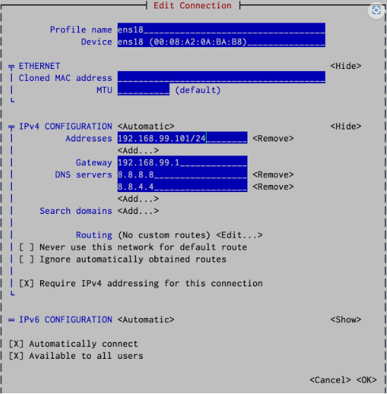

# Hướng dẫn cấu hình địa chỉ IP cho Ubuntu và CentOS

# I. Ubuntu

## 1. Chỉnh sửa IP cho ubuntu sử dụng Netplan

Hiển thị nội dung của file bằng lệnh `cat`

```sh
cloud@cloud:~$ cat /etc/netplan/01-network-manager-all.yaml
# Let NetworkManager manage all devices on this system
network:
  version: 2
  renderer: NetworkManager
  ethernets:
    ens33:
      dhcp4: no
      addresses: [192.168.126.143/24]
      nameservers:
        addresses: [8.8.8.8, 8.8.4.4]
```
Sửa file `/etc/netplan/ .yaml`f bằng 2 cách
- Dùng các công cụ chỉnh sửa như nano, vi, vim,...
- Dùng lệnh `echo` để chèn nội dung file 

### **Cách 1: Dùng công cụ chỉnh sửa**

Sử dụng **vim** để mở file:
```sh
vi  /etc/netplan/01-network-manager-all.yaml
```
Nội dung bên trong
```sh
# Let NetworkManager manage all devices on this system
network:
  version: 2
  renderer: NetworkManager
  ethernets:
    ens33:
      dhcp4: no
      addresses: [192.168.126.143/24]
      gateway4: 192.168.126.1
      nameservers:
        addresses: [8.8.8.8, 8.8.4.4]
```
Có thể chỉnh sửa các thông số của một giao diện mạng như sau
- Địa chỉ ip: sử dụng khai báo `addresses` với cú pháp CIDR (192.168.126.143/24) và chỉ định giao thức mạng (**dhcp** hoặc **static**)
- Subnet mask: như trên
- Gateway: sử dụng khai báo `gateway4` với địa chỉ ip của gateway
- DNS: sử dụng khai báo `namesevers` với danh sách địa chỉ IP của DNS servers 
- Các giao thức mạng: sử dụng khai báo `dhcp4` hoặc `dhcp6` để sử dụng DHCP hoặc `addresses` để cấu hình địa chỉ IP tĩnh

Sau khi chỉnh sửa file xong, chạy lệnh `sudo netplan apply` để áp dụng thay đổi

### **Cách 2: Sử dụng lệnh echo để chèn nội dung file**

Để chèn nội dung vào tệp cấu hình Netplan bằng lệnh `echo`, bạn có thể sử dụng cú pháp sau:

```sh
echo "Nội dung" | sudo tee /etc/netplan/ten-tap-tin.yaml
```

Trong đó:

- `Nội dung`: là nội dung muốn chèn vào tệp cấu hình.
- `/etc/netplan/ten-tap-tin.yaml`: là đường dẫn và tên của tệp cấu hình muốn chèn nội dung vào.

Ví dụ: để chèn cấu hình mạng với địa chỉ IP tĩnh 192.168.1.100 và gateway 192.168.1.1 vào tệp cấu hình /etc/netplan/01-netcfg.yaml, bạn có thể sử dụng lệnh sau:

```sh
echo "network:
  version: 2
  renderer: networkd
  ethernets:
    enp0s3:
      dhcp4: no
      addresses: [192.168.1.100/24]
      gateway4: 192.168.1.1
      nameservers:
        addresses: [8.8.8.8, 8.8.4.4]" | sudo tee /etc/netplan/01-netcfg.yaml
```

Lưu ý rằng tệp cấu hình Netplan phải có định dạng YAML và phải tuân thủ các quy tắc định dạng YAML để được đọc bởi Netplan.

## 2. Cấu hình mạng sử dụng ifupdown

**Ifupdown** là một bộ công cụ cấu hình mạng được sử dụng trên các hệ điều hành dựa trên Linux. Nó thường được sử dụng trên Debian và các bản phân phối tương tự, như Ubuntu.

**Ifupdown** bao gồm hai tiện ích chính: **ifup** và **ifdown**. Những công cụ này được sử dụng để kích hoạt và tắt các giao diện mạng, tương ứng. Chúng có thể được sử dụng để cấu hình các thiết lập mạng khác nhau, bao gồm địa chỉ IP, subnet mask, gateway, máy chủ DNS và nhiều hơn nữa.

**Ifupdown** đọc các tệp cấu hình từ tệp **/etc/network/interfaces**. Tệp này chứa danh sách các giao diện mạng và các thông số cấu hình của chúng.

Tổng thể, **ifupdown** cung cấp một cách đơn giản và linh hoạt để quản lý các giao diện mạng trong các hệ điều hành dựa trên Linux. Tuy nhiên, cần lưu ý rằng các phiên bản mới hơn của Debian và Ubuntu đang chuyển sang sử dụng các công cụ systemd-networkd và netplan để cấu hình mạng.

### 2.1. Cấu hình interface với địa chỉ IP tĩnh

Để cấu hình một giao diện mạng với địa chỉ IP tĩnh bằng cách sử dụng ifupdown trên hệ điều hành dựa trên Linux, làm theo các bước sau:

1. Mở tệp `/etc/network/interfaces` bằng trình chỉnh sửa văn bản với đặc quyền root.

2. Xác định giao diện mạng bạn muốn cấu hình. Nó sẽ được liệt kê trong tệp với một tiêu đề bắt đầu bằng "auto", theo sau là tên của giao diện (ví dụ: "auto ens33").

3. Dưới tiêu đề giao diện, thêm các dòng sau:

```sh
iface ens33 inet static
    address 192.168.126.14
    netmask 255.255.255.0
    gateway 192.168.126.2
```
KQ:
```sh
cloud@cloud:~/Desktop$ ip add show ens33
2: ens33: <BROADCAST,MULTICAST,UP,LOWER_UP> mtu 1500 qdisc fq_codel state UNKNOWN group default qlen 1000
    link/ether 00:0c:29:aa:5e:da brd ff:ff:ff:ff:ff:ff
    altname enp2s1
    inet 192.168.126.14/24 brd 192.168.126.255 scope global ens33
       valid_lft forever preferred_lft forever
    inet6 fe80::20c:29ff:feaa:5eda/64 scope link 
       valid_lft forever preferred_lft forever
```


4. Lưu tệp và thoát trình chỉnh sửa văn bản.

5. Khởi động lại để áp dụng các thay đổi bằng cách chạy lệnh sau:

```sh
reboot
```

Sau khi hoàn thành các bước này, giao diện mạng của bạn sẽ được cấu hình với địa chỉ IP tĩnh, và bạn sẽ có thể kết nối  ới mạng bằng địa chỉ IP đó.

Để thực hiện một số tác vụ khi interface được kích hoạt hoặc khi nó bị tắt, ta có thể thêm các lệnh tương ứng trên các dòng "up" và "down"

```sh
   iface ens33 inet static
      address 192.168.126.14
      netmask 255.255.255.0
      gateway 192.168.126.2
      up route add -net 10.0.0.0 netmask 255.0.0.0 gw 192.168.126.3 dev $IFACE
      down route del -net 10.0.0.0 netmask 255.0.0.0 gw 192.168.126.3 dev $IFACE
      up echo Interface $IFACE going up | /usr/bin/logger -t ifup
      down echo Interface $IFACE Going down | /usr/bin/logger -t ifdown
```
Cụ thể, khi interface `ens33` được kích hoạt "up", chúng ta thêm một router mới vào bảng định tuyến để kết nối mạng `10.0.0.0/8` thông qua gw `192.168.126.3` trên `ens33`. Đồng thời, một thông báo log cũng được ghi lại bằng lệnh `echo` 

Khi interface `ens33` bị tắt "down", route kết nối tới mạng 10.0.0.0/8 được xóa khỏi bảng định tuyến. Một thông báo log khác cũng được ghi lại để ghi nhận sự kiện này.

Bên cạnh đó, các lệnh cũng có thể được chèn vào các tập lệnh trong các thư mục `/etc/network/if-up.d` và `/etc/network/if-down.d`. Những tập lệnh đó cũng có thể thực hiện các tùy chọn mở rộng.

Ví dụ, gói **resolvconf** bao gồm các tập lệnh cho phép bạn thêm các tùy chọn chỉ định thông tin DNS vào `/etc/resolv.conf` trong khi giao diện được kích hoạt:
```sh
     iface eth0 inet static
        address 192.168.0.111
        netmask 255.255.255.0
        gateway 192.168.0.1
        dns-search somedomain.org
        dns-nameservers 195.238.2.21 195.238.2.22
```
Đối số `somedomain.org` của tùy chọn **dns-search** tương ứng với đối số của tùy chọn search trong resolv.conf. Các đối số `195.238.2.21` và `195.238.2.22` của tùy chọn **dns-nameservers** tương ứng với các đối số của tùy chọn **nameserver**. Các tùy chọn được công nhận khác bao gồm **dns-domain** và **dns-sortlist**.

### 2.2. Cấu hình mạng sử dụng DHCP

Để cấu hình một giao diện bằng DHCP, ta chỉ cần thay `static` bằng `dhcp` trong cấu hình của interface trong tệp `/etc/network/interfaces`. Ví dụ, nếu ta muốn cấu hình interface `ens33` bằng DHCP, ta sẽ sửa file `/etc/network/interfaces` thành:
```sh
    auto ens33
    iface ens33 inet dhcp
```
Sau đó lưu file và restart lại network service bằng lệnh:
```sh
    sudo systemctl restart networking
```
Sau khi kết nối lại, DHCP client sẽ tự động yêu cầu một địa chỉ IP từ DHCP server và cấu hình giao diện theo thông tin nhận được.

### 2.3. Cấu hình Wifi

Để cấu hình một giao diện Wi-Fi bằng ifupdown, bạn cần thực hiện các bước sau:

1. Mở tệp cấu hình mạng bằng trình soạn thảo văn bản:

```sh
sudo vi /etc/network/interfaces
```

2. Thêm các dòng sau vào tệp để cấu hình giao diện Wi-Fi:

```
auto wlp2s0
iface wlp2s0 inet dhcp
    wpa-ssid Cloud WiFi-5
    wpa-psk Cloud!1@3
```

Trong đó, `wlp2s0` là tên giao diện Wi-Fi của bạn. Bạn có thể xem tên của giao diện Wi-Fi bằng lệnh `ifconfig`.

3. Lưu và đóng tệp cấu hình mạng.

4. Khởi động lại giao diện mạng của bạn để áp dụng cấu hình mới:

```sh
sudo ifdown wlp2s0 && sudo ifup wlp2s0
```
### 2.4. Cấu hình PPP interface 

Để cấu hình một kết nối **PPP (Point-to-Point Protocol)** sử dụng **ifupdown** trên Linux, bạn có thể thực hiện theo các bước sau:

1. Tạo file cấu hình tương ứng với giao diện PPP tại `/etc/network/interfaces.d/ppp0` (ví dụ với PPPoE):

```sh
auto ppp0
iface ppp0 inet ppp
  provider my-pppoe
```

Trong đó `my-pppoe` là tên của file cấu hình PPPoE ở bước tiếp theo.

2. Tạo file cấu hình cho kết nối PPPoE tại `/etc/ppp/peers/my-pppoe` với nội dung như sau:

```sh
user "my-username"
password "my-password"
plugin rp-pppoe.so eth0
noipdefault
defaultroute
hide-password
```

Trong đó `my-username` và `my-password` lần lượt là tên đăng nhập và mật khẩu của kết nối PPPoE.

3. Khởi động lại dịch vụ networking để áp dụng cấu hình mới:

```sh
sudo service networking restart
```

Sau khi thực hiện xong các bước trên, bạn có thể kiểm tra kết nối PPP của mình bằng lệnh `ifconfig` hoặc `ip addr show`.

### 2.5. Cấu hình nhiều interface cho một gateway

Để cấu hình nhiều giao diện Ethernet cho một gateway trên hệ thống sử dụng ifupdown, bạn có thể làm như sau:

1. Tạo các file cấu hình cho các giao diện mạng tương ứng trong thư mục `/etc/network/interfaces.d/`. Ví dụ: `eth0.cfg`, `eth1.cfg`, ...

2. Mở file cấu hình mặc định của ifupdown `/etc/network/interfaces` và thêm các dòng sau:

```sh
# Cấu hình cho eth0
auto eth0
iface eth0 inet static
    address 192.168.1.100
    netmask 255.255.255.0
    gateway 192.168.1.1

# Cấu hình cho eth1
auto eth1
iface eth1 inet static
    address 192.168.2.100
    netmask 255.255.255.0
    gateway 192.168.2.1
```

3. Khởi động lại dịch vụ network để áp dụng các thay đổi:

```sh
sudo systemctl restart networking.service
```

Sau đó, các giao diện mạng của bạn sẽ được cấu hình để kết nối với gateway tương ứng.

### 2.6. Cấu hình Virtual interfaces 

Một giao diện ảo là một giao diện mạng ảo được tạo bởi phần mềm và được sử dụng để cung cấp các tính năng mạng bổ sung trên một giao diện mạng vật lý. Trong Linux, chúng ta có thể tạo ra các giao diện ảo bằng cách sử dụng lệnh `ifconfig` hoặc thông qua cấu hình trong `/etc/network/interfaces` khi sử dụng `ifupdown`.

Để cấu hình một giao diện ảo bằng `ifupdown`, ta có thể sử dụng tên của giao diện vật lý theo sau là một dấu `:` và số thứ tự của giao diện ảo. Ví dụ, để tạo một giao diện ảo trên giao diện `eth0` với số thứ tự 0, ta có thể sử dụng cấu hình sau trong `/etc/network/interfaces`:

```sh
auto eth0:0
iface eth0:0 inet static
address 192.168.1.100
netmask 255.255.255.0
```
```sh
iface eth0:0 inet dhcp
```

Trong đó:

- `auto eth0:0` sẽ kích hoạt giao diện ảo khi khởi động hệ thống.
- `iface eth0:0 inet static` chỉ định rằng giao diện ảo được cấu hình để sử dụng địa chỉ IP tĩnh.
- `address 192.168.1.100` chỉ định địa chỉ IP cho giao diện ảo.
- `netmask 255.255.255.0` chỉ định subnet mask cho giao diện ảo.

Ngoài ra, ta cũng có thể sử dụng các loại địa chỉ IP khác như địa chỉ IP động hoặc địa chỉ IP được cấp phát bởi DHCP server.

# II. CentOS

## 1. ID network interfaces

Sử dụng lệnh `ip link show` hoặc `ifconfig` để liệt kê tất cả các interface hoạt động trên hệ thống

```sh
thetd ~]$ ip link show
1: lo: <LOOPBACK,UP,LOWER_UP> mtu 65536 qdisc noqueue state UNKNOWN mode DEFAULT group default qlen 1000
    link/loopback 00:00:00:00:00:00 brd 00:00:00:00:00:00
2: ens33: <BROADCAST,MULTICAST,UP,LOWER_UP> mtu 1500 qdisc pfifo_fast state UP mode DEFAULT group default qlen 1000
    link/ether 00:0c:29:8a:f5:b1 brd ff:ff:ff:ff:ff:ff
```
Thông tin được hiển thị bao gồm tên giao diện, loại giao diện, trạng thái, địa chỉ MAC, MTU (Maximum Transmission Unit), và các thông số khác liên quan đến giao diện mạng.

## 2. Chỉnh sửa file cấu hình IP tĩnh cho card mạng tương ứng
Để cấu hình IP cho CentOS bằng cách sửa file cấu hình, ta có thể làm như sau:

1. Sử dụng trình soạn thảo để mở file cấu hình network:

   ```sh
   sudo vi /etc/sysconfig/network-scripts/ifcfg-<interface-name>
   ```

   Trong đó, `<interface-name>` là tên giao diện mạng mà ta muốn cấu hình, ví dụ như `eth0` hoặc `enp0s3`.

2. Trong file cấu hình, chỉnh sửa các thông tin cần thiết như IP address, subnet mask, gateway và DNS server. Ví dụ:

   ```sh
   DEVICE=ens33
   BOOTPROTO=none
   ONBOOT=yes
   IPADDR=192.168.1.100
   NETMASK=255.255.255.0
   GATEWAY=192.168.1.1
   DNS1=8.8.8.8
   DNS2=8.8.4.4
   ```

   Trong đó, `DEVICE` là tên của giao diện mạng, `BOOTPROTO` được đặt là `none` để chỉ định rằng ta sẽ cấu hình IP tĩnh. `ONBOOT` được đặt là `yes` để bật giao diện mạng khi khởi động hệ thống. `IPADDR`, `NETMASK` và `GATEWAY` là các thông tin về IP address, subnet mask và gateway tương ứng. `DNS1` và `DNS2` là các địa chỉ DNS server.

3. Lưu và đóng file cấu hình.

4. Khởi động lại dịch vụ network để áp dụng các thay đổi:

   ```sh
   sudo systemctl restart network
   ```

## 3. Cấu hình Network bằng nmcli 

Công cụ **nmcli "Network Manager Command-Line Interface"**. Đây là một công cụ dòng lệnh trên Linux được sử dụng để quản lý mạng thông qua Network Manager, một tiện ích quản lý mạng trên các phiên bản Linux phổ biến. nmcli cung cấp các lệnh để hiển thị, tạo và chỉnh sửa các kết nối mạng, thông tin mạng, cài đặt VPN, tạo các kết nối bridge, bond và VLAN, v.v. nmcli cũng được sử dụng để cấu hình các thông số mạng như địa chỉ IP, subnet mask, gateway và DNS

### 3.1. Thêm kết nối mạng

Lệnh **nmcli con add** được sử dụng để thêm các kết nối mạng mới.
```sh
sudo nmcli connection add con-name <tên-kết-nối> ifname <tên-giao-diện-mạng> type <kiểu-kết-nối> <các-tham-số-kết-nối>
```
Trong đó:

- <tên-kết-nối>: là tên của kết nối mạng bạn muốn thêm.
- <tên-giao-diện-mạng>: là tên giao diện mạng (interface) bạn muốn sử dụng cho kết nối mạng.
- <kiểu-kết-nối>: là kiểu kết nối mạng bạn muốn thêm, ví dụ như Ethernet, Wi-Fi, VPN, v.v.
- <các-tham-số-kết-nối>: là các tham số cấu hình kết nối, ví dụ như địa chỉ IP, subnet mask, gateway, DNS, v.v.

VD: 
```sh
~]$ sudo nmcli connection add con-name MyEthernet ifname ens3 type ethernet
Connection 'MyEthernet' (72b86f3e-0c96-4dd2-be7b-94e62637f58e) successfully added.
```
Bạn cũng có thể thêm các thông số cấu hình kết nối như địa chỉ IP, subnet mask, gateway, DNS, v.v. vào lệnh trên bằng cách thêm các tham số tương ứng. Ví dụ, để thêm địa chỉ IP cho kết nối mạng này, bạn có thể sử dụng lệnh sau
```sh
sudo nmcli connection modify MyEthernet ipv4.addresses 192.168.0.2/24 ipv4.gateway 192.168.0.1 ipv4.dns 8.8.8.8
```


### 3.2. Kiểm soát kết nối mạng

- Kiểm tra kết nối: `nmcli con show`
```sh
[root@thetd ~]# nmcli con show
NAME        UUID                                  TYPE      DEVICE
ens33       04138233-3959-4bb9-b238-9c69e16207e6  ethernet  ens33
virbr0      ab7df453-34b0-400a-963c-225c8c474659  bridge    virbr0
MyEthernet  c7d98e5f-527e-43fd-a989-9987038f8fb9  ethernet  --
```
- Kích hoạt kết nối mạng: `nmcli con up <tên-kết-nối>`
```sh
[root@thetd ~]# nmcli con up MyEthernet
Connection successfully activated (D-Bus active path: /org/freedesktop/NetworkManager/ActiveConnection/4)
```
- Ngắt kết nối: `nmcli dev disconnect device <tên-thiết-bị>`
 ```sh
 [root@thetd ~]# nmcli dev disconnect device MyEthernet
Connection reset by 192.168.126.142 port 22
[root@thetd ~]# nmcli con show
NAME        UUID                                  TYPE      DEVICE
ens33       04138233-3959-4bb9-b238-9c69e16207e6  ethernet  ens33
virbr0      ab7df453-34b0-400a-963c-225c8c474659  bridge    virbr0
MyEthernet  c7d98e5f-527e-43fd-a989-9987038f8fb9  ethernet  --
```
- Sửa đổi cài đặt của một kết nối mạng: `nmcli con mod <tên-kết-nối> <tùy-chọn> <giá-trị>`
    vd `nmcli con mod ens33 ipv4.addresses 192.168.1.100/24 ipv4.gateway 192.168.1.1`
- Xóa kết nối mạng: `nmcli con del name <tên-kết-nối>`
```sh
[root@thetd ~]# nmcli con del name MyEthernet
Connection 'MyEthernet' (c7d98e5f-527e-43fd-a989-9987038f8fb9) successfully deleted.
```

- Hiển thị trạng thái: `nmcli dev status`
```sh
[root@thetd ~]# nmcli dev status
DEVICE      TYPE      STATE      CONNECTION
ens33       ethernet  connected  ens33
virbr0      bridge    connected  virbr0
lo          loopback  unmanaged  --
virbr0-nic  tun       unmanaged  --
```
## 4. Cấu hình Network bằng nmtui

**nmtui (NetworkManager Text User Interface)** nhằm cung cấp cho chúng ta một giao diện text cấu hình linh động tương tác với NetworkManager ngay trên Terminal hoặc Console kết nối đến hệ thống thay vì phải dùng lệnh riêng của Network Manager

```sh
nmtui edit <tên-kết-nối>
```


# III. Tài liệu tham khảo

1. https://ubuntu.com/server/docs/network-configuration
2. https://www.linuxtopia.org/online_books/linux_system_administration/debian_linux_guides/debian_linux_reference_guide/ch-gateway.en_016.html
3. [Fiona Allen, Marc Kesler, Saumik Paul, Snehangshu Karmakar,
Victor Costea "Red Hat System Administration I" Red Hat Enterprise Linux 8.0 RH124, 07 May 2019](https://www.redhat.com/en/services/training/rh124-red-hat-system-administration-i)