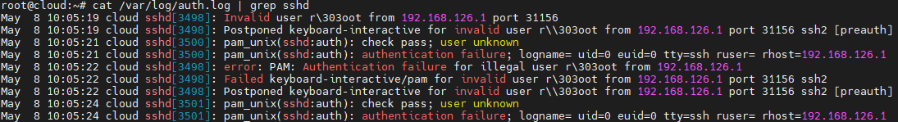
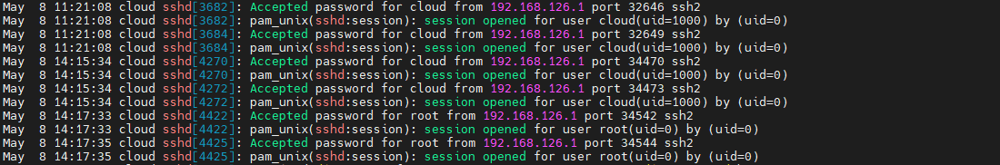
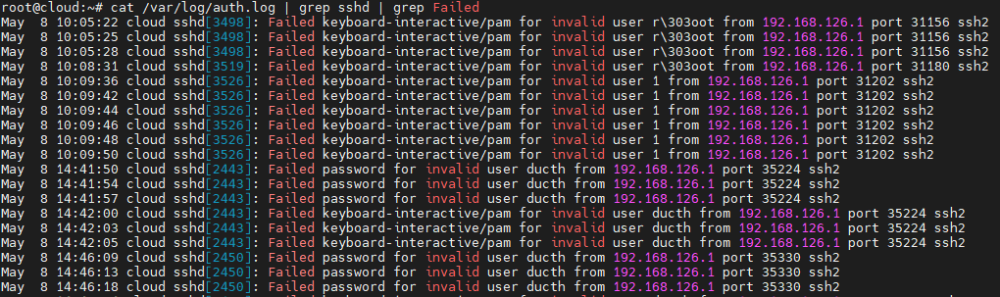

# SSH Logs

Ta có thể kiểm tra log của SSH trong file `/var/log/auth.log`

## Lọc log của ssh
```
cat /var/log/auth.log | grep sshd
```



## Lọc logs SSH đăng nhập thất bại :
```sh
cat /var/log/secure | grep sshd | grep Failed
```


# Tài liệu tham khảo

1. https://github.com/danghai1996/thuctapsinh/blob/master/HaiDD/SSH/docs/04-ssh_log.md
