# Tạo và làm việc với các SSH key

**server**: 192.168.126.143

**client**: 10.158.4.84

## 1. Tạo khóa trên server

### **Phía server**

- Sử dụng lệnh "sh-keygen" để tạo ra một cặp khóa RSA
    ```sh
    ssh-keygen -t rsa
    ```
    ```sh
    cloud@cloud:~$ ssh-keygen -t rsa
    Generating public/private rsa key pair.
    Enter file in which to save the key (/home/cloud/.ssh/id_rsa):
    ```
- Chọn nơi lưu key: Ở đây tên file được đề xuất là `/home/cloud/.ssh/id_rsa`
- Sau khi nhấn **Enter**
    ```sh
    Created directory '/home/cloud/.ssh'.
    Enter passphrase (empty for no passphrase):
    Enter same passphrase again:
    Passphrases do not match.  Try again.
    Enter passphrase (empty for no passphrase):
    Enter same passphrase again:
    Your identification has been saved in /home/cloud/.ssh/id_rsa
    Your public key has been saved in /home/cloud/.ssh/id_rsa.pub
    The key fingerprint is:
    SHA256:RI49L3o/eL1EzILS1aWauB5OZ6cXivs6pkMUO/WiWE8 cloud@cloud
    The key's randomart image is:
    +---[RSA 3072]----+
    |        .     .  |
    |      .=.  . o   |
    |      .+=.. o    |
    |      =oE*.=     |
    |     +.=S.= +    |
    |    . oo.o o.    |
    |     .. =oooo.   |
    |      .===++o    |
    |      .+=*+o..   |
    +----[SHA256]-----+
    ```
    - Hệ thống tạo ra thư mục mới "/home/cloud/.ssh" để lưu trữ khóa của bạn
    - Tạo mật khẩu
    - Thông báo các khóa đã được tạo và nơi lưu trữ
- **Phân quyền cho cặp khóa**
    - **Lưu ý*: Nếu bạn không chỉnh sửa cấu hình ssh thì bạn phải chuyển public key tới thư mục mặc định `(~/.ssh/authorized-keys)` thì server mới có thể xác nhận
    ```sh
    mv /home/cloud/.ssh/id_rsa.pub /root/.ssh/authorized_keys
    ```
    - Đặt quyền truy cập cho tệp `authorized_keys`
    ```sh
    chmod 600 /root/.ssh/authorized_keys
    ```
    Lệnh này đặt quyền truy cập cho tệp authorized_keys chỉ cho chủ sở hữu của tệp đó là đọc và ghi, và không cho phép các người dùng khác truy cập
    - Đặt quyền truy cập cho thư mục `.ssh`
    ```sh
    chmod 700 root/.ssh
    ```
    Lệnh này đặt quyền truy cập cho thư mục`.ssh` chỉ cho chủ sở hữu của thư mục đó là đọc, ghi và thực thi, và không cho phép các người dùng khác truy cập

    - Lưu ý: nếu bạn đặt quyền truy cập không chính xác cho tệp `authorized_keys` hoặc thư mục `.ssh`, bạn có thể gặp phải lỗi khi kết nối SSH vào máy chủ

    - Nếu tệp chưa tồn tại, bạn có thể tạo nó bằng lệnh:
    ```sh
    mkdir -p ~/.ssh
    touch ~/.ssh/authorized_keys
    ```
- Cấu hình file `/etc/ssh/sshd_config` để khai báo thư mục đặt key cũng như cho phép **user root** login

```sh
vi /etc/ssh/sshd_config
```
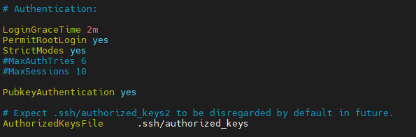

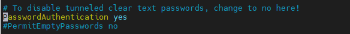

```sh
systemctl restart sshd
```
Sau đó đổi lại password
```sh
root@cloud:~# passwd
New password:
passwd: password updated successfully
```

### **Phía Client**
1. Windows

**Trên MobaXterm**

Chọn **Tool** -> **MobaKeyGen (SSH key generator)**

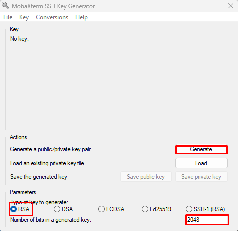

Chọn các thông số như **RSA** và **2048** như hình, và nhấn **Generate**

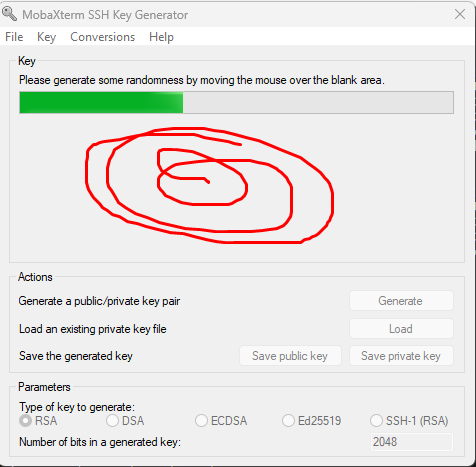

Di chuột ở phần trống để Load nhanh hơn

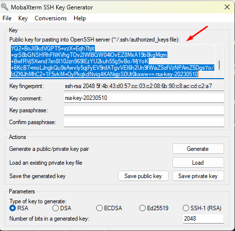

Coppy phần *Public key for pasting into OpenSSH server* và dán sang file 
`~/.ssh/authorized_keys` của **Server**

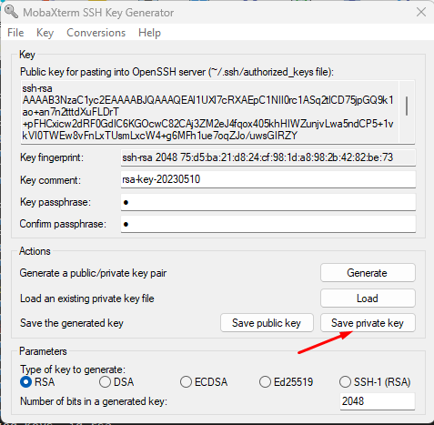

Đặt **key pasphrase** và nhấn **Save private key** để lưu.

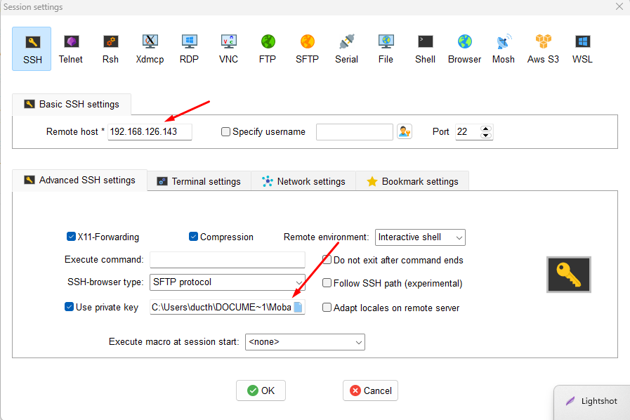

Tiếp theo, vào **Session** điền **Remote host**, ở phần **Advanced** tích vào **Use private key** và chọn đường dẫn private key lưu ở phần trên.

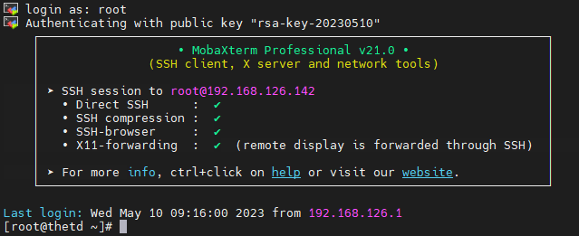

Login với **Root** như hình

2. Linux

**Bước 1**: Tạo key bằng câu lệnh `ssh-keygen -t rsa`

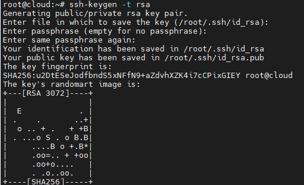

**Bước 2**: Đẩy public key lên server vào file `/root/.ssh/authorized_keys`

Cách nhanh nhất để copy **Public Key** trên **CentOS** là sử dụng tiện ích `ssh-copy-id` vì nó khá đơn giản . Nếu không có sẵn `ssh-copy-id` , cần phải copy 1 cách thủ công

- **Cách 1**: Copy Public Key sử dụng `ssh-copy-id`

Công cụ `ssh-copy-id` thường có sẵn trên nhiều hệ điều hành . Nếu dùng cách này , cần có kết nối SSH bằng mật khẩu từ **Client** đến **Server**

```sh
ssh-copy-id user@địa_chỉ_máy_chủ
```

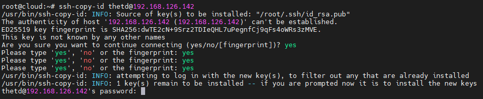

Khi được yêu cầu, nhập mật khẩu người dùng trên máy chủ. Lưu ý rằng bạn cần có quyền truy cập và mật khẩu cho người dùng đó trên máy chủ.

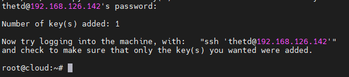

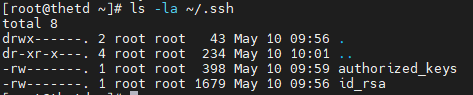

Như này đã thành công 

- **Cách 2**: Coppy Publickey sử dụng SSH

Nếu không có sẵn tiện ích `ssh-copy-id`, bạn có thể truy cập thông qua password vào một tài khoản truy cập trên server và upload key thông qua SSH. Chúng ta có thể thực hiện điều này bằng cách lấy nội dung của public key và gửi lên server thông qua kết nối SSH như sau:

```sh
cat ~/.ssh/id_rsa.pub | ssh root@192.168.126.143 "mkdir -p ~/.ssh && touch ~/.ssh/authorized_keys && chmod -R go= ~/.ssh && cat >> ~/.ssh/authorized_keys"
```

Sau khi nhập password , nội dung file `id_rsa.pub` sẽ được copy sang file `~/.ssh/authorized_keys`.

- **Cách 3:** Copy thủ công

Nếu không có cách nào để truy cập Server qua SSH , có thể thực hiện copy thủ công qua USB hay bất cứ cách nào khác .
Xem nội dung file `id_rsa.pub` và copy :

```sh
cat ~/.ssh/id_rsa.pub
```
Truy cập máy Server:
```sh
mkdir -p ~/.ssh

# public_key_string là phần copy được từ id_rsa.pub
echo public_key_string >> ~/.ssh/authorized_keys   
chmod -R go= ~/.ssh

# tùy chọn này sẽ gỡ bỏ hết các permission về Group và Others trong thư mục /.ssh
chmod -R go= ~/.ssh
```

**Bước 3:** Xác thực trên **CentOS Server** và sử dụng ssh key

- Thực hiện ssh vào Server
    ```
    ssh -i /root/.ssh/id_rsa root@192.168.126.143
    ```

- Nếu đã tạo passphrase thì ở bước này phải nhập thêm passphrase , nếu không thì có thể truy cập được luôn .

    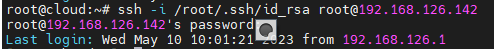