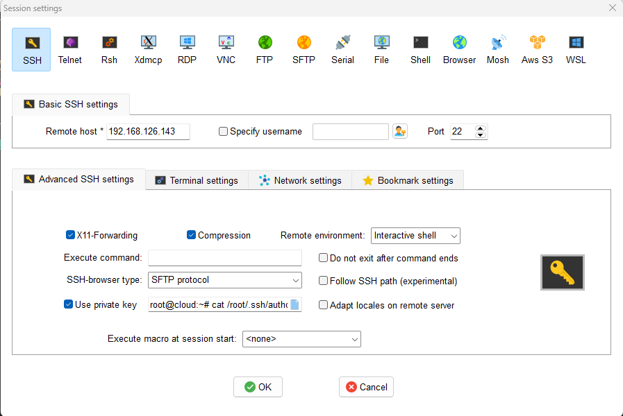

# Tạo và làm việc với các SSH key

**server**: 192.168.126.143

**client**: 10.158.4.84

## 1. Tạo khóa trên server

### **Phía server**

- Sử dụng lệnh "sh-keygen" để tạo ra một cặp khóa RSA
    ```sh
    ssh-keygen -t rsa
    ```
    ```sh
    cloud@cloud:~$ ssh-keygen -t rsa
    Generating public/private rsa key pair.
    Enter file in which to save the key (/home/cloud/.ssh/id_rsa):
    ```
- Chọn nơi lưu key: Ở đây tên file được đề xuất là `/home/cloud/.ssh/id_rsa`
- Sau khi nhấn **Enter**
    ```sh
    Created directory '/home/cloud/.ssh'.
    Enter passphrase (empty for no passphrase):
    Enter same passphrase again:
    Passphrases do not match.  Try again.
    Enter passphrase (empty for no passphrase):
    Enter same passphrase again:
    Your identification has been saved in /home/cloud/.ssh/id_rsa
    Your public key has been saved in /home/cloud/.ssh/id_rsa.pub
    The key fingerprint is:
    SHA256:RI49L3o/eL1EzILS1aWauB5OZ6cXivs6pkMUO/WiWE8 cloud@cloud
    The key's randomart image is:
    +---[RSA 3072]----+
    |        .     .  |
    |      .=.  . o   |
    |      .+=.. o    |
    |      =oE*.=     |
    |     +.=S.= +    |
    |    . oo.o o.    |
    |     .. =oooo.   |
    |      .===++o    |
    |      .+=*+o..   |
    +----[SHA256]-----+
    ```
    - Hệ thống tạo ra thư mục mới "/home/cloud/.ssh" để lưu trữ khóa của bạn
    - Tạo mật khẩu
    - Thông báo các khóa đã được tạo và nơi lưu trữ
- **Phân quyền cho cặp khóa**
    - **Lưu ý*: Nếu bạn không chỉnh sửa cấu hình ssh thì bạn phải chuyển public key tới thư mục mặc định `(~/.ssh/authorized-keys)` thì server mới có thể xác nhận
    ```sh
    mv /home/cloud/.ssh/id_rsa.pub /root/.ssh/authorized_keys
    ```
    - Đặt quyền truy cập cho tệp `authorized_keys`
    ```sh
    chmod 600 /root/.ssh/authorized_keys
    ```
    Lệnh này đặt quyền truy cập cho tệp authorized_keys chỉ cho chủ sở hữu của tệp đó là đọc và ghi, và không cho phép các người dùng khác truy cập
    - Đặt quyền truy cập cho thư mục `.ssh`
    ```sh
    chmod 700 root/.ssh
    ```
    Lệnh này đặt quyền truy cập cho thư mục`.ssh` chỉ cho chủ sở hữu của thư mục đó là đọc, ghi và thực thi, và không cho phép các người dùng khác truy cập

    - Lưu ý: nếu bạn đặt quyền truy cập không chính xác cho tệp `authorized_keys` hoặc thư mục `.ssh`, bạn có thể gặp phải lỗi khi kết nối SSH vào máy chủ

    - Nếu tệp chưa tồn tại, bạn có thể tạo nó bằng lệnh:
    ```sh
    mkdir -p ~/.ssh
    touch ~/.ssh/authorized_keys
    ```
- Cấu hình file `/etc/ssh/sshd_config` để khai báo thư mục đặt key cũng như cho phép **user root** login

```sh
vi /etc/ssh/sshd_config
```


```sh
systemctl restart sshd
```
Sau đó đổi lại password
```sh
root@cloud:~# passwd
New password:
passwd: password updated successfully
```

### **Phía Client**
1. Windows

Coppy file **Public key** ở Server  ra **Notepath** để load MobaXterm hoặc PuTTY

```sh
root@cloud:~# cat /root/.ssh/authorized_keys
```
```sh
root@cloud:~# cat /root/.ssh/authorized_keys
ssh-rsa AAAAB3NzaC1yc2EAAAADAQABAAABgQCueNaef3liIXVx2+jWa2DhUyZ/i2dmYhltDP27V24XtCGeLu4lkCWH/oL+77KWjBdPo7gckVXfX3YsZCwP9ATRrpndQIbLA+9fPBceXbA1+d6GSUCIURDVQGR7eOWaOgoc1Cs7sWfJf4/3dXQLNLS2vBSw1lk/C12ArlwRFWYnjw5fHXszIRcbhxDYEBRhFXGRHxh3w31yvgPnwGM9E/aOnPF6+GWsxO/FZyDTqfWqHTRlGOahOL6E1zREQOtcOwXS4zTk4fAqbVA+lyh0bDwLC2u2B8ZAAoyb1WBJDrY4DCLLPC30Ggo/dMcfS8LaMM7mWo+ylTg3NXp1sdO7LxblNH/16oWOJIhFVFlRQeyzrV0ntsXNSiBLmyiPbYdS6WzGCG+PxeOZBtmWcGBn77pkEzuzjvKokN6iClDi8Zs2ZQjpmOOzcSJQcxQeh5cf2RNezk1ZfgQLvAAQ8Em5NefbyRHx6h2As4eTZmORv/r8AyYYXNfl0JRlBXMkOvCJVs8= root@cloud
```
**Trên MobaXterm**

Chọn **Session** chọn **SSH**

Nhập địa chỉ IP của server trong **Remote host**

Trong **Advanced SSH settings**, tích vào **Use private key** và coppy key ở **authorized_keys**




