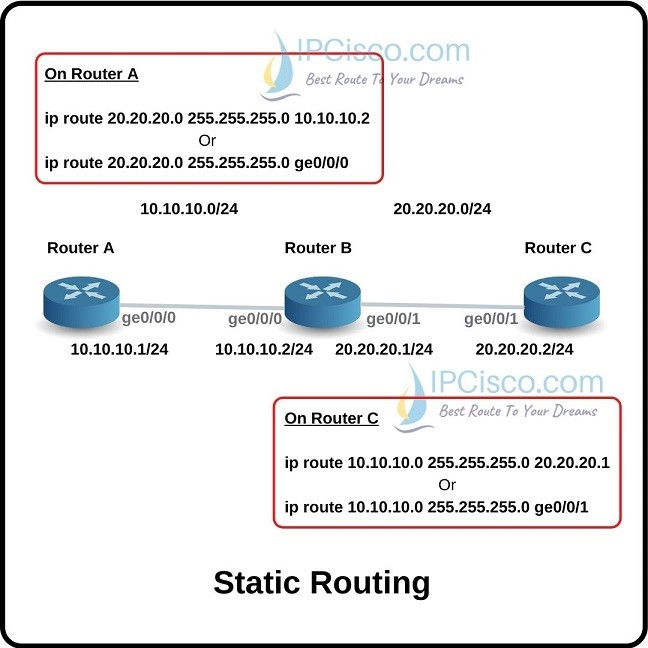

# **Định tuyến**
## **Giới thiệu**
- Định tuyến đơn giản chỉ là tìm đường đi từ mạng này đến mạng khác. Thông tin về những con đường này có thể là được cập nhật tự động từ các router khác hoặc là do người quản trị mạng chỉ định cho router. 
## **Những khái niệm cơ bản liên quan đến định tuyến**
### ***Bảng định tuyến (routing tables)***

  
 
 - Router sử dụng các giao thức định tuyến để xây dựng, cập nhật và duy trì thông tin trong bảng định tuyến.
 - Các thông tin thông thường gồm:
     - **Protocol type** - đặc tả giao thức định tuyến sử dụng để xây dựng mỗi phần tử trong bảng định tuyến.
     - **Next-hop associations** - thông tin về router kế tiếp khi sử dụng chức năng chuyển tiếp gói tin. 
     - **Routing metric** được sử dụng làm đơn vị cho tiêu chí định tuyến. Ví dụ RIP sử dụng hop count làm đơn vị định tuyến duy nhất; IGRP sử dụng băng thông, tải, trễ, và đơn vị tin cậy để tạo ra một đơn vị định tuyến riêng.
### ***Đơn vị tiêu chí định tuyến***
- Bandwidth (Băng thông).
- Delay (Trễ): Thời gian tối đa để gửi một gói tin trên một đường dẫn giữa 2 thiết bị đầu cuối.
- Load (Tải): Tần suất hoạt động của tài nguyên mạng nào đó, ví dụ router hay đường dẫn mạng.
- Reliability (độ tin cậy): Thường được đánh giá bằng khả năng chịu lỗi trên một đường dẫn mạng.
- Hop count: số lượng bước trung chuyển từ nguồn tới đích.
- Ticks: độ trễ của gói tin sử dụng IBM PC clock ticks. Một tick xấp xỉ 1/18 giây.
- Cost: chi phí, thông thường dựa trên dung lượng/ lưu lượng dữ liệu gửi qua routers. 

## ***Giao thức định tuyến***

  
 

- Giao thức định tuyến được dùng trong khi thực hiện giải thuật/ thuật toán định tuyến để trao đổi thông tin giữa các mạng, cho phép các router xây dựng bảng định tuyến một cách linh hoạt. 
    - Thu thập thông tin mạng: topo, tài nguyên. 
    - Trao đổi dữ liệu giữa các nút trong quá trình tính toán đường đi. 
    - Thiết lập bản định tuyến. 
- Các giao thức/ giải thuật định tuyến thường được thực thi bởi các router.
- Một số ví dụ về các giao thức định tuyến trên mạng Internet là RIP, IGRP, OSPF, BGP, và EIGRP.

- **Định tuyến tĩnh (Static Routing)** là phương pháp thiết lập tuyến đường mạng bằng cách cấu hình thủ công các bảng định tuyến trên các thiết bị định tuyến. Các tuyến đường này được cấu hình để gửi dữ liệu đến các mạng đích cụ thể.
- **Định tuyến động (Dynamic Routing)** là phương pháp định tuyến mà các tuyến đường được tính toán tự động bởi các giao thức định tuyến, thay vì được cấu hình thủ công bởi người quản trị mạng. Các giao thức định tuyến động sẽ cập nhật và tính toán các tuyến đường dựa trên các thông tin về mạng mà chúng thu thập được từ các thiết bị định tuyến khác.

## **1. Định tuyến tĩnh**
Trong định tuyến tĩnh, các bản ghi định tuyến được lưu trữ trong bảng định tuyến tĩnh (Static Routing Table), và các bản ghi này không thay đổi trừ khi người quản trị mạng thực hiện thay đổi cấu hình. Việc cấu hình định tuyến tĩnh cho phép người quản trị mạng có thể kiểm soát và điều chỉnh các tuyến đường một cách cụ thể, điều này có thể hữu ích trong một số trường hợp như:
- Mạng có cấu trúc đơn giản, với một số lượng thiết bị định tuyến ít.
- Các tuyến đường không thay đổi thường xuyên, và người quản trị mạng có thể dự đoán được các thay đổi.
- Mạng có các thiết bị định tuyến không hỗ trợ các giao thức định tuyến động
- Phương thức triển khai định tuyến tĩnh: Next hop hoặc Exit Interface.
    - Next hop: thông tin sẽ chuyển đến Router kế tiếp nào trước khi đến đích.
    - Exit Interface: thông tin sẽ được đưa ra cổng nào trước khi đến đích.

## **1.1. Ưu, nhược điểm**
### Ưu điểm
- Sử dụng ít băng thông hơn so với các phương thức định tuyến khác.
- Không tiêu tốn tài nguyên để tính toàn và phân tích gói tin định tuyến.
- Dễ dàng triển khai, cấu hình.
- Có tính bảo mật tốt hơn.

### Nhược điểm
- Không có khả năng tự động cập nhật đường đi.
- Phải cấu hình thủ công khi mạng có sự thay đổi.
- Khả năng mở rộng kém, phù hợp với mô hình mạng nhỏ.

## **1.2 Các loại định tuyến tĩnh**
***1. Standard static route***: Đây là loại định tuyến tĩnh đơn giản nhất và được sử dụng để chỉ định tuyến đường đến một mạng cụ thể. Nó chỉ định địa chỉ mạng đích và địa chỉ gateway mà các gói dữ liệu sẽ được gửi tới để đến được mạng đích.

***2. Default static route***: Đây là loại định tuyến tĩnh được sử dụng khi không có tuyến đường động nào để đến một mạng cụ thể. Nó sẽ chỉ định một địa chỉ gateway mặc định để các gói dữ liệu sẽ được gửi tới khi không có tuyến đường phù hợp nào được tìm thấy trong bảng định tuyến.

***3. Floating static route***: Đây là loại định tuyến tĩnh được cấu hình với một metric (trọng số) cao hơn các tuyến đường động. Nó sẽ được sử dụng làm backup cho các tuyến đường động và sẽ được kích hoạt nếu các tuyến đường động không khả dụng. Loại định tuyến này được gọi là "floating" vì nó không được sử dụng cho việc định tuyến chính thức, mà chỉ được kích hoạt khi tuyến đường chính thức không khả dụng.

***4. Summary static route***: Loại định tuyến tĩnh này được sử dụng để định tuyến cho một nhóm các mạng con nằm trong một phạm vi địa chỉ IP liên tục, thay vì cấu hình từng địa chỉ IP riêng lẻ. Một định tuyến tổng hợp sẽ được sử dụng để tóm tắt nhiều tuyến đường con thành một tuyến đường chính duy nhất và giảm thiểu kích thước bảng định tuyến. Loại định tuyến này thường được sử dụng trong các mạng lớn với số lượng mạng con lớn để giảm thiểu bộ nhớ và tăng hiệu suất của bộ định tuyến.

## **2. Định tuyến động**
Định tuyến động là phương thức tự động chia sẻ, trao đổi thông tin giữa các thiết bị định tuyến dựa trên các giao thức định tuyến động.
Tự động cập nhật thông tin bảng định tuyến nếu hệ thống có sự thay đổi.
Tính toán và đưa ra tuyến đường chuyển thông tin tốt nhất.

## **Mục đích của giao thức định tuyến động**

Trong một mạng rất lớn có rất nhiều bộ định tuyến như mạng Internet, việc cập nhật bảng định tuyến bằng tay là không thể, vì vậy cần phải có giao thức định tuyến, giao thức định tuyến cho phép các Router xây dựng bảng định tuyến một cách linh hoạt đó là:

- Khám phá mạng từ xa.
- Duy trì việc cập nhật thông tin định tuyến.
- Tính toán và chọn tuyến đường đi tốt nhất đến đích.
- Nếu tuyến đường chuyển thông tin chính bị lỗi, tự tính toán và đưa ra tuyến đường chuyển thông tin backup.
  

## **Phân loại giao thức định tuyến động**

**Giá trị Metric**

**RIP**: hop count 

**OSPF**: cost ( dựa vào bandwidth ) 

**EIGRP**: bandwidth , delay , load , reliability , MTU 

# **Tài liệu tham khảo**
1. https://ipcisco.com/lesson/static-routes/
2. https://www.educba.com/what-is-static-routing/
3. https://www.geeksforgeeks.org/routing-v-s-routed-protocols-in-computer-network/
