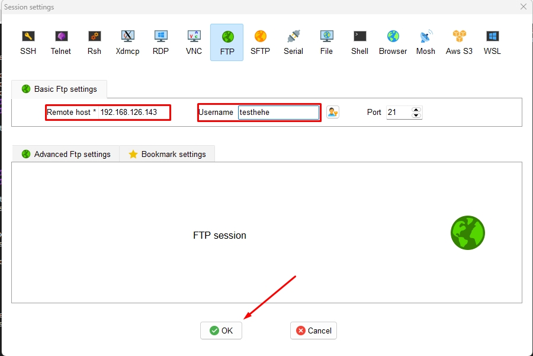
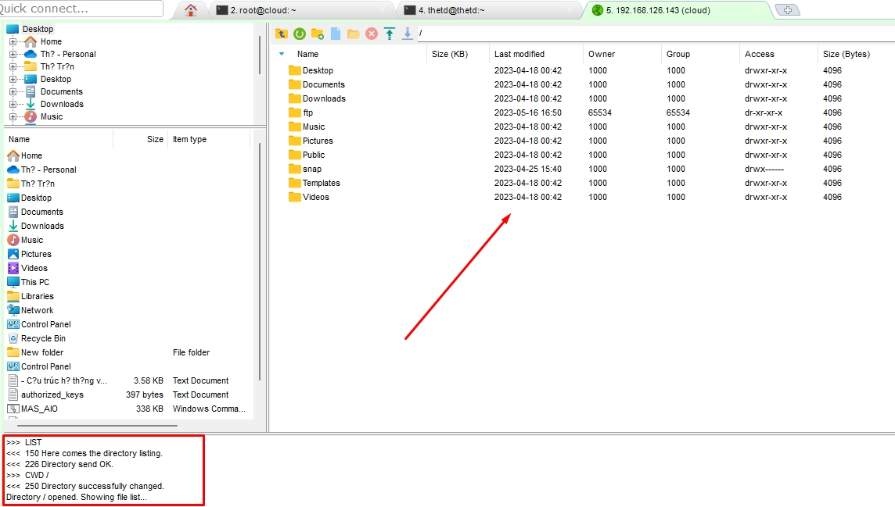

# Cấu hình và cài đặt FTP Server trên Ubuntu 20.04
## Giới thiệu
vsftpd là một chương trình máy chủ FTP (FTP server) mã nguồn mở phổ biến và được sử dụng rộng rãi trong các hệ thống Linux và UNIX. Tên đầy đủ của vsftpd là "Very Secure FTP Daemon".

vsftpd được thiết kế với mục tiêu tạo ra một máy chủ FTP có hiệu suất cao, bảo mật và dễ dùng. Nó tuân thủ các tiêu chuẩn FTP và hỗ trợ các tính năng quan trọng như xác thực người dùng, mã hóa dữ liệu, giới hạn băng thông, quản lý tập tin và thư mục.

Một số tính năng chính của vsftpd bao gồm:

1. Bảo mật cao: vsftpd được thiết kế với sự chú trọng đến bảo mật. Nó hỗ trợ các phương pháp xác thực như PAM (Pluggable Authentication Modules), SSL/TLS để mã hóa dữ liệu truyền tải và có khả năng giới hạn quyền truy cập của người dùng.

2. Hiệu suất cao: vsftpd được tối ưu hóa để đạt hiệu suất cao trong việc xử lý các yêu cầu FTP từ các máy khách.

3. Quản lý tập tin và thư mục: vsftpd cho phép quản lý tập tin và thư mục trên máy chủ FTP, bao gồm tạo, xóa, đổi tên và di chuyển tệp tin và thư mục.

4. Hỗ trợ IPv6: vsftpd hỗ trợ IPv6, cho phép truy cập và truyền tải dữ liệu qua giao thức FTP sử dụng địa chỉ IPv6.

5. Quản lý băng thông: vsftpd có khả năng giới hạn băng thông cho từng người dùng, giúp kiểm soát lưu lượng truyền tải trong mạng.

vsftpd được cung cấp dưới dạng phần mềm mã nguồn mở và có sẵn trong các kho lưu trữ phần mềm của hầu hết các hệ điều hành Linux và UNIX.

## Chuẩn bị môi trường

- Ubuntu 20.04: 192.168.126.143

## Cài đặt vsftpd

Đầu tiên bạn cần cài đặt vsftpd:

```sh
$ sudo apt update
$ sudo apt install vsftpd
```

Tiếp theo, chúng ta cần sao lưu lại cài đặt vsfptd cũ nếu bạn muốn cài đặt vsftpd mới ghi đè lên version cũ:

```sh
$ sudo cp /etc/vsftpd.conf /etc/vsftpd.conf.orig
```
## Cấu hình tưởng lửa cho vsftpd

Bạn cần phải cấu hình UFW (công cụ tường lửa trên Ubuntu 20.04) để mở port cho FTP nên trước hết bạn hãy kiểm tra trạng thái hiện tại:
```sh
root@cloud:~# ufw status
Status: active

To                         Action      From
--                         ------      ----
22/tcp                     ALLOW       Anywhere
OpenSSH                    ALLOW       Anywhere
22/tcp (v6)                ALLOW       Anywhere (v6)
OpenSSH (v6)               ALLOW       Anywhere (v6)
```
Thực hiện mở các port 20 (FTP command port), 21 (FTP data port), 990 (TLS FTP data port) và dải port 35000-40000:

```sh
root@cloud:~# ufw allow 20:21/tcp
Rule added
Rule added (v6)
root@cloud:~# ufw allow 990/tcp
Rule added
Rule added (v6)
root@cloud:~# ufw allow 35000:40000/tcp
Rule added
Rule added (v6)
root@cloud:~# ufw status
Status: active

To                         Action      From
--                         ------      ----
22/tcp                     ALLOW       Anywhere
OpenSSH                    ALLOW       Anywhere
20:21/tcp                  ALLOW       Anywhere
990/tcp                    ALLOW       Anywhere
35000:40000/tcp            ALLOW       Anywhere
22/tcp (v6)                ALLOW       Anywhere (v6)
OpenSSH (v6)               ALLOW       Anywhere (v6)
20:21/tcp (v6)             ALLOW       Anywhere (v6)
990/tcp (v6)               ALLOW       Anywhere (v6)
35000:40000/tcp (v6)       ALLOW       Anywhere (v6)
```
## Cấu hình vsftpd

Tiếp theo bạn cần cấu hình vsftpd bằng cách mở và chỉnh sửa file cấu hình:

```sh
$ sudo nano /etc/vsftpd.conf
```

Để giới hạn chỉ cho người dùng nội bộ truy cập vào FTP thì bạn thêm dòng cấu hình sau:

```sh
anonymous_enable=NO
local_enable=YES
```
Bạn cần cho phép quyền ghi để có thể kích hoạt chức năng upload trên FTP Server. Để làm điều đó, uncomment dòng sau:
```sh
write_enable=YES
```

Tiếp theo cần giới hạn người dùng chỉ có thể thao tác trên thư mục cụ thể. Để làm điều đó, bạn cần uncomment dòng sau:

```sh
chroot_local_user=YES
allow_writeable_chroot=YES
```

vsftpd có thể sử dụng bất kì port nào cho các kết nối passive FTP. Vi vậy nên chúng ta thực hiện cấu hình minimum port và maximum port với dòng cấu hình sau:

```sh
pasv_min_port=35000
pasv_max_port=40000
```
Cuối cùng là để giới hạn những người dùng nào có thể đăng nhập vào FTP Server, thêm đoạn cấu hình sau:

```sh
userlist_enable=YES
userlist_file=/etc/vsftpd.userlist
userlist_deny=NO
```
Với đoạn cấu hình trên, bạn đã chỉ định người dùng có thể truy cập với username lưu tại `/etc/vsftpd.userlist`.

## Cấu hình thư mục người dùng

Để thêm người dùng mới vào FTP Server, trong bài viết mình sẽ thực hiện thêm mới người dùng. Đầu tiên là tạo người dùng mới:

```sh
$ sudo adduser testhehe
```

Tiếp theo bạn cần thêm người dùng mới tạo vào danh sách người dùng của FTP:

```sh
$ echo "tel4vn" | sudo tee -a /etc/vsftpd.userlist
```

Sau khi thêm vào danh sách, bạn hãy tạo thư mục cho người dùng đó:

```sh
$ sudo mkdir /home/testhehe/ftp
$ sudo chown nobody:nogroup /home/testhehe/ftp
$ sudo chmod a-w /home/testhehe/ftp
```
Sau khi tạo xong thư mục, kiểm tra lại quyền thư mục như sau:
```sh
root@cloud:~# ls -al /home/testhehe/ftp
total 12
dr-xr-xr-x  3 nobody nogroup 4096 Thg 5  16 09:50 .
drwxr-x--- 17 testhehe  testhehe   4096 Thg 5  16 09:19 ..
```
Tiếp theo, bạn cần tạo thư mục có quyền write để có thể lưu các file tải lên:
```sh
$ sudo mkdir /home/tel4vn/ftp/upload
$ sudo chown tel4vn:tel4vn /home/tel4vn/ftp/upload
```
Lúc đó, thư mục dành cho việc tải lên sẽ có quyền như bên dưới:

```sh
root@cloud:~# ls -al /home/cloud/ftp
total 12
dr-xr-xr-x  3 nobody nogroup 4096 Thg 5  16 09:50 .
drwxr-x--- 17 testhehe  testhehe   4096 Thg 5  16 09:19 ..
drwxr-xr-x  2 testhehe  testhehe   4096 Thg 5  16 09:50 upload
```

Để tiện cho việc test thử, bạn nên tạo một file test.txt ttrong thư mục upload:

```sh
$ echo "vsftpd test file" | sudo tee /home/tel4vn/ftp/upload/test.txt
```

## Kiểm tra kết nối FTP

Sau khi cấu hình xong, bạn hãy thử kiểm tra kết nối FTP như sau:

```sh
root@cloud:~# ftp -p 192.168.126.143
Connected to 192.168.126.143.
220 (vsFTPd 3.0.5)
Name (192.168.126.143:root): vtv
530 Permission denied.
ftp: Login failed
```
Như bên trên, người dùng bất kì không thể đăng nhập vào FTP Server. Ta thử lại với người dùng mới tạo

```sh
root@cloud:~# ftp -p 192.168.126.143
Connected to 192.168.126.143.
220 (vsFTPd 3.0.5)
Name (192.168.126.143:root): testhehe
331 Please specify the password.
Password:
230 Login successful.
Remote system type is UNIX.
Using binary mode to transfer files.
ftp>
```

Với người dùng được cấu hình thì bạn có thể đăng nhập thành công. Thực hiện tải xuống file test.txt vừa tạo

```sh
ftp> cd upload
250 Directory successfully changed.
ftp> get test.txt
227 Entering Passive Mode (136,244,105,99,165,42).
150 Opening BINARY mode data connection for test.txt (17 bytes).
226 Transfer complete.
16 bytes received in 0.0101 seconds (164.3719 kB/s)
ftp>
```
Tiếp tục thực hiện đổi tên file test.txt để xác nhận người dùng được tạo có quyền write:
```sh
ftp> put test.txt upload.txt
227 Enteassive Mode (136,244,105,99,163,102).
150 Ok to send data.
226 Transfer complete.
17 bytes sent in 0.000894 seconds (518.7988 kB/s)
```
Cuối cùng đóng kết nối:
```sh
ftp> put test.txt upload.txt
227 Entering Passive Mode (136,244,105,99,163,102).
150 Ok to send data.
226 Transfer complete.
17 bytes sent in 0.000894 seconds (518.7988 kB/s)
```
### Truy cập đến FTP server bằng Mobaxterm

 Ta nhập địa chỉ IP của Server, username, password





Trên đây là chia sẻ cách cấu hình và cài đặt FTP Server trên Ubuntu 20.04. 

