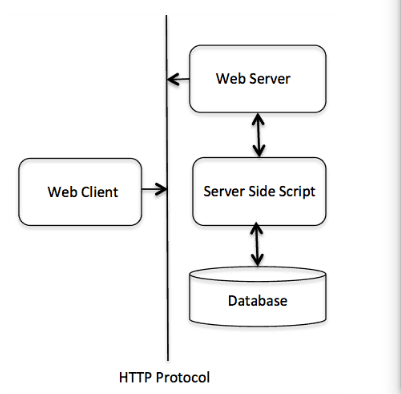
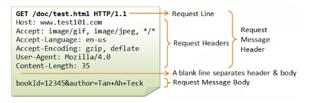

# 1. Tìm hiểu về giao thức HTTP

## 1.1. HTTP là gì ?

**HTTP (HyperText Transfer Protocol - Giao thức truyền tải siêu văn bản)** là một trong các giao thức chuẩn về mạng Internet, được dùng để liên hệ thông tin giữa Máy cung cấp dịch vụ (Web server) và Máy sử dụng dịch vụ (Web client), là giao thức Client/Server dùng cho World Wide Web – WWW

**HTTP** là một giao thức ứng dụng của bộ giao thức TCP/IP (các giao thức nền tảng cho Internet).

## 1.2. Lịch sử phát triển

Sự phát triển của HTTP được Tim Berners-Lee tại CERN khởi xướng vào năm 1989. Việc phát triển các RFC HTTP ban đầu là một nỗ lực phối hợp của Lực lượng Đặc nhiệm Kỹ thuật Internet (IETF) và World Wide Web Consortium (W3C), với các thay đổi sau đó chuyển sang do IETF phụ trách

HTTP/1.1 lần đầu tiên được chuẩn hóa trong RFC 2068 vào năm 1997. Đặc điểm kỹ thuật đó đã được RFC 2616 tuân theo vào năm 1999, cũng được thay thế bằng họ RFC 7230 vào năm 2014.

HTTP/2 là một giao thức hiệu quả hơn về ngữ nghĩa của HTTP "trên dây" và được xuất bản vào năm 2015; nó hiện được hỗ trợ bởi hầu như tất cả các trình duyệt web và các máy chủ web lớn qua Bảo mật tầng truyền tải (TLS) bằng cách sử dụng tiện ích mở rộng Application-Layer Protocol Negotiation (ALPN) trong đó TLS 1.2 hoặc mới hơn là bắt buộc phải có.

HTTP/3 là sự kế thừa được đề xuất cho HTTP/2, đã được sử dụng trên web (được bật theo mặc định trong macOS mới nhất), sử dụng UDP thay vì TCP cho giao thức truyền tải cơ bản. Giống như HTTP/2, nó không lỗi thời các phiên bản chính trước đó của giao thức. Hỗ trợ cho HTTP/3 đã được thêm vào Cloudflare và Google Chrome vào tháng 9 năm 2019 và có thể được kích hoạt trong các phiên bản ổn định của Chrome và Firefox.

## 1.3. Các đặc trưng cơ bản của HTTP

Dưới đây là một số đặc trưng cơ bản của HTTP:

1. **Giao thức vô trạng thái (stateless)**: HTTP không lưu trạng thái giữa các yêu cầu. Mỗi yêu cầu HTTP được xử lý độc lập, không có thông tin về trạng thái trước đó.

2. **Giao thức dựa trên văn bản**: HTTP sử dụng các thông điệp văn bản để truyền tải dữ liệu giữa máy khách và máy chủ. Các thông điệp này được định dạng theo các phương thức, tiêu đề và nội dung.

3. **Phương thức HTTP**: HTTP hỗ trợ nhiều phương thức, như GET, POST, PUT, DELETE, HEAD, OPTIONS, và TRACE. Mỗi phương thức có mục đích và ứng dụng riêng để thực hiện các hoạt động như truy xuất tài nguyên, gửi dữ liệu, xóa tài nguyên, vv.

4. **URL (Uniform Resource Locator)**: HTTP sử dụng URL để xác định địa chỉ của tài nguyên trên Internet. URL bao gồm các thành phần như giao thức, tên miền, đường dẫn, vv.

5. **Tiêu đề (Header)**: Mỗi thông điệp HTTP đi kèm với các tiêu đề chứa thông tin bổ sung về yêu cầu hoặc phản hồi. Các tiêu đề này chứa thông tin như loại nội dung, định dạng dữ liệu, ngôn ngữ ưu tiên, thông tin về trình duyệt, vv.

6. **Phản hồi HTTP**: Máy chủ trả về các phản hồi HTTP để đáp ứng yêu cầu của máy khách. Mỗi phản hồi bao gồm một mã trạng thái (status code) để chỉ định kết quả của yêu cầu, ví dụ: 200 OK (yêu cầu thành công), 404 Not Found (không tìm thấy tài nguyên), vv.

7. **Phiên HTTP (HTTP session)**: Mặc dù HTTP là một giao thức không lưu trạng thái, các ứng dụng web thường sử dụng các cơ chế như cookie hoặc phiên (session) để theo dõi trạng thái giữ

## 1.4. Cấu trúc cơ bản

Cấu trúc của HTTP bao gồm 2 đối tượng là **Client** và **Server**. Có thể coi HTTP như giao thức gửi các yêu cầu và phản hồi giữa Client - Server. Tại giao thức này, mọi thiết bị tìm kiếm hay trình duyệt web sẽ đóng vai trò như máy khách, còn máy chủ web có vai trò như Server. 

- **Client**: Client (máy khách) gửi yêu cầu cụ thể đến Server theo mẫu phương thức yêu cầu -> Các phiên bản giao thức cùng với URI gửi thông báo MIME (gồm thông tin máy khách, nội dung của đối tượng, bộ chỉnh sửa) đến server qua kết nối TCP/IP.
- **Server**: Server nhận được yêu cầu -> Phản hồi lại bằng một dòng trạng thái qua thông báo MIME có chứa thông tin máy chủ, thông tin về nội dung của đối tượng và thực thể của đa phương tiện

## 1.5. Uniform Resource Locator (URL)

Một **URL (Uniform Resource Locator)** được sử dụng để xác định duy nhất một tài nguyên trên Web. Một URL có cấu trúc như sau:

`protocol://hostname:port/path-and-file-name`

Trong một **URL** có 4 thành phần:

- Protocol: giao thức tầng ứng dụng được sử dụng bởi client và server
- Hostname: tên DNS domain
- Port: Cổng TCP để server lắng nghe request từ client
- Path-and-file-name: Tên và vị trí của tài nguyên yêu cầu.

## 1.6. Session 

Trong các giao thức client-server như HTTP, phiên (session) bao gồm ba giai đoạn:

1. Máy khách thiết lập kết nối TCP (hoặc kết nối tương ứng nếu lớp giao vận không phải là TCP).
2. Máy khách gửi yêu cầu của nó và chờ đợi phản hồi.
3. Máy chủ xử lý yêu cầu, gửi lại phản hồi của nó, cung cấp mã trạng thái và dữ liệu phù hợp.

Kể từ phiên HTTP/1.1, kết nối không đóng sau khi hoàn thành giai đoạn thứ ba, và máy khách được cấp một yêu cầu tiếp theo: điều này có nghĩa là giai đoạn thứ hai và thứ ba có thể được thực hiện nhiều lần.

## 1.7. Proxy

**Proxy HTTP** là một máy chủ trung gian giữa máy khách và máy chủ cuối cùng trong một yêu cầu HTTP. Khi một máy khách gửi yêu cầu HTTP đến một máy chủ, proxy nhận yêu cầu này và tiếp tục gửi yêu cầu đó thay mặt cho máy khách đến máy chủ cuối cùng. Sau đó, khi máy chủ cuối cùng trả lời, proxy nhận phản hồi và chuyển nó trở lại cho máy khách

Giữa **client** và **server** có thể có nhiều proxy thực hiện các chức năng khác nhau như **caching**, **filtering**, **load balancing**, **authentication** và **logging**.

1. **Caching (Lưu trữ)**: Proxy có thể lưu trữ bản sao của các tài nguyên được yêu cầu trước đó. Khi client gửi yêu cầu, proxy kiểm tra trong cache của nó xem có bản sao của tài nguyên đó hay không. Nếu có, proxy trả về bản sao từ cache mà không cần truy cập đến server. Điều này giúp giảm thời gian phản hồi và tăng hiệu suất.

2. **Filtering (Lọc)**: Proxy có thể thực hiện chức năng lọc để kiểm soát và giám sát nội dung yêu cầu và phản hồi. Ví dụ, proxy có thể lọc các tài nguyên độc hại, chặn truy cập vào các trang web không phù hợp hoặc kiểm soát nội dung dựa trên các quy tắc xác định trước.

3. **Load balancing (Cân bằng tải)**: Proxy có thể phân phối các yêu cầu đến nhiều máy chủ để cân bằng tải công việc. Điều này giúp tăng khả năng chịu tải và đảm bảo rằng các yêu cầu được xử lý một cách hiệu quả và không quá tải một máy chủ duy nhất.

4. **Authentication (Xác thực)**: Proxy có thể được sử dụng để xác thực người dùng trước khi cho phép truy cập đến các tài nguyên được bảo vệ. Proxy sẽ yêu cầu người dùng cung cấp thông tin đăng nhập hoặc mã xác thực trước khi cho phép truy cập đến server.

5. **Logging (Ghi nhật ký)**: Proxy có thể ghi lại các thông tin liên quan đến hoạt động của client và server. Điều này bao gồm việc lưu trữ thông tin đăng nhập, ghi lại yêu cầu và phản hồi, và theo dõi các hoạt động truy cập và sử dụng tài nguyên.

Các proxy có thể được cấu hình và điều chỉnh để thực hiện một hoặc nhiều chức năng trên, tùy thuộc vào yêu cầu và mục đích của mạng và ứng dụng.

## 1.8. HTTP Message

HTTP Message là đơn vị thông tin cơ bản trong giao thức HTTP, được trao đổi giữa máy khách và máy chủ. Có hai loại thông điệp trong HTTP: HTTP request (yêu cầu) và HTTP response (phản hồi).

1. HTTP Request Message (Thông điệp yêu cầu):
   - Line: Dòng đầu tiên trong thông điệp yêu cầu gồm ba phần: HTTP method (phương thức), URL (Uniform Resource Locator), và phiên bản của HTTP.
   - Headers: Các tiêu đề (headers) bổ sung cung cấp thông tin về yêu cầu, chẳng hạn như User-Agent (trình duyệt hoặc ứng dụng gửi yêu cầu), Content-Type (kiểu nội dung của yêu cầu), Cookie (thông tin phiên), vv.
   - Body: Nếu yêu cầu gửi dữ liệu, thì phần thân (body) chứa nội dung của yêu cầu.

2. HTTP Response Message (Thông điệp phản hồi):
   - Line: Dòng đầu tiên trong thông điệp phản hồi gồm ba phần: phiên bản của HTTP, mã trạng thái và thông báo trạng thái.
   - Headers: Các tiêu đề bổ sung cung cấp thông tin về phản hồi, chẳng hạn như Server (máy chủ phản hồi), Content-Type (kiểu nội dung của phản hồi), Set-Cookie (thiết lập cookie), vv.
   - Body: Phần thân (body) chứa nội dung của phản hồi, chẳng hạn như HTML, JSON hoặc các dữ liệu khác được yêu cầu.

Thông điệp HTTP có cấu trúc được định nghĩa rõ ràng và tuân thủ các quy tắc cú pháp của giao thức. Chúng đóng vai trò quan trọng trong việc truyền tải thông tin giữa máy khách và máy chủ và cung cấp các hướng dẫn và phản hồi cho việc xử lý yêu cầu và phản hồi trong môi trường web.

## 1.9. Request & Response

### HTTP Request

**HTTP Request Method**: Là phương thức để chỉ ra hành động mong muốn được thực hiện trên tài nguyên đã xác định

Cấu trúc của một HTTP Request:

- **Line**: Dòng đầu tiên trong yêu cầu chứa thông tin về phương thức yêu cầu, URL (Uniform Resource Locator) và phiên bản HTTP sử dụng. Ví dụ: "GET /example.html HTTP/1.1".
- **Headers**: Các tiêu đề bổ sung chứa thông tin về yêu cầu, bao gồm User-Agent (trình duyệt hoặc ứng dụng gửi yêu cầu), Host (tên miền của máy chủ), Accept (kiểu dữ liệu mà khách hàng chấp nhận), vv.
- **Body**: Phần thân (body) của yêu cầu chứa dữ liệu gửi đi, như dữ liệu biểu mẫu hoặc tài liệu tải lên. Body không bắt buộc và không xuất hiện trong mọi yêu cầu.

    

Khi một yêu cầu (request) được gửi đến máy chủ (server), máy chủ có thể thực hiện một trong ba hành động sau đây để xử lý yêu cầu:

1. Xử lý yêu cầu và gửi phản hồi (Response): Máy chủ tiếp nhận yêu cầu từ máy khách và thực hiện các xử lý cần thiết để đáp ứng yêu cầu đó. Sau khi hoàn thành xử lý, máy chủ gửi một phản hồi (response) chứa thông tin được yêu cầu hoặc kết quả xử lý trở lại cho máy khách. Phản hồi có thể chứa nội dung dữ liệu, mã trạng thái, tiêu đề và các thông tin khác.

2. Chuyển tiếp yêu cầu (Request forwarding): Trong một số trường hợp, máy chủ có thể không thể xử lý yêu cầu một cách trực tiếp. Thay vào đó, máy chủ có thể chuyển tiếp yêu cầu tới một máy chủ khác để xử lý yêu cầu đó. Quá trình này được gọi là chuyển tiếp yêu cầu (request forwarding). Máy chủ gốc sẽ chuyển tiếp yêu cầu từ máy khách tới máy chủ mục tiêu, sau đó nhận phản hồi từ máy chủ mục tiêu và gửi lại cho máy khách.

3. Phản hồi lỗi (Error response): Trong trường hợp máy chủ không thể hoặc không muốn xử lý yêu cầu từ máy khách, nó có thể trả về một phản hồi lỗi (error response). Phản hồi lỗi thông báo cho máy khách rằng yêu cầu không thể được xử lý và cung cấp thông tin về lỗi xảy ra. Phản hồi lỗi thường đi kèm với mã trạng thái và thông báo lỗi phù hợp để máy khách có thể hiểu và xử lý.

**Một số HTTP Request methoed thường dùng**

|**Method**|**Hoạt động**|**Chú thích**|
|----------|-------------|-------------|
|**GET**|Được sử dụng để lấy lại thông tin từ Server một tài nguyên xác định|Các yêu cầu sử dụng GET chỉ nên nhận dữ liệu và không nên có ảnh hưởng gì tới dữ liệu|
|**POST**|Yêu cầu máy chủ chấp nhận thực thể được đính kèm trong Request được xác định bởi URL, ví dụ: Thông tin khách hàng, file tải lên,...||
|**PUT**|Nếu URL đề cập đến một tài nguyên đã có, nó sẽ bị sửa đổi; nếu URL không trỏ đến một tài nguyên hiện có, thì máy chủ có thể tạo ra tài nguyên với URL đó|| 
|**DELETE**|Xóa bỏ tất cả các đại diện của tài nguyên được chỉ định bởi URL||
|**PATH**|ÁP dụng cho việc sửa đổi một phần của tài nguyên được xác định||
|...|...|...|

### HTTP Responses

Cấu trúc của một HTTP response:

- **Line**: Dòng đầu tiên trong phản hồi chứa phiên bản HTTP, mã trạng thái và thông báo trạng thái. Ví dụ: "HTTP/1.1 200 OK".
- **Headers**: Các tiêu đề bổ sung chứa thông tin về phản hồi, bao gồm Server (máy chủ phản hồi), Content-Type (kiểu dữ liệu của phản hồi), Set-Cookie (thiết lập cookie), vv.
- **Body**: Phần thân (body) của phản hồi chứa dữ liệu trả về từ máy chủ, chẳng hạn như nội dung HTML, JSON hoặc các tài nguyên tĩnh khác

**Mã trạng thái**: Thông báo về kết quả khi nhận được yêu cầu và xử lí bên server cho client.

Các kiểu mã trạng thái:

1xx: Thông tin (100 -> 101)

- VD: 100 (Continue), ….

2xx: Thành công (200 -> 206)

- VD: 200 (OK) , 201 (CREATED), …

3xx: Sự điều hướng lại (300 -> 307)

- VD: 305 (USE PROXY), …
 
4xx: Lỗi phía Client (400 -> 417)

- VD: 403 (FORBIDDEN), 404 (NOT FOUND), …

5xx: Lỗi phía Server (500 -> 505)

- VD: 500 (INTERNAL SERVER ERROR)

# Tài liệu tham khảo

1. https://viblo.asia/p/tim-hieu-ve-http-hypertext-transfer-protocol-bJzKmgewl9N#_layer-1-network-access-layer-4
2. https://github.com/danghai1996/thuctapsinh/blob/master/HaiDD/HTTP/docs/1-HTTP.md
